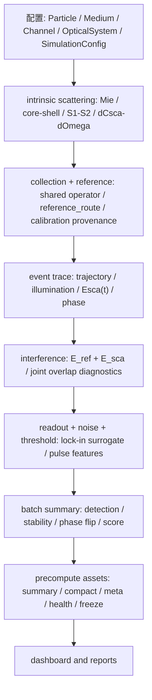

# NODI Interferometric Simulator — 工程总指南

> 当前状态：2026-05-08 复核版。v1 full-grid 已完成，v2 已收口为无实测数据、面向真实仪器约束的模拟补强。当前读者入口是 `reports/88_*`，v2 边界入口是 `reports/87_*` 和 `reports/84_*`。本文是工程总说明，不替代代码、测试或最终综合报告。

## 一句话定位

这是一套面向设计比较的 NODI 干涉散射检测链模拟与 dashboard 系统。当前主链适合做可审计的 engineering ranking、paper-aligned comparison 和部分 calibration-ready provenance；不能在没有实测标定或高保真闭环时宣称 absolute calibrated quantitative prediction。

## 当前工程状态

- 文件43旧版 Tsuyama 对齐路线图中可通过代码、schema、模板、边界状态和测试完成的修正项已经完成，并已归档到 `archive/tsuyama/59_*`。
- 根目录文件43现在冻结为 v5 EV/NODI 通道 + assay-control + wavelength/objective/exposure claim 设计决策层路线图；其中不依赖实测数据的 P0-hard gates、minimum required schema、P0-soft blockers、smoke-critical dashboard/export 路径和 P1 diagnostic/scaffold lane 已完成到可重算状态。
- 现行 metadata / dashboard 目标 schema 为 `1.24`。
- 旧全量库 `fine_full_range_biomimetic_exosome_10000e_*` 已从 `results/` 删除；当前正式目标前缀为 `ev_design_full_range_biomimetic_exosome_with_anchors_10000e_*`。
- 正式 EV full-grid recompute 已完成，生成 relative/proxy/diagnostic EV design decision library；P2/P3 不属于 v2 无实测修改范围，只能作为单独 post-v2 实测/高保真项目。
- 预计算主链已固定在当前安全性能口径：`dashboard.precompute` 默认使用 `standard` artifact profile，trajectory / intrinsic / reference / collection operator 的不变量复用已接入 sweep worker，summary-only 路径会跳过未消费诊断并保持 RNG 顺序；正式 precompute 默认使用 `vectorized_event_engine="off"`、`event_block_size=32`、`event_block_rng_order="event_loop_order"`。
- EV design recommendation 已拆成 relative/within-lambda 与 absolute/global green 两层；detector operator disagreement 会形成 caution 和 detector-resolved relative eligibility，不再直接硬杀 relative candidate ranking。
- Measured/calibrated `bfp_roi_mask_path` 会进入 Tsuyama BFP reference 的 1D projected ROI 积分；synthetic/template mask 仍只验证 contract，不改变数值。
- Dashboard long-form diagnostics 与 schema inventory 已统一导出完整 `DESIGN_CLAIM_GOVERNANCE_FIELDS`。
- 改变随机数消费顺序的 `block_lane_order` 只保留为显式实验选项，不进入默认主线。
- Tsuyama selected detector-mode 已升级为并行分析口径：summary / gold lane / calibration / rule sensitivity / EV targeted panel 都保留 all-crossing 主口径，同时输出 selected-candidate 与 edge-norm annulus 条件率；annulus 边界由 `SimulationConfig.selected_annulus_edge_norm_min/max` 记录，默认 `0.5-0.8`。EV targeted panel 和全量 size-weighted route analysis 现在会生成 selected-annulus 独立 ranking / comparison，用于交叉验证而不替代工程 gate。旧 CSV 缺少 selected-annulus 列、selected-annulus 分母为空、列全为 NaN，或 selected rate / fraction 不在同一行成对有效时，都会显式输出 unavailable/null/NaN 状态；route analysis 与 targeted comparison 只用同一行 rate 有效且 fraction>0 的 selected rows 生成 selected ranking，不再用 0 或 all-crossing 值伪造 selected ranking。selected-annulus paper-fit 的 claim/target 已集中到 `nodi_simulator/design_claim_governance.py`，当前为 `paper_aligned_2022_nodi_proxy_lens` / `tsuyama_2022_nodi_table_s1`；target metadata 会校验 NODI 2022 readout 层约束，claim compatibility 会阻止把不同 annulus/source/schema 的结果混成同一 paper claim。
- selected-annulus joint-fit 的 `joint_fit_score` 是 lower-is-better loss-style penalty；annulus sensitivity decision 以当前 joint-fit 粒径口径 Au `20/30/40/60 nm`、Ag `40/60 nm` 输出，并记录 scenario、score direction、target metadata status 与 8-worker smoke/medium/focused 结果。2026-05-02 的 P0.5 sensitivity 复核不支持改变 canonical annulus，当前默认仍保持 `0.5-0.8`。
- all-crossing 主口径不对齐 Tsuyama paper detection-rate target；selected-annulus paper-audit lane 的当前 2022 NODI surrogate detection-rate target 是 Au20 `0.30`、Au30 `0.60`、Au40 `0.78`、Au60 `0.92`。2020 POD thermal counting 的近 100% Au20 结论属于不同机制，不能作为 NODI selected-annulus 或 all-crossing 的校准锚。
- paper-audit lane 与工程主库 lane 必须分层：前者是 JOINT_CASES × Au `20/30/40/60` + Ag `40/60` 的小网格对齐/反演；后者才是 EV engineering full-grid 主库推广。`in_phase + absolute` 诊断 variant 不满足当前 paper target metadata guard，joint-fit 工具会提前拒绝。
- 后续若做 Phase 2 Tsuyama paper-fit alignment，第一步是 target audit 而不是直接调参：当前 selected-annulus detection targets 是 surrogate / operational targets；旧 detection-rate calibration broad bands 只能作 legacy screening；classification accuracy / peak-ratio 在 source anchor 复核前只作 diagnostic。Phase 2 不阻塞 nominal EV full-grid，也不能改 global EV material defaults 或 engineering main-library ranking。
- Tsuyama paper geometry 口径已纠正：2022 NODI 原文几何为 `800 / 1200 nm` 宽、`550 nm` 深，测量/比较波长覆盖 `488 / 532 / 660 nm`；2024 paired POD+NODI 为 `800–1200 nm` 宽、`550 nm` 深并使用 `660 nm` probe。`800x710 nm` 只来自 2020 POD counting paper，工程中标记为 POD bridge / sensitivity case，不再作为 NODI exact geometry。
- 如果未来要提升到 experimental calibrated platform，必须另起 post-v2 项目接入实测 blank/reference/operator/standard-particle/blank-trace/BFP ROI/lock-in transfer/detector-unit 数据，或补 full-wave/interface/thermal/readout/count-rate 高保真模型；这些不是 v2 当前结论的一部分。

## 当前标准结果库

正式全量重算的标准产物为：

- `results/ev_design_full_range_biomimetic_exosome_with_anchors_10000e_summary.csv`
- `results/ev_design_full_range_biomimetic_exosome_with_anchors_10000e_design_postprocess.csv`
- `results/ev_design_full_range_biomimetic_exosome_with_anchors_10000e_compact.pkl`
- `results/ev_design_full_range_biomimetic_exosome_with_anchors_10000e_meta.json`
- `results/ev_design_full_range_biomimetic_exosome_with_anchors_10000e_result_health.json`
- `results/ev_design_full_range_biomimetic_exosome_with_anchors_10000e_runtime_performance.json`
- `results/ev_design_full_range_biomimetic_exosome_with_anchors_10000e_freeze_probe.json`

预计算默认使用 `standard` artifact profile，因此 `case_summary.csv` 和 heavy parquet split exports 不是标准结果库的必需产物；若外部分析脚本依赖这些历史兼容文件，需要显式改用 `--artifact-profile full`。

目标范围：

- grid: `ev_design`
- particle profile: `full_range_biomimetic_exosome_with_anchors`
- wavelengths: `404 / 488 / 532 / 660 nm`
- particles: Au20/Au30 anchors plus gold 与 biomimetic EV/sEV exosome-like particles，`40-300 nm`
- channel grid: `W = 500 / 600 / 700 / 800 / 900 / 1000 / 1100 / 1200 / 1300 / 1400 / 1500 nm`；`H = 500 / 550 / 600 / 650 / 700 / 800 / 900 / 1000 / 1100 / 1200 / 1300 / 1400 / 1500 nm`
- events per case: `10000`
- total cases: `32032`
- 16C/32T 正式计算机器推荐：`NUMBA_NUM_THREADS=4`，`--workers 28`，`--vectorized-event-engine off`

EV optical uncertainty 变体：

- profile: `ev_design_biomimetic_ensemble_with_anchors`
- particles: Au20/Au30 anchors + gold `40-300 nm` + 四个 literature-bounded EV optical presets × `50-150 nm`
- total cases: `41756`
- 用途：让 `ev_score_min / ev_score_p10` 反映 EV optical-model uncertainty，而不只是 nominal biomimetic preset 的 size uncertainty。

正式命令见 [24_高性能预计算与增量重算方案.md](./24_高性能预计算与增量重算方案.md)。

## 主计算链

关键原则：

- reference、scattering、baseline normalization 共享 collection semantics。
- sweep worker 会在进程内复用 intrinsic scattering、reference base 和 collection operator；这些缓存是只读/本地性能优化，不是结果语义的一部分。
- 单 case 内 `TrajectoryContext` 复用时间网格、可达通道半跨和 `rect_series` 常量；event 随机采样、扩散和噪声仍按原 RNG 顺序推进。
- precompute 主线默认走 scalar event loop，即 `vectorized_event_engine="off"`。默认 RNG 顺序为 `event_loop_order`；`event_block_v3` 和 `block_lane_order` 只用于显式性能实验，其中 `block_lane_order` 会改变个体 event 轨迹。
- `reference_route` 区分 `calibrated_primary / paper_aligned_comparison / engineering_fallback / legacy_debug`。
- `output_claim_level` 由 reference/scattering/detector/readout/count calibration levels 共同决定。
- synthetic calibration templates 只验证字段与单位，不解锁 calibrated claims。

## 当前已完成的治理点

- Reference route 与 solver route 已接入配置、metadata、summary 和 dashboard。
- `tsuyama_phase_filter_1d` 已提供 signed `exp(iθ)-1`、BFP decomposition、thin-phase diagnostics 和 validity status。
- Detector forward、field coordinate、BFP/Jacobian、complex convention、vector/superposition、readout、threshold、count、interface、thermal-POD、uncertainty 等状态字段已进入 governed outputs。
- Calibration loader、manifest validation、synthetic fixture 防误用、row-level coverage、raw blank bootstrap、BFP/ROI mask、standard-particle 与 blank false-positive 模板已就位。
- Manifest kind guard 已收紧；错 lane 的 manifest 不会被当成当前 calibration kind 的有效实测 manifest。
- EV/sEV ensemble preset、material-model-aware gold baseline、interface/POD/uncertainty API boundary 已接入。
- `analytic_lockin_surrogate` 已有 bandpass/envelope 数值分支；但它仍不是 measured transfer function。
- Event QC 已有 stricter soft/hard gate、artifact risk 与 failure reason 输出。
- 旧文件43 P0-P6 hard gate 已落地；新文件43 v5 的 P0/P1 非实测治理层也已进入 summary、precompute、dashboard 和测试。
- Dashboard/backend/precompute 已统一到 `schema 1.24` 并强制 schema 检查。

## 当前边界

仍不能过度宣称：

- 没有实测 `A_ref / phi_ref / collection operator` 时，reference 仍只是 engineering fallback 或 partial calibration-ready lane。
- 没有 measured BFP ROI mask、lock-in transfer、detector-unit chain 和 held-out standards 时，P2/P3 claim 仍保持 data-blocked。
- 没有标准粒子 `K_sca`、Mie-to-power 单位链、detector/noise budget 和 held-out validation 时，不能叫 photon-unit calibrated NODI amplitude。
- 没有 raw blank trace / colored-noise bootstrap / dead-time / occupancy / concentration-flow 模型时，不能输出 experimental count-rate confidence。
- POD thermal lane 当前是 API boundary / unavailable quantitative route，不能替代热扩散模型。
- Interface correction 当前有边界状态；未实现 full-wave 时不能宣称 near-wall absolute phase/polarity closure。

## 推荐阅读

- 当前执行：[24_高性能预计算与增量重算方案.md](./24_高性能预计算与增量重算方案.md)
- 最终复核：[42_全量重算前复核结论与现行边界.md](./42_全量重算前复核结论与现行边界.md)
- EV 设计决策层路线：[43_Tsuyama对齐主链升级路线图与修改框架.md](./43_Tsuyama对齐主链升级路线图与修改框架.md)
- 计算总链：[25_核心计算逻辑与公式总说明.md](./25_核心计算逻辑与公式总说明.md)
- 全波边界：[34_完整全波理论推导与当前模型边界.md](./34_完整全波理论推导与当前模型边界.md)
- 文档地图：[文档导航.md](./文档导航.md)

## 当前验证基线

最终复核通过：

- `ruff check .`
- `pyright` → `0 errors, 0 warnings, 0 informations`（配置中的 typed-seed allowlist：公共 helper 与 legacy entrypoint；全仓类型债尚未作为 release gate）
- `mypy` → pass（同一 typed-seed allowlist 范围）
- 全量测试入口：`python tests/run_tests.py --workers 7`（非 AppTest xdist lane + AppTest serial lane 并发）
- AppleDouble `._*` 元数据文件已从工程范围清理；在 exFAT USB 盘上可能再生，后续发现后直接清理即可

旧文件43列出的 Tsuyama 对齐代码框架项无需继续修补；新的 EV 设计决策层 v5 不再扩新方向。当前也不建议继续在主线做性能重构或无实测 paper-fit 搜索。正式 full-grid recompute 已完成，v2 也已完成无实测范围内的 realism supplement；如要推进真实采集、P2/P3 实测或高保真闭环，应作为 post-v2 独立项目重新立项，之后才可能讨论 quantitative claim。
