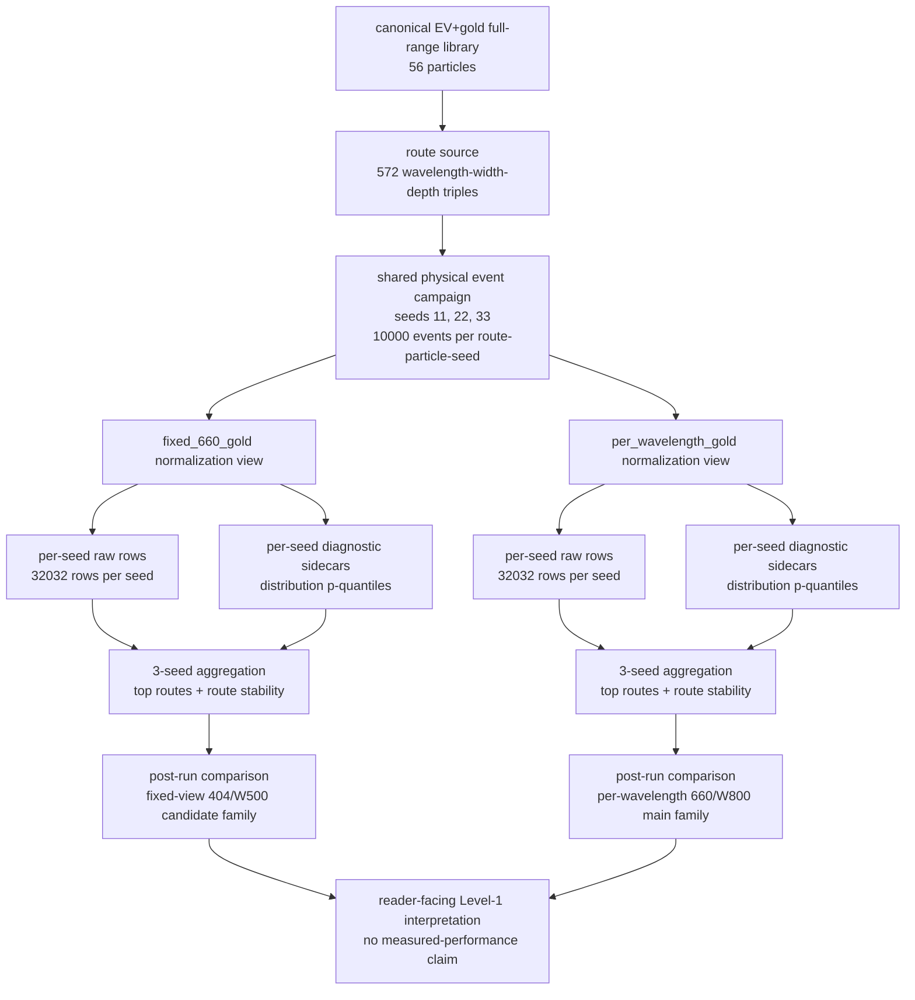
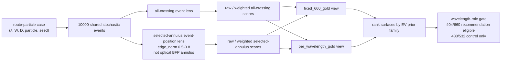
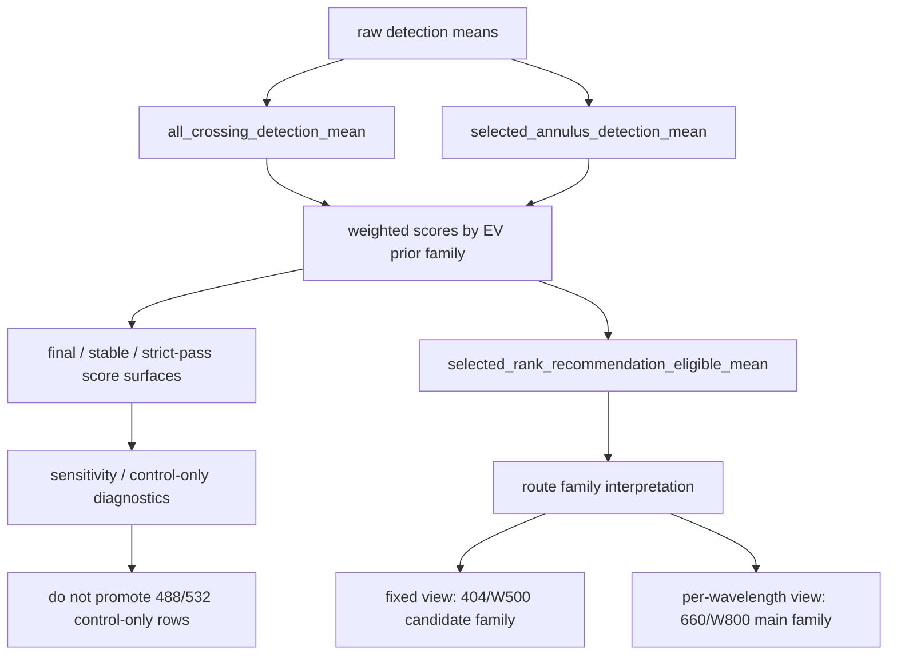
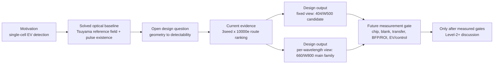
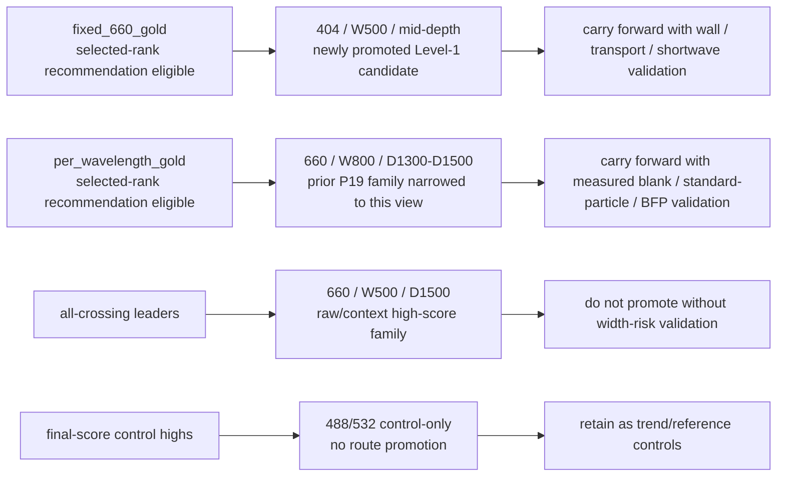
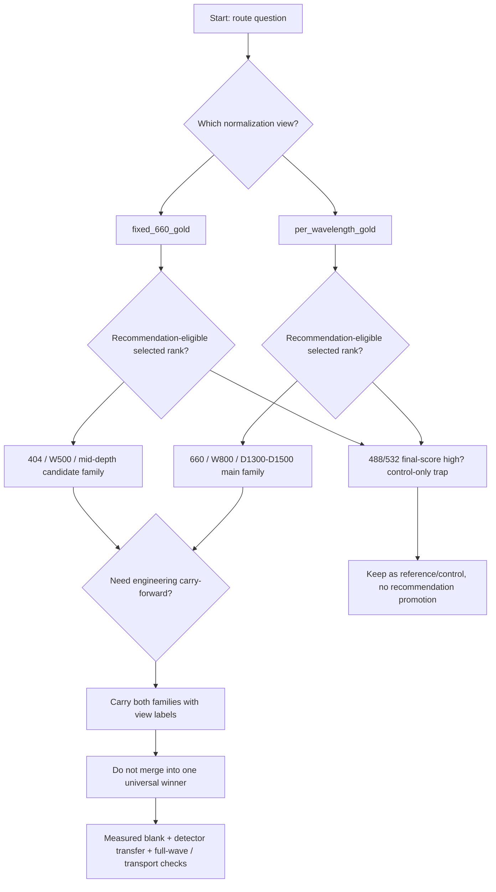
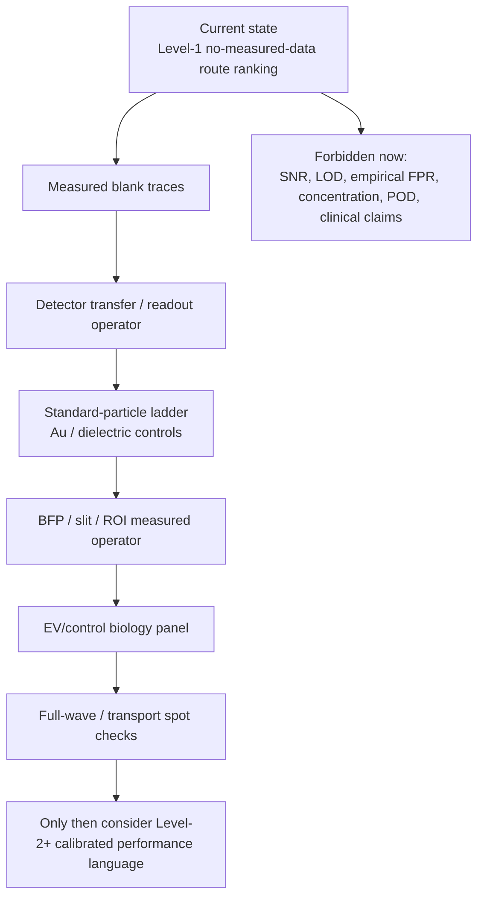

# EV/NODI 最新全量计算综合报告：EV+gold exhaustive shared-dual 3seed × 10000e

- 日期 / 版本：2026-05-23 reader-facing rewrite；**2026-06-03 设计决策修订**（在原结论之上新增「§D 设计决策层」+ `reports/146_depth_reference_model_noise_regime_evidence_20260603.md` 深度证据；原 §0–§13 governed 内容保留）
- 报告性质：最新全量计算读者向综合报告；适用口径 = no-measured-data Level-1 relative/proxy design-selection
- 当前数据入口：`results/exhaustive_ev_gold_fullgrid_shared_dual_10000e_seed11_16worker_20260518/`、`seed22`、`seed33` 三个 seed 目录，以及两个 3-seed aggregation 目录
- 当前解释入口：本报告替代原 140 的技术摘要写法，并继承 `reports/88_EV_NODI_v1_v2_consolidated_reader_analysis_with_Tsuyama_comparison.md` 的读者逻辑、claim boundary 和 selected-annulus 防误读框架
- 当前主结论（2026-06-03 决策版，详见 §D）：
  - **宽度是主导且物理牢固的旋钮**——每个波长选「衍射锥半角 ~λ/W 仍能进入收集 NA(0.9) 的最窄通道」，即 `W_min ≈ λ/NA`：404→W500、660→W800。`fixed_660_gold` 推 404/W500 与 `per_wavelength_gold` 推 660/W800 其实是**同一条规则**在两种归一化下的呈现，差别只在于是否保留 404 比 660 高约 7× 的散射截面。
  - **深度是弱且口径依赖的旋钮**：在被治理的 selected-annulus 推荐面上 660/W800 全深度跨度仅 3.7–10.3%（4 个 EV 先验里 uniform/broad 最优在中深 D900，仅 small/sharp 到 D1400）；更大的 all-crossing 深度效应（~23–31%）是 `A_ref∝depth` 的外差增益，依赖未标定的噪声口径，**不构成「必须做 D1400」的依据**。
  - 旧的 `660_W800_D1400/D1500` 仍是 per-wavelength selected-annulus 主候选 family，但 D1400 不优于中深；404 仍是 fixed-view candidate family；488/532 仍 control-only。
- **重要更正（2026-06-03）**：全量 run 实际使用 `reference_model=paper_aligned_phase_filter`（route `paper_aligned_comparison`），不是 engineering surrogate。深度依赖在两种 reference model 下几乎一致（report 146），因此**不是 surrogate 伪影**，而是噪声口径依赖的外差增益。
- 读者先记住的一句话：宽度按 `W≈λ/NA` 选最窄可用通道是稳的；深度做中深即可，D1400 的收益小、口径依赖、未经实测验证。

---

## 设计决策层 / §D（2026-06-03 新增，决策优先）

§D 把全文结论按「设计旋钮 × 置信度」重排，服务于芯片几何决策。它不取代 §0–§13 的 governed 内容，而是给出**先读的决策视图**。数据证据见 §5、§7.4、§8 与 `reports/146_depth_reference_model_noise_regime_evidence_20260603.md`（深度 reference-model / 噪声口径探针）。

### D.0 一页决策摘要

| 设计决策 | 结论 | 置信度 | 依据 |
|---|---|---|---|
| 波长 | 404 与 660 为 recommendation-eligible；488/532 control-only | 高（治理规则固定） | §0.4 |
| 宽度 | 每波长取衍射锥能进 NA 的最窄通道：`W_min≈λ/NA`（NA=0.9）→ 404→W500、660→W800 | **高（物理牢固）** | §D.2 |
| 深度 | 取工艺最优的中深 **D900–D1200**；不必为 D1400 买单 | **低（口径依赖、未标定）** | §D.3、report 146 |
| 性能（SNR/LOD/浓度/特异性） | 当前一律不可出绝对值 | 被实测阻断 | §10、§11 |

> 最强单一设计杠杆：收集系统 **NA_collection（当前在代码里写死 0.9）**，它直接决定 `W_min≈λ/NA`。任何宽度推荐都应附上 `W_min(NA)` 曲线；若实际物镜 NA 不同（如油浸 0.95–1.4），更窄、信号更强的通道会随之解锁。

### D.1 置信度网格（物理基础度 × 实测标定度）

把"有没有实测"和"物理基础牢不牢"分成两个正交轴，避免把宽度（牢固）和深度（口径依赖）混成同一档 Level-1：

| | 物理基础**牢固** | 物理基础**口径/代理依赖** |
|---|---|---|
| **可现在用于设计排序** | 宽度 `W≈λ/NA` 规则、波长可用性门（§D.2） | 深度 band；精确 W 截止随 NA 值与硬/软策略移动（§D.3、§D.2 翻转条件） |
| **被实测阻断（性能层）** | 相对趋势可参考、绝对值禁用 | 不要碰 |

### D.2 决策一：波长 + 宽度【高置信，物理牢固】

核心规则：每波长狭缝衍射半角 ~`λ/W` 必须落进收集 NA。代码以 `reference_operating_band` 实现——只有 `electronics_noise_limited_useful`（等价于 `W ≳ λ/NA`，NA=0.9，介质折射率 n 在 `λ/(nW)` vs `NA/n` 中相消，见 `nodi_simulator/reference_field.py:1617`）的路线进入 recommendation 排名。因此：

- 404 nm：`λ/NA≈449nm`，全部宽度都过 → 最窄可用 = **W500**。
- 660 nm：`λ/NA≈733nm`，W500/600/700 被判 `reference_too_weak` → 最窄可用 = **W800**。
- `fixed_660_gold` 推 404/W500、`per_wavelength_gold` 推 660/W800，是**同一条 `W_min≈λ/NA` 规则**在两种归一化下的呈现；两个 view 的真正差别只在于是否保留 404 比 660 高约 7× 的散射截面（保留→404 占优；归一化掉→660 占优）。这不是两个并立赢家，而是一个待定的方法论选择（能否跨波长比较 Csca），由标准粒子梯度实验判定。

宽度在 selected 面上的跨度达 17–35%，且带一个**直接淘汰窄通道的硬门**——这是全研究最可靠的结论。

决策卡（宽度）：

| 维度 | 内容 |
|---|---|
| 收益（模拟） | 选对宽度是一阶效应（17–35% + 硬门）；物理基础牢固 |
| 成本（工艺） | W500–W800 在可制造范围内；与深度组合决定深宽比 |
| 翻转条件 | 实际 NA≠0.9（W_min=λ/NA 直接移动）；或改用软滚降而非硬截止 → 近门宽度（660 的 W700）部分解禁 |

### D.3 决策二：深度【低置信，口径依赖，需实测复核】

- **在被治理的 selected-annulus 推荐面（报告据以排名的面）上，深度是弱旋钮**：660/W800 全深度跨度仅 3.7–10.3%；uniform/broad 先验最优在中深 **D900**，仅 small/sharp 先验到 D1400；D1400 只在单一未验证的 sharp MSC/sEV 先验下领先，且只领先个位数 %（§5.1、§7.4、F.2）。
- **更大的「越深越好」（all-crossing ~23–31%）真实存在于模型中，但 report 146 证实它不是 surrogate 伪影**：`paper_aligned_phase_filter`（全网格实际所用）与 `channel_angular_surrogate` 给出几乎相同的深度曲线（660/W800：23% vs 27%；404/W500：31% vs 30%）。机理是参考场幅值 `A_ref` 随深度近线性增长（`depth_scale=depth/550nm`，`reference_field.py:673`），外差项 `2·Re(E_ref·E_sca*)` 随之抬升信号 margin，把更多边缘事件推过一个**固定的 electronics 噪声门**。
- **这个深度收益依赖两个未标定假设**：(i) 参考场幅值随深度线性外推（无实测锚，且与 Tsuyama 2020 Eq.13「S/B 与深度无关」存在张力）；(ii) electronics-noise-limited 口径——report 146 的噪声扫描显示，把噪声推向 shot-limited 时，深度跨度从 23% 收缩到 8%，operating band 翻成 `shot_noise_limited_no_gain`。
- **决策结论**：深度按工艺取中深（D900–D1200），不为 D1400 的更高深宽比 / 壁面 / 堵塞风险买单；先用 measured blank + detector transfer 钉死噪声口径，再决定是否加深。

决策卡（深度）：

| 维度 | 内容 |
|---|---|
| 收益（模拟） | 治理推荐面上仅 3.7–10.3%，2/4 先验最优在中深；all-crossing 上 23–31% 但口径依赖 |
| 成本（工艺） | 深宽比随深度上升：W800×D1400≈1.75:1、W500×D1500=3:1 → 刻蚀均匀性 / 壁面 / 堵塞风险 |
| 翻转条件 | measured blank 证实系统 electronics-noise-limited **且** A_ref∝depth 线性外推成立 → 才考虑加深 |

### D.4 下一步（按设计决策价值排序，而非按 claim 等级）

1. **measured blank trace + detector transfer** —— 钉死噪声口径（electronics vs shot），直接决定深度收益是否真实。【最高价值：决定深度决策】
2. **NA 敏感性 `W_min=λ/NA` 曲线** —— 若实际物镜 NA≠0.9，最窄可用宽度随之移动。【决定宽度决策】
3. **标准粒子梯度** —— 验证跨波长归一化是否成立，才能在 404 vs 660 之间下定论。
4. **full-wave / transport spot check** —— 验证 A_ref∝depth 线性外推与窄通道壁面风险。
5. 其余 measured 链（BFP/ROI、EV/control biology） —— 解锁性能层（§10、F.7）。

> §D 的边界与 §0–§13 一致：仍是 no-measured-data Level-1 相对/代理设计选择，不含任何 calibrated 性能、绝对浓度、LOD、生物特异性结论。

---

## Executive Verdict / §0 阅读须知

§0 是入口集合，不是要求读者逐段顺序通读的正文主体。第一次阅读先看 §0.0-§0.2；需要快速定位问题看 §0.3/§0.6；准备做展示或向别人解释时再看 §0.9。

### 0.0 First-time reviewer claim boundary box

如果读者只给本报告 3-5 分钟，应先按下面四行理解全文：

| 读者问题 | 本报告允许的回答 | 本报告不允许的回答 |
|---|---|---|
| 这次全量计算是什么？ | EV+gold full-range library 的 no-measured-data Level-1 relative/proxy route-ranking audit；三 seed、每 case 10000 events、两个 normalization views | 不是实验报告、不是 calibrated simulator、不是 detector-transfer calibration、不是 EV 生物学验证 |
| 这次最重要的变化是什么？ | `fixed_660_gold` 推出 404/W500 family；`per_wavelength_gold` 确认 660/W800/D1400-D1500 family；两者是并立 normalization views | 不能写成一个 universal route winner；不能把 fixed-view 404 直接覆盖 per-wavelength 660 |
| 数字应怎样读？ | 同 view、同 lens、同 EV prior / score family 内可以相对比较；seed stability 决定排序精度 | 不能把 score / detection proxy 当真实事件概率、count rate、concentration、LOD、empirical blank FPR 或 calibrated SNR |
| selected-annulus 是什么？ | event-position / analysis-window lens，保留为并行分析视图 | 不是 optical BFP annular aperture；不能写成光学环形孔径提高收集 |

一句话边界：本报告能说“在声明的 no-measured-data Level-1 模型和 normalization view 内，哪些 route family 更值得作为下一步工程候选或对照保留”，但不能替代 measured blank、standard-particle ladder、detector transfer、BFP/slit/ROI、EV/control biology 或 full-wave validation 之后的结论。

### 0.1 这份报告是什么、不是什么

是：

- 最新 3seed × 10000e exhaustive EV+gold full-grid 的读者向综合解释。
- 对 `fixed_660_gold` 与 `per_wavelength_gold` 两个 normalization analysis views 的并列解释。
- 对报告 88 旧结论、P19 candidate-family 结论和 404/660/488/532 波长角色的更新版裁决。

不是：

- 不是 raw calculation rerun 记录；本报告没有重新启动 full-grid。
- 不是 measured-data 报告；没有实测 detector voltage、photon count、blank trace、EV concentration 或 biological specificity。
- 不是 POD 报告；POD 仍在本 NODI scoring run 外。
- 不是把 gold-anchor rows 当作 EV 最终推荐；gold rows 只作为 anchor / Tsuyama consistency diagnostics。

### 0.2 双 normalization view 并立

本报告同时回答两个并立问题，互不替代：

```text
View A — fixed_660_gold
  问题：所有波长都按 fixed 660 gold normalization 进入跨波长决策 lineage 后，
        selected-annulus EV-prior recommendation-eligible routes 怎么排序？
  当前读法：404 nm / W500 / D550-D1200 family 成为固定归一化视图下的前沿候选。
  风险边界：404/W500 是 fixed-view Level-1 candidate family，不是 calibrated cross-wavelength superiority；
            W500 family 仍需要 wall / transport / full-wave / measured operator 验证。

View B — per_wavelength_gold
  问题：每个波长用自己的 gold normalization，保留 Tsuyama-style / per-wavelength diagnostic lineage 后，
        selected-annulus EV-prior recommendation-eligible routes 怎么排序？
  当前读法：660 nm / W800 / D1300-D1500 family 重新成为主候选；
            sharp MSC/sEV prior 下 D1400 和 D1500 最贴近旧 main family。
  风险边界：这是 per-wavelength selected-annulus / EV-prior-aware 口径，不是所有 metric 的 raw maximum。
```

把 View A 的 404 family 写成“全局替代 660”，或把 View B 的 660 family 写成“所有 normalization 下唯一赢家”，都属于误读。

> **宽度/深度读法提示（2026-06-03，见 §D）**：两个 view 的 W500 与 W800「赢家」其实是同一条 `W_min≈λ/NA` 规则（404 最窄可用 W500、660 最窄可用 W800）。View B 文字里的 D1300-D1500 是 selected-annulus 排名顺序，**不代表深度收益大**：该面上 660/W800 全深度跨度仅 3.7–10.3%，uniform/broad 先验最优在中深 D900，D1400 不优于中深。深度的工程结论见 §D.3。

### 0.3 一页版读者地图

| 你想知道 | 一句话答案 | 详细见 |
|---|---|---|
| 全量输出是否完整 | 完整性审计通过，但 raw lightweight CSV 的 p-quantile compact fields 在 diagnostic sidecars 中 | §2 |
| 物理样本数是多少 | 3 seeds × 572 routes × 56 particles × 10000 events = 960,960,000 physical stochastic event samples | §1 |
| 两个 view 是否是两次物理实验 | 不是；它们是同一 shared physical events 上的两个 normalization / analysis views | §1.2 / §4 |
| 当前路线结论是什么 | fixed view = 404/W500 family；per-wavelength view = 660/W800 family（宽度是主结论；深度 prior 依赖 D900–D1500 且弱，见 §D） | §D / §3-§5 |
| 旧 main-660 结论是否还成立 | 成立但边界收窄；不再允许不加限定地写成 universal winner | §8 |
| 404 还是 sidecar 吗 | fixed view 下不是“仅 sidecar”；它是 Level-1 candidate family，但仍不是 calibrated superiority | §6 / §8 |
| 488/532 能否推荐 | 不能；仍是 control/reference-useful | §6 |
| 还缺什么 | measured blank、detector transfer、standard-particle ladder、BFP/slit/ROI、EV/control biology、full-wave validation、POD branch | §10 |

### 0.4 四波长角色表

| 波长 | 最新角色 | 支持证据 | 可以支持的最强表述 | 禁止表述 |
|---:|---|---|---|---|
| 404 nm | fixed-view recommendation-eligible candidate family | `fixed_660_gold` selected recommendation ranks: W500 mid-depth routes top across EV priors | 在 fixed-660 normalization selected-annulus view 内，404/W500 family 是 Level-1 candidate family | 404 已经 calibrated superior；404 全局替代 660；404 thermal/POD 给 NODI 加分 |
| 660 nm | per-wavelength main family；all-crossing raw high-score family也多在 660 | `per_wavelength_gold` selected recommendation ranks: W800 D1300-D1500；all-crossing leaders: W500 D1500 | 在 per-wavelength selected-annulus / sharp-prior 口径下，660/W800/D1400-D1500 仍是主候选 | 660 是物理绝对最佳；660 在 fixed-view selected rank 中仍无条件第一 |
| 488 nm | control/reference-useful | `wavelength_role=control_only_488_532`；recommendation rank 不作为 promotion surface | 可作为 trend / control / reference comparator | 488 成为 primary recommendation wavelength |
| 532 nm | control/reference-useful；部分 final-score 表可高 | fixed-view small/sharp final-score 里 532 control rows 可排高 | 可提示 normalization / final-score sensitivity | 532 成为 EV final recommendation wavelength |

### 0.5 数字可比微规则

1. 同一 normalization view 内，且同一 metric family / prior family 内，数字可作相对排序。
2. `fixed_660_gold` 与 `per_wavelength_gold` 的 route rank 不能直接合并成一个表后选唯一赢家。
3. selected-annulus 与 all-crossing 是 parallel analysis lenses；selected-annulus 不替代 all-crossing，也不是 optical-BFP annulus。
4. EV-like prior rows 和 gold-anchor rows 角色不同；EV recommendation 必须以 EV/exosome prior interpretation 为主，gold rows 只做 anchor diagnostics。
5. `wavelength_role=control_only_488_532` 的 route 即使 final score 高，也不能被写成 primary recommendation。

### 0.6 读者问题导航表

| # | 读者问题 | 在哪里回答 | 主要看哪张表 / 段 | 注意事项 |
|---:|---|---|---|---|
| 1 | 全量计算到底完整吗？ | §2 | Audit verdict + hash/manifest status | `passed_with_schema_caveat`，不是 silent failure |
| 2 | 物理事件数是多少？ | §1.1-§1.2 | Declared grid | 两个 normalization views 不把 physical samples 翻倍 |
| 3 | 现在推荐 404 还是 660？ | §4-§6 | Route-role decision matrix + cross-view comparison | 答案必须带 view label |
| 4 | 404 为什么从 sidecar 变成候选？ | §5.1 / §6.1 / §8 | fixed-view selected rank rows | 只在 fixed_660_gold view 内成立 |
| 5 | 660 main route 是否还成立？ | §5.1 / §8 | `660_W800_D1400/D1500` prior comparison | 成立但边界收窄 |
| 6 | 488/532 为什么不推荐？ | §0.4 / §5.3 / §8 | final-score caveat + role table | `control_only_488_532` blocks promotion |
| 7 | all-crossing 和 selected-annulus 差别是什么？ | §3.4 / §3.6 / §5 | Metric lineage + top route findings | selected-annulus 是 event-position lens |
| 8 | seed 稳定性够不够？ | §7 | Seed stability + flags file | 读 family，不读过精细单 depth 次序 |
| 9 | 与报告 88 旧结论相比变了什么？ | §4.2 / §6.3 / §8 | Prior conclusion status table | 旧逻辑保留，旧宽表述收窄 |
| 10 | 后续还缺什么才能升级 claim？ | §9-§11 | Engineering implications + blockers | measured data 和 full-wave validation 仍缺 |

### 0.7 外部审稿人入口：先定角色，再读数字

| 读者角色 | 建议路径 | 大致用时 |
|---|---|---:|
| 极速预读 | §0.0 → §0.2 → §4.1 → §8.2 | 5 分钟 |
| 第一次阅读 | §0 → §1 → §4 → §5.1 → §8 → 附录 B | 15-25 分钟 |
| 工程选型评审 | §1 → §2 → §3 → §4 → §5 → §6 → §7 → §9 | 35-50 分钟 |
| 旧结论复核 | §0.4 → §4.2 → §6.3 → §8 → 附录 E | 20-35 分钟 |
| 数据/证据审计 | §2 → §3.1 → §7.2 → §12 → §13 → 附录 D | 25-40 分钟 |
| claim boundary 审核 | §0.0 → §0.5 → §10 → §11 → 附录 B | 15-25 分钟 |

### 0.8 Report 88 展示迁移原则

本报告不原样复制 report 88 的旧 v5.x 数值表，因为那些表描述的是 earlier all-crossing / Lens-B low-event / Tsuyama audit lineages，其中一部分已被本次 3seed × 10000e exhaustive run 覆盖或收窄。这里迁移的是 report 88 的展示逻辑：

| report 88 展示单元 | 140 当前等价展示 | 迁移状态 |
|---|---|---|
| first-time reviewer boundary box | §0.0 | 已迁移，改为 3seed 10000e scope |
| 双口径并立 | §0.2 双 normalization view 并立 | 已迁移，A/B 改为 fixed/per-wavelength views |
| 读者问题导航表 | §0.6 | 已迁移 |
| 外部审稿人入口 / 阅读路径 | §0.7 | 已迁移 |
| 四波长角色表 | §0.4 | 已迁移，按最新 404/660/488/532 角色重写 |
| 全流程 flowchart | §3.4 | 已迁移为当前 exhaustive run flowchart |
| 核心计算单元图 | §3.5 | 已迁移为 event → dual-normalization diagram |
| 变量 / metric 依赖图 | §3.6 | 已迁移为 rank-surface lineage diagram |
| route-role decision matrix | §4.1 + §4.3 | 已迁移 |
| evidence / gap map | §6.4 | 已迁移为 view × route-family coverage map |
| strict vs route-level 防误读矩阵 | §3.7 | 已迁移 |
| 表格索引 | 附录 D | 已迁移 |
| 88 旧 Tsuyama / POD / paper-specific 表 | §10 + 附录 E 说明 | 不原样迁移；作为旧背景或 future scope，不是本次 full-grid 结果 |

### 0.9 正文展示主线：从问题到路线选择

旧展示 deck 最值得继承的不是旧 event count 或旧 heatmap 星标，而是它把读者带入问题的顺序：single-cell EV detection 为什么需要纳米流道、Tsuyama 已经解决了哪些光学基础、simulator 要回答哪个 geometry-to-detectability 问题、全量计算现在给出怎样的 route-family 选择、哪些实验验证还没有完成。140 的正文应按这个顺序读，而不是先跳到某个 route 表里找唯一赢家。

| 展示步骤 | 读者应先看到什么 | 本报告对应证据 | 必须保留的边界 |
|---|---|---|---|
| 1. 实验动机 | single-cell EV / exosome isolation and detection 需要可设计的 nanochannel readout | §0.0-§0.3 给出任务和 claim boundary | 不是 clinical / diagnostic performance 报告 |
| 2. Tsuyama solved baseline | reference-field formation、interferometric pulse existence 和 diffracted-region 逻辑已提供上游物理直觉 | §3.0 继承物理链，§3.8 对接仍未解决的 geometry-to-detectability gap | 不是本次 measured optical validation |
| 3. simulator gap | width/depth/wavelength 如何改变 detectability 和 route robustness | §3.4-§3.7 定义 route evidence、lens、metric 可比规则 | 不能把 proxy score 当 calibrated signal |
| 4. 最新 route 结论 | fixed view 推出 404/W500；per-wavelength view 确认 660/W800 | §4-§8 给出 route table、cross-view、prior delta 和 seed stability | 没有 single universal winner |
| 5. 工程落点 | 候选路线应该转化为 chip / blank / transfer / BFP / EV-control 验证计划 | §9.4、§10、F.7、G.7 | 验证计划不等于验证完成 |

---

## 1. Scope And Claim Boundary / §1 全量计算范围

### 1.1 Declared grid

本次 completed run 的声明范围是：

| 项 | 值 |
|---|---:|
| particle source | canonical EV+gold full-range library |
| route source | `results/ev_design_full_range_biomimetic_exosome_with_anchors_10000e_summary.csv` |
| particles | 56 |
| wavelengths | 404, 488, 532, 660 nm |
| widths | 500-1500 nm, 11 values |
| depths | 500-1500 nm, 13 values |
| route triples | 572 = 4 × 11 × 13 |
| rows per seed per normalization view | 32032 = 572 × 56 |
| seeds | 11, 22, 33 |
| events per route-particle-seed case | 10000 |
| physical route-particle rows per view across 3 seeds | 96096 = 32032 × 3 seeds; both analysis views describe the same shared physical rows |
| physical stochastic event samples across 3 seeds | 960,960,000 |
| analysis views | `fixed_660_gold`, `per_wavelength_gold` |
| long-form analysis-view rows | 192192 = 96096 × 2 views |
| raw worker count | 16 |

EV prior families (`uniform`, `small_ev_literature`, `broad_ev_literature`, `sharp_msc_sev_empirical`) 是同一 56-particle physical library 上的 reweighting / scoring schemes，不是独立 physical campaigns。它们不会把 960,960,000 physical stochastic event samples 再乘以 4。

### 1.2 Physical samples vs analysis-view rows

`fixed_660_gold` 和 `per_wavelength_gold` 是同一 shared-event physical campaign 上的两种 normalization / analysis views。它们会把 long-form analysis rows 翻倍到 192,192，但不会把 physical stochastic event samples 翻倍。本报告所有事件数都按 960,960,000 physical samples 解释。

### 1.3 Current file lineage

Seed directories:

- `results/exhaustive_ev_gold_fullgrid_shared_dual_10000e_seed11_16worker_20260518/`
- `results/exhaustive_ev_gold_fullgrid_shared_dual_10000e_seed22_16worker_20260518/`
- `results/exhaustive_ev_gold_fullgrid_shared_dual_10000e_seed33_16worker_20260518/`

Aggregation directories:

- `results/exhaustive_ev_gold_fullgrid_shared_dual_3seed_10000e_fixed_660_gold_aggregation_20260518/`
- `results/exhaustive_ev_gold_fullgrid_shared_dual_3seed_10000e_per_wavelength_gold_aggregation_20260518/`

Post-run artifacts:

- `results/exhaustive_ev_gold_fullgrid_shared_dual_3seed_10000e_postrun_audit_20260523.json`
- `results/exhaustive_ev_gold_fullgrid_shared_dual_3seed_10000e_cross_view_route_comparison_20260523.csv`
- `results/exhaustive_ev_gold_fullgrid_shared_dual_3seed_10000e_top_route_delta_vs_prior_conclusions_20260523.csv`
- `results/exhaustive_ev_gold_fullgrid_shared_dual_3seed_10000e_seed_stability_flags_20260523.csv`

Raw-row schema 可从任一 seed lane 的 raw CSV header 直接检查，例如 `results/exhaustive_ev_gold_fullgrid_shared_dual_10000e_seed11_16worker_20260518/seed_11_fixed_660_gold_raw_rows.csv`；`tmp/review_report140_integrity_20260523.py` 会复核 selected-annulus、route identity、particle identity、claim/governance metadata 和关键 artifact paths。

---

## 2. Output Integrity Audit / §2 输出完整性审计

### 2.1 Audit verdict

整体状态：`passed_with_schema_caveat`。

已确认：

- 三个 seed 目录存在。
- 每个 seed 的 raw CSV 与 diagnostic CSV 均存在。
- 每个 seed 的 `run_summary.json` 报告 completed，seed 正确，`n_events=10000`，`expected_route_count=572`，`completion_check_passed=True`，`failures=[]`，每 view `32032` rows，shared-dual output paths 存在。
- 每个 `progress.json` 报告 `status="completed"`、`completed_route_particle_rows=32032`、`remaining_route_particle_rows=0`、`current_route_index=572`；572 route triples 另由 raw CSV 的 `(wavelength_nm, width_nm, depth_nm)` distinct group count 独立验证。
- 每个 raw CSV 有 `32032` rows、单一 seed、单一 normalization lane、`n_events=10000`、56 particles、572 unique route triples、4 个 wavelength、11 个 width、13 个 depth。
- raw 与 diagnostic rows 的 route-particle identities 匹配。
- `shared_event_dual_normalization_used=True` 在 raw/diagnostic 可用位置成立。
- 每个 per-seed derived precheck JSON passed。
- 两个 3-seed aggregation coverage prechecks passed，均覆盖 3 seeds × 32032 rows。
- 两个 aggregation summary 均报告 `route_count=572`、`top_route_count=20`、Level-1 no-measured-data claim boundary。

Schema caveat：

- lightweight raw CSV 含 mean scalar distribution fields。
- p10/p50/p90/p95/p99 compact distribution fields 在 diagnostic sidecars 中，而不是 raw lightweight CSV 中。
- 这不影响 route ranking 或 post-run interpretation，但报告中不能写成“raw CSV 自身携带全部 p-quantile compact fields”。

### 2.2 Hash and manifest status

轻量 artifact hash 已记录在：

```text
results/exhaustive_ev_gold_fullgrid_shared_dual_3seed_10000e_postrun_audit_20260523.json
```

主要覆盖：

- aggregation summaries
- coverage prechecks
- top-routes CSV
- route-stability CSV
- new comparison CSVs
- final report path

本报告没有要求 hash 巨大的 raw / diagnostic CSV；它们已通过 row count、schema、identity 和 summary/precheck path audit 验证。

---

## 3. Metric Reader Guide / §3 如何读 route metrics

### 3.0 Report 88 physical-chain carryover

Report 88 的核心内容不是只给 route 排名，而是先建立“粒子散射 → 参考场 / 干涉 → event lens → readout / governance → route role”的防误读链条。本报告不重新推导这些物理公式，也不把旧 low-event / Tsuyama 数值表原样搬入；但下面这些 reader rules 继续作为解释当前 3seed × 10000e aggregation 的前置逻辑。

| report 88 content block | 140 current use | current boundary |
|---|---|---|
| particle/material scattering variables (`Csca`, `E_sca`) | 作为 route-particle event evidence 的上游物理来源 | 本报告只解释 aggregation outputs，不把这些 stage variables 重算成 calibrated signal |
| reference-field / channel response (`A_ref`) | 解释为什么 width/depth 会改变 route role，而不是只看 wavelength | 不能把 high proxy score 直接写成 detector transfer 或 measured field |
| intrinsic scattering plus interference term | 保留“不是简单单指标乘法选波长”的读法 | 当前报告不新增公式校准，不声称 optical phase / BFP operator 已实测 |
| readout, noise, transit, gating | 作为 W500/W800、deep/mid-depth tension 的解释背景 | 没有 measured blank / detector noise / concentration-to-arrival model |
| selected-annulus `edge_norm=0.5-0.8` event-position window | 当前 raw rows 明确记录 `selected_detector_mode_annulus_edge_norm_min=0.5` 与 `max=0.8`；用于 selected-annulus rank surface | 仍不是 optical BFP annular aperture；不能写成光学环形孔径 |
| route governance / wavelength role gate | 404/660 才进入 recommendation interpretation；488/532 保留 control-only | control-only final-score high rows 不可 route promotion |
| strict controlled vs route-level comparison discipline | 140 的 §3.7 把 view、metric、lens、route role 分开读 | 旧 fixed-geometry strict tables 不原样复制，因为本次 evidence surface 是 3-seed route aggregation |

Report 88 §2.4 block A 的最小 carry-forward 如下，用于保留四波长物理链直觉；这些数值是旧报告中的 strict controlled stage quantities，不是本次 3seed aggregation 重新计算，也不是 calibrated detector output。

| wavelength | Csca× vs 660 | E_sca amplitude× vs 660 | A_ref amplitude× vs 660 | cross term `A_ref * E_sca`× vs 660 | extracted peak× vs 660 | transit window |
|---:|---:|---:|---:|---:|---:|---:|
| 660 nm | 1.00 | 1.00 | 1.00 | 1.00 | 1.00 | 8.94 ms |
| 532 nm | 2.37 | 1.54 | ≈1.00 | ≈1.54 | ≈1.2-1.4 | 7.21 ms |
| 488 nm | 3.34 | 1.83 | ≈1.00 | ≈1.83 | ≈1.4-1.6 | 6.61 ms |
| 404 nm | 7.10 | 2.66 | ≈0.95-1.00 | ≈0.95 × 2.66 ≈ 2.5 | ≈2.0 | 5.48 ms |

读法：404 的 `Csca` 增益不等于 pulse-height 增益；strong-reference 区主要读 `|A_ref| · |E_sca|`，再受 phase / readout / transit 折扣影响。因此 404/W500 在 fixed-view 成为 candidate family 是可解释的，但仍不能写成 calibrated cross-wavelength superiority。

### 3.1 本报告使用的主排序表

主要读取：

```text
results/exhaustive_ev_gold_fullgrid_shared_dual_3seed_10000e_fixed_660_gold_aggregation_20260518/lens_b_ev_fullgrid_3seed_top_routes.csv
results/exhaustive_ev_gold_fullgrid_shared_dual_3seed_10000e_fixed_660_gold_aggregation_20260518/lens_b_ev_fullgrid_3seed_route_stability.csv
results/exhaustive_ev_gold_fullgrid_shared_dual_3seed_10000e_per_wavelength_gold_aggregation_20260518/lens_b_ev_fullgrid_3seed_top_routes.csv
results/exhaustive_ev_gold_fullgrid_shared_dual_3seed_10000e_per_wavelength_gold_aggregation_20260518/lens_b_ev_fullgrid_3seed_route_stability.csv
```

主要 metric families：

- `uniform_*`
- `small_ev_literature_*`
- `broad_ev_literature_*`
- `sharp_msc_sev_empirical_*`

主要 rank surface：

- `*_selected_rank_recommendation_eligible_mean`
- `*_selected_rank_recommendation_eligible_std`

辅助 score surfaces：

- `*_weighted_selected_annulus_detection_mean`
- `*_weighted_all_crossing_detection_mean`
- `*_weighted_final_mean`
- `*_weighted_strict_pass_mean`

### 3.2 Recommendation eligibility

本报告只把 404 / 660 作为 recommendation-eligible wavelength family 解释。488 / 532 的 `wavelength_role` 是 `control_only_488_532`；即使某些 final score 表中它们数值很高，也不能作为 final route recommendation。

### 3.3 Gold-anchor behavior

Gold rows 是 anchor diagnostics，不是 EV-like final recommendation。若 gold-anchor behavior 和 EV-like prior interpretation 不一致，本报告优先保留该分歧，而不是用 gold rows 覆盖 EV route recommendation。

### 3.4 Whole exhaustive-run workflow flowchart

下面这张图对应 report 88 的 whole engineering workflow flowchart，但只画本次 3seed × 10000e exhaustive run 的数据链。箭头表示计算 / aggregation / interpretation provenance，不表示实验校准闭环。



### 3.5 Core computation unit diagram

这张图对应 report 88 的 core computation unit diagram。它强调：同一个 physical event batch 先生成 route-particle evidence，再进入两个 normalization views；两个 views 不是两次独立 physical runs。



### 3.6 Metric lineage diagram



### 3.7 Strict vs route-level comparison matrix

| comparison | strict within this report? | what is fixed | what varies | conclusion allowed |
|---|---|---|---|---|
| Same view + same EV prior + same rank column | yes | normalization view, rank surface, wavelength-role gate | route | route-family ordering |
| fixed vs per-wavelength same route | no, cross-view diagnostic | route identity | normalization view | normalization sensitivity, not universal winner |
| selected-annulus vs all-crossing | parallel lens, not replacement | route and view | event-position lens | lens sensitivity, not optical BFP claim |
| final-score high control-only route | diagnostic only | final score surface | wavelength role | control/reference insight, not recommendation |
| all-crossing W500 vs selected-rank W800 | route-level comparison | view may match; metric differs | metric surface + geometry | explain tension; do not collapse to one score |
| EV-prior route vs gold-anchor route | diagnostic contrast | route may match | particle / anchor role | gold diagnostic cannot override EV recommendation |
| seed-to-seed ranks within same surface | yes, for stability | view, metric family, route | seed | rank stability / caveat |
| report 88 old route table vs report 140 top route table | historical comparison | claim boundary logic | run scope and data vintage | changed / confirmed_with_narrower_boundary status only |

### 3.8 From physical story to route evidence

这段是正文里的 presentation bridge：它把旧 slides 的 “Tsuyama solved / unsolved” 逻辑压进当前 report 140 的证据链，而不是放到附录堆材料。读法是：Tsuyama-style optical mechanism 先给“为什么可能测到”的物理前提；本次 full-grid 再回答“在声明模型里优先测哪几类 route”的设计问题；measured blank / transfer / BFP / EV-control 才能把它升级成实验性能问题。



| slide/report bridge item | current answer in 140 | evidence location | still missing |
|---|---|---|---|
| reference field 与 interferometric pulse 的存在 | Tsuyama solved side 的上游结论；140 仅继承物理直觉，不重新校准 reference-field formation | §3.0 physical-chain carryover | measured BFP / slit / ROI operator 仍是 140 这边的 simulator-to-experiment gate，不被 Tsuyama solved baseline 替代 |
| strongest diffraction 是否等于 strongest pulse | 不能简单等同；要分 all-crossing、selected-annulus、final-score surfaces | §3.6, §5.1-§5.3 | measured trace-to-score transfer |
| width/depth 如何影响 detectability | 当前压缩为 W500 fixed-view candidate 与 W800 per-wavelength main family | §4.1, §7.4, G.3 | wall / transport / full-wave spot checks |
| 哪个 wavelength 应该优先 | 404 和 660 分属不同 normalization view 结论；488/532 控制用途 | §0.4, §6.5, §8.2 | shortwave blank and detector response |
| 哪个 route 最适合 chip 验证 | 不选唯一全局 route；保留两个候选 family 和控制波长 | §9.1, §9.4 | measured blank、standard-particle ladder、EV/control panel |
| 旧 design-selection heatmap 能否直接复用 | 不能；必须拆成 view/lens-specific maps | §9.4 display rules | 避免 one global winner map |

---

## 4. Top Route Findings / §4 总结论：没有一个 universal winner

### 4.1 Route-role decision matrix

| 路线 / family | 主要出现位置 | 最新状态 | 为什么 |
|---|---|---|---|
| `404_W500_D550-D1200` family | `fixed_660_gold` selected recommendation ranks | fixed-view Level-1 candidate family | fixed-660 normalization 下，EV-prior selected-annulus recommendation-eligible 排名靠前 |
| `660_W800` family（深度 prior 依赖：D900–D1500） | `per_wavelength_gold` selected recommendation ranks | per-wavelength main **width** family | per-wavelength normalization 下 4 个 EV prior 都回到 W800 宽度；W800 内最优深度随 prior 漂移（uniform/broad→D900，small→D1300，sharp→D1400），深度是弱旋钮，"D1300-D1500" 仅是 sharp/旧 main 口径的深带，见 §D.3 |
| `660_W800_D1400` | prior P19 main route | confirmed_with_narrower_boundary | per-wavelength sharp prior rank `1.333 ± 0.577`；fixed-view 同 metric rank `22.333 ± 0.577` |
| `660_W800_D1500` | prior P19 main route | confirmed_with_narrower_boundary | per-wavelength sharp prior rank `1.667 ± 0.577`；fixed-view 同 metric rank `22.667 ± 1.528` |
| `660_W500_D1500` | all-crossing high-score route | raw/all-crossing context high route | all-crossing detection leaders集中在 narrow deep 660/W500；但这不是 governed W800 main conclusion |
| 488 / 532 routes | control/reference-useful | confirmed control-only | `wavelength_role=control_only_488_532`；不可 route promotion |

Compact decision form: see F.1 route decision tree. Prior × view collapse: see G.2 heatmap.

### 4.2 这对报告 88 旧读法的影响

报告 88 的大逻辑仍成立：先定口径 / lens / claim boundary，再读数字；不能把 selected-annulus、Tsuyama anchor、工程主排序混成一个结论。

变化在于：

- 404 不再只能写成 shortwave sidecar / probe；在 `fixed_660_gold` view 中，它是明确的 Level-1 candidate family。
- 660/W800/D1400-D1500 仍是重要主线，但必须写清 `per_wavelength_gold` + selected-annulus + EV-prior / sharp-prior boundary。
- “660 是 conservative main route”的老表述如果不带 view boundary，现在太粗。
- 488 / 532 的 control-only 边界没有改变。

### 4.3 Slide-ready route-role diagram



---

## 5. Detailed Route Metrics / §5 Top route findings

### 5.1 Selected-annulus recommendation-rank leaders

这些是本报告最接近“推荐候选”的 rank surface。它们来自 `*_selected_rank_recommendation_eligible_mean`，并辅以 selected / all-crossing / final score。

| view | family | route | rank | rank std | selected score | all-crossing score | final score |
|---|---|---|---:|---:|---:|---:|---:|
| fixed_660_gold | uniform | 404 W500 D600 | 2.000 | 0.000 | 0.885798 | 0.648174 | 0.975820 |
| fixed_660_gold | small_ev_literature | 404 W500 D800 | 1.333 | 0.577 | 0.883360 | 0.651458 | 0.819959 |
| fixed_660_gold | broad_ev_literature | 404 W500 D650 | 1.667 | 1.155 | 0.905685 | 0.665486 | 1.018305 |
| fixed_660_gold | sharp_msc_sev_empirical | 404 W500 D1200 | 1.667 | 1.155 | 0.805364 | 0.654898 | 0.745770 |
| per_wavelength_gold | uniform | 660 W800 D900 | 1.333 | 0.577 | 0.838607 | 0.614510 | 1.107208 |
| per_wavelength_gold | small_ev_literature | 660 W800 D1300 | 1.667 | 0.577 | 0.828645 | 0.634714 | 0.863728 |
| per_wavelength_gold | broad_ev_literature | 660 W800 D900 | 1.333 | 0.577 | 0.855446 | 0.621164 | 1.093021 |
| per_wavelength_gold | sharp_msc_sev_empirical | 660 W800 D1400 | 1.333 | 0.577 | 0.753270 | 0.574259 | 0.711179 |

读法：

- fixed view 的 leading family 是 404/W500，不是旧 404/W600/W700 stress wording。
- per-wavelength view 的 leading family 是 660/W800，且 D1400/D1500 与旧 main family 对齐。
- rank std 非零时，不应过度解释单个 depth 的精确顺序；应读 family。
- 若 rank mean 差 ≤ 1 且 std ≥ 0.577，应按 family 读 F.2 top-3，不应过度解释表中 top-1 单 depth。本表至少在 per-wavelength `small_ev_literature` D1300/D1400、fixed `broad_ev_literature` D650/D600、per-wavelength `sharp_msc_sev_empirical` D1400/D1500 三处出现这种 family-level near-tie。
- score 保留 6 位小数是为了和 CSV audit 可逐位核对，不代表实测精度或 calibrated performance。

### 5.2 All-crossing leaders

All-crossing detection leaders主要集中在 660/W500/D1500：

| view | family | route | wavelength role | all-crossing score |
|---|---|---|---|---:|
| fixed_660_gold | uniform | 660 W500 D1500 | recommendation_eligible_404_660 | 0.851860 |
| fixed_660_gold | small_ev_literature | 660 W500 D1500 | recommendation_eligible_404_660 | 0.819629 |
| fixed_660_gold | broad_ev_literature | 660 W500 D1500 | recommendation_eligible_404_660 | 0.852247 |
| fixed_660_gold | sharp_msc_sev_empirical | 660 W500 D1500 | recommendation_eligible_404_660 | 0.774097 |
| per_wavelength_gold | uniform | 660 W500 D1500 | recommendation_eligible_404_660 | 0.851712 |
| per_wavelength_gold | small_ev_literature | 660 W500 D1500 | recommendation_eligible_404_660 | 0.819478 |
| per_wavelength_gold | broad_ev_literature | 660 W500 D1500 | recommendation_eligible_404_660 | 0.852125 |
| per_wavelength_gold | sharp_msc_sev_empirical | 660 W500 D1500 | recommendation_eligible_404_660 | 0.773828 |

读法：

- W500 deep routes 是 raw/all-crossing high-score context。
- 它们不能自动替代 W800 governed main family，因为 width / wall / transport / full-wave risk 仍需要后续验证。
- 这与报告 88 中“数字最高不等于 route promotion”的逻辑一致。

### 5.3 Final-score leaders and control-only caveat

Final-score surface 显示 normalization 和 wavelength role 的重要性：

| view | family | route | role | final score |
|---|---|---|---|---:|
| fixed_660_gold | uniform | 660 W500 D1300 | recommendation_eligible_404_660 | 1.260709 |
| fixed_660_gold | small_ev_literature | 532 W800 D500 | control_only_488_532 | 1.137491 |
| fixed_660_gold | broad_ev_literature | 660 W600 D500 | recommendation_eligible_404_660 | 1.245357 |
| fixed_660_gold | sharp_msc_sev_empirical | 532 W800 D500 | control_only_488_532 | 0.883757 |
| per_wavelength_gold | uniform | 660 W500 D1300 | recommendation_eligible_404_660 | 1.260943 |
| per_wavelength_gold | small_ev_literature | 660 W600 D500 | recommendation_eligible_404_660 | 1.064895 |
| per_wavelength_gold | broad_ev_literature | 660 W600 D500 | recommendation_eligible_404_660 | 1.245637 |
| per_wavelength_gold | sharp_msc_sev_empirical | 660 W600 D500 | recommendation_eligible_404_660 | 0.854512 |

读法：

- fixed-view final-score 可让 532 control-only route 变高；这不等于 532 被推荐。
- final score 不能绕过 `wavelength_role` 和 recommendation eligibility。
- recommendation route 解释必须结合 selected rank、EV prior 和 role gating。

---

## 6. Cross-View Comparison / §6 Cross-view comparison

### 6.1 Primary contrast

以 sharp MSC/sEV selected recommendation rank 作为最敏感的 EV-like prior surface：

| view | top family | representative top routes | interpretation |
|---|---|---|---|
| fixed_660_gold | 404 / W500 / mid-depth | `404_W500_D1200`, `404_W500_D1100`, `404_W500_D900` | fixed-660 normalization 对跨波长 candidate selection 的影响很强；404 family 必须升级为 candidate |
| per_wavelength_gold | 660 / W800 / deep band | `660_W800_D1400`, `660_W800_D1500`, `660_W800_D1300` | per-wavelength normalization 重新确认旧 main-660 W800 family |

完整 route-level 对照表：

```text
results/exhaustive_ev_gold_fullgrid_shared_dual_3seed_10000e_cross_view_route_comparison_20260523.csv
```

关键列：

- `fixed_rank_selected_or_final`
- `per_wavelength_rank_selected_or_final`
- `rank_delta`
- `fixed_key_score`
- `per_wavelength_key_score`
- `fixed_seed_std`
- `per_wavelength_seed_std`
- `wavelength_role`
- `interpretation`

Column naming caveat：当前 cross-view CSV 中的 `fixed_rank_selected_or_final` / `per_wavelength_rank_selected_or_final` 是 legacy column names；在本次 report 140 artifact 中，它们实际来自 primary EV prior surface `sharp_msc_sev_empirical_selected_rank_recommendation_eligible_mean`。它们不是四个 EV prior 的平均 rank，也不是 measured final rank。若该 primary selected recommendation-rank field 为 `NaN`，rank cell 以 `—` 显示；这不代表 selected/all-crossing scores 缺失。

NaN 的具体原因（2026-06-03 复核更正）：cross-view CSV 的 rank 字段来自 `sharp_msc_sev_empirical_selected_rank_recommendation_eligible_mean`，它只对**同时通过 wavelength gate 与 `reference_operating_band` NA 门**的路线排序。本次该可排序集合共 **247 条**（404 全 11 宽 ×13 深 = 143，加 660 的 W800–W1500 共 8 宽 ×13 深 = 104），rank 取值 1–247（实测 max rank = 247，227 条 rank>20），**并非 top-20 截断**（`top_route_count=20` 只决定 top_routes.csv 的导出条数，不是 rank 分母）。NaN 来源是：286 行 `control_only_488_532` 因 wavelength gate 被排除；另有 39 行 wavelength 虽为 `recommendation_eligible_404_660`，但 660/W500、660/W600、660/W700（各 13 depth）被 NA 门判为 `reference_too_weak`，**不进入可排序集合**，故 rank=NaN。所以这 39 行不是"排在 top-20 之外"，而正是 §D.2 NA 门（W≈λ/NA，660 的 W_min≈733nm）的直接体现：660/W500 deep routes 虽是 all-crossing high-score context（§5.2、F.3），但其参考场被 NA 门判弱、不进入 EV-prior recommendation 排名，所以 §4.1 将其列为 raw/context high-score route，而非 main family。

### 6.2 What is invariant

两种 view 不一致的是 top route identity；一致的是治理结构：

- 404 / 660 是 recommendation-eligible。
- 488 / 532 是 control-only。
- selected-annulus 是 event-position lens。
- 两个 view 共享 physical events。
- Level-1 no-measured-data boundary 不变。
- gold anchors 不变成 EV final recommendation。

### 6.3 What changed relative to report 88

报告 88 中的“660 conservative main / 404 sidecar / 488-532 controls”需要被改写为：

```text
660 remains main only under explicit per-wavelength selected-annulus / EV-prior-aware boundary.
404 becomes a fixed-view candidate family, not merely sidecar.
488/532 remain controls.
No view authorizes calibrated superiority or measured-performance language.
```

### 6.4 Evidence / gap map

这张表对应 report 88 的 evidence / gap map，但改成当前 3seed × 10000e 的 view × route-family 覆盖。`direct` 表示本次 aggregation 直接覆盖该 route family；`diagnostic` 表示可用于解释但不能直接推荐；`gap` 表示还需要 measured / full-wave / transport evidence。

| evidence cell | fixed_660_gold | per_wavelength_gold | interpretation |
|---|---|---|---|
| 404/W500 selected-annulus EV-prior ranks | direct strong | direct lower / not top under sharp prior | fixed-view candidate family; not universal winner |
| 660/W800/D1400-D1500 selected-annulus EV-prior ranks | direct but rank weaker | direct strong | per-wavelength main family |
| 660/W500/D1500 all-crossing high score | direct diagnostic | direct diagnostic | raw/context high-score; width-risk caveat |
| 488/532 final-score highs | diagnostic control-only | diagnostic control-only | reference/control only; no recommendation |
| seed stability | direct 3-seed ranks | direct 3-seed ranks | family-level stable enough; avoid single-depth overprecision |
| gold-anchor behavior | diagnostic | diagnostic | anchor/Tsuyama consistency only |
| measured blank / detector transfer | gap | gap | blocks Level-2+ claims; see F.7 and G.7 priority 1-2 |
| BFP/slit/ROI measured operator | gap | gap | blocks optical-operator calibration; see F.7 and G.7 priority 4 |
| POD / thermal branch | out of scope | out of scope | future plan only; see G.7 priority 7 |

### 6.5 View-specific takeaway table

| view | strongest current message | what it does not mean |
|---|---|---|
| `fixed_660_gold` | 404/W500 family must be carried as a real Level-1 candidate family | 404 has not been calibrated as superior to 660 |
| `per_wavelength_gold` | 660/W800/D1400-D1500 remains the cleanest old-main-family confirmation | 660 is not the universal top under every view/metric |
| all-crossing score lens | 660/W500/D1500 is a high raw/context route | W500 is not automatically promoted |
| final-score lens | can expose 488/532 control sensitivity | control-only wavelengths are not final recommendations |

For the most compressed view × prior summary, see G.2 heatmap.

---

## 7. Seed Stability / §7 Seed stability

### 7.1 Stable enough for family-level conclusions

Leading selected-annulus route families在 3 seeds 中足够支持 family-level 解释，但不支持过度精细的单 depth 顺序。

Examples:

- fixed `sharp_msc_sev_empirical`: `404_W500_D1200` rank `1.667 ± 1.155`; `404_W500_D1100` rank `2.000 ± 0.000`。
- per-wavelength `sharp_msc_sev_empirical`: `660_W800_D1400` rank `1.333 ± 0.577`; `660_W800_D1500` rank `1.667 ± 0.577`。
- prior main routes在 fixed view 同 metric 下明显变弱：`660_W800_D1400` rank `22.333 ± 0.577`，`660_W800_D1500` rank `22.667 ± 1.528`。

### 7.2 Flag file

Seed instability / top-rank caveat rows 已保存：

```text
results/exhaustive_ev_gold_fullgrid_shared_dual_3seed_10000e_seed_stability_flags_20260523.csv
```

这些 flags 不是失败项；它们的作用是提醒读者不要把相近 routes 的 seed-level rank 差异解释成强科学排序。

### 7.3 Practical reading rule

| 情况 | 建议读法 |
|---|---|
| rank std = 0 或接近 0 | 可较强地读 route / depth 排名 |
| rank std ≈ 0.5-1.5 | 读 family，不读单 route 绝对次序 |
| rank span 较大但仍 top10 | 保留为 candidate family member，后续用 measured / full-wave / transport 验证 |
| view 间 rank delta 很大 | 说明 normalization-sensitive，不可合并成单一结论 |

---

## 7.4 Wavelength / Width / Depth Interpretation / 波长-宽度-深度解释

这一节把 §0.4、§5 和 §6 的 route 表解释成工程几何语言，避免读者只记住单个 rank 数字。

| axis | current pattern | engineering interpretation | boundary |
|---|---|---|---|
| wavelength 404 nm | fixed-view selected-annulus EV-prior ranks concentrate at W500 mid-depth | fixed-660 normalization 下需要正式保留 404/W500 candidate family | shortwave blank、transport、thermal/POD exclusion 和 full-wave spot checks 仍缺 |
| wavelength 660 nm | per-wavelength selected-annulus EV-prior ranks return to W800/D1300-D1500; all-crossing high-score rows favor 660 deep routes | 660 remains the clearest main-family carry-forward under per-wavelength EV-prior interpretation | 不能写成 fixed-view selected-rank universal winner |
| wavelength 488/532 nm | final-score 或 control diagnostics 可出现高分，但 `wavelength_role=control_only_488_532` blocks promotion | 继续作为 trend/reference controls | 不能升级为 primary final recommendation |
| width W500 | fixed-view 404 winners 与 all-crossing 660 deep rows 都可落在 W500 | high proxy score must be balanced against wall/transport/geometry risk | W500 不因 rank 高就自动成为工程最终宽度 |
| width W800 | per-wavelength 660 sharp-prior main route 的核心宽度 | 与旧 P19 `main_660_W800` family 连续性最好 | 仍受 normalization-view boundary 限制 |
| depth D1300-D1500 | per-wavelength 660 main family deep routes stable | D1400/D1500 是旧 main route 最清晰的延续 | D1400 vs D1500 不应过度精细化 |
| mid-depth D550-D1200 | fixed-view 404/W500 family spreads across mid-depth routes | fixed-view candidate family 是一个 band，不是单点 | 后续验证应覆盖 band representative routes |

> **深度幅度与可信度更正（2026-06-03，见 §D.3 + report 146）**：上表把宽度（W500/W800）与深度（D 带）并列，容易让读者高估深度。事实是：(1) 在本报告据以排名的 selected-annulus 推荐面上，660/W800 全深度跨度仅 3.7–10.3%，uniform/broad 先验最优在中深 D900，仅 small/sharp 到 D1400；(2) 更大的 all-crossing 深度效应（~23–31%）是 `A_ref∝depth` 外差增益对抗固定 electronics 噪声门，**在两种 reference model 下几乎一致（非 surrogate 伪影）**，但把噪声推向 shot-limited 时跨度收缩到 ~8%。因此深度应按工艺取中深（D900–D1200），D1400 不作为可承诺设计杠杆。宽度的 `W≈λ/NA` 规则才是物理牢固的一阶结论。

---

## 8. Comparison To Prior Conclusions / §8 与既有结论的对照

### 8.1 Prior conclusion status table

| prior conclusion | post-run status | evidence | interpretation |
|---|---|---|---|
| `main_660_W800_D1400` | confirmed_with_narrower_boundary | per-wavelength sharp selected rank `1.333 ± 0.577`; fixed rank `22.333 ± 0.577` | 仍是主候选，但只在 per-wavelength selected-annulus / sharp-prior boundary 下写 |
| `main_660_W800_D1500` | confirmed_with_narrower_boundary | per-wavelength sharp selected rank `1.667 ± 0.577`; fixed rank `22.667 ± 1.528` | 仍是 D1400 的 depth-neighbor 主候选 |
| 404 branches as stress/control/diagnostic | changed | fixed-view selected ranks把 404/W500 mid-depth routes 放到 EV-prior family top | 404 fixed-view candidate role 必须显式写入 |
| 488 / 532 as control/reference-useful | confirmed | `wavelength_role=control_only_488_532` | 仍不可作为 primary final recommendation |
| `fixed_660_gold` lineage | confirmed | fixed-view aggregation完整通过 | 它保留 fixed-660 cross-wavelength decision lineage |
| `per_wavelength_gold` lineage | confirmed | per-view aggregation完整通过 | 它保留 per-wavelength / Tsuyama-style diagnostic lineage |
| shared-event dual-normalization does not double samples | confirmed | raw/diagnostic shared flag + manifests | 两个 views 只翻倍 analysis rows，不翻倍 physical events |
| POD out-of-scope | not_tested_by_this_run | 本 run 无 POD scoring axis | POD 仍不进 NODI route score |
| event-arrival / concentration / LOD / blank FPR excluded | not_tested_by_this_run | 无 measured-data layer | 后续 measured plan 才能处理 |

Detailed delta table:

```text
results/exhaustive_ev_gold_fullgrid_shared_dual_3seed_10000e_top_route_delta_vs_prior_conclusions_20260523.csv
```

### 8.2 Plain-language verdict

旧结论不是“错了”，而是“写得太宽”。最新报告应该写：

```text
660/W800 is confirmed as a per-wavelength selected-annulus EV-prior main width family (= the narrowest NA-admissible width at 660 nm).
404/W500 is newly promoted as a fixed-660-normalization selected-annulus Level-1 candidate family (= the narrowest NA-admissible width at 404 nm; same W_min≈λ/NA rule).
Depth is a weak, calibration-dependent knob: on the governed selected-annulus surface the 660/W800 depth span is only 3.7-10.3% and 2 of 4 EV priors peak at mid-depth D900, so D1400-D1500 is NOT preferred over mid-depth; the larger all-crossing depth effect is a noise-regime-dependent heterodyne-gain (report 146), not a robust recommendation to fabricate deep.
488/532 remain control/reference wavelengths.
No result is a calibrated measured-performance claim. See §D for the design-decision summary.
```

---

## 9. Engineering Implications / §9 Engineering implications

### 9.1 Carry forward

应继续携带两组候选，而不是强行合并：

| candidate family | carry-forward role | next validation need |
|---|---|---|
| 660 / W800 / D1400-D1500 | per-wavelength main family | measured blank + standard-particle transfer + BFP/slit/ROI + EV/control panel + full-wave spot checks |
| 404 / W500 / D550-D1200 | fixed-view Level-1 candidate family | shortwave blank/reference, wall/transport risk, exposure/thermal/POD exclusion check, full-wave spot checks |
| 660 / W500 / deep routes | raw/all-crossing context high routes | wall-risk and width-prior validation before any promotion |
| 488 / 532 controls | trend/reference comparators | retain as controls unless a new reviewed plan changes eligibility |

### 9.2 Demote or rewrite

需要改写的旧说法：

- “404 只是 sidecar / stress branch” → 改成“fixed-view candidate family, with Level-1 boundary”。
- “660 main route” → 改成“per-wavelength selected-annulus / EV-prior-aware main family”。
- “selected-annulus improves collection” → 改成“selected-annulus is an event-position analysis lens”。
- “gold anchor validates EV recommendation” → 改成“gold anchors are diagnostics; EV recommendation follows EV-like priors”。

### 9.3 Do not carry forward

不应携带的结论：

- 把 404/W500 写成实测优于 660。
- 把 660/W800 写成所有 normalization views 下的第一名。
- 把 488/532 final score high rows 写成 primary recommendations。
- 把 three-seed Monte Carlo proxy 写成 empirical false-positive rate 或 true event probability。

### 9.4 Route selection to chip validation bridge

旧 slides 里的 chip 图不应该被当作“已经验证”的证据，但它非常适合放在正文工程含义里：它把 140 的 route-family 结论变成下一步实验排布。当前最稳的展示方式是“route family → chip variable → validation gate”，而不是把 simulation heatmap 直接当作 final design figure。

本节描述的 chip 是 slide 阶段的设计意图；本报告没有引用已制造、已联机测量或已校准的 chip 证据。`validation gate` 列指的是这些 chip 元素一旦实际制造并接入测量链路后，才能解锁的下一档证据；它不替代 §10 / §11 中的 measured-data blockers，也不解锁 F.7 evidence ladder 的任何上层 claim。

| chip / display element | how to use it now | route family connected | validation gate before stronger claim |
|---|---|---|---|
| chip status | designed on slide, not fabricated/calibrated in this report | — | 前提：fabrication + pressure-flow + measured blank trace; this gate governs every row below |
| microchannel 500 um × 6 um | pressure-control / feeding context | all candidate nanochannels | measured pressure-flow relation and blank stability |
| nanochannel length 100 um | common trace-acquisition geometry | W500 and W800 families | measured transit / event-arrival model |
| W500-900 nm nanochannel ladder | directly covers both current width families | 404/W500 and 660/W800 | wall / transport / clogging observation |
| depth ladder | test bands, not single exact depths | D550-D1200 and D1300-D1500 | depth effect read at family level |
| BFP / slit / ROI optical path | define the measured optical operator | selected-annulus and all-crossing comparison | measured BFP/ROI cannot be replaced by event-position selected-annulus |
| EV/control sample panel | test specificity after physical route selection | final EV candidate families | biological / clinical language remains forbidden until measured |

If a design-selection figure is rebuilt for slides, use these rules:

| figure to build | show | avoid |
|---|---|---|
| fixed-view map | 404/W500 candidate band under `fixed_660_gold` selected-rank surface | claiming 404 globally beats 660 |
| per-wavelength map | 660/W800 D1300-D1500 main band under `per_wavelength_gold` selected-rank surface | using it to erase fixed-view 404 |
| metric-lens contrast | selected-annulus vs all-crossing vs final-score differences | collapsing metric surfaces into one score |
| control wavelength panel | 488/532 as reference/control and final-score trap checks | promoting control-only wavelengths |
| validation ladder | blank, transfer, standard particles, BFP/ROI, full-wave, EV/control gates | performance-style SNR/LOD chart before measured data |

---

## 10. What Did Not Change / §10 What did not change

本次全量计算没有改变以下 blocker：

- 无 measured detector transfer。
- 无 measured blank trace。
- 无 standard-particle ladder calibration。
- 无 BFP/slit/ROI measured operator。
- 无 pressure-flow / event-arrival / concentration-to-count-rate model。
- 无 calibrated SNR、LOD、empirical blank FPR。
- 无 biological EV specificity 或 clinical/diagnostic performance。
- 无 quantitative POD branch。
- selected-annulus 仍不是 optical-BFP annulus。
- P19 evidence-strategy gate 没有被本次 no-measured-data run 解锁；measured blank / raw trace / detector operator 仍是后续升级 claim 的硬前置。
- paper story / validation package 仍是单独讨论层，不并入本报告作为 claim 升级依据。

POD scope 仍按 `reports/132_pod_scope_decision.md`：当前 no-data NODI scoring run 中 out-of-scope；POD evidence 可保留为未来 thermal-POD plan 的上下文。

---

## 11. Residual Risks And No-Rerun Caveats / §11 Residual risks and no-rerun caveats

1. 本报告没有 rerun raw full-grid。
2. 本报告没有 rerun analyzer / aggregation；使用的是既有 post-processing artifacts。
3. raw CSV 的 compact p-quantile field expectation 有 schema caveat；p-quantile compact fields 在 diagnostic sidecars。
4. Full event traces 没有保留；需要 per-event archaeology 的问题必须另立 scope。
5. W500 high-score routes 仍有 wall / transport / full-wave 风险。
6. View-sensitive conclusions 必须带 view label；跨 view 合并会误导。
7. 本报告只更新解释和写法，不新增 measured evidence。

如果准备引用本报告的结论，先用 G.6 misread correction matrix 对照一次，确保没有把 view-specific route family、control-only wavelength、selected-annulus 或 Level-1 boundary 写宽。

---

## 12. Artifacts Produced / Used / §12 Artifacts produced / used

### 12.1 Main artifacts

| role | path |
|---|---|
| main report | `reports/140_exhaustive_ev_gold_fullgrid_3seed_10000e_postrun_analysis_20260523.md` |
| depth reference-model / noise-regime evidence (§D.3) | `reports/146_depth_reference_model_noise_regime_evidence_20260603.md` |
| depth evidence raw data (§D.3) | `results/depth_reference_model_noise_regime_probe_20260603.csv` |
| depth evidence reproducer script (§D.3) | `tmp/depth_evidence_artifact.py` |
| audit manifest | `results/exhaustive_ev_gold_fullgrid_shared_dual_3seed_10000e_postrun_audit_20260523.json` |
| cross-view comparison | `results/exhaustive_ev_gold_fullgrid_shared_dual_3seed_10000e_cross_view_route_comparison_20260523.csv` |
| prior conclusion delta | `results/exhaustive_ev_gold_fullgrid_shared_dual_3seed_10000e_top_route_delta_vs_prior_conclusions_20260523.csv` |
| seed stability flags | `results/exhaustive_ev_gold_fullgrid_shared_dual_3seed_10000e_seed_stability_flags_20260523.csv` |
| helper script from original analysis | `tmp/postrun_fullgrid_3seed_10000e_analysis_20260523.py` |
| repeated review helper script | `tmp/review_report140_integrity_20260523.py` |
| extracted slide text used for main-text presentation bridge | `tmp/pdfs/zemi_yan_260515/text_layout.txt` |
| rendered slide pages used for main-text presentation bridge | `tmp/pdfs/zemi_yan_260515/render/` |

### 12.2 Aggregation artifacts

| view | aggregation path |
|---|---|
| fixed_660_gold | `results/exhaustive_ev_gold_fullgrid_shared_dual_3seed_10000e_fixed_660_gold_aggregation_20260518/` |
| per_wavelength_gold | `results/exhaustive_ev_gold_fullgrid_shared_dual_3seed_10000e_per_wavelength_gold_aggregation_20260518/` |

Each aggregation directory contains:

- `lens_b_ev_fullgrid_3seed_route_stability.csv`
- `lens_b_ev_fullgrid_3seed_top_routes.csv`
- `lens_b_fullgrid_3seed_aggregation_report.md`
- `lens_b_fullgrid_3seed_aggregation_summary.json`
- `lens_b_fullgrid_3seed_coverage_precheck.json`

---

## 13. Commands Run / §13 Commands run for the original post-run analysis

No forbidden raw full-grid command was run.

Original post-run audit / analysis command:

```bash
python tmp/postrun_fullgrid_3seed_10000e_analysis_20260523.py
```

Command used for this rewrite is documented in the current work session as a report-only edit; no full-grid calculation or post-processing rerun was started.

Canonical repeated review integrity command:

```bash
python tmp/review_report140_integrity_20260523.py
```

Current post-slide-bridge validation commands:

```bash
python tmp/review_report140_integrity_20260523.py
python -m py_compile tmp/review_report140_integrity_20260523.py
```

---

## 附录 A：术语表

| reader term | code / artifact term | meaning |
|---|---|---|
| fixed view | `fixed_660_gold` | fixed-660 gold normalization analysis view |
| per-wavelength view | `per_wavelength_gold` | per-wavelength gold normalization analysis view |
| selected-annulus | `selected_annulus`, `selected_detector_mode_annulus_edge_norm_min=0.5`, `selected_detector_mode_annulus_edge_norm_max=0.8` | event-position / analysis-window lens, not optical BFP annulus |
| recommendation-eligible | `recommendation_eligible_404_660` | 404 / 660 routes allowed into route recommendation interpretation |
| control-only | `control_only_488_532` | 488 / 532 routes retained as controls / references |
| EV prior families | `uniform`, `small_ev_literature`, `broad_ev_literature`, `sharp_msc_sev_empirical` | reweighting / scoring schemes over the same physical event rows; they do not resample events or multiply physical sample count |
| cross-view primary rank | `fixed_rank_selected_or_final`, `per_wavelength_rank_selected_or_final` | legacy column names in the cross-view CSV; current report uses sharp MSC/sEV selected recommendation rank, not a four-prior average or measured final rank; `NaN` means the route is excluded from the recommendation-eligible rankable set by the `reference_operating_band` NA gate (`reference_too_weak`: 660/W500/W600/W700), not a top-20 truncation and not data loss — the rank ranks all 247 NA-passing eligible routes 1–247 (see §6.1) |
| physical events | shared event samples | stochastic samples generated once and viewed through two normalization analyses |
| analysis-view rows | long-form rows after view expansion | physical rows × normalization views |
| Level-1 | no-measured-data relative/proxy route ranking | not calibrated, not empirical, not clinical |

## 附录 B：Forbidden claim checklist

Do not write:

- calibrated SNR
- absolute LOD
- detector voltage
- photon count
- true event probability
- true concentration
- empirical blank false-positive rate
- biological EV specificity
- clinical/diagnostic performance
- calibrated cross-wavelength superiority
- optical-BFP selected-annulus behavior
- quantitative POD amplitude / sign / LOD transfer

Allowed wording:

- “Level-1 no-measured-data relative/proxy design-selection evidence”
- “within the declared normalization view”
- “selected-annulus event-position analysis lens”
- “EV-prior-aware route family”
- “control/reference-useful wavelength”
- “candidate family requiring measured/full-wave validation”

## 附录 C：读者用最终结论模板

可以直接复用的摘要：

```text
The exhaustive EV+gold shared-dual 3seed × 10000e run passed integrity audit for the declared Level-1 no-measured-data scope. It does not produce one universal route winner. In fixed_660_gold normalization, selected-annulus recommendation-eligible EV-prior ranking promotes 404 nm / W500 mid-depth routes as a Level-1 candidate family. In per_wavelength_gold normalization, selected-annulus EV-prior ranking confirms the 660 nm / W800 / D1400-D1500 family, especially under the sharp MSC/sEV prior. The result narrows rather than erases the prior main-660 conclusion, upgrades 404 from mere sidecar language in the fixed view, and leaves 488/532 as control/reference wavelengths. No calibrated SNR, LOD, empirical FPR, concentration, POD, biological specificity, clinical performance, or optical-BFP annulus claim is authorized.
```

## 附录 D：表格与图表索引

| 你想找的内容 | 去 § | 展示类型 |
|---|---|---|
| first-time reviewer claim boundary | §0.0 | boundary table |
| 读者问题导航 | §0.6 | navigation table |
| 外部审稿人阅读路径 | §0.7 | role/path table |
| report 88 展示迁移原则 | §0.8 | coverage table |
| 正文展示主线 | §0.9 | story-line table |
| 全量 run scope | §1.1 | declared grid table |
| physical samples vs analysis rows | §1.2 | explanatory paragraph |
| 输出完整性 | §2.1 | audit checklist |
| report 88 physical-chain carryover | §3.0 | inheritance / boundary table |
| route metric 读取规则 | §3.1-§3.3 | metric list |
| whole workflow flowchart | §3.4 | Mermaid diagram |
| core computation unit diagram | §3.5 | Mermaid diagram |
| metric lineage diagram | §3.6 | Mermaid diagram |
| strict vs route-level matrix | §3.7 | comparison matrix |
| Tsuyama solved / unsolved bridge | §3.8 | Mermaid + bridge table |
| route-role decision matrix | §4.1 | decision table |
| slide-ready route-role diagram | §4.3 | Mermaid diagram |
| selected-annulus recommendation-rank leaders | §5.1 | route table |
| all-crossing leaders | §5.2 | route table |
| final-score control-only caveat | §5.3 | route table |
| cross-view comparison | §6.1-§6.3 | contrast table + CSV pointer |
| evidence / gap map | §6.4 | coverage map |
| view-specific takeaways | §6.5 | interpretation table |
| seed stability | §7 | examples + rule table |
| wavelength / width / depth interpretation | §7.4 | geometry interpretation table |
| prior conclusion delta | §8 | status table |
| engineering carry-forward | §9 | carry-forward / demotion tables |
| chip validation bridge | §9.4 | validation bridge + figure rules |
| what did not change | §10 | blocker list |
| residual risks | §11 | caveat list |
| artifacts | §12 | artifact index |
| commands | §13 | command record |
| glossary | 附录 A | terminology table |
| forbidden claims | 附录 B | checklist |
| reusable summary | 附录 C | text block |
| report 88 display coverage | 附录 E | coverage audit table |
| supplemental decision/review figures | 附录 F | decision tree + consensus / delta / stability tables |
| route decision tree | F.1 | Mermaid diagram |
| selected-annulus top-3 prior consensus | F.2 | consensus table |
| metric-surface leader comparison | F.3 | contrast table |
| cross-view key route delta | F.4 | delta table |
| seed-stability key routes | F.5 | stability table |
| final-score lens audit | F.6 | eligible-leader and control-trap table |
| claim-upgrade evidence ladder | F.7 | Mermaid diagram |
| conclusion-to-evidence citation map | F.8 | citation map |
| deep figure sufficiency stress test | 附录 G | governance / usage / stop-rule tables |
| route-family evidence matrix | G.1 | evidence matrix |
| view × prior winning-family heatmap | G.2 | compact heatmap table |
| geometry-band compression | G.3 | geometry band table |
| charts intentionally not added | G.4 | stop/avoidance table |
| reader-use scenario matrix | G.5 | usage matrix |
| misread correction matrix | G.6 | correction table |
| next-validation priority matrix | G.7 | priority table |
| chart sufficiency stop rule | G.8 | stop-rule table |

## 附录 E：Report 88 → Report 140 展示覆盖审计

复核结论：report 88 的核心展示类型现在都在 140 中有当前 full-grid 语境下的等价展示；没有原样搬运的是旧 Tsuyama / paper-audit / low-event Lens-B 数值表，因为它们不是本次 3seed × 10000e exhaustive run 的最新结果。

| report 88 section / display | 140 equivalent | status | note |
|---|---|---|---|
| §0.0 claim boundary box | §0.0 | covered | wording updated to 3seed × 10000e |
| §0.2 双口径并立 | §0.2 双 normalization view 并立 | covered | A/B changed to fixed/per-wavelength views |
| §0.3a 一页版读者地图 | §0.3 | covered | current routes and artifacts |
| §0.3b 读者问题导航表 | §0.6 | covered | 10 current reviewer questions |
| §0.3c 外部审稿人入口 | §0.7 | covered | role-specific reading paths |
| §0.3c.1 四波长角色表 | §0.4 | covered | latest 404/660/488/532 roles |
| §0.3c.2 版本 / lens lineage 表 | §0.8 + §12 | covered | latest file lineage instead of old report lineage |
| §0.3c.3 三个高优先级图表规格 | §3.4 / §3.5 / §4.3 / §6.4 | covered | actual current diagrams/tables added |
| §0.3c.4 paper route not merged | §10 + 附录 E | covered | paper story remains separate and does not upgrade claims |
| §2.1a whole workflow flowchart | §3.4 | covered | Mermaid flowchart |
| §2.1b core computation diagram | §3.5 | covered | Mermaid flowchart |
| §2.2 physical stages / formulas | §3.0 | covered as carryover | inherited as interpretation chain; not recalibrated or rederived |
| §2.3 intrinsic scattering plus interference | §3.0 | covered as carryover | preserves non-single-indicator reading; no new phase/BFP calibration claim |
| §2.4 four-wavelength mechanism chain | §0.4 + §3.0 + §7.4 | covered as updated role logic | old strict multipliers not copied; current route roles use 3seed aggregation |
| §3.0 variable dependency diagram | §3.6 | covered | metric lineage diagram |
| §3.1-§3.4 particle / optical / geometry / electronics variables | §3.0 + §7.4 + §10 | covered as boundary logic | current report carries variable meaning without old full formula pack |
| §4 detection-rate meaning table | §3.7 + §5 | covered | mapped to score/rank surfaces |
| §5 study design | §1 / §2 / §12 | covered | run scope + audit artifacts |
| §6 detection big tables | §5.1-§5.3 | covered | current top route tables |
| §7 data coverage / gap map | §6.4 | covered | current view × route-family map |
| §8 noise / blocker explanations | §10 / §11 | partially covered | current report lists blockers; old noise sensitivity tables not applicable to aggregation-only post-run report |
| §9 variable influence ranking | §9 | partially covered | current engineering implications replace old variable ranking |
| §10 route governance decision matrix | §4.1 / §4.3 / §8 | covered | updated with fixed/per-wavelength split |
| §11 Tsuyama / Lens-B step flow | §0.2 / §6 / §8 | partially covered | old Tsuyama fitting tables not copied; per-wavelength lineage retained as diagnostic lineage |
| §12 dual口径 meaning | §0.2 / §6.2 | covered | two-view invariants |
| §13 evidence confidence / provenance | §2 / §12 / §13 | covered | audit manifest + artifacts + commands |
| §14 paper comparison | §10 / 附录 E | intentionally not copied | paper-specific content out of this full-grid report |
| §15 forbidden claims | 附录 B | covered | current no-measured-data forbidden checklist |
| §16 next evidence gate / P19 | §9 / §10 | covered | measured/full-wave validation needs; P19 gate remains locked by missing measured evidence |
| §17 raw provenance | §12 / §13 | covered | current artifact and command lineage |
| §18 version history / acceptance | §0.8 / 附录 E | covered | rewritten as display coverage rather than long version history |
| 附录 A glossary | 附录 A | covered | current terms |
| 附录 B formula table | §3.6 / §3.7 | partially covered | current report uses metric lineage; no old physical formula table because no new physics calculation is introduced |
| 附录 C table index | 附录 D | covered | current table/diagram index |
| 附录 D/E strict comparison tables | §5 / §6.4 / §3.7 | conceptually covered | old fixed-geometry comparison tables not copied because latest evidence is route aggregation, not old strict reader pack |
| 附录 F strict vs route-level matrix | §3.7 | covered | current strict-vs-route matrix |

## 附录 F：追加图表包（路线选择 / 审稿复核）

本附录回答“图表是否足够”的审稿问题。结论是：正文图表已经足以支持主结论，但为了减少读者翻 CSV 的成本，下面补充 prior consensus、metric-surface contrast、cross-view delta、seed stability、control-only trap 和 claim-upgrade ladder。所有表仍只支持 Level-1 no-measured-data relative/proxy 解读。

### F.0 图表充分性判断

| reader task | current coverage before Appendix F | added here | verdict |
|---|---|---|---|
| 快速看懂主结论 | §0 / §4 / §6 已覆盖 fixed=404/W500、per-wavelength=660/W800 | F.1 decision tree | sufficient |
| 追溯每个 prior 的候选路线 | §5.1 给 top-1 | F.2 给每个 view × prior 的 top-3 | strengthened |
| 理解 selected / all-crossing / final 的冲突 | §5.1-§5.3 分开列 | F.3 横向合并三种 metric surface | strengthened |
| 判断 cross-view sensitivity | §6 给主对比，CSV 给全表 | F.4 摘出关键路线 delta | strengthened |
| 判断 seed 稳定性 | §7 给例子和 flag file | F.5 给关键路线 rank min/max | strengthened |
| 避免 control-only route promotion | §0.4 / §5.3 / 附录 B 已覆盖 | F.6 同时标出 eligible leaders 和 control-only traps | strengthened |
| 规划下一步证据 | §9-§11 已覆盖 blocker | F.7 claim-upgrade ladder + F.8 citation map | strengthened |

### F.1 Route decision tree



### F.2 Selected-annulus top-3 prior consensus table

| view | prior | top-1 selected rank | top-2 selected rank | top-3 selected rank | consensus reading |
|---|---|---|---|---|---|
| `fixed_660_gold` | `uniform` | 404_W500_D600 (2.000±0.000, sel=0.885798) | 404_W500_D650 (2.333±2.309, sel=0.885500) | 404_W500_D550 (3.000±1.732, sel=0.885716) | 404/W500 family dominates recommendation-eligible selected ranks |
| `fixed_660_gold` | `small_ev` | 404_W500_D800 (1.333±0.577, sel=0.883360) | 404_W500_D900 (2.000±1.000, sel=0.882109) | 404_W500_D650 (3.333±1.528, sel=0.880427) | 404/W500 family dominates recommendation-eligible selected ranks |
| `fixed_660_gold` | `broad_ev` | 404_W500_D650 (1.667±1.155, sel=0.905685) | 404_W500_D600 (2.000±0.000, sel=0.905753) | 404_W500_D550 (2.667±1.528, sel=0.905385) | 404/W500 family dominates recommendation-eligible selected ranks |
| `fixed_660_gold` | `sharp_msc` | 404_W500_D1200 (1.667±1.155, sel=0.805364) | 404_W500_D1100 (2.000±0.000, sel=0.803548) | 404_W500_D900 (3.000±2.000, sel=0.801823) | 404/W500 family dominates recommendation-eligible selected ranks |
| `per_wavelength_gold` | `uniform` | 660_W800_D900 (1.333±0.577, sel=0.838607) | 660_W800_D1000 (3.000±2.646, sel=0.836809) | 660_W800_D800 (4.000±1.732, sel=0.835974) | 660/W800 family dominates recommendation-eligible selected ranks |
| `per_wavelength_gold` | `small_ev` | 660_W800_D1300 (1.667±0.577, sel=0.828645) | 660_W800_D1400 (1.667±1.155, sel=0.829031) | 660_W800_D1500 (3.000±1.000, sel=0.826624) | 660/W800 family dominates recommendation-eligible selected ranks |
| `per_wavelength_gold` | `broad_ev` | 660_W800_D900 (1.333±0.577, sel=0.855446) | 660_W800_D1000 (3.000±2.646, sel=0.854060) | 660_W800_D800 (3.333±1.528, sel=0.853394) | 660/W800 family dominates recommendation-eligible selected ranks |
| `per_wavelength_gold` | `sharp_msc` | 660_W800_D1400 (1.333±0.577, sel=0.753270) | 660_W800_D1500 (1.667±0.577, sel=0.752837) | 660_W800_D1300 (3.000±0.000, sel=0.750223) | 660/W800 family dominates recommendation-eligible selected ranks |

### F.3 Metric-surface leader comparison

| view | prior | selected-rank leader | all-crossing leader | final-score leader | reading |
|---|---|---|---|---|---|
| `fixed_660_gold` | `uniform` | 404_W500_D600 (2.000±0.000) | 660_W500_D1500 (0.851860) | 660_W500_D1300 (recommendation_eligible_404_660; 1.260709) | metric surfaces disagree; keep lens labels |
| `fixed_660_gold` | `small_ev` | 404_W500_D800 (1.333±0.577) | 660_W500_D1500 (0.819629) | 532_W800_D500 (control_only_488_532; 1.137491) | final-score leader is control-only; do not promote |
| `fixed_660_gold` | `broad_ev` | 404_W500_D650 (1.667±1.155) | 660_W500_D1500 (0.852247) | 660_W600_D500 (recommendation_eligible_404_660; 1.245357) | metric surfaces disagree; keep lens labels |
| `fixed_660_gold` | `sharp_msc` | 404_W500_D1200 (1.667±1.155) | 660_W500_D1500 (0.774097) | 532_W800_D500 (control_only_488_532; 0.883757) | final-score leader is control-only; do not promote |
| `per_wavelength_gold` | `uniform` | 660_W800_D900 (1.333±0.577) | 660_W500_D1500 (0.851712) | 660_W500_D1300 (recommendation_eligible_404_660; 1.260943) | metric surfaces disagree; keep lens labels |
| `per_wavelength_gold` | `small_ev` | 660_W800_D1300 (1.667±0.577) | 660_W500_D1500 (0.819478) | 660_W600_D500 (recommendation_eligible_404_660; 1.064895) | metric surfaces disagree; keep lens labels |
| `per_wavelength_gold` | `broad_ev` | 660_W800_D900 (1.333±0.577) | 660_W500_D1500 (0.852125) | 660_W600_D500 (recommendation_eligible_404_660; 1.245637) | metric surfaces disagree; keep lens labels |
| `per_wavelength_gold` | `sharp_msc` | 660_W800_D1400 (1.333±0.577) | 660_W500_D1500 (0.773828) | 660_W600_D500 (recommendation_eligible_404_660; 0.854512) | metric surfaces disagree; keep lens labels |

### F.4 Cross-view key route delta table

Rank columns come from cross-view CSV `*_rank_selected_or_final`; in this report artifact they are the sharp MSC/sEV selected recommendation-rank surface, not a four-prior average or measured final-rank field. `—` means the primary selected recommendation-rank field is unavailable for that route in this surface; see §6.1 caveat.

| route_key | fixed rank | per-wavelength rank | rank delta | fixed selected score | per selected score | wavelength role | interpretation |
|---|---:|---:|---:|---:|---:|---|---|
| `404_W500_D600` | 10.667 | 85.000 | 74.333 | 0.786974 | 0.649619 | `recommendation_eligible_404_660` | normalization-sensitive selected-rank ordering |
| `404_W500_D800` | 5.667 | 64.333 | 58.667 | 0.799940 | 0.671346 | `recommendation_eligible_404_660` | normalization-sensitive selected-rank ordering |
| `404_W500_D1200` | 1.667 | 41.000 | 39.333 | 0.805364 | 0.690349 | `recommendation_eligible_404_660` | fixed-660 selected-rank leader not reproduced by per-wavelength ranking |
| `404_W500_D1500` | 5.333 | 39.000 | 33.667 | 0.800879 | 0.691356 | `recommendation_eligible_404_660` | normalization-sensitive selected-rank ordering |
| `660_W800_D900` | 46.333 | 11.000 | -35.333 | 0.727890 | 0.727521 | `recommendation_eligible_404_660` | normalization-sensitive selected-rank ordering |
| `660_W800_D1300` | 24.000 | 3.000 | -21.000 | 0.750500 | 0.750223 | `recommendation_eligible_404_660` | per-wavelength selected-rank leader not reproduced by fixed-660 ranking |
| `660_W800_D1400` | 22.333 | 1.333 | -21.000 | 0.753594 | 0.753270 | `recommendation_eligible_404_660` | per-wavelength selected-rank leader not reproduced by fixed-660 ranking |
| `660_W800_D1500` | 22.667 | 1.667 | -21.000 | 0.753061 | 0.752837 | `recommendation_eligible_404_660` | per-wavelength selected-rank leader not reproduced by fixed-660 ranking |
| `660_W500_D1500` | — | — | — | 0.879390 | 0.879114 | `recommendation_eligible_404_660` | route NA-gated out of the recommendation-eligible rankable set (660/W500 = `reference_too_weak`, W<W_min≈733nm); all-crossing leader; selected and all-crossing scores remain populated |
| `532_W800_D500` | — | — | — | 0.664909 | 0.515361 | `control_only_488_532` | control-only wavelength; not a final recommendation candidate |

### F.5 Seed-stability key-route table

| view | prior | route_key | rank mean | rank std | rank min-max | selected score | reading |
|---|---|---|---:|---:|---|---:|---|
| `fixed_660_gold` | `uniform` | `404_W500_D600` | 2.000 | 0.000 | 2-2 | 0.885798 | fixed-view leader family; read as family if std > 0 |
| `fixed_660_gold` | `small_ev` | `404_W500_D800` | 1.333 | 0.577 | 1-2 | 0.883360 | fixed-view leader family; read as family if std > 0 |
| `fixed_660_gold` | `broad_ev` | `404_W500_D650` | 1.667 | 1.155 | 1-3 | 0.905685 | fixed-view leader family; read as family if std > 0 |
| `fixed_660_gold` | `sharp_msc` | `404_W500_D1200` | 1.667 | 1.155 | 1-3 | 0.805364 | fixed-view leader family; read as family if std > 0 |
| `fixed_660_gold` | `sharp_msc` | `660_W800_D1400` | 22.333 | 0.577 | 22-23 | 0.753594 | contrast route; shows view sensitivity |
| `fixed_660_gold` | `sharp_msc` | `660_W800_D1500` | 22.667 | 1.528 | 21-24 | 0.753061 | contrast route; shows view sensitivity |
| `per_wavelength_gold` | `uniform` | `660_W800_D900` | 1.333 | 0.577 | 1-2 | 0.838607 | per-wavelength leader family; D-order should not be overread |
| `per_wavelength_gold` | `small_ev` | `660_W800_D1300` | 1.667 | 0.577 | 1-2 | 0.828645 | per-wavelength leader family; D-order should not be overread |
| `per_wavelength_gold` | `broad_ev` | `660_W800_D900` | 1.333 | 0.577 | 1-2 | 0.855446 | per-wavelength leader family; D-order should not be overread |
| `per_wavelength_gold` | `sharp_msc` | `660_W800_D1400` | 1.333 | 0.577 | 1-2 | 0.753270 | per-wavelength leader family; D-order should not be overread |
| `per_wavelength_gold` | `sharp_msc` | `660_W800_D1500` | 1.667 | 0.577 | 1-2 | 0.752837 | per-wavelength leader family; D-order should not be overread |
| `per_wavelength_gold` | `sharp_msc` | `404_W500_D1200` | 41.000 | 2.646 | 39-44 | 0.690349 | contrast route; shows view sensitivity |

D1400 / D1500 在 per-wavelength sharp-prior surface 中都落在 rank 1-2 的 seed range 内，差异不应解读成强 depth-level ordering；这里支持的是 660/W800 deep-band family。

### F.6 Final-score lens audit table

| view | prior | top final-score route | wavelength role | final score | recommendation reading |
|---|---|---|---|---:|---|
| `fixed_660_gold` | `uniform` | `660_W500_D1300` | `recommendation_eligible_404_660` | 1.260709 | eligible by wavelength, still bounded by view/metric |
| `fixed_660_gold` | `small_ev` | `532_W800_D500` | `control_only_488_532` | 1.137491 | trap: high final score but no route promotion |
| `fixed_660_gold` | `broad_ev` | `660_W600_D500` | `recommendation_eligible_404_660` | 1.245357 | eligible by wavelength, still bounded by view/metric |
| `fixed_660_gold` | `sharp_msc` | `532_W800_D500` | `control_only_488_532` | 0.883757 | trap: high final score but no route promotion |
| `per_wavelength_gold` | `uniform` | `660_W500_D1300` | `recommendation_eligible_404_660` | 1.260943 | eligible by wavelength, still bounded by view/metric |
| `per_wavelength_gold` | `small_ev` | `660_W600_D500` | `recommendation_eligible_404_660` | 1.064895 | eligible by wavelength, still bounded by view/metric |
| `per_wavelength_gold` | `broad_ev` | `660_W600_D500` | `recommendation_eligible_404_660` | 1.245637 | eligible by wavelength, still bounded by view/metric |
| `per_wavelength_gold` | `sharp_msc` | `660_W600_D500` | `recommendation_eligible_404_660` | 0.854512 | eligible by wavelength, still bounded by view/metric |

### F.7 Claim-upgrade evidence ladder



### F.8 Conclusion-to-evidence citation map

| conclusion readers may quote | cite first | supporting table/CSV | mandatory boundary phrase |
|---|---|---|---|
| fixed view promotes 404/W500 family | §5.1 + F.2 | fixed route-stability CSV; cross-view CSV | within `fixed_660_gold` selected-annulus EV-prior rank surface |
| per-wavelength view confirms 660/W800/D1300-D1500 | §5.1 + F.2 | per-wavelength route-stability CSV; prior delta CSV | within `per_wavelength_gold` selected-annulus EV-prior rank surface |
| old `660_W800_D1400/D1500` is narrowed, not erased | §8 + F.4/F.5 | top_route_delta_vs_prior_conclusions CSV | confirmed_with_narrower_boundary |
| all-crossing favors 660/W500/D1500 | §5.2 + F.3 | route-stability CSV all-crossing columns | raw/context high-score route, not governed final recommendation |
| 488/532 remain controls | §0.4 + §5.3 + F.6 | wavelength_role fields | control/reference-useful only |
| selected-annulus is not optical BFP annulus | §0.0 + §3.0 + 附录 B | raw edge_norm columns verified 0.5-0.8 | event-position analysis window |
| two views do not double physical samples | §1.2 + §2.1 | audit manifest and raw shared flag | shared physical events; analysis-view rows only |
| no Level-2+ performance claim is unlocked | §10 + F.7 | P19/POD boundary reports | no-measured-data Level-1 only |

## 附录 G：深度图表充分性压力测试

附录 F 已经让报告可以不用翻 CSV 读懂主结论；附录 G 继续回答更细的审稿问题：路线家族证据是否闭合、几何带是否清楚、哪些图不该再加、不同读者该引用哪些图表。这里仍不新增任何 raw calculation 或 measured-data claim。

### G.0 Deep sufficiency verdict

| dimension | current state after Appendix F | remaining gap | decision |
|---|---|---|---|
| main conclusion readability | covered by §0/§4/F.1 | none for Level-1 reader | sufficient |
| numeric traceability | covered by §5/F.2-F.6 + CSV paths | full 572-row listing remains external CSV | sufficient; do not paste all rows |
| normalization-view sensitivity | covered by §6/F.4 | none for key route families | sufficient |
| seed stability | covered by §7/F.5 + flags CSV | fine-grained all-route stability remains CSV | sufficient |
| route-family governance | covered by §4/F.3/F.6 | family-level synthesis can be clearer | strengthen in G.1-G.3 |
| reader misuse prevention | covered by §0/附录 B | scenario-specific corrections can be clearer | strengthen in G.5-G.6 |
| next evidence planning | covered by §9/§10/F.7 | priority order can be clearer | strengthen in G.7 |
| visual overproduction risk | not yet explicit | more charts may create false precision | add stop-rule in G.8 |

### G.1 Route-family evidence matrix

| route family | strongest evidence surface | cross-view behavior | seed stability reading | engineering status | do not say |
|---|---|---|---|---|---|
| 404/W500 mid-depth | fixed_660_gold selected-rank EV-prior leaders | falls in per_wavelength_gold selected ranks | family-level stable; single depth should not be overread | carry as fixed-view Level-1 candidate | calibrated superior to 660 |
| 660/W800/D1300-D1500 | per_wavelength_gold selected-rank EV-prior leaders | weakens strongly in fixed_660_gold selected ranks | stable enough for family; D1400 vs D1500 not overread | carry as per-wavelength main family | universal winner across all views |
| 660/W500 deep | all-crossing leader in both views | not selected-rank final recommendation family | raw/context high-score only | keep as wall/transport-risk diagnostic | promote just because all-crossing is high |
| 532/W800 shallow | fixed final-score leader for small/sharp priors, but control-only | not recommendation-eligible | diagnostic/control only | retain as control trap example | 532 primary EV recommendation |
| 488/532 controls | wavelength_role=control_only_488_532 | ranks excluded from recommendation surface | not applicable to final promotion | trend/reference comparators | same tier as 404/660 recommendation candidates |
| gold-anchor rows | anchor/Tsuyama diagnostics | not EV final selection surface | diagnostic only | preserve disagreement with EV priors | gold validates EV biology or final route |

### G.2 View × prior winning-family heatmap

| normalization view | uniform | small_ev | broad_ev | sharp_msc | row-level reading |
|---|---|---|---|---|---|
| `fixed_660_gold` | 404/W500 D600 (rank 2.000) | 404/W500 D800 (rank 1.333) | 404/W500 D650 (rank 1.667) | 404/W500 D1200 (rank 1.667) | 404/W500 wins every prior in fixed view |
| `per_wavelength_gold` | 660/W800 D900 (rank 1.333) | 660/W800 D1300 (rank 1.667) | 660/W800 D900 (rank 1.333) | 660/W800 D1400 (rank 1.333) | 660/W800 wins every prior in per-wavelength view |

### G.3 Geometry-band compression table

| view | prior | winning family | top depth | top-3 depth band | rank range in top-3 | geometry reading |
|---|---|---|---:|---|---|---|
| `fixed_660_gold` | `uniform` | 404/W500 | 600 | 550-650 | 2.000-3.000 | W500 candidate band; validate wall/transport before promotion |
| `fixed_660_gold` | `small_ev` | 404/W500 | 800 | 650-900 | 1.333-3.333 | W500 candidate band; validate wall/transport before promotion |
| `fixed_660_gold` | `broad_ev` | 404/W500 | 650 | 550-650 | 1.667-2.667 | W500 candidate band; validate wall/transport before promotion |
| `fixed_660_gold` | `sharp_msc` | 404/W500 | 1200 | 900-1200 | 1.667-3.000 | W500 candidate band; validate wall/transport before promotion |
| `per_wavelength_gold` | `uniform` | 660/W800 | 900 | 800-1000 | 1.333-4.000 | W800 main-family band; depth ordering is secondary |
| `per_wavelength_gold` | `small_ev` | 660/W800 | 1300 | 1300-1500 | 1.667-3.000 | W800 main-family band; depth ordering is secondary |
| `per_wavelength_gold` | `broad_ev` | 660/W800 | 900 | 800-1000 | 1.333-3.333 | W800 main-family band; depth ordering is secondary |
| `per_wavelength_gold` | `sharp_msc` | 660/W800 | 1400 | 1300-1500 | 1.333-3.000 | W800 main-family band; depth ordering is secondary |

### G.4 What not to add as a chart

| tempting chart | why it is not added | safer replacement already present |
|---|---|---|
| full 572-route heatmap pasted into report | too large; encourages overreading tiny rank differences | CSV artifacts + F.4/F.5 key-route excerpts |
| single global winner chart | would collapse two normalization views into one false decision | F.1 route decision tree + G.2 heatmap |
| calibrated performance bar chart | no measured detector transfer / blank / concentration layer | F.7 evidence ladder + §9.4 figure rules |
| optical annulus diagram | selected-annulus is event-position window, not BFP annulus | §3.5 core computation diagram + G.6 correction table |
| POD response chart | POD out of current NODI scoring scope | §10 + F.7 blocker ladder |
| clinical/diagnostic readiness chart | no biological specificity / clinical data | 附录 B forbidden checklist + G.7 evidence priority |

### G.5 Reader-use scenario matrix

| scenario | use these displays | acceptable output | boundary phrase |
|---|---|---|---|
| internal design meeting | §4.1, F.1, G.1-G.3 | carry two candidate families: fixed-view 404/W500 and per-wavelength 660/W800 | view-labeled Level-1 route family |
| external reviewer first pass | §0.0, §0.6, F.8, 附录 B | explain what changed from report 88 and what did not | no measured-data claim |
| experiment planning | §9.1, F.7, G.7 | prioritize blank/transfer/full-wave/transport checks | candidate requiring validation |
| paper outline discussion | §10, F.8, G.4-G.6 | use as route-selection framework figure source | paper story does not upgrade claim |
| debugging route disagreement | §6.1, F.3, F.4, G.2 | separate normalization sensitivity from metric-surface disagreement | do not merge views |
| control wavelength discussion | §0.4, §5.3, F.6, G.6 | keep 488/532 as control/reference useful | control-only, no promotion |

### G.6 Misread correction matrix

| if reader says | correction | cite |
|---|---|---|
| 404 beat 660 globally | No. 404/W500 wins fixed_660_gold selected-rank surface; 660/W800 wins per_wavelength_gold selected-rank surface. | §0.2, F.1, G.2 |
| 660 is still the universal main route | No. It is confirmed with narrower per-wavelength selected-annulus / EV-prior boundary. | §8, F.4, G.1 |
| 532 final-score high means 532 is recommended | No. 532 is control_only_488_532 and appears as a final-score trap. | §5.3, F.6, G.6 |
| selected-annulus is optical annular aperture | No. It is an event-position edge_norm 0.5-0.8 analysis window. | §3.0, §3.5, 附录 B |
| two normalization views double physical evidence | No. They are two analysis views over shared physical events. | §1.2, §2.1 |
| gold anchors validate EV specificity | No. Gold rows are diagnostics; EV recommendation follows EV-like priors. | §3.3, G.1 |
| rank 1.333 vs 1.667 proves exact depth order | No. Seed std means read family first, depth second. | §7, F.5, G.3 |
| Level-1 route ranking unlocks LOD/SNR/FPR | No. Measured blank, detector transfer, and concentration layers are missing. | §10, F.7, G.7 |

### G.7 Next-validation priority matrix

| priority | validation item | resolves which ambiguity | route families most affected | why first/next |
|---:|---|---|---|---|
| 1 | measured blank traces | empirical false-positive / background floor remains unknown | all families, especially shortwave 404 | without blank, no Level-2+ detection claim |
| 2 | detector transfer / readout operator | proxy score to detector output mapping remains uncalibrated | 404/W500 and 660/W800 | needed before SNR or voltage language |
| 3 | standard-particle ladder | anchor response and size/material monotonicity | gold-anchor diagnostics + EV-like priors | separates anchor sanity from EV recommendation |
| 4 | BFP / slit / ROI measured operator | selected/all-crossing operator meaning | selected-annulus and all-crossing comparisons | prevents optical-operator overinterpretation |
| 5 | full-wave / transport spot checks | wall/transport and W500 risk | 404/W500 and 660/W500 | tests whether narrow-width proxy is over-optimistic |
| 6 | EV/control biology panel | EV specificity and control rejection | final EV candidate families | required before biological/clinical language |
| 7 | POD / thermal branch if scientifically needed | POD remains out-of-scope for NODI score | 404 shortwave branch mainly | separate branch; do not back-port into current score |

### G.8 Chart sufficiency stop rule

| stop criterion | current status | implication |
|---|---|---|
| Main conclusion readable in under 5 minutes | met by §0 + F.1 | no more front-matter figures needed |
| Every promoted family has a view/prior/table citation | met by F.2/F.8/G.1 | no need for more route-promotion tables |
| Every major disagreement has a diagnostic table | met by F.3/F.4/F.6 | no need for a single merged winner plot |
| Every Level-2+ blocker is visible | met by §10/F.7/G.7 | no performance-style figures until measured data exist |
| All large exhaustive detail remains in CSV | met by CSV artifacts | do not paste 572-row matrices into report |
