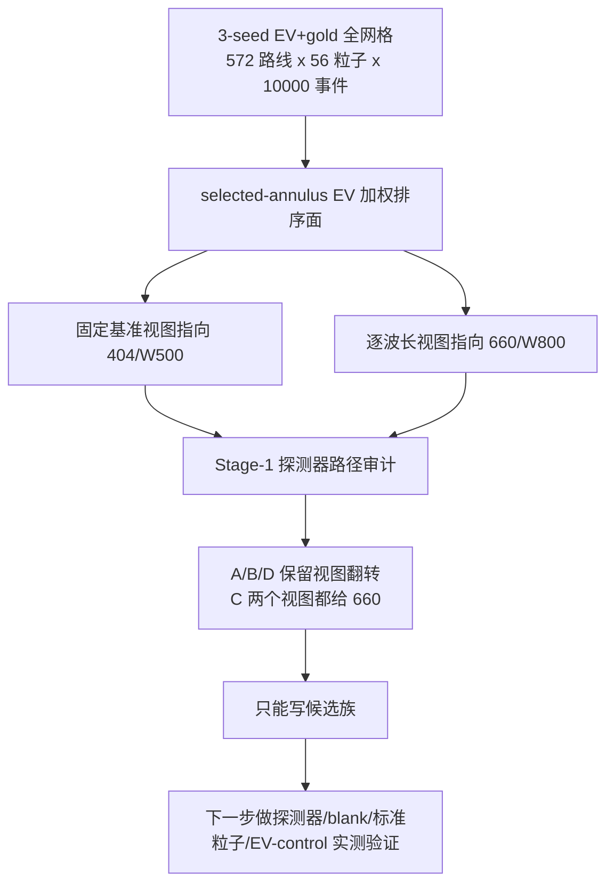
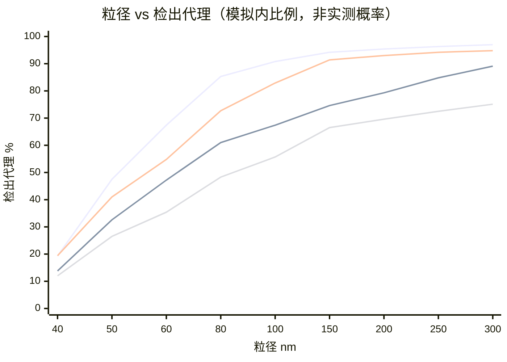
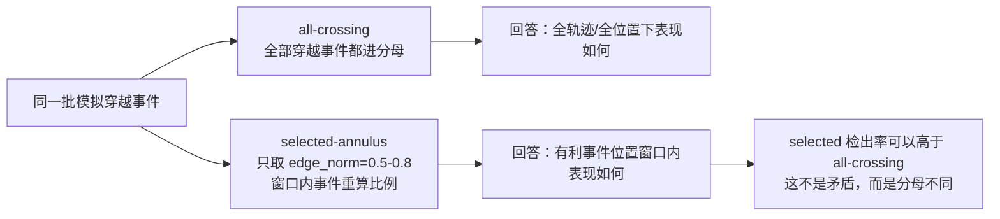
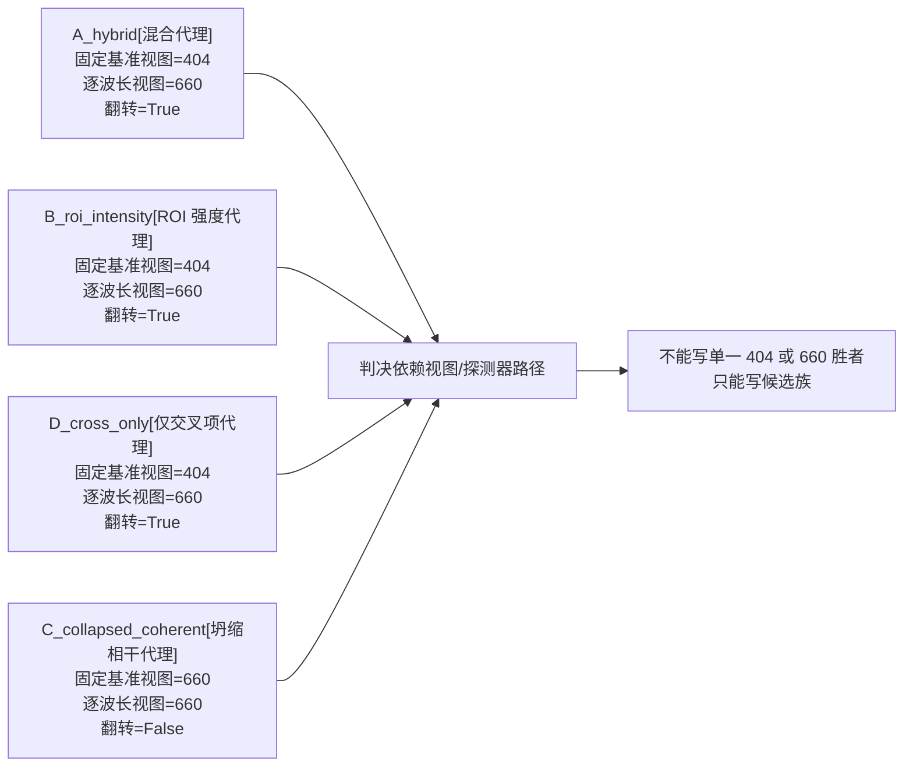

# EV/NODI 最终分析报告：无实测数据下的候选路线定稿

- 定稿日期：2026-06-12
- 报告性质：读者向最终分析报告
- 适用范围：无实测数据的一级相对/代理审计
- 顶层口径：探测器代理模型下的候选族
- 证据入口：3-seed EV+gold 全网格计算；report 147/148 的 Stage-1、T3、T4 审计证据包

这份报告回答一个实际工程问题：

> 在还没有实测空白噪声、标准粒子、真实探测器传递函数、BFP/ROI 图像和 EV/control 实验数据时，当前模拟链条能把哪些通道/波长组合推进到下一轮验证？

答案不是“404 赢”或“660 赢”。当前可以定稿的是两组候选族：

| 候选族 | 它为什么留下 | 怎么使用 |
|---|---|---|
| `404/W500` | 在固定基准视图（`fixed_660_gold`）下，短波散射和窄通道参考场使它成为最强候选族 | 首批取 D600/D900/D1200 代表点；重点验证墙面、运输和真实探测器算子是否保留优势 |
| `660/W800` | 在逐波长归一化视图（`per_wavelength_gold`）下，它是更稳健的 660 候选族，且宽度符合 `W≈λ/NA` 工程护栏 | 首批围绕 D900-D1200；D1300/D1400 只作为深度敏感性点 |

一句话说清楚：

> 当前工程可以封板的是一份无实测数据下的候选路线清单：`404/W500` 与 `660/W800` 并立；二者都只是探测器代理模型下的候选族。真实探测器分辨胜者不授权；校准 SNR/LOD/FPR 不授权；生物学结论不授权。

## 0. 先把边界讲清楚

### 0.1 本报告能回答什么

本报告能回答：

- 在同一套合成事件、同一套模型口径下，哪些路线更值得进入下一轮实测。
- 粒径、波长、宽度、深度、噪声，以及 selected-annulus / all-crossing 两种分析口径，分别如何影响候选排序。
- 为什么高峰值、高检出代理值或高综合分数不一定等于最终推荐。
- 为什么当前必须保留 `404/W500` 与 `660/W800` 两个候选族，而不是宣布一个绝对赢家。

### 0.2 本报告不能回答什么

本报告不授权：

- 404 或 660 是真实物理胜者。
- 任一路线是探测器分辨胜者或绝对胜者；绝对胜者不授权。
- 当前分数不是校准 SNR、不是 LOD、不是 blank-FPR，也不是真实事件概率、真实浓度或临床/生物性能。
- 把 selected-annulus 当成 BFP 光学环。它在这里只是事件位置分析窗口。
- NODI 外差增强倍数不授权；不能写成已经证明。
- R1 读出轴或 C/D×V2 已经完成。

### 0.3 最小术语表

| 术语 | 本报告里的意思 |
|---|---|
| route / 路线 | 一组波长/宽度/深度组合，例如 `404/W500/D900`；其中 404 是波长 nm，W500 是通道宽度 500 nm，D900 是通道深度 900 nm |
| family / 候选族 | 同一波长和宽度、把深度作为区间读取的一组路线，例如 `404/W500` |
| view / 视图 | 对同一批物理事件的归一化读法；本报告主要用固定基准视图（`fixed_660_gold`）与逐波长归一化视图（`per_wavelength_gold`） |
| selected-annulus | 事件位置分析窗口，边界为 `edge_norm=0.5-0.8`；不是 BFP 光学环 |
| all-crossing | 不限 selected-annulus 的并行分析口径 |
| detector surrogate | A/B/C/D 探测器路径代理；它是分析口径，不是真实探测器身份 |
| A/B/C/D 探测器路径 | A = self + joint cross 混合代理；B = ROI-scaled self + joint cross；C = self + collapsed cross；D = joint cross only |
| proxy 检出率 | 模拟内事件过阈值比例；不是实测事件概率 |
| peak 代理 | 模型内信号峰值相对量；不是实测电压 |
| margin 代理 | 模型内过阈余量相对量；数值可很大，但不是 SNR |
| `A_ref` | 参考场幅度代理；用于解释参考场强弱，不是实测光功率 |
| `E_sca` / `Csca` | 散射场振幅代理 / 散射强度代理；`Csca` 在本报告中只作 `E_sca^2` 阶段解释，不是校准 Mie 截面 |
| readout / 读出轴 | 把模拟信号转成判决量的规则；本次 no-data 封板门使用 R2，R1 未纳入封板范围 |
| gauge / gauge 轴 | 跨波长读法的角度/归一化检查；V1 是主判决 gauge，V2 是抽样复核 gauge |
| R1 / R2 | R1 = signed-positive 读出（只看正向符号）；R2 = absolute-peak 读出（取绝对峰值）。R2 是当前主判决读出，R1 是未跑、未验证的不变性假设 |
| V1 / V2 | V1 = locked gauge 主口径（锁定 gauge）；V2 = raw-angular + 显式 ref/sca 归一化抽样复核口径（`V2_raw_angular_explicit_norm_sample`）。V1 覆盖 A/B/C/D，V2 只覆盖 A/B 抽样；V2 不是“未归一化的真实探测器原始读数” |
| NODI | Nanofluidic Optical Diffraction Interferometry；本报告只取 Tsuyama 2022 single-channel NODI 语义锚定的参考光、脉冲、selected-annulus 与 gold-anchor 相对检测链，不把它扩展成已校准的实测性能或外差增强倍数 |
| gold anchor | 金纳米参考粒子锚点；主要指 Au20/40/60 等 gold rows，用于归一化、anchor 与 Tsuyama 一致性诊断，不参与 EV 推荐，也不是 EV 粒子轴 |
| Tsuyama-lineage | 以 Tsuyama/Mawatari 论文链为锚点的相对读法谱系；在本工程中主要指 per-wavelength gold-normalized 的 Tsuyama anchor 诊断和同波长几何比较，不是跨波长绝对校准 |
| 四种 EV 加权方式 | uniform、small_ev_literature、broad_ev_literature、sharp_msc_sev_empirical；它们是粒径群体假设，用来避免单一 EV-like 粒径分布主导排序 |
| 综合分数 | 模型内多指标合成的诊断量；可以暴露机制陷阱或对照波长高分，但不能单独决定推荐路线 |
| 波长角色（`wavelength_role`） | 波长治理标签；404/660 才参与主候选族，488/532 在本报告中是对照/参考波长 |
| 参考场过弱（`reference_too_weak`） | 参考场过弱、不可用；不进入受治理的推荐候选族 |
| 电子学噪声受限但可用（`electronics_noise_limited_useful`） | 电子学噪声受限但参考场可用；可作为推荐候选状态 |
| 散粒噪声受限、无净增益（`shot_noise_limited_no_gain`） | 散粒噪声受限、深度无净增益 |

### 0.4 百分比数字该怎么读

报告里的 88.3%、83.9%、97.0% 这类百分比，只表示“在当前模拟、当前阈值、当前分析口径下，事件过阈的比例代理”。它们不是实测检出概率，不是 POD，不是真实浓度层，也不能直接写进仪器规格书。读这些数字时要同时看三件事：它属于哪个视图、哪个分母口径（selected-annulus 还是 all-crossing）、是否通过参考场/工程护栏。

## 1. 证据从哪里来

### 1.1 主计算库

主证据来自 3 个 seed 的 EV+gold 全网格双视图共享事件流计算。

| 项目 | 数值 | 来源 |
|---|---:|---|
| 随机种子 | 11, 22, 33 | `results/exhaustive_ev_gold_fullgrid_shared_dual_3seed_10000e_postrun_audit_20260523.json` |
| 路线三元组 | 572 | 同上 |
| 粒子类型 | 56 | 同上 |
| 每个路线-粒子 case 的事件数 | 10000 | 同上 |
| 每个 seed、每个视图的路线-粒子表行 | 32032 | 同上 |
| 物理随机事件样本 | 960,960,000 | `3 × 572 × 56 × 10000` |
| 归一化视图 | 固定基准视图（`fixed_660_gold`）、逐波长归一化视图（`per_wavelength_gold`） | 双视图共享事件流运行 manifest |
| 计算后审计 | 通过，但有一条存储格式注意事项（`passed_with_schema_caveat`） | 运行后审计 JSON |

这条存储格式注意事项（`passed_with_schema_caveat`）的含义很窄：原始表只存均值类字段，分位数字段另存在诊断文件里；这一存储差异不影响任何候选族结论。

还要同时看一个抑制性证据：report 147 用工程自带的探测器自洽门（B vs C 比较）扫描时，v1 库 32,032 个 case 中有 32,000 个未通过自洽门，约 99.9%（审计字段为 `gate_passed=False`）。如果进一步要求“探测器分辨资格”，则只有 7/32,032 通过（审计字段为 `detector_resolved_relative_design_eligible`）。也就是说，本报告的候选族建立在不含探测器自洽门的“探索性相对排序”轨道上；这条轨道可以用于下一轮路线选择，但不能写成探测器分辨胜者。

### 1.2 两个 view 为什么都要保留

这次计算不是两次独立采样。固定基准视图（`fixed_660_gold`）与逐波长归一化视图（`per_wavelength_gold`）使用同一批物理事件，只是归一化视角不同：

- 固定基准视图（`fixed_660_gold`）：把跨波长差异更强地保留下来，容易暴露 404 的短波优势。
- 逐波长归一化视图（`per_wavelength_gold`）：每个波长用自己的 gold anchor 归一化，更接近 Tsuyama-lineage 的相对读法，660/W800 更稳。

所以两个视图的冲突不是 bug，而是当前无实测数据状态下最关键的信号：结论依赖探测器路径代理与归一化视角，不能写成绝对胜者。

### 1.3 结论链条

## 2. 最终候选：为什么是 `404/W500` 与 `660/W800`

### 2.1 最短证据表

下表只看可参与推荐的波长，也就是 404/660；488/532 作为对照/参考波长保留，但不参与候选胜出。

表中路线是“候选族代表路线”，不是每一行都等于逐 seed 字面第一名；名次列来自 recommendation-eligible 池，数值越低越靠前。

为防止单一粒径分布主导结论，排序同时考察了四种模拟粒径群体加权：uniform（均匀分布）、small_ev_literature（小 EV 文献分布）、broad_ev_literature（宽 EV 分布）、sharp_msc_sev_empirical（尖锐 MSC/sEV 经验分布）。它们是粒径群体假设，不是临床或样本假设。

| 视图 | EV 加权方式 | 候选族代表路线 | recommendation-eligible 平均名次 ± 标准差 | selected-annulus 检出代理（均值） |
|---|---|---|---:|---:|
| 固定基准视图（`fixed_660_gold`） | uniform | 404/W500/D600 | 2.000 ± 0.000 | 0.885798 |
| 固定基准视图（`fixed_660_gold`） | small_ev_literature | 404/W500/D800 | 1.333 ± 0.577 | 0.883360 |
| 固定基准视图（`fixed_660_gold`） | broad_ev_literature | 404/W500/D650 | 1.667 ± 1.155 | 0.905685 |
| 固定基准视图（`fixed_660_gold`） | sharp_msc_sev_empirical | 404/W500/D1200 | 1.667 ± 1.155 | 0.805364 |
| 逐波长归一化视图（`per_wavelength_gold`） | uniform | 660/W800/D900 | 1.333 ± 0.577 | 0.838607 |
| 逐波长归一化视图（`per_wavelength_gold`） | small_ev_literature | 660/W800/D1300 | 1.667 ± 0.577 | 0.828645 |
| 逐波长归一化视图（`per_wavelength_gold`） | broad_ev_literature | 660/W800/D900 | 1.333 ± 0.577 | 0.855446 |
| 逐波长归一化视图（`per_wavelength_gold`） | sharp_msc_sev_empirical | 660/W800/D1400 | 1.333 ± 0.577 | 0.753270 |

证据文件：

- `results/exhaustive_ev_gold_fullgrid_shared_dual_3seed_10000e_fixed_660_gold_aggregation_20260518/lens_b_ev_fullgrid_3seed_route_stability.csv`
- `results/exhaustive_ev_gold_fullgrid_shared_dual_3seed_10000e_per_wavelength_gold_aggregation_20260518/lens_b_ev_fullgrid_3seed_route_stability.csv`

读法：

- 固定基准视图的四个 EV 加权方式都落在 `404/W500` 候选族。
- 逐波长归一化视图的四个 EV 加权方式都落在 `660/W800` 候选族。
- 深度在不同加权方式和 seed 之间会移动，所以深度只能读成区间，不应读成唯一胜出点。
- 例如均匀分布（`uniform`）下 `404/W500/D600` 的平均名次是 2.000 ± 0.000，意思是它在 3 个 seed 中稳定处在可推荐池第二带；可推荐池内第 1 名在不同 seed 间变动，故没有任何单条路线稳定占据第 1，候选族代表取稳定居前者。

### 2.2 代表通道的模拟检出代理有多高

下面的“检出比例”都是模拟内代理值：它表示被抽样的 EV-like 事件中，有多少在当前读出/阈值下被判为检出。它不是实测概率。

| 这些百分比是 | 这些百分比不是 |
|---|---|
| 同一模型、同一口径内比较路线的过阈比例代理 | 实测检出概率、POD、浓度换算或临床性能 |
| selected-annulus 或 all-crossing 各自分母下的内部比例 | 两个口径之间可互相替代的绝对性能数字 |
| 用来解释粒径、宽度、深度、噪声如何影响排序 | 可直接写入 SNR/LOD/FPR 的校准指标 |

| 代表路线 | 视图 | selected-annulus 检出代理 | all-crossing 检出代理 | peak 代理 | margin 代理 | 读法 |
|---|---|---:|---:|---:|---:|---|
| 404/W500/D600 | 固定基准视图 | 88.6% | 64.8% | 7.43 | 3434 | 404 候选族的浅/中深代表 |
| 404/W500/D900 | 固定基准视图 | 88.3% | 71.8% | 11.33 | 5294 | peak 与 all-crossing 随深度上升，但 selected 基本平台化 |
| 404/W500/D1200 | 固定基准视图 | 87.5% | 77.2% | 12.33 | 5783 | 更深不显著改善 selected |
| 660/W800/D900 | 逐波长归一化视图 | 83.9% | 61.5% | 2.63 | 1198 | 660 候选族的保守中深代表 |
| 660/W800/D1200 | 逐波长归一化视图 | 83.6% | 65.6% | 3.62 | 1656 | all-crossing 与 peak 上升，selected 仍接近平台 |
| 660/W800/D1400 | 逐波长归一化视图 | 83.3% | 68.2% | 4.08 | 1876 | 深度更高主要增强 all-crossing/peak |
| 660/W500/D1500 | 逐波长归一化视图 | 91.3% | 85.2% | 15.15 | 6914 | 数字最高，但参考场过弱（`reference_too_weak`），只作诊断线索 |

证据文件：

- `results/exhaustive_ev_gold_fullgrid_shared_dual_10000e_seed*_16worker_20260518/seed_*_*_raw_rows.csv`

读法：

- `660/W500/D1500` 的数字很高，但它违反 660 的宽度/参考场护栏，不能因为代理值高就推荐。
- `404/W500` 与 `660/W800` 的 selected-annulus 检出代理都已经进入较高平台区；此时继续追逐 peak 不一定换来 selected-annulus 检出率提升。
- all-crossing 与 selected-annulus 必须并列展示；它们回答的问题不同，不能互相覆盖。

## 3. 粒径：为什么有些粒子在模型内更难过阈

工程上最关心的问题往往不是“哪个 route 排第一”，而是：

> 在当前模拟内，这个通道能让多少比例的粒子过阈？为什么小粒子更难过阈，大粒子更容易过阈？

下面固定两个代表通道，看不同 EV-like 粒径的检出代理。表中 peak 和 margin 是模型内相对量，用来解释趋势，不是实测电压或 SNR。

一眼读图：

如果当前阅读器不支持 `xychart-beta` 渲染，请直接看下面 3.1/3.2 两张表；表格给出同一组数字。

### 3.1 `404/W500/D900`：固定基准视图候选

| 粒径 | selected-annulus 检出代理 | all-crossing 检出代理 | peak 代理 | margin 代理 |
|---:|---:|---:|---:|---:|
| 40 nm | 19.3% | 13.8% | 0.16 | 69 |
| 50 nm | 47.5% | 32.6% | 0.30 | 139 |
| 60 nm | 67.4% | 47.2% | 0.50 | 231 |
| 80 nm | 85.3% | 61.0% | 1.07 | 497 |
| 100 nm | 90.8% | 67.4% | 1.90 | 889 |
| 150 nm | 94.2% | 74.6% | 5.41 | 2523 |
| 200 nm | 95.4% | 79.3% | 11.49 | 5361 |
| 250 nm | 96.3% | 84.8% | 21.23 | 9929 |
| 300 nm | 97.0% | 89.1% | 37.36 | 17492 |

### 3.2 `660/W800/D900`：逐波长归一化视图候选

| 粒径 | selected-annulus 检出代理 | all-crossing 检出代理 | peak 代理 | margin 代理 |
|---:|---:|---:|---:|---:|
| 40 nm | 19.4% | 12.0% | 0.05 | 18 |
| 50 nm | 41.0% | 26.5% | 0.09 | 36 |
| 60 nm | 54.8% | 35.4% | 0.14 | 62 |
| 80 nm | 72.7% | 48.3% | 0.30 | 135 |
| 100 nm | 82.9% | 55.7% | 0.53 | 238 |
| 150 nm | 91.4% | 66.5% | 1.41 | 641 |
| 200 nm | 93.0% | 69.6% | 2.85 | 1300 |
| 250 nm | 94.2% | 72.5% | 4.93 | 2245 |
| 300 nm | 94.8% | 75.1% | 7.77 | 3544 |

读法：

- 40-60 nm 是最困难区间。小 EV 的散射场和 peak 都低，很多事件即使进入 selected-annulus 也过不了阈值。
- 一个重要细节是：40 nm 处 404 的 peak 代理约为 660 的 3 倍（0.16 vs 0.05），但 selected-annulus 检出代理几乎相同（19.3% vs 19.4%）。这正说明小粒径区的最后瓶颈不是 peak 倍数本身，而是阈值、事件位置和读出门控。
- 80-150 nm 是过渡区。peak 快速上升，selected-annulus 检出代理从几十个百分点进入 85-90% 附近。
- 200-300 nm 接近平台。大粒子 peak/margin 很高，但 all-crossing 仍低于 selected-annulus，因为 all-crossing 把所有穿越事件都算进分母，包含位置、相位和轨迹不利的事件。
- 这解释了为什么报告不能只给一个总检出率。粒径分布假设会改变工程判断，所以全网格同时保留均匀分布、小 EV 文献分布、宽 EV 分布、尖锐 MSC/sEV 经验分布等加权方式。

## 4. 固定变量看影响因素

这一章按“固定其他变量，只改变一个变量”的方式解释原因。这样能看出到底是粒径、波长、宽度、深度还是噪声最影响结论。

先给一个定性优先级，帮助读者读后面的细表：

| 变量 | 当前报告中的作用 | 是否需要实测确认 |
|---|---|---|
| 粒径 | 最大的事件级驱动项；40-60 nm 最难，80-150 nm 过渡，200-300 nm 接近 selected-annulus 平台 | 需要 EV/control 与标准粒子阶梯确认 |
| 波长 | 改变散射场与参考场，但不能单独决定真实胜者 | 需要跨波长 gauge 和标准粒子确认 |
| 宽度 | 决定候选族的工程护栏；404 读 W500，660 读 W800 | 需要墙面、运输和真实光学算子确认 |
| 深度 | selected-annulus 下是弱变量；更深主要增强 peak/all-crossing | 需要空白噪声与探测器传递函数确认 |
| 噪声 | 决定参考场/深度增强是否有净收益，是未标定关键轴 | 必须用实测空白噪声轨迹确认 |

先给机制骨架：

### 4.1 固定几何看波长：404 峰值强，但不直接变成胜者

固定几何为 W800/D900，固定视图为固定基准视图（`fixed_660_gold`），只改变波长。倍数都相对 660 nm。注意：这张表是为了隔离“波长”这个变量，所以统一使用 W800/D900；404 的实际候选几何是 W500，不能把这里的 404/W800 检出代理当成 404/W500 的候选族表现。488/532 在本报告中是对照/参考波长，即使代理值接近也不进入主候选族。

| 波长 | 角色 | `E_sca` 代理（×，基准=660） | `Csca` 代理（×，基准=660） | `A_ref`（×，基准=660） | peak 代理（×，基准=660） | selected-annulus 检出代理 | all-crossing 检出代理 |
|---:|---|---:|---:|---:|---:|---:|---:|
| 404 | 主候选 | 1.97× | 3.90× | 1.34× | 2.67× | 82.7% | 60.2% |
| 488 | 对照/参考 | 1.62× | 2.63× | 1.16× | 1.97× | 83.0% | 60.5% |
| 532 | 对照/参考 | 1.44× | 2.06× | 1.10× | 1.63× | 83.0% | 60.7% |
| 660 | 主候选 | 1.00× | 1.00× | 1.00× | 1.00× | 83.9% | 61.5% |

`Csca` 代理在这里用 `E_sca` 代理的平方近似，只用于阶段解释；它不是校准后的 Mie 散射截面。
列出 `Csca` 是为了直观展示振幅差异在强度层面的放大效应。

读法：

- 404 的散射振幅代理约为 660 的 1.97×，对应的散射强度代理约为 3.90×。
- 参考场也更强，peak 代理约为 660 的 2.67×。
- 但检出代理没有等比例提高，反而略低。这说明这组条件已经接近阈值/门控平台；过阈值、事件位置、穿越/读出和探测器路径门控才是最后的约束。
- 因此，404 峰值强是保留 `404/W500` 的理由，但不是宣布 404 物理胜出的理由。

### 4.2 固定波长看宽度：为什么 404 选 W500、660 选 W800

这里的 `W≈λ/NA` 不是一个单步推出最优宽度的定律，而是一个工程量级护栏：

1. 波长/NA 先给量级：以 NA=0.9 粗算，404/0.9≈449 nm，660/0.9≈733 nm。
2. 再落到离散宽度网格：404 最接近 W500，660 最接近 W700/W800。
3. 最后用参考场可用性治理：660 的 W500/W600/W700 被标为 `reference_too_weak`，所以 W800 才是最窄可用候选宽度。

本节的倍数各以本候选族自己的基准宽度为 1.00×，和 4.1 中“共同几何、相对 660”的基准不同。

先看 404。固定波长为 404、深度为 D900、视图为固定基准视图（`fixed_660_gold`），只改变宽度。倍数相对 W500。

| 宽度 | 参考场状态 | `A_ref`（×，基准=W500） | peak 代理（×，基准=W500） | selected-annulus 检出代理 | all-crossing 检出代理 | 读法 |
|---:|---|---:|---:|---:|---:|---|
| W500 | 电子学噪声受限但可用（`electronics_noise_limited_useful`） | 1.00× | 1.00× | 88.3% | 71.8% | 最窄可用且最高；404 候选宽度 |
| W600 | 电子学噪声受限但可用（`electronics_noise_limited_useful`） | 0.90× | 0.75× | 85.7% | 65.7% | 加宽后 peak 和检出代理下降 |
| W700 | 电子学噪声受限但可用（`electronics_noise_limited_useful`） | 0.85× | 0.67× | 84.1% | 62.3% | 继续下降 |
| W800 | 电子学噪声受限但可用（`electronics_noise_limited_useful`） | 0.81× | 0.62× | 82.7% | 60.2% | 这是 4.1 共同几何表中的 404 点，不是 404 推荐宽度 |
| W900 | 电子学噪声受限但可用（`electronics_noise_limited_useful`） | 0.78× | 0.59× | 81.2% | 58.6% | 更宽不利 |

再看 660。固定波长为 660、深度为 D900、视图为逐波长归一化视图（`per_wavelength_gold`），只改变宽度。倍数相对 W800。

| 宽度 | 参考场状态 | `A_ref`（×，基准=W800） | peak 代理（×，基准=W800） | selected-annulus 检出代理 | all-crossing 检出代理 | 读法 |
|---:|---|---:|---:|---:|---:|---|
| W500 | 参考场过弱（`reference_too_weak`） | 4.26× | 4.54× | 93.1% | 76.5% | 数字最高，但违反 660 宽度护栏 |
| W600 | 参考场过弱（`reference_too_weak`） | 1.44× | 1.49× | 87.8% | 68.0% | 仍在参考场过弱区 |
| W700 | 参考场过弱（`reference_too_weak`） | 1.14× | 1.15× | 85.5% | 64.0% | 接近门槛但仍未过 |
| W800 | 电子学噪声受限但可用（`electronics_noise_limited_useful`） | 1.00× | 1.00× | 83.9% | 61.5% | 最窄可用参考场状态；最终候选宽度 |
| W900 | 电子学噪声受限但可用（`electronics_noise_limited_useful`） | 0.92× | 0.91× | 82.3% | 59.8% | 更宽后参考场和 peak 下降 |
| W1200 | 电子学噪声受限但可用（`electronics_noise_limited_useful`） | 0.80× | 0.78× | 78.5% | 57.0% | 继续下降 |
| W1500 | 电子学噪声受限但可用（`electronics_noise_limited_useful`） | 0.75× | 0.72× | 75.4% | 55.5% | 更宽不利 |

读法：

- 对 404，W500 本身已经通过参考场状态，并且加宽后 peak 与检出代理单调下降，所以 `404/W500` 是直接候选族。
- 对 660，W500 的参考场和 peak 很高，所以代理检出率也高。
- 但 W500/W600/W700 对 660 nm 被标为参考场过弱（`reference_too_weak`），不能进入受治理的推荐候选族。
- W800 不是“分数最高的宽度”，而是在 `W≈λ/NA` 量级、离散网格和参考场可用性三重约束下的最窄可用宽度。它牺牲一部分代理高分，换取更稳健的参考场解释和工程可发布边界。

### 4.3 固定波长和宽度看深度：为什么不能追逐单点深度冠军

深度结论要分 404 和 660 两条读。`D900-D1200` 是 660/W800 首批验证的保守中心带，不是两个候选族共同的唯一深度结论。

先看 `660/W800`。固定波长为 660、宽度为 W800、视图为逐波长归一化视图（`per_wavelength_gold`），只改变深度。倍数相对 D900。

| 深度 | `A_ref`（×，基准=D900） | peak 代理（×，基准=D900） | selected-annulus 检出代理 | all-crossing 检出代理 | 读法 |
|---:|---:|---:|---:|---:|---|
| D500 | 0.57× | 0.48× | 80.6% | 54.0% | 太浅时 reference/peak 较低 |
| D700 | 0.79× | 0.74× | 83.1% | 58.2% | 接近平台 |
| D900 | 1.00× | 1.00× | 83.9% | 61.5% | 保守工程中心 |
| D1200 | 1.28× | 1.37× | 83.6% | 65.6% | peak/all-crossing 增强，但 selected 不增 |
| D1300 | 1.43× | 1.52× | 83.6% | 67.0% | 部分 weighting 会上榜，但 selected 仍在平台内 |
| D1400 | 1.45× | 1.55× | 83.3% | 68.2% | 深度收益主要出现在 all-crossing |
| D1500 | 1.53× | 1.61× | 83.0% | 69.3% | 更深不提高 selected，工艺风险更高 |

读法：

- 深度确实增强参考场和 peak：D1500 相对 D900 的 `A_ref` 约 1.53×，peak 约 1.61×。
- all-crossing proxy 也会上升：61.5% 到 69.3%。
- 但 selected-annulus proxy 基本持平甚至略降：D900 为 83.9%，D1200 为 83.6%，D1300 为 83.6%，D1400 为 83.3%，D1500 为 83.0%。
- 因此 D1300/D1400 不是“错误”或“无价值”，它们确实会在部分 weighting 下成为 selected top；但它们没有给出明显高于 D900-D1200 的 selected 收益，主要提升的是 all-crossing/peak。因此首批工艺中心取 D900-D1200，D1300/D1400 作为深度敏感性点。

再看 `404/W500`。固定波长为 404、宽度为 W500、视图为固定基准视图（`fixed_660_gold`），只改变深度。倍数相对 D900。

| 深度 | `A_ref`（×，基准=D900） | peak 代理（×，基准=D900） | selected-annulus 检出代理 | all-crossing 检出代理 | 读法 |
|---:|---:|---:|---:|---:|---|
| D500 | 0.61× | 0.51× | 88.3% | 62.4% | selected 已在平台附近 |
| D600 | 0.72× | 0.66× | 88.6% | 64.8% | 浅/中深代表点 |
| D700 | 0.82× | 0.79× | 88.3% | 67.0% | selected 仍平台化 |
| D800 | 0.91× | 0.92× | 88.6% | 69.6% | selected 最高带之一 |
| D900 | 1.00× | 1.00× | 88.3% | 71.8% | 工程中点 |
| D1200 | 1.20× | 1.09× | 87.5% | 77.2% | 深度压力点 |
| D1500 | 1.30× | 1.17× | 86.8% | 80.8% | all-crossing 更高，但 selected 不升 |

这里 selected-annulus 从 D600 到 D1500 大致在 88.6%→86.8% 之间缓慢下降，而 all-crossing 从 64.8%→80.8% 上升。它说明 404/W500 更适合读作一个较宽的深度候选带，而不是套用 660/W800 的 D900-D1200 中心规则。首批验证可取 D600、D900、D1200 三个代表点：一个浅/中深点、一个工程中点、一个深度压力点。

综合规则是：

- 宽度决定候选族：404 读 W500，660 读 W800。
- 深度读成区间：404/W500 用 D600/D900/D1200 代表宽深度带；660/W800 以 D900-D1200 为保守中心，D1300/D1400 只做敏感性点。
- T3 已显示 selected-annulus 的深度排序接近采样噪声底，因此不要把任何单个深度写成强胜出点。

### 4.4 噪声：为什么参考场增强不能直接变成最终推荐

一项前置噪声研究（report 146）显示：当噪声从“电子学噪声受限”转向“散粒噪声偏重”，深度收益会收缩。

下表是 660/W800 在论文对齐参考场模型下的 all-crossing 机制探针结果；它使用 0-1 独立探针标度，不能和主网格里的 61.5% 等数字逐值对齐。表中的“深度跨度”按 `(最大值 - 最小值) / 最大值` 计算，用来表达深度收益被噪声压缩的程度；第三行是非单调探针，最低点在 D900 而不是 D500。

| 噪声设定 | 散粒噪声标度（shot scale） | D500 检出代理（0-1 独立探针） | D900 检出代理（0-1 独立探针） | D1500 检出代理（0-1 独立探针） | 深度跨度 | 工作状态 |
|---|---:|---:|---:|---:|---:|---|
| 按既有计算运行的电子学噪声受限口径 | 0.001 | 0.502 | 0.556 | 0.652 | 23% | 电子学噪声受限但可用（`electronics_noise_limited_useful`） |
| 散粒噪声偏重 | 0.05 | 0.488 | 0.523 | 0.595 | 18% | 散粒噪声受限、无净增益（`shot_noise_limited_no_gain`） |
| 散粒噪声主导 | 0.2 | 0.442 | 0.436 | 0.476 | 8% | 散粒噪声受限、无净增益（`shot_noise_limited_no_gain`） |

证据文件：

- `reports/146_depth_reference_model_noise_regime_evidence_20260603.md`
- `results/depth_reference_model_noise_regime_probe_20260603.csv`

读法：

- 参考场增强确实抬高 peak/margin。
- 但它的设计价值取决于真实噪声口径。参考场增强会抬高信号；如果系统更接近散粒噪声主导，噪声底也会随光强一起上升，净检出收益会被抵消。
- 所以空白噪声轨迹与探测器传递函数是下一阶段第一批实测门。没有它们，深度不能写成强推荐，也不应为了 D1300+ 的深通道单点支付额外工艺成本。

## 5. 为什么 all-crossing、selected-annulus 和综合分数不能互相替代

先把两个分母画清楚：

### 5.1 all-crossing 的领先路线用于揭示机制，但不是最终推荐

在两个归一化视图和四个 EV 加权方式下，all-crossing 领先路线都是 `660/W500/D1500`。它的加权 all-crossing 得分为：

下表四列是四种 EV 加权方式，定义见 0.3 与 2.1；保留括号内字段名是为了便于追溯 artifact。

| 视图 | 均匀分布（`uniform`） | 小 EV 文献分布（`small_ev_literature`） | 宽 EV 分布（`broad_ev_literature`） | 尖锐 MSC/sEV 经验分布（`sharp_msc_sev_empirical`） |
|---|---:|---:|---:|---:|
| 固定基准视图（`fixed_660_gold`） | 0.851860 | 0.819629 | 0.852247 | 0.774097 |
| 逐波长归一化视图（`per_wavelength_gold`） | 0.851712 | 0.819478 | 0.852125 | 0.773828 |

这是一个机制揭示/工程诊断信号：`660/W500/D1500` 在“所有穿越事件都算进去”的口径里非常强。但它不能直接覆盖 selected-annulus。

关键点：selected-annulus 检出率可以高于 all-crossing，这不是矛盾。all-crossing 的分母是全部模拟穿越事件；selected-annulus 只看事件初始位置落在 `edge_norm=0.5-0.8` 分析窗口内的事件，并在这个窗口内重新计算通过阈值的比例。因此 selected-annulus 检出率更高，只表示窗口内事件更有利，不表示“子集检出数超过全集”。

不能直接覆盖的原因有三条：

1. all-crossing 和 selected-annulus 是两个并行分析口径，分母和问题都不同。
2. selected-annulus 是为了近似 Tsuyama 语义下更有利的事件位置窗口，不是 BFP 光学环。
3. `660/W500` 对 660 nm 处在参考场过弱（`reference_too_weak`）护栏外，不能因为 all-crossing 高就绕过参考场治理。

### 5.2 综合分数的高分也可能是陷阱

综合分数最高的路线会暴露有用的诊断现象，但不等于最终推荐。例如在固定基准视图（`fixed_660_gold`）中，`small_ev_literature` 和 `sharp_msc_sev_empirical` 的综合分数最高路线都是 `532/W800/D500`，但 532 的波长角色是仅作对照（artifact 字段为 `wavelength_role=control_only_488_532`）。

所以本报告必须分开三件事：

- EV 推荐候选：只在 404/660 中读。
- 对照/参考波长：488/532 可以帮助看趋势和陷阱，但不能升级为主推荐。
- 分析口径诊断：all-crossing 和综合分数面可以指出机制问题，但不能单独决定最终候选。

## 6. Stage-1：为什么不能选单一 404↔660 胜者

Stage-1 是本报告的主判决层。它不是在全网格表上再选一次最高分，而是在问：

> 如果探测器路径代理不同，404/660 的判决会不会变？

答案是会变。

### 6.1 收窄后的 no-data 封板门

先用平白话说：主判决使用 R2 读出 + V1 gauge，已经覆盖 A/B/C/D 四条探测器路径的 3 个 seed；另用 V2 gauge 在 A/B 上做抽样复核。R1 读出轴和 C/D×V2 不在本次 no-data 定稿封板门内。

当前定稿负责人裁决后的封板门是：

> R2 绝对峰值读出 + V1 锁定 gauge 主口径覆盖 A/B/C/D 全 3-seed 主判决（`R2_absolute / V1_gauge_locked`），再加 R2 + V2 raw-angular + 显式 ref/sca 归一化抽样 gauge 覆盖 A/B 全 3-seed 抽样检验（`R2_absolute / V2_raw_angular_explicit_norm_sample`）。

括号里的英文/代码标签只用于追溯 artifact 字段；正文读法以中文说明为准。

更具体地说：R1 是只看正向符号的读出，R2 是取绝对峰值的读出；V1 是锁定 gauge 的主判决口径，V2 是 raw-angular 角谱加显式 ref/sca 归一化后的抽样复核，不是未归一化原始探测器真值。当前封板门只授权 R2/V1 主判决与 A/B 的 V2 抽样，不把 R1 或 C/D×V2 写成已验证不变性。

封板门故意比 “A/B/C/D × R1/R2 × V1/V2 全部跑完” 更窄。R1 与 C/D×V2 仍在覆盖矩阵中可见，但被登记为“本次无实测定稿范围之外的待办格”。换句话说，它们不是“已经验证不重要”，而是被定稿负责人裁决为无实测数据定稿范围之外、转入后续交接清单。

| 读出 | gauge | 探测器路径覆盖 | 封板门分类 |
|---|---|---|---|
| R2 绝对峰值（`R2_absolute`） | V1 锁定 gauge（`V1_gauge_locked`） | A/B/C/D 全部完成，3/3 seeds | 收窄封板门内，主判决完成 |
| R2 绝对峰值（`R2_absolute`） | V2 raw-angular + 显式归一化（`V2_raw_angular_explicit_norm_sample`） | A/B 完成，3/3 seeds | 收窄封板门内，gauge 抽样完成 |
| R2 绝对峰值（`R2_absolute`） | V2 raw-angular + 显式归一化（`V2_raw_angular_explicit_norm_sample`） | C/D 缺失 | 收窄封板门外，由 A/B 抽样代表 |
| R1 正向符号（`R1_signed_positive`） | V1/V2 | A/B/C/D 缺失 | 收窄封板门外，R1 不变性未测 |

证据文件：

- `results/audits/report148_stage1_preseal_review_20260612/report148_stage1_coverage_matrix.csv`

同样要保留 report 147 的更严口径提醒：如果把探测器自洽门接入“探测器分辨资格”层，通过者只有 7/32,032（审计字段为 `detector_resolved_relative_design_eligible`）。因此本节的“封板门满足”只表示收窄 no-data 范围内的主判决完成，不表示真实探测器身份已经结案。

### 6.2 探测器路径判决

一眼读图：

括注描述的是当前代理组装口径；四条路径的差别在于是否含自项、是否保留交叉项、交叉项是否坍缩。对应 artifact 速记为：A = self + joint cross；B = ROI-scaled self + joint cross；C = self + collapsed cross；D = joint cross only。

这个 Stage-1 翻转判决是在代表深度面板上执行的：404 包含 D700/D1300，660 包含 D900/D1300。它用于判断 404↔660 headline 是否依赖探测器路径，不是用来替代第 2/4 章的全网格深度区间读法。

| 探测器路径 | gauge 证据 | 固定基准视图判决 | 逐波长归一化视图判决 | 是否视图翻转 |
|---|---|---|---|---|
| A_hybrid [混合代理] | V1 和 V2 | 3/3 seeds 为 404 | 3/3 seeds 为 660 | 3/3 seeds 为 True |
| B_roi_intensity [ROI 强度代理] | V1 和 V2 | 3/3 seeds 为 404 | 3/3 seeds 为 660 | 3/3 seeds 为 True |
| C_collapsed_coherent [坍缩相干代理] | V1 | 3/3 seeds 为 660 | 3/3 seeds 为 660 | 3/3 seeds 为 False |
| D_cross_only [仅交叉项代理] | V1 | 3/3 seeds 为 404 | 3/3 seeds 为 660 | 3/3 seeds 为 True |

证据文件：

- `results/audits/report148_stage1_preseal_review_20260612/report148_stage1_flip_evidence.csv`

读法：

- A/B/D 都保留固定基准视图→404、逐波长归一化视图→660 的视图翻转。
- C 去掉了这个翻转，两个视图都给 660。
- 因此 Stage-1 的结论不是 “A/B/D 多数投票所以 404 或 660 赢”，而是 “探测器路径身份会改变判决；当前只能写成探测器代理模型下的候选族”。

### 6.3 事件账：为什么按表行计的事件数不是去重物理事件数

Stage-1 的两个归一化视图共享同一条物理事件流，所以事件账必须分两种口径。这一节是为了防止把“同一批物理事件在两个视图里各算一次”误读成样本量翻倍。

主全网格每个路线-粒子 case 使用 10000 事件；Stage-1 审计是封板前的探测器路径筛查，使用每个表行（case row）2000 事件的子预算。二者用途不同，所以事件数口径不同，不要把下表的 Stage-1 子预算与 §1.1 的主全网格 960,960,000 个物理随机事件样本相加。

| 来源范围 | 表行数 | 每个表行事件数 | 按表行计的事件数 | 去重物理 case | 去重物理事件数 |
|---|---:|---:|---:|---:|---:|
| A/B, V1+V2, 仅 R2 | 2160 | 2000 | 4,320,000 | 1080 | 2,160,000 |
| C/D, V1, 仅 R2 | 1080 | 2000 | 2,160,000 | 540 | 1,080,000 |
| total | 3240 | 2000 | 6,480,000 | 1620 | 3,240,000 |

证据文件：

- `results/audits/report148_stage1_preseal_review_20260612/report148_stage1_event_accounting.csv`

## 7. T3/T4：为什么深度和 bright-EV（强散射 EV 组合）不能写成强分离

### 7.1 T3：selected-annulus 下深度是弱变量

T3 噪声轴审计检查：当噪声设定改变时，深度领先点是否稳定。

| 分析口径 | 跨 seed 稳定的深度领先点数量 |
|---|---:|
| selected-annulus | 5/30 |
| all-crossing | 26/30 |

这里的 30 = 10 个深度点 × 3 个噪声设定；基线下的 10 = 单一噪声设定里的 10 个深度点。在基线 `shot_noise_scale=0.001` 下，selected-annulus 只有 1/10 个深度领先点跨 seed 稳定；all-crossing 是 10/10。

证据文件：

- `results/audits/report148_t3_noise_axis_20260612/report148_t3_depth_rank_seed_stability.csv`

读法：

- selected-annulus 的深度排序接近采样噪声底。
- all-crossing 的深度排序强得多，但它是另一个分析口径，并且仍受噪声口径影响。
- 因此深度应写成工程区间。对 `660/W800`，D900-D1200 是保守首批范围；D1300/D1400/D1500 适合做敏感性点，不适合写成强制推荐。

### 7.2 T4：bright-EV（强散射 EV 组合）是 Wilson 重叠 / 近似平局，不是分离胜出

T4 检查 7 个 bright-EV（强散射 EV 组合），每个使用 10000 个事件。这里的 Wilson 区间指二项比例置信区间，用来判断 404 与 660 的过阈比例是否达到区间分离。

| T4 结果 | 数量 |
|---|---:|
| 组合 | 7 |
| seed 行数 | 21 |
| Wilson 区间重叠 | 21/21 |
| seed 一致偏向 404、但区间未分离 | 12/21 seed 行，覆盖 4 个组合 |
| seed 不稳且 Wilson 重叠近似平局 | 9/21 seed 行，覆盖 3 个组合 |

证据文件：

- `results/audits/report148_stage1_preseal_review_20260612/report148_stage1_t4_wilson_support.csv`

读法：

- T4 不支持“确定性、区间分离的 404 胜出”。
- 它支持的是 “Wilson 区间重叠；部分组合点估计偏向 404，部分组合 seed 不稳、近似平局”。
- 所以 bright-EV 不能用来推翻 Stage-1 的候选族边界。

## 8. 工程建议

### 8.1 下一阶段路线分层

进入实测验证的主候选只有两组：

| 候选族 | 下一阶段角色 | 几何建议 |
|---|---|---|
| `404/W500` | 固定基准视图下的短波候选 | 以 W500 为核心，选 D600/D900/D1200 代表点；必须做墙面/运输/full-wave 与真实探测器算子检查 |
| `660/W800` | 逐波长归一化视图下的基线候选 | 首批围绕 D900-D1200；D1300/D1400 只作为深度敏感性测试 |

D700 是 Stage-1 门内 404 字面胜出深度；D600/D900/D1200 是覆盖浅/中/深压力的工程代表带。二者不冲突，因为深度仍按区间读，不按单点冠军读。

只保留为诊断/对照、不作为主实测推进路线的是：

| 路线 | 角色 | 使用边界 |
|---|---|---|
| `488/532` | 对照/参考波长 | 用于趋势检查、陷阱检查和仅对照表面；不进入主推荐，不安排为主路线实测 |
| `660/W500 deep` | all-crossing 诊断路线 | 解释“高代理值不等于推荐”；处在 660 的参考场过弱护栏外，不安排为主路线实测 |

### 8.2 第一批验证门

下一阶段不应先追求更多 no-data 排名，而应补决定性实测/高保真信息：

| 验证门 | 要解决的问题 | 通过判据 / 可观测量 | 通过后才可能解锁的说法 |
|---|---|---|---|
| BFP / slit / ROI / 参考相位实测算子 | 真实探测器更像 A/B/D 还是 C | 同一颗粒/同一几何下能判定 joint-cross 家族与 collapsed-cross 家族哪一个更贴近真实读出，并保留原始图像/相位来源溯源 | 才能讨论更接近真实探测器身份的 404/660 判决 |
| 实测空白噪声轨迹 | 真实噪声底、空白尾部、误报行为 | 每波长/每芯片有空白轨迹，能区分电子学噪声受限与散粒噪声受限倾向，并解释深度收益是否仍有净增益 | 才能写经验 FPR、LOD 或空白风险边界 |
| 探测器传递函数 / 读出算子 | proxy score 如何映射到真实输出 | 同一输入事件在真实读出链中的峰值、符号、时间窗与模拟代理可逐项对照 | 才能把模拟代理量连接到仪器输出 |
| 标准粒子阶梯 | 粒径/材料单调性和跨波长 gauge 是否成立 | Au/Ag 或等效标准粒子阶梯给出可复查的粒径单调性与跨波长归一化偏差 | 才能验证粒径曲线和跨波长比较 |
| full-wave / transport 抽检 | 窄通道代理增益是否经受墙面和运输物理 | W500/W800 代表几何在墙面、运输、相位和轨迹扰动下仍保留候选族级别解释 | 才能判断 W500/W800 几何优势是否保留 |
| EV/control 生物面板 | EV 组成和非 EV control 的真实差异 | EV 与 non-EV control 在同一读出链下可分开记录，并能回连到粒径/RI/背景组成解释 | 才能进入生物学特异性验证 |

其中空白噪声轨迹是深度决策的硬前提：深度收益是否真实，门槛在噪声口径标定。未标定前，不应为了 D1300+ 深通道单点支付工艺成本。

### 8.3 仍开放的问题

| 桶 | 项目 | 当前状态 |
|---|---|---|
| A：必须实测 | 探测器身份 / cross-term identity | 开放；no-data 模拟不能单独解决 |
| A：必须实测 | 跨波长 gauge | 开放；需要标准粒子阶梯 |
| A：必须实测 | 空白噪声 / FPR | 开放；需要实测空白噪声轨迹 |
| A：必须实测 | EV 成分和生物学特异性 | 开放；需要 EV/control panel |
| B：可模拟补齐但不在本封板门内 | R1 读出轴 | 未跑；不是 no-data 封板阻塞项 |
| B：可模拟补齐但不在本封板门内 | C/D×V2 | 未跑；当前仅由 A/B V2 抽样代表 |

## 9. 防误读清单

| 如果你读成... | 正确读法 |
|---|---|
| “404 打败 660。” | 不对。404/W500 只在固定基准视图下领先；660/W800 在逐波长归一化视图下领先；Stage-1 C 路两个视图都给 660。 |
| “660 是真实胜者。” | 不对。660/W800 是逐波长归一化视图下的探测器代理候选族。 |
| “selected-annulus 是 BFP 光学环。” | 不对。这里是事件位置分析窗口。 |
| “all-crossing 领先路线应覆盖 selected-annulus。” | 不对。它们是并行分析口径；all-crossing 强只能说明另一个口径强。 |
| “既然报告能给候选族，就已经通过探测器分辨自洽门。” | 不对。更严的探测器分辨资格只有 7/32,032 通过；本报告走的是探索性相对候选族轨道。 |
| “rank 1.333 vs 1.667 能证明精确深度。” | 不对。深度要读成区间；seed 标准差与 T3 都说明深度是弱变量。 |
| “R1 和 C/D×V2 已完成。” | 不对。它们被登记为收窄 no-data 封板门外的待办格。 |
| “这已经解锁 SNR/LOD/FPR。” | 不对。没有实测 blank、探测器传递函数或真实浓度层。 |

## 10. 证据索引

| 角色 | artifact |
|---|---|
| 全网格运行后审计 | `results/exhaustive_ev_gold_fullgrid_shared_dual_3seed_10000e_postrun_audit_20260523.json` |
| proxy-rate / peak / margin 表的 seed raw rows | `results/exhaustive_ev_gold_fullgrid_shared_dual_10000e_seed*_16worker_20260518/seed_*_*_raw_rows.csv` |
| 固定基准视图路线稳定性 | `results/exhaustive_ev_gold_fullgrid_shared_dual_3seed_10000e_fixed_660_gold_aggregation_20260518/lens_b_ev_fullgrid_3seed_route_stability.csv` |
| 逐波长归一化视图路线稳定性 | `results/exhaustive_ev_gold_fullgrid_shared_dual_3seed_10000e_per_wavelength_gold_aggregation_20260518/lens_b_ev_fullgrid_3seed_route_stability.csv` |
| 跨视图 comparison | `results/exhaustive_ev_gold_fullgrid_shared_dual_3seed_10000e_cross_view_route_comparison_20260523.csv` |
| Stage-1 flip evidence | `results/audits/report148_stage1_preseal_review_20260612/report148_stage1_flip_evidence.csv` |
| Stage-1 覆盖矩阵 | `results/audits/report148_stage1_preseal_review_20260612/report148_stage1_coverage_matrix.csv` |
| Stage-1 事件账 | `results/audits/report148_stage1_preseal_review_20260612/report148_stage1_event_accounting.csv` |
| T3 depth stability | `results/audits/report148_t3_noise_axis_20260612/report148_t3_depth_rank_seed_stability.csv` |
| T4 Wilson support | `results/audits/report148_stage1_preseal_review_20260612/report148_stage1_t4_wilson_support.csv` |
| depth/noise 机制探针 | `results/depth_reference_model_noise_regime_probe_20260603.csv` |
| detector-identity closure report | `reports/147_detector_forward_identity_full_chain_adversarial_audit_synthesis_20260610.md` |
| route/audit closure ledger | `reports/148_extreme_simulation_roadmap_post_audit_20260610.md` |
| depth/noise explanation report | `reports/146_depth_reference_model_noise_regime_evidence_20260603.md` |

## 11. 可复用最终摘要

当前 EV/NODI 工程在无实测数据下已经完成一级相对/代理审计定稿。定稿不是单一胜者，而是两组并立的探测器代理候选族：`404/W500` 与 `660/W800`。

`404/W500` 来自固定基准视图下的短波/窄通道优势；`660/W800` 来自逐波长归一化视图下更稳健的 660 基线。粒径是最大的实际驱动项：40-60 nm 小 EV 检出代理明显低，80-150 nm 快速进入过渡平台，200-300 nm 接近 selected-annulus 平台，但 all-crossing 仍受轨迹和位置影响。

波长、宽度和深度都能增强 peak，但 peak 增强不会自动变成最终推荐。宽度必须通过参考场护栏，深度在 selected-annulus 下是弱变量，噪声口径也会压缩深度收益；在实测空白噪声轨迹和探测器传递函数定义前，不应为 D1300+ 深通道单点支付工艺成本。

Stage-1 探测器路径审计证明，404/660 判决依赖探测器代理：A/B/D 保留“固定基准视图→404、逐波长归一化视图→660”的视图翻转，而 C 两个视图都给 660。report 147 的更严探测器自洽门还显示，若要求探测器分辨资格，通过者几乎清空（7/32,032），所以本报告只授权“探测器代理模型下的候选族”，不授权探测器分辨胜者、绝对胜者、校准 SNR/LOD/FPR、真实浓度、真实事件概率、NODI 增强倍数或生物学特异性结论。下一步应围绕真实探测器算子、空白噪声、标准粒子阶梯、full-wave/transport 抽检和 EV/control panel 做验证。
