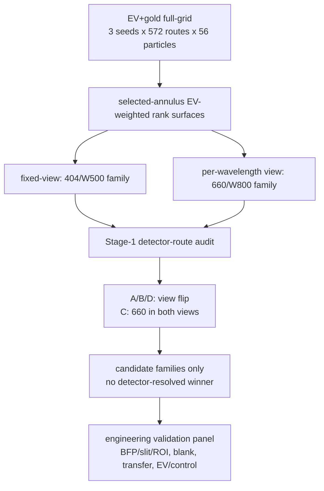

# EV/NODI 最终分析报告：no-data 相对审计定稿

- 定稿日期：2026-06-12
- 报告性质：最终读者向分析报告
- 适用范围：no-measured-data Level-1 relative/proxy audit
- 顶层口径：candidate families under detector surrogate
- 数据入口：3-seed EV+gold exhaustive full-grid run + 147/148 detector-identity closure artifacts

这份报告给出当前工程在**没有实测数据**时能够定稿的最终结论。它不是实验报告，不是校准性能报告，也不是 404 nm 与 660 nm 的物理胜负裁决。

一句话结论：

> 当前工程可以封板的是一份 no-data 候选路线清单：`404/W500` 是 fixed-view detector-surrogate candidate family，`660/W800` 是 per-wavelength detector-surrogate candidate family；二者都不能升级为真实 detector-resolved winner。首批工程验证应围绕这两个 family、D900-D1200 中深带、488/532 control/reference wavelengths，以及 detector identity / blank / transfer / EV-control 实测门展开。

最小术语表：

| 术语 | 本报告里的意思 |
|---|---|
| route | 一组 `wavelength / width / depth` 几何与波长组合，例如 `404/W500/D900` |
| family | 同一波长与宽度、但深度可作为 band 读取的一组 routes，例如 `404/W500` |
| view | 对同一物理事件流的归一化读法；本报告只使用 `fixed_660_gold` 与 `per_wavelength_gold` |
| selected-annulus | event-position analysis window；不是 optical BFP annulus |
| all-crossing | 不限 selected-annulus 的并行 metric face |
| detector surrogate | A/B/C/D detector-route 代理；它给出分析口径，不等于真实探测器身份 |

## 1. 最终结论

### 1.1 可以现在说的话

| 主题 | 最终结论 | 读者应怎样使用 |
|---|---|---|
| 波长 | 404 与 660 都保留，但只作为 detector-surrogate candidate families | 不能选出单一物理赢家；应进入并行验证 |
| 404 family | `404/W500` 是 fixed-view 候选 family | 适合验证短波、窄通道、fixed normalization 下的相对优势 |
| 660 family | `660/W800` 是 per-wavelength 候选 family | 适合验证 per-wavelength normalization 下的稳健候选 |
| 宽度 | `W≈lambda/NA` 是工程 guardrail；在 NA=0.9 下给出 404→W500、660→W800 | 可用于设计候选宽度，不是 detector-resolved optimum law |
| 深度 | 深度是弱、噪声口径依赖的工程旋钮 | 首批工艺建议取 D900-D1200；不要把 D1400/D1500 当成强结论 |
| 488/532 | control/reference-useful | 可用于对照、trap check 和趋势参考；不能提升为主推荐 |
| no-data 封板 | 收窄封板门已满足 | R1 与 C/D×V2 被登记为范围外项，不阻断 no-data 定稿 |

### 1.2 不能说的话

本报告不授权以下 claim：

- 404 或 660 是真实物理 winner。
- 任一路线是 detector-resolved 或 absolute winner。
- 当前 score 是 calibrated SNR、LOD、浓度、blank-FPR、event probability 或 clinical/biological performance。
- selected-annulus 是 optical BFP annular aperture。
- NODI 已证明外差增强倍数。
- R1 读出轴或 C/D×V2 已经完成。

## 2. 为什么是这个结论

最终结论来自三层证据，而不是单个排名表：

1. **全量 route evidence**：3 seeds、572 route triples、56 particles、10000 events/case 的 EV+gold exhaustive run 给出两个候选 family。
2. **Stage-1 detector identity audit**：A/B/D route 与 C route 对 404↔660 的判读不同，因此 full-grid ranking 只能作为 detector-surrogate family evidence。
3. **T3/T4 robustness audit**：深度与 bright-EV 判断都没有达到可写成强分离结论的程度。

理解原因时要按这条链读：

```text
particle + wavelength -> Mie / scattering amplitude proxy
channel width/depth -> reference field and event geometry
reference + scattering -> peak height and margin
noise + threshold + event position -> detection proxy
detector route + normalization view -> final family interpretation
```

两条最容易误读的规则：

- Mie 阶段更强不等于最终检出比例必然等比例提高。强参考场下，主要项近似随 `|A_ref| * |E_sca|` 走，但最终还要过 noise、threshold、event-position、transit/readout 和 detector-route gates。
- 检出比例是模型内 synthetic/proxy rate，不是实测事件概率。它适合回答“在同一 lens/同一 view 下哪个 route 更好”，不适合直接写成临床或仪器性能。



## 3. 证据层 A：全量 EV+gold full-grid

### 3.1 计算范围

| 项目 | 值 | 来源 |
|---|---:|---|
| seeds | 11, 22, 33 | `results/exhaustive_ev_gold_fullgrid_shared_dual_3seed_10000e_postrun_audit_20260523.json` |
| route triples | 572 | same |
| particles | 56 | same |
| events per route-particle case | 10000 | same |
| route-particle rows per seed per view | 32032 | same |
| physical stochastic event samples | 960,960,000 | `3 × 572 × 56 × 10000` |
| normalization views | `fixed_660_gold`, `per_wavelength_gold` | shared-dual run manifest |
| audit status | `passed_with_schema_caveat` | postrun audit JSON |

The schema caveat is bounded: lightweight raw CSVs contain mean scalar distribution fields, while matching diagnostic sidecars contain the compact quantile fields. It does not change the route-family conclusion.

### 3.2 Primary selected-annulus candidate table

The table below is the shortest numerical reason why the final candidate families are `404/W500` and `660/W800`. The rank column is the selected-annulus recommendation-eligible rank mean across 3 seeds; lower is better.

| view | EV weighting | leading route | rank mean ± std | selected score |
|---|---|---|---:|---:|
| `fixed_660_gold` | uniform | 404/W500/D600 | 2.000 ± 0.000 | 0.885798 |
| `fixed_660_gold` | small_ev_literature | 404/W500/D800 | 1.333 ± 0.577 | 0.883360 |
| `fixed_660_gold` | broad_ev_literature | 404/W500/D650 | 1.667 ± 1.155 | 0.905685 |
| `fixed_660_gold` | sharp_msc_sev_empirical | 404/W500/D1200 | 1.667 ± 1.155 | 0.805364 |
| `per_wavelength_gold` | uniform | 660/W800/D900 | 1.333 ± 0.577 | 0.838607 |
| `per_wavelength_gold` | small_ev_literature | 660/W800/D1300 | 1.667 ± 0.577 | 0.828645 |
| `per_wavelength_gold` | broad_ev_literature | 660/W800/D900 | 1.333 ± 0.577 | 0.855446 |
| `per_wavelength_gold` | sharp_msc_sev_empirical | 660/W800/D1400 | 1.333 ± 0.577 | 0.753270 |

证据文件：

- `results/exhaustive_ev_gold_fullgrid_shared_dual_3seed_10000e_fixed_660_gold_aggregation_20260518/lens_b_ev_fullgrid_3seed_route_stability.csv`
- `results/exhaustive_ev_gold_fullgrid_shared_dual_3seed_10000e_per_wavelength_gold_aggregation_20260518/lens_b_ev_fullgrid_3seed_route_stability.csv`

读法：

- The fixed view consistently points to the `404/W500` family.
- The per-wavelength view consistently points to the `660/W800` family.
- The exact depth differs by weighting and seed; read depth as a band, not a single winning number.

### 3.3 这些通道在模型里“能检出多少”

下面这张表回答最直接的问题：如果只把它当作 no-data simulator 内的 proxy，这些代表通道大约检出多少 sampled EV-like events。这里用 exosome rows 在 3 seeds 上的简单平均；它不是实测概率，也不是 final rank。

| representative route | view | selected-annulus proxy | all-crossing proxy | peak proxy | margin proxy | 读法 |
|---|---|---:|---:|---:|---:|---|
| 404/W500/D600 | fixed | 88.6% | 64.8% | 7.43 | 3434 | fixed-view 候选 family 的浅/中深代表 |
| 404/W500/D900 | fixed | 88.3% | 71.8% | 11.33 | 5294 | peak 和 all-crossing 随深度增加，但 selected 基本平台化 |
| 404/W500/D1200 | fixed | 87.5% | 77.2% | 12.33 | 5783 | 更深不显著改善 selected；读作 family band |
| 660/W800/D900 | per-wavelength | 83.9% | 61.5% | 2.63 | 1198 | per-wavelength 候选 family 的保守中深代表 |
| 660/W800/D1200 | per-wavelength | 83.6% | 65.6% | 3.62 | 1656 | all-crossing 与 peak 上升，selected 几乎不变 |
| 660/W800/D1400 | per-wavelength | 83.3% | 68.2% | 4.08 | 1876 | 深度更高主要增强 all-crossing/peak，不构成强 selected 结论 |
| 660/W500/D1500 | per-wavelength | 91.3% | 85.2% | 15.15 | 6914 | 数字高，但 `reference_too_weak`；只作 all-crossing diagnostic |

证据文件：

- `seed_11/22/33_*_raw_rows.csv` in `results/exhaustive_ev_gold_fullgrid_shared_dual_10000e_seed*_16worker_20260518/`

读法：

- “能检出多少”要先问是哪一个 lens。selected-annulus 与 all-crossing 的比例可以差很多。
- selected-annulus 对深度不敏感：404/W500 从 D600 到 D1200 保持约 87.5-88.6%；660/W800 从 D900 到 D1400 保持约 83.3-83.9%。
- all-crossing 对深度更敏感：660/W800 从 D900 到 D1400 为 61.5%→68.2%，但这不是最终 selected-rank 的强证据。
- `660/W500/D1500` 数字最高，却被当作 diagnostic，因为 width W500 对 660 nm 落在 `reference_too_weak` 区域。高 proxy 不自动等于工程推荐。

### 3.4 固定变量看波长：为什么 404 峰值强，但不直接赢

下面固定几何为 W800/D900，固定 view 为 `fixed_660_gold`，只改变波长。所有倍数相对 660 nm。

| wavelength | `E_sca` proxy × | `Csca` proxy × | `A_ref` × | peak × | selected proxy | all-crossing proxy | 读法 |
|---:|---:|---:|---:|---:|---:|---:|---|
| 404 | 1.97 | 3.90 | 1.34 | 2.67 | 82.7% | 60.2% | scattering/peak 强很多，但 detection 已接近平台 |
| 488 | 1.62 | 2.63 | 1.16 | 1.97 | 83.0% | 60.5% | 中间态；峰值增强没有等比例转成 detection |
| 532 | 1.44 | 2.06 | 1.10 | 1.63 | 83.0% | 60.7% | 接近 660 的 detection proxy |
| 660 | 1.00 | 1.00 | 1.00 | 1.00 | 83.9% | 61.5% | baseline |

这里的 `Csca proxy` 用 `E_sca` proxy 的平方近似，只用于阶段解释。它不是 calibrated Mie cross-section 表。

读法：

- 404 的 scattering amplitude proxy 约为 660 的 1.97×，对应 `Csca` proxy 约 3.90×；加上参考场后 peak proxy 约 2.67×。
- 但是 selected/all-crossing detection proxy 没有提高，反而略低于 660。这说明这组 route 已经接近 threshold/gating 平台，峰值增强不是最终排序的唯一瓶颈。
- 所以 404/W500 可以保留为 fixed-view candidate family，但不能因为“峰值强”就写成全局 winner。

### 3.5 固定波长看宽度：为什么 660/W800 是候选，而不是 660/W500

下面固定 wavelength=660、depth=D900、view=`per_wavelength_gold`，只改变 width。倍数相对 W800。

| width | reference band | `A_ref` × | peak × | selected proxy | all-crossing proxy | 读法 |
|---:|---|---:|---:|---:|---:|---|
| W500 | `reference_too_weak` | 4.26 | 4.54 | 93.1% | 76.5% | 数字最高，但违反 660 nm 宽度 guardrail |
| W600 | `reference_too_weak` | 1.44 | 1.49 | 87.8% | 68.0% | 仍在 weak-reference 区 |
| W700 | `reference_too_weak` | 1.14 | 1.15 | 85.5% | 64.0% | 接近门槛但仍未过 |
| W800 | `electronics_noise_limited_useful` | 1.00 | 1.00 | 83.9% | 61.5% | 最窄可用 reference band；最终候选宽度 |
| W900 | `electronics_noise_limited_useful` | 0.92 | 0.91 | 82.3% | 59.8% | 更宽使 reference/peak 下降 |
| W1200 | `electronics_noise_limited_useful` | 0.80 | 0.78 | 78.5% | 57.0% | 继续下降 |
| W1500 | `electronics_noise_limited_useful` | 0.75 | 0.72 | 75.4% | 55.5% | 更宽不利 |

读法：

- 模型里 W500 的 reference/peak 很高，因此 detection proxy 也高。
- 但 660/W500、W600、W700 都被 `reference_too_weak` 标记，不进入 governed recommendation family。
- W800 是 660 nm 在 `W≈lambda/NA` guardrail 下的最窄可用宽度；它不是“分数最高的宽度”，而是“在参考场可用门内最窄、最稳妥的候选宽度”。

### 3.6 固定波长和宽度看深度：为什么 D900-D1200 足够

下面固定 wavelength=660、width=W800、view=`per_wavelength_gold`，只改变 depth。倍数相对 D900。

| depth | `A_ref` × | peak × | selected proxy | all-crossing proxy | 读法 |
|---:|---:|---:|---:|---:|---|
| D500 | 0.57 | 0.48 | 80.6% | 54.0% | 太浅时 reference/peak 低 |
| D700 | 0.79 | 0.74 | 83.1% | 58.2% | 接近平台 |
| D900 | 1.00 | 1.00 | 83.9% | 61.5% | 保守工程中心 |
| D1200 | 1.28 | 1.37 | 83.6% | 65.6% | peak/all-crossing 增强，但 selected 不增 |
| D1400 | 1.45 | 1.55 | 83.3% | 68.2% | 深度收益主要出现在 all-crossing |
| D1500 | 1.53 | 1.61 | 83.0% | 69.3% | 更深不提高 selected，工艺风险更高 |

读法：

- 深度会增强 `A_ref` 与 peak：D1500 相对 D900 的 `A_ref` 约 1.53×、peak 约 1.61×。
- all-crossing detection proxy 随深度上升：61.5%→69.3%。
- selected-annulus detection proxy 却基本持平甚至略降：83.9%→83.0%。这就是为什么最终工程建议是 D900-D1200，而不是追逐 D1400/D1500。

### 3.7 噪声决定深度收益能不能成立

Report 146 单粒子深度探针显示：当噪声从 electronics-limited 转向 shot-limited，深度收益明显收缩。以下是 660/W800、paper-aligned reference model 的 all-crossing probe。

| noise setting | shot scale | D500 det | D900 det | D1500 det | depth span | operating band |
|---|---:|---:|---:|---:|---:|---|
| electronics-limited as run | 0.001 | 0.502 | 0.556 | 0.652 | 23% | `electronics_noise_limited_useful` |
| shot-noise heavy | 0.05 | 0.488 | 0.523 | 0.595 | 18% | `shot_noise_limited_no_gain` |
| shot-noise dominant | 0.2 | 0.442 | 0.436 | 0.476 | 8% | `shot_noise_limited_no_gain` |

证据文件：

- `reports/146_depth_reference_model_noise_regime_evidence_20260603.md`
- `results/depth_reference_model_noise_regime_probe_20260603.csv`

读法：

- 参考场增强不是没有用；它确实抬高 peak/margin。
- 但它的设计价值取决于噪声口径。若真实系统更接近 shot-noise-limited，深度收益会变小。
- 因此 blank trace 和 detector transfer 是第一批实测门。没有它们，深度不能写成强推荐。

### 3.8 为什么 all-crossing 不能覆盖 selected-annulus

在两个 normalization views 和四个 EV weightings 下，all-crossing leader 都是 `660/W500/D1500`。它的 weighted all-crossing scores 为：

| view | uniform | small_ev_literature | broad_ev_literature | sharp_msc_sev_empirical |
|---|---:|---:|---:|---:|
| `fixed_660_gold` | 0.851860 | 0.819629 | 0.852247 | 0.774097 |
| `per_wavelength_gold` | 0.851712 | 0.819478 | 0.852125 | 0.773828 |

That is a real metric-lens result, but it is not the final route selection. All-crossing and selected-annulus are two parallel analysis lenses. The selected-annulus lens is an event-position analysis window (`edge_norm=0.5-0.8`), not an optical BFP annulus, and it does not erase all-crossing. Conversely, all-crossing cannot promote a route by itself when the selected-annulus recommendation surface and detector-identity audit say the conclusion is only family-level.

### 3.9 final-score trap：为什么高 final score 也不能直接推荐

Final-score leaders can surface routes that are not final recommendations. For example, in `fixed_660_gold`, `small_ev_literature` and `sharp_msc_sev_empirical` both have `532/W800/D500` as the top final-score route, but its `wavelength_role` is `control_only_488_532`. 这正是本报告必须分开的三类东西：

- EV recommendation candidates: 404/660 only.
- control/reference wavelengths: 488/532.
- metric-lens diagnostics: all-crossing and final-score surfaces.

## 4. 证据层 B：Stage-1 detector identity audit

Stage-1 是本报告不选择单一 404↔660 winner 的主因。

### 4.1 收窄后的封板门

The no-data sealing gate is:

> `R2_absolute / V1_gauge_locked` primary decision over A/B/C/D, all 3 seeds, plus `R2_absolute / V2_raw_angular` gauge-sampling over A/B, all 3 seeds.

The gate is intentionally narrower than “run every possible readout/gauge cell.” R1 and C/D×V2 remain visible in the coverage matrix, but they are outside the no-data sealing gate.

| readout | gauge | route coverage | gate classification |
|---|---|---|---|
| R2_absolute | V1_gauge_locked | A/B/C/D all complete, 3/3 seeds | in narrowed gate, primary complete |
| R2_absolute | V2_raw_angular | A/B complete, 3/3 seeds | in narrowed gate, gauge sample complete |
| R2_absolute | V2_raw_angular | C/D missing | out of narrowed gate, represented by A/B sample |
| R1_signed_positive | V1/V2 | A/B/C/D missing | out of narrowed gate, assumed-invariant untested |

证据文件：

- `results/audits/report148_stage1_preseal_review_20260612/report148_stage1_coverage_matrix.csv`

### 4.2 detector-route 判决

| detector route | gauge coverage in evidence | fixed-view winner | per-wavelength winner | flip flag |
|---|---|---|---|---|
| A_hybrid | V1 and V2 | 404 in 3/3 seeds | 660 in 3/3 seeds | True in 3/3 seeds |
| B_roi_intensity | V1 and V2 | 404 in 3/3 seeds | 660 in 3/3 seeds | True in 3/3 seeds |
| C_collapsed_coherent | V1 | 660 in 3/3 seeds | 660 in 3/3 seeds | False in 3/3 seeds |
| D_cross_only | V1 | 404 in 3/3 seeds | 660 in 3/3 seeds | True in 3/3 seeds |

证据文件：

- `results/audits/report148_stage1_preseal_review_20260612/report148_stage1_flip_evidence.csv`

读法：

- A/B/D preserve the fixed→404 and per-wavelength→660 view flip.
- C removes that flip and gives 660 in both views.
- Therefore 404/W500 and 660/W800 are candidate families under detector surrogate, not absolute winners.

### 4.3 Stage-1 event accounting

两个 normalization views 共享同一条 physical event stream。因此在 Stage-1 中，case-row events 与 distinct physical events 是两个不同口径。

| source scope | case rows | events per case row | case-row events | distinct physical cases | distinct physical events |
|---|---:|---:|---:|---:|---:|
| A/B, V1+V2, R2 only | 2160 | 2000 | 4,320,000 | 1080 | 2,160,000 |
| C/D, V1, R2 only | 1080 | 2000 | 2,160,000 | 540 | 1,080,000 |
| total | 3240 | 2000 | 6,480,000 | 1620 | 3,240,000 |

证据文件：

- `results/audits/report148_stage1_preseal_review_20260612/report148_stage1_event_accounting.csv`

## 5. 证据层 C：robustness audits

### 5.1 T3：selected-annulus 下深度是弱变量

T3 noise-axis audit 检查 noise setting 改变时 depth winners 是否稳定。

| metric face | seed-stable depth-top count |
|---|---:|
| selected-annulus | 5/30 |
| all-crossing | 26/30 |

At the baseline `shot_noise_scale=0.001`, selected-annulus has only 1/10 seed-stable depth tops, while all-crossing has 10/10.

证据文件：

- `results/audits/report148_t3_noise_axis_20260612/report148_t3_depth_rank_seed_stability.csv`

读法：

- Selected-annulus depth ordering is near a sampling-noise floor.
- All-crossing depth ordering is much stronger, but it is a different metric face and is noise-regime dependent.
- The engineering answer is to use depth as a band: D900-D1200 as the conservative fabrication range, with deeper channels only as explicit sensitivity tests.

### 5.2 T4：bright-EV 只能写 Wilson-overlap / near-tie

T4 检查 7 个 bright-EV combinations，每个使用 10000 events。

| T4 result | count |
|---|---:|
| combinations | 7 |
| seed rows | 21 |
| Wilson intervals overlap | 21/21 |
| seed-unanimous 404 but not interval-separated | 12/21 rows, covering 4 combinations |
| seed-unstable Wilson-overlap near-tie | 9/21 rows, covering 3 combinations |

证据文件：

- `results/audits/report148_stage1_preseal_review_20260612/report148_stage1_t4_wilson_support.csv`

读法：

- T4 does not support “deterministic separated 404 winner.”
- It supports “Wilson-overlap, near-tie or point-estimate-only 404 lean,” depending on combination.

## 6. 工程建议

### 6.1 下一阶段保留这些 families

| family | use in next engineering phase | representative geometry guidance |
|---|---|---|
| 404/W500 | fixed-view shortwave candidate | test W500 with mid-depth representatives; include wall/transport/full-wave checks |
| 660/W800 | per-wavelength candidate | center fabrication around D900-D1200; include D1300/D1400 only if explicitly testing depth sensitivity |
| 488/532 | controls and references | keep for trap checks, trend references, and control-only surfaces |
| 660/W500 deep | all-crossing diagnostic | do not promote without wall/transport and optical-operator validation |

### 6.2 第一批 validation gates

下一批实测应按下面顺序补证据：

1. BFP / slit / ROI / reference-phase measured operator: resolves whether the real detector resembles A/B/D or C.
2. Measured blank traces: needed before any empirical FPR or LOD language.
3. Detector transfer / readout operator: maps proxy score into measured output.
4. Standard-particle ladder: checks size/material monotonicity and cross-wavelength gauge.
5. Full-wave / transport spot checks: tests whether narrow-channel proxy gains survive wall and transport physics.
6. EV/control biological panel: only after physical route and detector transfer are grounded.

### 6.3 仍开放的问题

| bucket | item | status |
|---|---|---|
| A: needs measurement | detector identity / cross-term identity | open; cannot be resolved by no-data simulation alone |
| A: needs measurement | cross-wavelength gauge | open; standard-particle ladder required |
| A: needs measurement | blank/noise/FPR | open; measured blank traces required |
| A: needs measurement | EV composition and biological specificity | open; EV/control panel required |
| B: simulation-completable but out of gate | R1 readout axis | unrun; not a no-data blocker |
| B: simulation-completable but out of gate | C/D×V2 | unrun; represented only by A/B V2 sampling |

## 7. 防误读清单

| If you think... | Correct reading |
|---|---|
| “404 beat 660.” | No. 404/W500 leads in `fixed_660_gold`; 660/W800 leads in `per_wavelength_gold`; Stage-1 C gives 660 in both views. |
| “660 is the real winner.” | No. 660/W800 is a per-wavelength detector-surrogate candidate family. |
| “selected-annulus means BFP optical annulus.” | No. It is an event-position analysis window. |
| “all-crossing leader should override selected-annulus.” | No. They are parallel lenses and must both be shown with labels. |
| “rank 1.333 vs 1.667 proves an exact depth.” | No. Read depth as a band; seed std and T3 show depth is weak. |
| “R1 and C/D×V2 are complete.” | No. They are explicitly deferred out of the narrowed no-data gate. |
| “This unlocks SNR/LOD/FPR.” | No. No measured blank, detector transfer, or concentration layer is present. |

## 8. Artifact ledger / 证据索引

| role | artifact |
|---|---|
| full-grid postrun audit | `results/exhaustive_ev_gold_fullgrid_shared_dual_3seed_10000e_postrun_audit_20260523.json` |
| seed raw rows for proxy-rate / peak / margin tables | `results/exhaustive_ev_gold_fullgrid_shared_dual_10000e_seed*_16worker_20260518/seed_*_*_raw_rows.csv` |
| fixed-view route stability | `results/exhaustive_ev_gold_fullgrid_shared_dual_3seed_10000e_fixed_660_gold_aggregation_20260518/lens_b_ev_fullgrid_3seed_route_stability.csv` |
| per-wavelength route stability | `results/exhaustive_ev_gold_fullgrid_shared_dual_3seed_10000e_per_wavelength_gold_aggregation_20260518/lens_b_ev_fullgrid_3seed_route_stability.csv` |
| cross-view comparison | `results/exhaustive_ev_gold_fullgrid_shared_dual_3seed_10000e_cross_view_route_comparison_20260523.csv` |
| Stage-1 flip evidence | `results/audits/report148_stage1_preseal_review_20260612/report148_stage1_flip_evidence.csv` |
| Stage-1 coverage matrix | `results/audits/report148_stage1_preseal_review_20260612/report148_stage1_coverage_matrix.csv` |
| Stage-1 event accounting | `results/audits/report148_stage1_preseal_review_20260612/report148_stage1_event_accounting.csv` |
| T3 depth stability | `results/audits/report148_t3_noise_axis_20260612/report148_t3_depth_rank_seed_stability.csv` |
| T4 Wilson support | `results/audits/report148_stage1_preseal_review_20260612/report148_stage1_t4_wilson_support.csv` |
| depth/noise mechanism probe | `results/depth_reference_model_noise_regime_probe_20260603.csv` |
| detector-identity closure report | `reports/147_detector_forward_identity_full_chain_adversarial_audit_synthesis_20260610.md` |
| route/audit closure ledger | `reports/148_extreme_simulation_roadmap_post_audit_20260610.md` |
| depth/noise explanation report | `reports/146_depth_reference_model_noise_regime_evidence_20260603.md` |

## 9. 可复用最终摘要

The EV/NODI no-data audit is closed under the narrowed sealing gate: `R2/V1` A/B/C/D all-3-seed primary decision plus A/B `V2` gauge sampling. The full-grid EV+gold run supports two detector-surrogate candidate families, not one physical winner: `404/W500` in the fixed-view surface and `660/W800` in the per-wavelength surface. The mechanism is not a single-factor story: 404 can have much stronger scattering/peak proxies than 660 under fixed geometry, and 660/W500 can have higher all-crossing/selected proxy rates than 660/W800, but detector-route gates, reference-width guardrails, selected-annulus behavior, noise sensitivity, and engineering risk prevent those higher proxy numbers from becoming final recommendations. Stage-1 detector-route evidence prevents either family from being promoted to detector-resolved truth because A/B/D preserve the fixed→404 / per→660 flip while C gives 660 in both views. Depth is a weak, noise-dependent engineering band; D900-D1200 is the conservative fabrication range, not a D1400/D1500 mandate. 488/532 remain control/reference wavelengths. No calibrated SNR, LOD, empirical FPR, concentration, POD, biological specificity, clinical performance, NODI gain, or optical-BFP-annulus claim is authorized.
