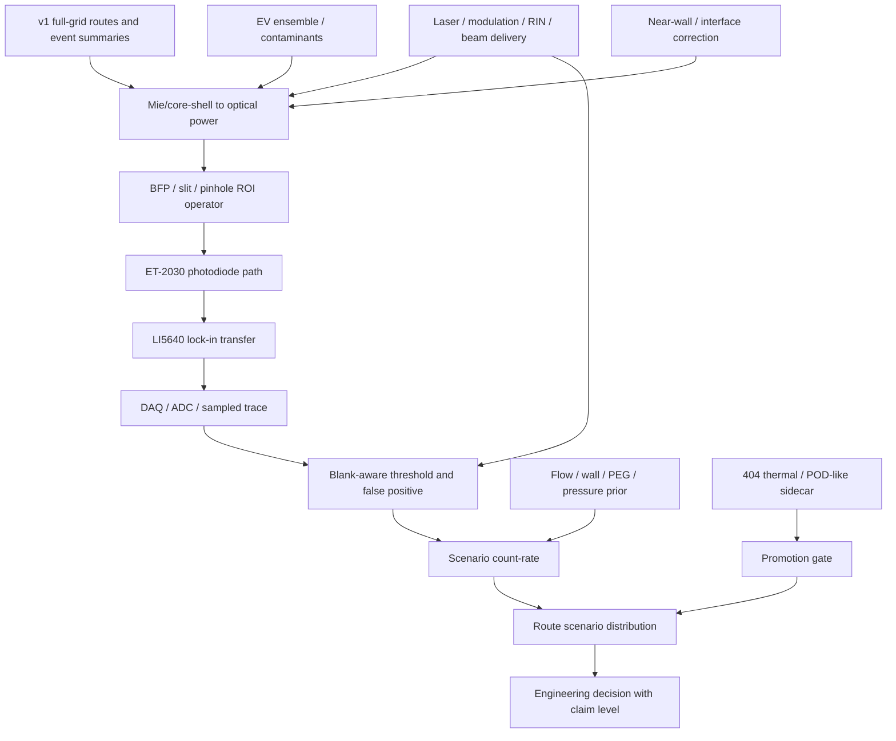

# EV/NODI Realism v2 Instrument-Aware 路线图

> 当前状态：历史 v2 启动路线图。v2 已完成并按无实测数据边界收口；当前综合解释以 `reports/88_*` 为准，v2 边界以 `reports/87_*` 和 `reports/84_*` 为准。本文底部的 handoff prompt 只保留为历史记录，不应再次执行。

> 面向对象：新线程 / 新执行者。  
> 目的：读完本文即可知道 v2 要做什么、为什么做、先做哪些模块、如何验收、何时停止或重算。  
> 重要边界：本文是路线图，不是 v1 结论替换稿；不允许把 v2 的 scenario prior 伪装成实测 calibration。

---

## 0. Executive Summary

下一阶段应该从 **paper-fit 思维** 切换到 **instrument-aware / experiment-scenario forward model**。

v1 已经完成的事情是：

- 在统一 NODI surrogate 下完成 EV full-grid 工程筛选。
- 生成 `32032` 个唯一 case，每 case `10000` events，总计 `3.2032e8` events。
- 支持不同波长、通道宽深、EV size / Au anchor 的 relative ranking。
- 明确不能声明 absolute SNR、absolute LOD、真实 EV 浓度、真实回收率或 biological specificity。

v2 要解决的问题不是：

```text
继续寻找一个无实测参数组合，把 Tsuyama 2022 数值自然贴上。
```

v2 要解决的是：

```text
v1 推荐的 660 / 404 / 532 / 488 路线，在更接近真实 ET-2030 + LI5640 + BFP/slit/pinhole + blank + wall/flow + EV ensemble 的场景下，会不会翻车？
```

因此 v2 的定位是：

```text
relative proxy
→ instrument-aware scenario prediction
→ uncertainty-aware engineering decision
```

v2 仍可以在没有实测数据时运行，但每个新增模块必须输出：

```text
nominal prior
optimistic bound
pessimistic bound
claim level
ranking sensitivity
calibration dependency
```

v2 最核心的第一阶段不是 full-grid 重算，而是 P0 补链和 P0.5 防误实现 guardrails：

1. Mie-to-power conversion，而且必须先把 probe power 转为 local irradiance。
2. BFP / slit / pinhole ROI operator。
3. ET-2030 detector connection state machine 与 detector-unit chain。
4. 真实 lock-in model identity、input path、transient / ENBW / full-scale / saturation。
5. Laser / modulation / RIN / beam / chromatic / DAQ / ADC sidecar。
6. Blank / colored-noise / rare false-positive prior。
7. 404 thermal / POD-like artifact / EV integrity sidecar。

只有 P0 micro-anchor 和 anchor smoke 稳定后，才进入 reduced grid；只有 reduced grid 的 prior uncertainty 不再完全主导 ranking，才进入 full-grid v2。

---

## 1. Baseline Contract：v2 必须继承但不能覆盖的 v1 事实

### 1.1 v1 计算事实

当前正式 EV full-grid v1 是完整工程设计库，不是 partial run：

```text
unique cases = 32032
events per case = 10000
total events = 320320000
main engineering lens = all-crossing
parallel cross-check lens = selected-annulus edge_norm 0.5-0.8
claim level = relative / proxy / diagnostic
```

v1 的结果可以用于：

- 第一轮 route / chip / wavelength 选择。
- 660 / 404 / 532 / 488 机制对照设计。
- all-crossing 与 selected-annulus 的一致性检查。
- Au ladder / EV proxy / selected-annulus paper-audit 的相对解释。

v1 的结果不能用于：

- 真实 EV absolute LOD。
- 真实 absolute SNR。
- 真实 particles/mL 浓度或回收率。
- 真实 false-positive per minute。
- biological EV specificity。
- detector-unit voltage / current / photon-count claim。

### 1.2 当前一轮实验面板

v2 的第一批 anchor smoke 应围绕当前已整理的实验面板展开，而不是重新撒网。

| Route | 当前角色 | v2 要验证的问题 |
|---|---|---|
| `660 / 800×1400` | 长波 reference-useful 主候选 | 真实 BFP/slit/pinhole 与 detector-unit prior 下是否仍可观测 |
| `660 / 800×1500` | 长波深通道主候选 | 深度增加是否给 reference、blank 或 flow 带来真实收益 |
| `660 / 700×1500` | weak-reference 边界对照 | 高 conditional detection 是否是弱参考场 / ROI leakage / NA boundary 现象 |
| `404 / 600×1300` | 短波机制主候选 | 短波高散射是否能在 blank、throughput、thermal、EV integrity 下成立 |
| `404 / 800×550` | 404/660 shared sanity | selected-annulus overlap 是否在真实 ROI operator 下仍成立 |
| `404 / 800×600` | 404/660 shared sanity | 同上 |
| `404 / 800×700` | 404 Tsuyama-like sanity | 平台是否处在合理短波机制量级 |
| `660 / 800×550` | 660 shared sanity | 长波 shallow sanity 与 selected-annulus cross-check |
| `660 / 800×600` | 660 shared sanity | 同上 |
| `660 / 800×700` | 660 shared sanity | 同上 |
| `532 / 600×1500` | 中波稳健 baseline | 与旧版稳健候选对齐，作为趋势锚点 |
| `488 / 600×1500` | 中波第二 baseline | 与 532 一起判断 404/660 差异是否真实 |

### 1.3 Tsuyama paper-fit lane 的边界

v2 不继续 Tsuyama paper-fit 搜索。

当前 Tsuyama Phase 2 / 2.11 结论保持：

```text
status = negative_or_diagnostic_result_only
formula-consistent Ag/Au = broadly aligned
detection = not decisive blocker
raw Au size-response = unresolved
best D2.1 raw exponent ≈ 3.05
global response-compression gamma ≈ 0.749
response-compression score ≈ 2.033
formal bounded partial = not passed
```

v2 可以继续做：

- detector-unit feasibility。
- paper-statistics sensitivity。
- hardware-constrained readout / blank / BFP 验证。
- Au ladder scenario prediction。

v2 不允许做：

- per-size correction 来贴 Tsuyama exponent。
- per-geometry / per-case / per-wavelength arbitrary fit。
- 把 maximal upper-bound 叫 accepted calibration。
- 回写 EV full-grid、selected-annulus canonical bounds 或 global material defaults。

---

## 2. v2 总目标：从 Conditional Detection 到 Scenario Event Observability

v1 当前核心输出更接近：

```text
P(detected | particle already crosses optical detection region)
```

v2 要逐步扩展到：

```text
R_det = C_sample
        × Q_nano
        × N_channels
        × eta_entry
        × eta_survival
        × eta_not_adsorbed
        × p_optical
        × p_threshold
        × eta_deadtime
```

这不是要在无实测数据下声称真实 count-rate，而是要把每一段不确定性显式建成 scenario prior：

```text
clean / nominal / pessimistic blank
50 ohm voltage / current-input / external-TIA detector path
centered / offset / leakage BFP operator
PEG-good / PEG-weak wall scenario
sEV-rich / low-RI / aggregate-rich EV ensemble
404 low / nominal / high thermal-risk sidecar
```

最终 v2 输出不应是单一 “best route”，而应是：

```text
nominal score
optimistic score
pessimistic score
rank stability probability
Pareto membership probability
detector path recommendation
false-positive scenario
count-rate scenario
thermal / wall / specificity sidecars
claim level
```

---

## 3. v2 架构总览



模块状态必须使用统一枚举：

```text
off
surrogate
bounded_prior
measured_prior
calibrated
blocked
```

claim level 必须使用统一枚举：

```text
relative_proxy
relative_with_priors
scenario_count_rate
safety_sidecar
diagnostic_only
absolute_blocked
calibrated_absolute
```

无实测数据阶段默认最高只能到：

```text
relative_with_priors
scenario_count_rate
safety_sidecar
diagnostic_only
absolute_blocked
```

不得输出 `calibrated_absolute`。

---

## 4. P0 模块规格

P0 是 v2 成败的关键。P0 不稳定时，不应进入大 grid 重算。

### 4.1 R0 Realism Contract / Prior Schema

**为什么做**

v2 会引入大量 prior。没有 schema，后续很容易把 datasheet prior、synthetic prior、measured blank、calibrated gain 混成一个数字。

**要做什么**

新增一组 contract / schema 文件，建议路径：

```text
docs/realism_v2/realism_model_contract.md
docs/realism_v2/physics_spec.md
docs/realism_v2/test_spec.md
docs/realism_v2/task_list_R0_P0.md
docs/realism_v2/failure_mode_dashboard_template.md
configs/realism_v2/scenario_registry.yaml
configs/realism_v2/detector_path_schema.yaml
configs/realism_v2/detector_connection_state_machine.yaml
configs/realism_v2/laser_daq_schema.yaml
configs/realism_v2/route_key_schema.yaml
configs/realism_v2/run_manifest_schema.yaml
configs/realism_v2/calibration_artifact_registry.yaml
configs/realism_v2/unit_registry.yaml
configs/realism_v2/claim_level_matrix.csv
```

每个 scenario 参数必须记录：

```text
name
module
unit
value_nominal
value_optimistic
value_pessimistic
source_type = assumption | datasheet | literature | measured | calibrated
source_ref
artifact_id
claim_level
applies_to
can_change_ranking
calibration_dependency
requires_bench_validation
v1_route_key
selected_annulus_policy
```

**验收条件**

- v1 compatibility mode 不改变 v1 的 route identity 和 all-crossing / selected-annulus 语义。
- 每个新增 module 可单独开关。
- 所有 detector-unit 输出带 unit。
- 任意 prior 都可追溯来源和边界。
- detector source、load、termination 和 lock-in path 都能被 state machine 判定 allowed / warning / forbidden。
- measured-prior / calibrated 值必须引用 calibration artifact registry 中存在且 checksum 通过的 artifact。
- 每次 R1.5 / R2 / R3 / R5 run 必须写 `run_manifest.json`，无 manifest 的结果不得用于 promote decision。
- base route identity 与 scenario identity 必须分离。
- 不存在 per-size / per-case empirical fit parameter。

**停止 / 返工条件**

- arbitrary unit 与 detector unit 混写。
- selected-annulus denominator 不清。
- scenario prior 没有单位或来源。
- measured/calibrated 字段没有 artifact provenance。
- route key 把 scenario id 混入 base identity。
- run output 缺少 manifest 或 checksum。
- 新旧 route key 混写，无法和 v1 full-grid 对齐。

### 4.1.1 Calibration Artifact Registry

**为什么做**

v2 后续会接入 dark trace、laser-off trace、blank trace、BFP image、slit scan、Au ladder、detector transfer 等实测或 bench validation artifact。没有 registry，`measured_prior` 和 `calibrated` 会重新退化成不可审计数字。

**必须创建**

```text
configs/realism_v2/calibration_artifact_registry.yaml
```

每个 artifact 至少记录：

```text
artifact_id
artifact_type = detector_off_trace / laser_off_trace / blank_trace / blank_matrix_trace / BFP_image / slit_scan / pinhole_scan / Au_ladder_trace / Ag_ladder_trace / PS_or_silica_trace / detector_transfer / lockin_setting_snapshot / DAQ_config / power_meter_log
route_key
wavelength_nm
geometry_nm
instrument_chain_id
connection_state_id
acquisition_duration_s
sampling_rate_Hz
laser_state
detector_state
sample_state
file_path
checksum
source_type = measured / literature / datasheet / assumption
claim_unlocks
```

**规则**

- 没有 registry artifact 的值，只能是 `assumption`、`datasheet`、`literature` 或 `bounded_prior`。
- 任意 `measured_prior` / `calibrated` 值必须引用 `artifact_id`。
- `bench_validation_artifact_id` 是解除 detector state machine forbidden path 的唯一方式。

### 4.1.2 Route Key Schema

**为什么做**

v2 会新增 scenario、instrument chain、prior sample 和 sidecar 输出，但不能污染 v1 base route identity。

**base route key**

```text
base_route_key:
  wavelength_nm
  width_nm
  depth_nm
  particle_profile_id
  particle_id
  event_lens = all_crossing / selected_annulus_0p5_0p8
```

**scenario identity**

```text
scenario_identity:
  scenario_id
  instrument_chain_id
  prior_sample_id
  sidecar_id
```

所有输出表必须同时包含 `base_route_key` 和 `scenario_identity`。full-grid v2 可以增加 scenario dimensions，但不得重写 v1 route identity。

### 4.1.3 Run Provenance Manifest

每次 R1.5 / R2 / R3 / R5 run 必须写：

```text
run_manifest.json
```

最低字段：

```text
run_id
git_commit
roadmap_version
schema_version
created_at
base_v1_summary_path
base_v1_summary_checksum
scenario_registry_checksum
detector_state_machine_checksum
laser_daq_schema_checksum
unit_registry_checksum
claim_level_matrix_checksum
calibration_artifact_registry_checksum
random_seed_policy
event_budget
scenario_budget
output_directory
```

无 manifest 的结果不得进入 promote / stop decision。

### 4.2 Mie-to-Power Conversion

**为什么做**

v1 的 field / signal proxy 可以做相对排序，但 detector-unit chain 需要 optical power。否则 shot noise、RIN、photodiode responsivity、full-scale、saturation 都无从计算。

**核心转换与单位 guardrail**

detector-power route 必须先把 probe power 转为粒子位置处的 local irradiance，再乘散射截面。实现公式应写成：

```text
P_sca_ROI(t) =
  integral_Omega_ROI(
    I_inc(r_p(t), lambda)
    × dC_sca_dOmega(theta, phi, lambda)
    × T_coll(theta, phi, lambda)
    × dOmega
  )
```

其中：

```text
I_inc(r, t, lambda) = P_probe(lambda, t) × p_beam(r, t, lambda)
integral_A p_beam(r, t, lambda) dA = 1
p_beam normalization plane = particle-plane transverse to local propagation direction
```

单位检查必须成立：

```text
[W/m^2] × [m^2/sr] × [sr] = [W]
```

因此，下面这种表达是危险的，不能直接作为实现公式：

```text
P_probe × integral(dC_sca/dOmega dOmega)
```

除非 `illumination` 项明确携带 `1/m^2` 的 beam-area normalization。否则结果会变成 `W × m^2`，会污染 photodiode current、shot noise、RIN 和 saturation margin。

NODI perturbation optical power 应拆成：

```text
Delta P_NODI(t) = P_sca(t) + P_cross(t)
```

其中 cross term 是 coherent overlap，不是简单 intensity multiplier。

**要做什么**

- 将现有 Mie / core-shell 输出扩展为可被 ROI operator 积分的 detector-power sidecar。
- 保留 v1 relative field route；v2 power route 默认 sidecar/off-by-default，直到测试完成。
- 输出 `P_ref_ROI_W`、`P_sca_ROI_W`、`P_cross_ROI_W`、`Delta_P_NODI_peak_W`。
- 明确 `P_probe_W`、throughput、field normalization 的来源。
- `P_cross_ROI_W` 必须允许正负号；不能存成 absolute magnitude，否则 phase / polarity 信息会丢失。

**必须测试**

- Rayleigh limit 下散射 intensity 约随 diameter 的六次方，interferometric amplitude 约随 diameter 的三次方。
- `Csca = integral(dCsca/dOmega dOmega)` 的数值一致性。
- `P_sca_ROI_W` 的 dimensional consistency：任何 `W × m^2` 或 arbitrary field unit 混入都必须 fail。
- power-budget conservation tests：

```text
integral_full_sphere(dCsca_dOmega dOmega) == Csca
0 <= Cabs = Cext - Csca within numerical tolerance
Cext >= Csca for passive particles
P_sca_total = I_inc × Csca
P_abs_particle = I_inc × Cabs
P_ext_particle = I_inc × Cext
P_sca_ROI <= P_sca_total
P_sca_total + P_abs_particle <= P_ext_particle within tolerance
```

- radius / diameter 不混。
- vacuum wavelength / medium wavelength 不混。
- field normalization 与 `I_inc = 0.5 n epsilon0 c |E|^2` 的连接必须有 sanity test。
- `Cabs = Cext - Csca` 不为负，除非明确标记 numerical tolerance。

### 4.3 BFP / Slit / Pinhole ROI Operator

**为什么做**

这是最可能改变 660 / 404 推荐解释的模块。v1 的 `pupil_slit_surrogate` 适合 relative ranking，但真实 detector 看到的是 objective pupil、BFP diffraction lobe、slit、pinhole、filter、polarization、photodiode active area 的组合。

**正确 ROI 公式**

真实 detector 应积分 intensity perturbation：

```text
S_ROI(t) =
  integral_ROI((|E_ref(u,v) + E_sca(u,v,t)|^2 - |E_ref(u,v)|^2) W(u,v) du dv)
```

展开为：

```text
S_ROI(t) =
  integral_ROI(|E_sca|^2 W du dv)
  + 2 Re integral_ROI(E_ref × conj(E_sca) × W du dv)
```

不允许默认使用：

```text
|integral(E_ref) + integral(E_sca)|^2 - |integral(E_ref)|^2
```

除非明确处于 single-mode coherent projection 模式，并有单独 claim level。

**BFP Jacobian**

若使用 direction-cosine coordinates：

```text
u = sin(theta) cos(phi)
v = sin(theta) sin(phi)
dOmega = du dv / sqrt(1 - u^2 - v^2)
```

若使用 angular coordinates：

```text
dOmega = sin(theta) dtheta dphi
```

v2 必须显式记录：

```text
coordinate_type = theta_phi / direction_cosine_uv / physical_BFP_mm
field_coordinate_measure
bfp_to_angle_jacobian_applied
aplanatic_apodization
intensity_or_field_weight
operator_normalization
NA_limit
```

若使用实际 BFP 物理坐标，必须显式记录从 BFP mm 到 direction cosine 的映射，例如：

```text
u = x_BFP / (f_obj × n_medium)
v = y_BFP / (f_obj × n_medium)
NA_limit: u^2 + v^2 <= (NA / n_medium)^2
valid_uv_domain:
  u^2 + v^2 < 1
  u^2 + v^2 <= (NA / n_medium)^2
```

**Synthetic measured-operator prior**

先不用等待实测 BFP，也可以建低自由度 prior：

```text
W(u,v,lambda) =
  pupil_mask
  × slit_mask(slit_width, slit_offset)
  × pinhole_mask(pinhole_diameter, pinhole_offset)
  × filter_transmission(lambda)
  × detector_active_area
  × polarization_projection
  × optional_transmitted_leakage
```

scenario 参数：

```text
slit_width = nominal / narrow / wide
slit_offset = centered / mild_offset / bad_offset
pinhole_diameter = nominal / tolerance_low / tolerance_high
pinhole_offset = centered / mild_offset / bad_offset
effective_NA = nominal / clipped
objective_transmission_by_lambda = optimistic / nominal / pessimistic
focus_z_shift_by_lambda = none / mild / large
BFP_lobe_shift_by_lambda = centered / mild / large
chromatic_magnification = nominal / shifted
transmitted_leakage = none / low / medium
polarization_leakage = none / 5 percent / 20 percent
```

**输出字段**

```text
P_ref_ROI_W
P_sca_ROI_W
P_cross_ROI_W
mode_overlap_eta
ROI_scalar_disagreement_ratio
transmitted_leakage_fraction
operator_normalization_mode
coordinate_type
BFP_jacobian_applied
aplanatic_apodization_applied
operator_throughput_preserved
selected_annulus_consistency
```

**最可能改变的结论**

- `660 / 700×1500` 是 weak-reference control、ROI leakage artifact，还是 boundary-useful route。
- `660 / 800×1400` 与 `660 / 800×1500` 是否仍为 reference-useful main。
- `404 / 600×1300` 的强峰是否真实落在 slit/pinhole ROI 内。
- `800×550 / 800×600 / 800×700` 的 404/660 selected-annulus shared sanity 是否仍成立。

### 4.4 ET-2030 + LI5640 Detector-Unit Chain

**为什么做**

v1 的 lock-in output 是 arbitrary units。v2 必须输出 photocurrent、voltage/current-input、lock-in output、noise、full-scale 和 saturation margin，才能回答真实 ET-2030 + LI5640 是否足够。

**从 optical power 到 photodiode current**

```text
i_PD(t) = R_PD(lambda) × P_det(t) + i_dark
Delta i(t) = R_PD(lambda) × Delta P_NODI(t)
```

这里 `R_PD(lambda)` 必须按 wavelength prior 给出，不能把单一 datasheet wavelength 的 responsivity 硬套到 404 / 488 / 532 / 660。

**Detector connection state machine**

ET-2030 必须建模为 path-dependent detector source，不能抽象成任意 current source。v2 必须新增并执行：

```text
configs/realism_v2/detector_connection_state_machine.yaml
```

最低状态机：

| detector source | readout path | status |
|---|---|---|
| `ET2030_BNC_biased_output` | voltage input with explicit 50 ohm termination | allowed |
| `ET2030_BNC_biased_output` | high-Z voltage input with source/load model | allowed with warning |
| `ET2030_BNC_biased_output` | LI5640 current input direct | forbidden unless bench validated |
| `bare_photodiode` | lock-in current input | allowed |
| `bare_photodiode` | external TIA | allowed |
| `external_TIA_voltage_output` | lock-in voltage input | allowed |

每次 detector-unit run 必须输出：

```text
state_machine_version
connection_physical_validity
termination_mode
source_impedance_assumption
load_impedance_assumption
requires_bench_validation
bench_validation_artifact_id
```

**必须拆成互斥 readout paths**

Path A：ET-2030 50 ohm voltage path

```text
V_50(t) = 50 ohm × i_PD(t)
```

适合做 datasheet-clean high-bandwidth path，但只有在 termination 明确为 `50 ohm` 时才能使用。若接入 lock-in high-Z voltage input，不能自动沿用 `50 ohm` load；必须显式 source/load model。

Path B：LI5640 current input feasibility

```text
V_current(t) = G_current(f) × i_PD(t)
```

这个 path 必须标记为 feasibility scenario，因为 ET-2030 是带 BNC 输出的高速 detector，不能默认等同裸 photodiode current terminal。需区分真实接线、输入阻抗、带宽和量程。

Path C：external low-noise TIA then LI5640 voltage input

```text
V_TIA(t) = Z_TIA(f) × i_PD(t)
```

这是最合理的弱信号工程候选之一，但没有实测或硬件选型前只能是 scenario。

external TIA path 必须至少记录：

```text
Z_TIA(f)
i_n_TIA
e_n_TIA
C_in
f_c
V_sat
```

**噪声项**

电流 shot noise：

```text
S_i_shot = 2 q (I_DC + I_dark)
```

单位是 `A^2/Hz`，转 RMS 必须乘 ENBW 后开方。

50 ohm Johnson noise：

```text
S_v_Johnson = 4 k_B T R
```

equivalent current PSD：

```text
S_i_Johnson = 4 k_B T / R
```

RIN current PSD：

```text
S_i_RIN = I_DC^2 × S_RIN(f)
```

其中 `S_RIN(f)` 单位为 `1/Hz`。所有 PSD 必须记录 convention：

```text
PSD_convention = one_sided / two_sided
ENBW_convention = Hz_one_sided / Hz_two_sided
```

detector / amplifier / lock-in 输入噪声按 path 各自建模，不允许混用。

**输出字段**

```text
readout_path
P_ref_W
Delta_P_peak_W
i_PD_DC_A
Delta_i_peak_A
V_in_peak_V
input_noise_rms
output_noise_rms
scenario_detector_SNR
scenario_detector_SNR_lower
scenario_detector_SNR_upper
SNR_claim_level = relative_with_priors / absolute_blocked / calibrated_absolute
SNR_requires_calibration
SNR_source_type = bounded_prior / measured / calibrated
shot_noise_fraction
RIN_noise_fraction
lockin_noise_fraction
photodiode_linear_margin
lockin_input_margin
lockin_fullscale_margin
saturation_status
preferred_detector_path
connection_mode_warning
connection_physical_validity
termination_mode
source_impedance_assumption
load_impedance_assumption
requires_bench_validation
state_machine_version
bench_validation_artifact_id
```

**验收条件**

- 同一 route 可以同时输出 50 ohm、current-input feasibility、external-TIA 三种 path。
- 无 path 可用时必须显式 warning，而不是静默 fallback。
- 50 ohm path 不能自动继承 current/TIA 增益。
- current-input path 不能忽略带宽限制。
- ET2030 BNC 直连 lock-in current input 默认 forbidden，除非 bench validation 显式解除。
- `scenario_detector_SNR` 在没有 measured detector transfer 和 measured blank 前必须保持 `absolute_blocked`，不得写成 calibrated absolute SNR。
- saturation margin 必须同时检查 photodiode、lock-in input、lock-in output。

### 4.5 LI5640 Lock-in Transient / ENBW / Sampling

**为什么做**

NODI event 是 ms 级 transient，不是无限长 steady-state sine。Tsuyama-style time constant 约 1-2 ms，与 event width 同量级，lock-in filter 会改变 pulse height、width 和 detection probability。

**真实型号锁定**

v2 不能混用 LI5640、LI5660、LI5650、LI5645 或 LI5600 系列的不同规格。实际实现必须先锁定实验室真实 lock-in 型号、输入 path、manual source、firmware / mode 和接线：

```text
lockin_model_id
lockin_manual_source
firmware_or_mode
input_connector
input_impedance
current_gain_setting
current_input_bandwidth
voltage_sensitivity_range
time_constant_setting
filter_slope_setting
synchronous_filter_enabled
output_mode = X / Y / R / theta
analog_output_range
ADC_or_logger_model
```

如果实际型号未锁定，所有 lock-in 数值输出只能是 `bounded_prior` 或 `absolute_blocked`，不能标记为 measured-prior 或 calibrated。

schema / test 必须把不同型号分成 enum，禁止在同一 run 混用型号规格：

```text
lockin_model_id_enum = LI5640 / LI5660 / LI5650 / LI5645 / other_explicit
test_lockin_model_specs_not_mixed
test_actual_lockin_model_required_for_measured_prior
```

**Lock-in 基本模型**

```text
X(t) = LPF(2 V_in(t) cos(2 pi f_ref t + phi))
Y(t) = LPF(-2 V_in(t) sin(2 pi f_ref t + phi))
R(t) = sqrt(X(t)^2 + Y(t)^2)
```

LPF 可先用 n 阶一阶级联：

```text
H(f) = (1 + i 2 pi f tau)^(-n)
```

ENBW：

```text
ENBW_n = Gamma(n - 1/2) / (4 sqrt(pi) Gamma(n) tau)
```

常用值：

```text
n = 1: 1 / (4 tau)
n = 2: 1 / (8 tau)
n = 3: 3 / (32 tau)
n = 4: 5 / (64 tau)
```

注意：不同仪器数字滤波器的真实 ENBW 可能与级联一阶近似不同；该公式是 first-pass guardrail，后续可被 datasheet / bench measurement 覆盖。

同时必须记录：

```text
PSD_convention = one_sided / two_sided
ENBW_convention = Hz_one_sided / Hz_two_sided
```

否则 output noise RMS 可能出现 `sqrt(2)` 量级错误。

**Pulse attenuation**

需要输出：

```text
G_transit = peak_after_lockin / ideal_demod_peak
```

并扫描：

```text
time_constant = 0.5 / 1 / 2 / 3 / 5 ms
filter_order = 1 / 2 / 3 / 4
output_mode = X_signed / R_magnitude
sample_interval = 0.5 / 1 / 2 ms
min_width = paper_matched / current_default
```

**必须测试**

- 固定 pulse width 下，过大的 tau 会降低 peak height。
- 固定 noise PSD 下，ENBW 随 tau 增大而降低。
- `R` magnitude threshold 的 false-positive 率不能等同 one-sided `X` threshold。
- RMS / peak / peak-to-peak convention 不混。

### 4.6 P0.5 Laser / Modulation / Beam Delivery / DAQ Sidecar

**为什么做**

detector-unit chain 不能只从 photodiode 开始。404 vs 660 的真实差异还会被 laser source、modulation、beam waist、chromatic focus、objective/filter throughput、RIN、pointing jitter、DAQ / ADC / logger 采样链路显著改变。若这些字段缺失，404 的风险可能被错误归因到 detector 或 blank。

**Laser / beam 字段**

```text
P_probe_W_by_lambda
P_probe_uncertainty
beam_waist_xy_by_lambda
focus_z_shift_by_lambda
objective_transmission_by_lambda
filter_leakage_by_lambda
polarization_state_by_lambda
RIN_PSD_by_lambda
power_drift_slope
pointing_jitter_um_or_rad
modulation_frequency_Hz
modulation_depth
modulation_sideband_status
```

**DAQ / ADC / sampled-output 字段**

```text
daq_model
adc_bits
adc_input_range_V
adc_sampling_rate_Hz
anti_alias_filter
analog_output_scaling_V_per_fullscale
quantization_noise_rms
timestamp_jitter
buffer_drop_or_deadtime
```

**输出**

```text
laser_source_status
beam_delivery_status
DAQ_status
RIN_noise_contribution
pointing_jitter_peak_variance
chromatic_focus_penalty
ADC_quantization_margin
sampled_trace_claim_level
```

**验收条件**

- Laser / DAQ sidecar 可以改变 scenario observability，但不得修改 v1 默认输出。
- 404 的 filter leakage、RIN、focus shift 和 blank/thermal risk 必须可分开报告。
- lock-in theoretical output 通过后，仍必须检查 ADC range、bits、sampling、anti-alias 和 quantization margin。

**owner 边界**

```text
laser_daq_sidecar owns:
  P_probe, RIN_PSD, pointing_jitter, beam_waist, focus_shift, DAQ_sampling, ADC_quantization

BFP_operator owns:
  pupil/slit/pinhole ROI, objective/filter throughput in ROI operator, BFP coordinate mapping, detector active area

blank_false_positive owns:
  threshold tails, colored-noise effective N, burst/drift models, FP/min estimates
```

同一个字段不能在三个模块中重复定义；若必须跨模块使用，必须由 scenario registry 指定单一 owner，其他模块只消费该字段。

### 4.7 Blank / False-Positive / Colored-Noise Prior

**为什么做**

v1 的 5 sigma threshold 是 Gaussian iid surrogate。真实 blank 可能包含 colored noise、laser RIN、speckle、drift、污染颗粒、burst artifact 和 photothermal background。404 尤其可能被 blank 风险压低。

**噪声模型**

```text
sigma_total^2 =
  sigma_electronics^2
  + sigma_shot^2
  + sigma_RIN^2
  + sigma_speckle^2
  + sigma_drift^2
  + sigma_burst^2
```

scenario：

```text
blank_clean
blank_nominal
blank_bursty
blank_drift_high
blank_404_photothermal
laser_RIN_low / nominal / high
```

**输出字段**

```text
noise_rms
effective_independent_samples
false_positive_per_min
threshold_sigma_effective
threshold_tail = one_sided / two_sided / magnitude_R
drift_crossing_risk
burst_false_positive_rate
blank_status
analytic_gaussian_FP_per_min
rice_or_rayleigh_magnitude_FP_per_min
colored_noise_effective_N
block_bootstrap_FP_if_trace_available
rare_burst_rate_prior
upper_confidence_bound_if_zero_events
```

**Dark / laser-off / blank trace hierarchy**

blank 必须拆成 trace levels。每个 false-positive estimate 必须声明使用了哪一层 trace：

```text
trace_level_0_detector_off:
  detector electronics / DAQ / grounding

trace_level_1_laser_off_detector_on:
  ambient light / electronics baseline

trace_level_2_laser_on_no_channel_or_blocked:
  laser leakage / RIN / stray scatter

trace_level_3_blank_channel_buffer:
  channel diffraction / wall / buffer / BFP / slit background

trace_level_4_blank_matrix:
  biofluid matrix / contaminants / protein / lipoprotein background

trace_level_5_particle_standard:
  Au / Ag / PS / silica / EV mimic traces
```

`trace_level_3` buffer blank 不能作为 biofluid matrix false-positive safety 的证据。

**Minimum blank acquisition rule**

```text
micro_anchor:
  measured_blank_optional: true
  analytic_prior_allowed: true

anchor_smoke:
  clean_blank_min_duration_s: 300
  burst_blank_min_duration_s: 1800
  per_route_blank_required: true

experimental_recommendation:
  blank_duration_must_exceed_expected_event_interval_by_factor: 20
```

若无实测 blank，必须输出：

```text
blank_acquisition_status = not_measured
false_positive_per_min_claim = analytic_prior_only
```

**验收条件**

- iid Gaussian false alarm 与 colored-noise false alarm 分开。
- rare burst 不被 sigma 完全吞掉。
- false positives/min 可与 scenario count-rate 并列输出。
- 阈值高于 5 sigma 时，blank false-positive 不得只由有限 Monte Carlo 零事件推断；必须给 analytic / semi-analytic tail 或 upper confidence bound。
- 404 blank / thermal / filter leakage 风险进入 sidecar，不作为 NODI optical signal 加分。

### 4.8 404 Thermal / POD-like Artifact / EV Integrity Sidecar

**为什么做**

404 的短波机制可能强，但也最容易受到 filter throughput、substrate scatter、photothermal drift、POD-like artifact 和 EV membrane integrity 风险影响。该模块不应正向增加 NODI optical score，只能作为 safety sidecar / promotion gate。

**最低阶热 proxy**

```text
P_abs =
  I_inc × (C_abs_particle + C_abs_contaminant)
  + P_medium_abs
  + P_glass_abs
Delta_T_proxy ≈ P_abs / (4 pi kappa r_eff)
thermal_diffusion_length = sqrt(kappa / (pi rho C f))
```

需要分别估算：

```text
EV absorption
contaminant absorption
medium absorption
glass/substrate absorption
gold anchor absorption
filter leakage / stray absorption
blank photothermal artifact
EV_integrity_transport_risk
```

**输出字段**

```text
thermal_artifact_risk
EV_integrity_risk
blank_photothermal_risk
recommended_power_ladder
promotion_allowed
promotion_block_reason
```

**promotion rule 示例**

```text
404 route can be promoted only if:
  thermal_artifact_risk != red
  EV_integrity_risk != red
  blank_photothermal_false_positive_rate acceptable
  low-power Au ladder remains monotonic
```

---

## 5. P1 模块规格

P1 的目标是把 conditional optical observability 推近真实 count-rate / sample scenario。

### 5.1 Pressure-Flow / Count-Rate Scenario

**为什么做**

v1 固定 event budget 下的 detection rate 不包含真实流量、入口损失和压力网络。窄通道在 optical ranking 中可能有利，但 fixed-pressure 实验中 count-rate 可能被 hydraulic resistance 惩罚。

**最低阶 pressure-flow**

对矩形通道，若 `H <= W`：

```text
R_h ≈ 12 eta L / (W H^3) × (1 - 0.63 H/W)^(-1)
```

但真实系统需要 network：

```text
R_total = R_capillary + R_microchannel + R_nanochannel + R_entry + R_external
Q_nano = Delta_P / R_total
```

必须同时支持：

```text
flow_control_mode = fixed_velocity
flow_control_mode = fixed_pressure
```

**count-rate**

```text
R_enter_j = C_j × Q_nano × N_channels × eta_entry_j
R_det_j = R_enter_j × eta_survival_j × eta_not_adsorbed_j × p_optical_j × p_threshold_j
R_total_obs = sum_j(R_det_j) + R_false_positive
```

`C_j` 必须区分不同层级，不得把 NTA 标称浓度直接当进入 nanochannel 的单颗粒有效浓度：

```text
nominal_NTA_concentration
post_filter_concentration
entry_available_concentration
effective_single_particle_concentration
```

dead-time：

```text
R_obs_deadtime = R_true / (1 + R_true × tau_dead)
```

multi-occupancy：

```text
P(k >= 2) = 1 - exp(-mu) × (1 + mu)
mu = C × V_focus
```

**输出字段**

```text
Q_nano
transit_time_distribution
count_rate_true
count_rate_observed
deadtime_loss
multi_occupancy_risk
fixed_pressure_penalty
```

### 5.2 Wall / PEG / Adsorption / Bound-State

**为什么做**

真实 EV 很可能受壁面吸附、PEG passivation、near-wall residence、surface memory 和堵塞影响。`404 / 600×1300` 这类窄宽度路线尤其需要该模块。

wall 必须拆成两个不同模块，不能用一个 correction factor 混掉：

```text
wall_transport_model:
  adsorption / desorption / clogging / residence / EV_integrity_transport_risk

wall_optical_model:
  near-wall EM correction / interface phase / selected-annulus optical bias
```

前者影响进入和存活；后者影响光学相位、角分布和 ROI overlap。

**两态模型**

```text
free ↔ bound
```

沿程 survival：

```text
eta_not_adsorbed = exp(-lambda_ads × L)
```

PEG effect：

```text
lambda_ads_PEG = f_PEG × lambda_ads_bare
W_eff = W - 2 × t_PEG
H_eff = H - 2 × t_PEG
```

**scenario**

```text
wall_bare
PEG_good
PEG_nominal
PEG_weak
protein_corona_sticky
high_salt_screened
low_salt_electrostatic
```

**输出字段**

```text
eta_not_adsorbed
bound_event_fraction
repeat_event_risk
clogging_risk
effective_geometry
near_wall_residence_fraction
selected_annulus_wall_bias
EV_integrity_transport_risk
```

**禁止事项**

- 不允许把 bound event 同时算作真实 EV detection 和 blank artifact。
- 不允许用 per-route arbitrary adsorption factor 去贴 desired ranking。

### 5.2.1 Channel Metrology / Fabrication / PEG Geometry Tolerance

**为什么做**

NODI reference 来自 nanochannel diffraction，真实 `W/H`、sidewall taper、corner radius、roughness、bonding deformation 和 PEG layer 会直接改变 reference field、flow、wall encounter 和 BFP lobe。它不是后处理小修。

**scenario 字段**

```text
actual_W_distribution
actual_H_distribution
sidewall_taper
corner_radius
surface_roughness
bonding_deformation
PEG_layer_thickness_distribution
channel_to_channel_variation
```

**输出字段**

```text
effective_W
effective_H
reference_geometry_shift
hydraulic_resistance_shift
BFP_lobe_geometry_shift
fabrication_tolerance_status
```

### 5.3 EV Ensemble / RI / Corona / Aggregation

**为什么做**

真实 EV 不是一个固定折射率、固定尺寸、完美球。EV optical response 对 size、RI、shell、corona、shape、aggregation 和 contaminants 高度敏感。

**EV optical ensemble**

每个 event 采样：

```text
diameter ~ size_distribution
n_core ~ core_RI_distribution
n_shell ~ shell_RI_distribution
t_shell ~ shell_thickness_distribution
t_corona ~ corona_thickness_distribution
shape ~ sphere / ellipsoid / rough_sphere
aggregation_state ~ single / doublet / aggregate
```

建议 scenario：

```text
EV_small_low_RI
EV_nominal_sEV
EV_large_tail
EV_corona_rich
EV_aggregate_rich
EV_low_purity_biofluid
```

样品制备 / biofluid matrix 必须单独建 scenario，不能只压缩成 contaminants：

```text
EV_sample_preparation_profile =
  PBS_clean_mimic
  conditioned_medium
  SEC_enriched
  IEX_enriched
  UF_enriched
  PEG_precipitated
  serum_or_plasma_like

biofluid_matrix_fields =
  medium_RI
  viscosity
  ionic_strength
  buffer_absorption_404
  protein_corona_growth
  surfactant_or_preservative
  freeze_thaw_aggregation
  filtration_loss
  dilution_factor
```

**contaminants**

至少加入：

```text
LDL_like_lipoprotein
VLDL_like_lipoprotein
protein_aggregate
PEG_or_silane_residue
dust_or_chip_debris
bubble_or_void
EV_doublet
EV_triplet
```

**输出字段**

```text
ensemble_detection_rate
ensemble_peak_distribution
small_EV_recall
large_EV_bias
aggregate_bias
contaminant_event_rate
optical_specificity_proxy
biological_specificity_status = not_claimed
```

**关键边界**

```text
optical specificity proxy != biological EV specificity
```

v2 可以输出 `P(EV-like | optical event)` 的 scenario proxy，但不能声称检测到的一定是 biological EV。

### 5.4 Near-Wall / Interface EM Correction

**为什么做**

v1 是 homogeneous-medium Mie。真实粒子在水/玻璃 nanochannel 附近，near-wall interface 会改变 angular scattering pattern、phase、polarization 和 ROI overlap。selected-annulus、404/660 contrast、Au size-response 都可能受影响。

**最低阶 complex correction**

```text
E_sca_interface(theta, phi, z) =
  E_sca_Mie(theta, phi) × F_interface(theta, phi, z, lambda, polarization)
```

`F_interface` 必须是 complex factor，不只是 intensity gain，因为 phase 会影响 NODI cross term。

**输出字段**

```text
near_wall_gain_factor
phase_shift
angular_pattern_shift
ROI_overlap_shift
selected_annulus_interface_bias
interface_claim_status
```

**触发 representative FDTD / BEM 的条件**

任一条件满足就需要代表点 full-wave / BEM sanity：

```text
|F_interface - 1| > 20 percent
ROI_overlap_shift > 10 percent
404/660 route rank flips in reduced grid
selected-annulus conclusion depends on near-wall events
particle-wall distance < max(2a, 100 nm)
Au40/Au60 size-response remains decisive
scalar/vector high-NA disagreement > 20 percent
```

代表点建议：

```text
wavelength = 404 / 660
geometry = 600×1300 / 800×550 / 800×600 / 800×700 / 800×1500
particles = EV70_lowRI / EV100_nominal / EV150 / Au20 / Au40 / Au60
wall_distance = 10 / 25 / 50 / 100 / 250 nm
polarization = parallel / perpendicular
outputs = angular field / phase / ROI overlap / cross term
```

### 5.5 Selected-Annulus Bias Audit

**为什么做**

selected-annulus 是有价值的 cross-check，但不是 all-crossing 替代品。v2 需要量化 selected-annulus 是否被 BFP operator、wall interaction 或 near-wall EM 放大。

**固定边界**

```text
edge_norm = 0.5-0.8
```

不继续扫描 selected-annulus window。

**输出**

```text
selected_fraction
selected_detection_rate
all_crossing_detection_rate
selection_bias = selected_detection_rate / all_crossing_detection_rate
rank_stability_selected_vs_all
operator_stability_selected_vs_all
wall_bias_selected_vs_all
```

**解释规则**

| 结果形态 | 解释 |
|---|---|
| all-crossing 强，selected 强 | 高可信主候选 |
| all-crossing 强，selected 弱 | 全域稳健，但 annulus 不是优势轨迹 |
| all-crossing 弱，selected 强 | 只在有利轨迹变亮，不宜主推 |
| 两者都弱 | 不推荐 |

---

## 6. Staged Recompute Plan

### 6.1 Stage R0：Realism Contract

**目标**

建立 v2 的 schema、claim level、prior registry 和 feature flags，不改 v1 输出。

**产物**

```text
docs/realism_v2/realism_model_contract.md
docs/realism_v2/physics_spec.md
docs/realism_v2/test_spec.md
docs/realism_v2/task_list_R0_P0.md
configs/realism_v2/scenario_registry.yaml
configs/realism_v2/detector_path_schema.yaml
configs/realism_v2/detector_connection_state_machine.yaml
configs/realism_v2/laser_daq_schema.yaml
configs/realism_v2/claim_level_matrix.csv
tests/test_realism_v2_contract.py
```

**验收**

```text
v1 compatibility mode can run without changing v1 route keys
all module states use off/surrogate/bounded_prior/measured_prior/calibrated/blocked
all claim levels are explicit
all scenario values have units
no per-size or per-case fit term
```

**停止 / 返工**

```text
schema cannot distinguish datasheet prior from measured calibration
detector-unit and arbitrary-unit values share same field
selected-annulus denominator ambiguous
route keys no longer match v1 summaries
```

### 6.2 Stage R1：P0 Module Implementation

**目标**

实现 sidecar 级 P0 physics，不马上 full-grid。

**建议实施顺序**

1. Unit and formula guardrails。
2. Mie-to-power sidecar。
3. BFP / slit / pinhole ROI operator。
4. Detector connection state machine。
5. Detector-unit chain with readout paths。
6. Actual lock-in model identity + transient / ENBW / sampling。
7. Laser / modulation / beam / DAQ sidecar。
8. Blank / colored-noise / rare false-positive prior。
9. 404 thermal sidecar。

**验收**

```text
all P0 modules can run independently
v1 compatibility remains unchanged
detector outputs finite units
BFP ROI integration passes scalar/distributed tests
ET2030 connection state machine blocks invalid current-input direct path
lock-in ENBW monotonic with tau/order
laser/DAQ fields have source_type and claim_level
blank false-positive output includes analytic or semi-analytic rare-tail estimate
404 sidecar never boosts NODI optical score
```

### 6.3 Stage R1.5：Micro-Anchor Numerical Sanity

**目标**

在跑完整 12-route anchor smoke 前，用极小 panel 抓单位、接线、ROI、saturation、false-positive tail 的灾难性错误。这个阶段只用于 sanity，不用于 route ranking。

**routes**

```text
660 / 800×1400
660 / 700×1500
404 / 600×1300
532 / 600×1500
```

**particles**

```text
blank
EV70_lowRI
EV100_nominal
Au40
```

**required outputs**

```text
P_ref_ROI_W
P_sca_ROI_W
P_cross_ROI_W
Delta_i_peak_A
V_in_peak_V
scenario_detector_SNR
false_positive_rate_per_min
saturation_status
connection_physical_validity
sampled_trace_claim_level
```

**fixed micro-anchor scenario bundle**

Micro-anchor 只使用一个固定 sanity bundle，不吃完整 scenario registry：

```text
scenario_bundle = micro_anchor_nominal_sanity
detector_path = ET2030_50ohm_voltage + external_TIA_algebraic_check
BFP_operator = centered_nominal
blank = analytic_prior_clean + analytic_prior_bursty_upper_bound
laser_daq = nominal_schema_values
404_thermal = low_power_proxy
```

**promote to anchor smoke**

```text
all optical-power outputs have watt units
no detector path silently falls back
ET2030 invalid current-input direct path is blocked unless bench-validated
ROI operator does not depend on arbitrary v1 field normalization
scenario_detector_SNR is not marked calibrated_absolute
blank FP/min is not inferred from zero finite-Monte-Carlo events alone
```

**third external review trigger**

Micro-anchor 不是直接进入大规模 R2 的自动按钮。R1.5 完成后，应触发第三轮外部审阅，但审阅对象不再是 roadmap 文本，而是实际执行证据：

```text
trigger_third_review_when:
  R0 schema files exist
  P0/P0.5 unit tests pass
  v1 compatibility tests pass
  micro_anchor dry-run outputs exist
  run_manifest.json exists
  detector state machine blocks invalid ET2030 current-input path
  calibration artifact registry and route key schema are active
```

第三轮审阅输入包至少包含：

```text
docs/realism_v2/PRD.md
docs/realism_v2/physics_spec.md
docs/realism_v2/test_spec.md
docs/realism_v2/task_list_R0_P0.md
configs/realism_v2/
tests/test_realism_v2_*.py
results/ev_nodi_realism_v2_micro_anchor/
run_manifest.json
```

第三轮审阅目标：

```text
verify implementation matches roadmap guardrails
verify unit tests actually catch the P0 failure modes
verify micro-anchor outputs are physically plausible
verify invalid detector paths are blocked in code
verify no v1 outputs or claim levels were silently changed
decide whether R2 anchor smoke may start
```

在第三轮外部审阅通过前，不应启动 R2 anchor smoke；更不能启动 reduced grid 或 full-grid v2。

**stop / revise**

```text
P_sca_ROI_W fails dimensional consistency or Csca integral check
P_ref_ROI_W depends on arbitrary normalization scalar in detector-unit route
50ohm vs current-input path ranking flips but physical wiring is unresolved
scenario_SNR varies by >1e3 across unconstrained throughput priors
404 promotion depends on thermal/POD-like component being counted as positive NODI
```

### 6.4 Stage R2：Anchor Smoke

**目标**

先跑最有信息量的 12 条路线，验证 v2 是否稳定、有物理解释力。

**routes**

```text
660 / 800×1400
660 / 800×1500
660 / 700×1500
660 / 800×550
660 / 800×600
660 / 800×700
404 / 600×1300
404 / 800×550
404 / 800×600
404 / 800×700
532 / 600×1500
488 / 600×1500
```

recommended optional:

```text
660 / 900×1400
404 / 700×1400
```

Recommended optional routes enter R2 only if micro-anchor passes and the smoke-run cost estimate is under cap.

**particles**

```text
EV70_lowRI
EV100_nominal
EV150_nominal
EV250_large_tail
LDL_like_contaminant
protein_aggregate
EV_doublet
Au20 / Au30 / Au40 / Au60 / Au100
Ag40 / Ag60
```

**scenarios**

Anchor smoke 使用 named scenario bundles，不允许把 detector、blank、PEG、EV、thermal、BFP、RIN、DAQ 轴做全笛卡尔积。以下是 scenario ingredients，不是独立 grid dimensions。

```text
max_anchor_scenario_bundles = 8
max_anchor_routes = 14
max_stochastic_seeds = 3
max_event_level_runs_before_review = 14 * 8 * 8 * 3
```

推荐第一批 bundles：

```text
nominal_instrument_clean_blank
detector_50ohm_pessimistic
external_TIA_optimistic
blank_bursty_RIN_high
BFP_slit_offset_leakage
PEG_pessimistic_wall_loss
404_thermal_high_low_power
DAQ_low_resolution_sampling
```

R2 前必须生成：

```text
smoke_run_cost_estimate.csv
```

字段：

```text
n_routes
n_particles
n_scenario_bundles
n_seeds
events_per_case
event_level_case_count
posthoc_case_count
estimated_runtime_s
estimated_disk_MB
```

若 cost estimate 超过 cap，不得启动 anchor smoke。

**events**

```text
events per case = 2000-3000
seeds = 42 / 43 / 44
selected-annulus = fixed 0.5-0.8
adaptive rerun = if Wilson half-width > 0.05 or p_detect < 0.02, increase to 10000 events
```

Blank false-positive is an exception: it must use analytic / semi-analytic / bootstrap / rare-burst estimates and cannot rely on 2000-3000 event Monte Carlo tails.

**promote to reduced grid**

```text
Mie-to-power and detector-unit outputs have finite units
micro-anchor passed
no main route saturates under nominal detector path
lock-in ENBW and pulse attenuation behave monotonically
BFP ROI integration and scalar surrogate disagreement are explainable
660 / 800×1400 or 800×1500 remains viable in nominal plus at least one pessimistic scenario
660 / 700×1500 is either still a control or reclassified for explicit physical reason
404 / 600×1300 is either optically strong or demoted by sidecar, not by numerical artifact
selected-annulus 800×550/600/700 sanity does not depend on one fragile ROI offset
run_manifest.json exists and checksums match active schemas
smoke_run_cost_estimate.csv is under cap
```

**stop / revise**

```text
detector chain says every EV route is below noise by >100x under all plausible paths
all 404 routes saturate or thermal-risk red under realistic power
BFP operator changes sign/ranking under tiny alignment perturbations
false positive rate exceeds true event rate for all EV scenarios
blank FP/min estimated only by finite Monte Carlo with zero observed false positives
50ohm vs current-input path unresolved and ranking-flipping
unit tests fail energy, Jacobian, ENBW, RMS/peak, or threshold-tail checks
```

### 6.5 Stage R3：Reduced Grid

**目标**

在可控成本下评估 v2 priors 是否会系统性改变 404/660/532/488 推荐。

**grid**

```text
wavelength = 404 / 488 / 532 / 660
width = 600 / 700 / 800 / 900
depth = 500 / 550 / 600 / 700 / 1300 / 1400 / 1500
```

仅当 660 robustness 需要时，额外加入：

```text
width = 1000
```

**particles**

```text
EV size = 50 / 70 / 100 / 120 / 150 / 200 / 250 nm
EV RI = low / nominal / high
contaminants = LDL_like / protein_aggregate / doublet
standards = Au20 / Au30 / Au40 / Au60 / Ag40 / Ag60
```

**scenarios / uncertainty propagation**

不要做全笛卡尔爆炸。使用 bounded scenario set 或 Sobol / Latin-hypercube prior samples：

```text
scenario samples per route = 16-64
seeds = 3 for stochastic priors
events per case = 2000-5000
uncertainty_method = interval_bound / latin_hypercube / sobol / bootstrap / analytic_delta_method
n_prior_samples
correlation_policy
```

**promote to full-grid v2**

```text
top route families stable under prior uncertainty
660 main remains 800×1400/1500 or shifts with physical explanation
404 remains mechanism route or is gated by sidecar
BFP uncertainty no longer dominates every ranking
detector path decision is settled or explicitly bifurcated
wall/flow changes count-rate without arbitrary free parameter
EV ensemble outputs small-EV / aggregate bias explicitly
rank correlation with anchor smoke > 0.7 for shared cases
```

**stop / revise**

```text
ranking controlled by unconstrained optical-throughput scalar
wall adsorption prior alone determines all conclusions
detector path unresolved and gives opposite route rankings
interface correction shifts ROI by >30 percent with no representative validation
uncertainty bands are so wide that every route overlaps every route
```

### 6.5.1 Posthoc Sidecar vs Event-Level Rerun Boundary

第一轮实现必须把 deterministic posthoc sidecars 与 event-level reruns 分开，不允许为本可 posthoc 的代数检查启动大规模 event simulation。

| Module | First implementation mode | Event-level required when |
|---|---|---|
| Mie-to-power static unit checks | posthoc | ROI coupling depends on event position |
| detector connection state machine | posthoc | never |
| detector noise algebra | posthoc | pulse extraction changes threshold statistics |
| lock-in ENBW noise RMS | posthoc | pulse attenuation / width matters |
| BFP ROI operator | posthoc for static masks | trajectory-dependent mode overlap matters |
| blank rare-tail analytic model | posthoc | empirical trace bootstrap is available |
| 404 absorbed-power proxy | posthoc | full thermal FEM is triggered |
| wall / PEG / adsorption | schema first | survival / count-rate / trajectory bias is evaluated |
| selected-annulus bias audit | event-level | always for route recommendation |

### 6.6 Stage R4：Representative Interface / Full-Wave Validation

**目标**

不做全量 FDTD/BEM，先用代表点验证 near-wall / interface / vector high-NA correction 是否足以影响 ranking。

**触发**

见 5.4 的 trigger list。

**输出**

```text
interface_correction_table.csv
vector_scalar_disagreement.csv
ROI_overlap_shift.csv
fullwave_trigger_report.md
```

**promote**

```text
corrections bounded and can be represented by low-dimensional priors
404/660 flips, if any, have physical explanation
selected-annulus dependency explained
```

**stop / revise**

```text
correction >50 percent across most representative cases
phase/polarity changes cannot be captured by current surrogate
FDTD/BEM contradicts core ROI operator assumptions
```

### 6.7 Stage R5：Full-Grid v2

**前置条件**

只有 P0 和 reduced grid 稳定后才做。不要一开始 full-grid v2。

**设计原则**

```text
same base case keys as v1
same all-crossing main ranking field preserved
selected-annulus 0.5-0.8 remains parallel output
scenario dimensions stored separately
run_manifest.json required
no v1 result overwrite
```

**输出**

```text
relative_optical_score_v2
scenario_detector_SNR
scenario_detector_SNR_lower
scenario_detector_SNR_upper
SNR_claim_level
false_positive_per_min_scenario
count_rate_scenario
saturation_margin
thermal_sidecar
wall_loss_sidecar
EV_ensemble_recall
contaminant_specificity_proxy
rank_stability_probability
Pareto_membership_probability
claim_level
run_manifest_path
base_route_key
scenario_identity
```

**promote to experimental recommendation**

```text
rank_stability above preset threshold
no main route red-gated by detector/safety
660 main/control labels remain interpretable
404 mechanism/safety status explicit
532/488 controls stable
claim_level_matrix forbids absolute claims without calibration
```

---

## 7. P0 / P1 / P2 Priority Table

| Priority | Module | Expected impact | Overfit risk | May change 660/404 conclusion |
|---|---|---:|---:|---|
| P0 | Realism contract / claim schema / unit registry | 极高 | 低 | 间接，防止错误 claim |
| P0 | Mie-to-power conversion | 极高 | 低 | 是，打开 detector-unit 与 shot/RIN/full-scale 判断 |
| P0 | BFP/slit/pinhole ROI operator | 极高 | 中 | 是，最可能影响 660 weak/main 与 800×550/600/700 overlap |
| P0 | Detector connection state machine | 极高 | 低 | 是，防止 ET2030 BNC 被误当裸 photodiode current source |
| P0 | ET-2030 + LI5640 detector-unit chain | 极高 | 低-中 | 是，尤其 404 feasibility 与 50 ohm/TIA path |
| P0 | Actual lock-in model identity / input path | 极高 | 低 | 是，防止 LI5640/LI5660/LI5650 参数混用 |
| P0 | Lock-in transient / ENBW / sampling | 高 | 低 | 是，ms pulse 与 1-2 ms tau 会改变 peak |
| P0 | Laser / modulation / RIN / beam / DAQ sidecar | 极高 | 中 | 是，尤其 404 throughput、RIN、focus、ADC 和 sampled trace |
| P0 | Blank / colored-noise / rare false-positive prior | 极高 | 中 | 是，尤其 404 和 weak-reference routes |
| P0 | Calibration artifact registry / run manifest / route key schema | 极高 | 低 | 间接，防止 measured/calibrated claim 不可追溯 |
| P0.5 | Scenario-bundle cap / smoke-run cost estimator | 极高 | 低 | 间接，防止 anchor smoke 变成隐形 full-grid |
| P0 | 404 thermal / POD-like sidecar | 高 | 低-中 | 是，可能 hard-gate 404 promotion |
| P1 | Pressure-flow / scenario count-rate | 高 | 中 | 是，惩罚窄通道与低-throughput routes |
| P1 | Wall / PEG / adsorption / bound-state | 高 | 中 | 是，尤其 404 / 600×1300 |
| P1 | Channel metrology / fabrication / PEG geometry tolerance | 高 | 低-中 | 是，W/H 与 BFP diffraction reference 强耦合 |
| P1 | EV ensemble / RI / corona / aggregation | 高 | 中 | 是，小 EV / low RI / aggregate-rich 情景会改变偏好 |
| P1 | Biofluid matrix / sample preparation profile | 高 | 中 | 是，改变 RI、viscosity、404 absorption、corona 和 loss |
| P1 | Contaminant optical specificity proxy | 中-高 | 中 | 是，区分“检出多”和“检出 EV-like” |
| P1 | Selected-annulus bias audit | 中-高 | 低 | 是，影响 shared sanity 解释 |
| P1 | Near-wall/interface approximate EM | 中-高 | 中 | 可能，尤其 selected-annulus 和 size-response |
| P1 | Mechanical vibration / thermal drift / BFP drift sidecar | 中 | 中 | 可能，影响 blank 和 ROI stability |
| P1 | Calibration standards plan | 中 | 低 | 间接，定义 Au/Ag/PS/silica/blank/dark/BFP traces |
| P1 | Parallel channel variability / clogging prior | 中 | 中 | 可能，影响 count-rate robustness |
| P2 | Representative FDTD/BEM library | 中-高 | 低但成本高 | 可能，用于 validator |
| P2 | Full vector high-NA model | 中 | 中 | 可能，影响 ROI/polarization |
| P2 | Full thermal FEM for 404 | 中 | 低但成本高 | 主要影响 404 safety |
| P2 | Coherence length sanity | 低-中 | 低 | 多数 common-path NODI 非首要 blocker，多波长/paired mode 时记录 |
| P2 | Bayesian calibration scaffold | 高，接实测后 | 中 | 无实测时只搭架子，不改 claim |
| P2 | Advanced biological specificity classifier | 高但超出 optical v2 | 高 | 不应替代正交验证 |

---

## 8. 公式风险与必须 Unit Test 的地方

这些测试应在 R1 前半段完成，否则后续重算越多，风险越大。

### 8.1 Optical / Mie

```text
radius vs diameter
nm / um / m unit conversion
vacuum wavelength vs medium wavelength
complex RI sign convention
Mie S1/S2 normalization
Csca = integral(dCsca/dOmega dOmega)
P_probe converted to local irradiance before multiplying dCsca/dOmega
p_beam normalization plane is particle-plane transverse to local propagation direction
P_sca_ROI has watts, not W*m^2 or arbitrary field units
power-budget conservation: P_sca_ROI <= I_inc*Csca
Cabs = Cext - Csca >= 0 within tolerance
Rayleigh intensity scaling near d^6
interferometric amplitude scaling near d^3
```

### 8.2 Field / Interference / Reference

```text
Gaussian illumination multiplies field amplitude, not intensity
interference convention fixed as 2 Re(E_ref × conj(E_sca))
time convention exp(-i omega t) vs exp(+i omega t) documented
reference phase filter uses exp(i theta) - 1, not only intensity magnitude
transmitted leakage not double-counted as reference
particle-channel perturbation not double-counted with Mie scatterer
```

### 8.3 BFP / ROI

```text
dOmega Jacobian tested for theta/phi and u/v coordinates
physical_BFP_mm to direction_cosine_uv mapping tested
NA limit u^2 + v^2 <= (NA/n)^2 explicit
ROI integration uses intensity perturbation, not collapsed scalar square
P_cross_ROI_W preserves sign
Delta_P_NODI_peak_signed_W and Delta_P_NODI_peak_abs_W both exported
peak_polarity and readout_observable recorded
operator normalization preserves throughput in detector-unit route
same operator applied to reference and scattering before interference
aplanatic apodization explicit
NA clipping explicit
slit/pinhole units tested: mm / um / normalized BFP / radians
selected-annulus trajectory lens not confused with BFP annulus mask
```

### 8.4 Polarization / Vector

```text
s/p basis rotation
Jones matrix multiplication order
parallel/perpendicular Mie component mapping
scalar limit at NA -> 0
vector/scalar disagreement reported at high NA
```

### 8.5 Detector / Electronics

```text
ET-2030 modeled as path-dependent current/voltage source, not magical unitless detector
detector connection state machine blocks invalid source/load combinations
ET2030 BNC direct-to-current-input requires bench validation
50 ohm termination factor tested
high-Z load does not silently inherit 50 ohm voltage conversion
LI5640 voltage input impedance not confused with 50 ohm load
current-input bandwidth not ignored
actual lock-in model identity required before measured-prior claim
test_lockin_model_specs_not_mixed
photodiode responsivity by wavelength
shot noise PSD in A^2/Hz converted to RMS via sqrt(ENBW)
RIN PSD in 1/Hz converted to current PSD as I_DC^2 * S_RIN
PSD one-sided/two-sided convention tracked
Johnson noise for 50 ohm
RMS vs peak vs peak-to-peak
lock-in mixer factor
X/Y/R output convention
analog output full-scale
photodiode, lock-in input, lock-in output saturation
```

### 8.5.1 Laser / DAQ / Sampled Trace

```text
probe power by wavelength has source_type and uncertainty
beam waist and local irradiance normalization checked
objective/filter transmission by wavelength tracked
focus z-shift and pointing jitter scenario tracked
modulation frequency/depth and sideband status tracked
RIN PSD around demod frequency tracked
ADC bits/range/sampling/anti-alias tracked
quantization noise and timestamp jitter included
lock-in theoretical output is not treated as sampled trace success without DAQ check
```

### 8.6 Lock-in / Threshold / Blank

```text
ENBW formula for each filter order
time constant and pulse attenuation monotonic checks
one-sided vs two-sided vs magnitude threshold
Gaussian erfc false-alarm relation
colored noise effective independent samples
rare burst false positives not hidden by sigma
zero observed false positives in finite Monte Carlo not treated as zero FP/min
analytic Gaussian, Rice/Rayleigh magnitude, colored-noise and rare-burst upper bounds tested
minimum blank acquisition duration rule enforced before measured FP claim
minimum pulse width and interval effects
```

### 8.7 Flow / Wall / Count

```text
mL vs m^3 concentration conversion
rectangular hydraulic resistance scaling
fixed pressure vs fixed velocity
event distribution uniform vs flux-weighted
near-wall hindered diffusion
reflecting vs absorbing boundary
p_ads per time vs per length
PEG geometry subtracts twice: W_eff = W - 2t, H_eff = H - 2t
dead-time correction
Poisson multi-occupancy
conditional detection not reported as concentration detection
```

### 8.8 EV Ensemble / Interface / Thermal

```text
core-shell volume consistency
hydrodynamic diameter vs optical diameter vs TEM diameter
homogeneous equivalent RI not confused with physical core RI
doublet coherent/incoherent assumption documented
contaminant optical label not treated as biological specificity
interface correction tends to 1 far from wall
interface correction not double-counted with medium Mie
thermal absorbed power uses Cabs, not Csca
P_medium_abs_W = integral_medium(alpha_medium(lambda) * I_exc(r,z) dV)
P_glass_abs_W = integral_glass(alpha_glass(lambda) * I_exc(r,z) dV)
filter leakage / stray absorption path has unit and source_type
thermal diffusion length units
POD-like artifact never added as NODI scattering benefit
```

---

## 9. 404 / 660 结论最可能被哪些模块改变

### 9.1 BFP / Slit / Pinhole Operator

最可能改变：

```text
660 / 700×1500
660 / 800×1400
660 / 800×1500
404 / 800×550
404 / 800×600
404 / 800×700
```

如果真实 ROI 与 v1 surrogate 的 diffraction lobe overlap 不一致，660 的 weak/main 分界和 404/660 shared sanity 都可能重判。

### 9.2 Detector-Unit + Blank

最可能改变 404 的 feasibility。这里的 detector-unit 必须包括 laser / modulation / RIN / beam / DAQ / ADC；否则 404 的真实风险会被错误归因到 detector 或 blank。404 可能出现两种结果：

```text
机制仍强，但 blank / throughput / thermal / false-positive 风险使其降级为 mechanism-only
```

或：

```text
blank 和 thermal 可控，404 / 600×1300 获得 short-wave main route 资格
```

### 9.3 Wall / PEG / Flow

最可能惩罚：

```text
404 / 600×1300
600 nm width routes
deep/narrow count-rate under fixed-pressure
```

如果 `600 nm` route 的 optical gain 被 adsorption / clogging / PEG effective width / fixed-pressure flow penalty 抵消，它仍可保留机制验证，但不应作为 count-rate 主路线。

### 9.4 EV Ensemble / Contaminants

可能改变“检出多”与“检出真实 EV-like”的解释：

- small EV / low RI 可能偏向短波。
- aggregate-rich 可能让 660 看起来更强，但 specificity proxy 变差。
- lipoprotein / protein aggregates 可能增加短波 false biological positive。

### 9.5 Interface / Near-Wall EM

可能改变：

- selected-annulus 解释。
- Au size-response slope。
- 404/660 angular overlap。
- phase / polarity。

### 9.6 Anchor Panel Adjustment

GPT-Pro 复核后，两个原 optional route 应升级为 recommended optional：

```text
660 / 900×1400
404 / 700×1400
```

理由：

- `660 / 900×1400` 判断 800 nm 宽度是否只是边界最优，还是 660 在更宽、更低 wall-risk 几何下仍 robust。
- `404 / 700×1400` 判断 `404 / 600×1300` 是否被 wall / PEG / adsorption 过度惩罚。

这两条不改变第一轮主轴，但能显著提高 anchor smoke 的解释力。

---

## 10. 新线程实施 Checklist

新线程接手后建议按这个顺序执行。

### 10.1 第一天目标：不要写大模型，先锁 contract 和 tests

1. 创建 v2 contract / schema 文件，并拆成 `PRD.md`、`physics_spec.md`、`test_spec.md`、`task_list_R0_P0.md`、`failure_mode_dashboard_template.md`。
2. 加 module status / claim level 枚举。
3. 加 detector connection state machine、laser/DAQ schema、calibration artifact registry、route key schema、run manifest schema、unit registry。
4. 加 route-key compatibility tests 和 manifest/checksum tests。
5. 加公式 guardrail tests：Mie-to-power irradiance units、power-budget conservation、diameter/radius、BFP Jacobian、ROI integral、ENBW、shot-noise/RIN/Johnson units、threshold rare-tail。
6. 确认 v1 tests 仍通过，且所有 v2 sidecar 默认不改变 v1 输出。

### 10.2 第二步：P0 sidecar 最小实现

1. Mie-to-power sidecar，先转 local irradiance 再乘 scattering cross-section。
2. BFP ROI operator sidecar。
3. detector connection state machine。
4. detector-unit chain sidecar。
5. actual lock-in model identity + lock-in transient sidecar。
6. laser / modulation / beam / DAQ sidecar。
7. blank rare false-positive sidecar。
8. 404 thermal sidecar。
9. smoke-run cost estimator and scenario-bundle cap。

全部 sidecar 必须 off-by-default 或 scenario-gated，不能改变 v1 默认输出。

### 10.3 第三步：Micro-Anchor

先运行 Stage R1.5 micro-anchor。输出：

```text
results/ev_nodi_realism_v2_micro_anchor/
  micro_anchor_summary.csv
  unit_guardrail_summary.csv
  detector_connection_state_machine_summary.csv
  mie_to_power_unit_check.csv
  blank_rare_tail_check.csv
  run_manifest.json
  micro_anchor_report.md
```

只有 micro-anchor 通过后，才运行完整 anchor smoke。

### 10.4 第四步：Anchor Smoke

运行 Stage R2 的 12 条 route panel，输出：

```text
results/ev_nodi_realism_v2_anchor_smoke/
  anchor_smoke_summary.csv
  anchor_smoke_scenarios.csv
  detector_path_comparison.csv
  bfp_operator_sensitivity.csv
  blank_false_positive_summary.csv
  laser_daq_sidecar.csv
  smoke_run_cost_estimate.csv
  thermal_404_sidecar.csv
  selected_annulus_bias_audit.csv
  failure_mode_dashboard.md
  run_manifest.json
  anchor_smoke_report.md
```

### 10.5 第五步：Reduced Grid

只有 anchor smoke 满足 promote criteria 后再做。

输出：

```text
results/ev_nodi_realism_v2_reduced_grid/
  reduced_grid_summary.csv
  scenario_rank_distribution.csv
  pareto_membership_probability.csv
  route_family_stability.csv
reduced_grid_report.md
```

### 10.6 第六步：Full-Grid v2

只有 reduced grid 稳定后再做。

full-grid v2 不得覆盖 v1；结果目录应独立，例如：

```text
results/ev_nodi_realism_v2_full_grid_YYYYMMDD/
```

---

## 11. 明确禁止事项

v2 严禁：

```text
overwrite v1 full-grid outputs
change all-crossing main ranking meaning
change selected-annulus 0.5-0.8 bounds
turn selected-annulus into main ranking without explicit new report
claim absolute SNR without detector + blank calibration
name bounded-prior SNR as calibrated detector_SNR
claim absolute LOD without concentration / flow / false-positive calibration
claim biological specificity from label-free optical event alone
add per-size correction to match Tsuyama
add per-case SNR normalization
add per-wavelength empirical gain without scenario source
use 404 thermal signal as positive NODI scattering score
mix arbitrary units and SI units in one column
compute P_sca_ROI as P_probe times cross-section without local irradiance
allow ET2030 BNC direct current-input path without bench validation
mix LI5640 / LI5660 / LI5650 specs in one run
infer rare false-positive safety from short Monte Carlo zero events
skip DAQ / ADC after lock-in output passes
hide detector path ambiguity
hide blank false-positive assumptions
```

---

## 12. Suggested Handoff Prompt for the Implementation Thread

> 历史记录：下面这段是 R0/P0 启动阶段的旧 handoff prompt。当前不要再次执行；后续若有新阶段，应以 v2 closure 后的独立计划为准。

可以把下面这段直接给新线程：

```text
历史 handoff 当时要求新执行者读取本路线图并启动 R0/P0。

目标不是继续 Tsuyama paper-fit，也不是覆盖 v1 full-grid 结论，而是新开 EV_NODI_realism_v2 / instrument_aware_v2 lane。

第一阶段只做 R0 + P0 + micro-anchor：
1. realism contract / prior schema / claim-level matrix，并拆出 PRD、physics_spec、test_spec、task_list_R0_P0、failure_mode_dashboard_template；
2. Mie-to-power conversion sidecar，必须先把 probe power 转成 local irradiance，再乘 dCsca/dOmega；
3. BFP/slit/pinhole ROI operator sidecar，必须用 intensity perturbation integral，并测试 BFP Jacobian；
4. detector connection state machine，ET2030 BNC direct-to-current-input 默认 forbidden unless bench validated；
5. ET-2030 + lock-in / external TIA detector-unit sidecar，区分 50 ohm voltage、high-Z voltage、current-input feasibility、external TIA；
6. actual lock-in model identity + lock-in transient / ENBW / pulse attenuation sidecar，不混用 LI5640/LI5660/LI5650 规格；
7. laser / modulation / RIN / beam / chromatic / DAQ / ADC sidecar；
8. blank / colored-noise / rare false-positive prior，不能用短 Monte Carlo 零事件证明 safety；
9. 404 thermal / POD-like artifact / EV integrity sidecar，不得作为 NODI signal bonus；
10. calibration artifact registry、route key schema、run manifest schema、scenario-bundle cap、smoke-run cost estimator；
11. 对应 unit tests、compatibility tests 和 micro-anchor numerical sanity。

所有 sidecar 默认不得改变 v1 输出。完成 R0/P0 并通过 micro-anchor 后，再按文档定义运行 anchor smoke；不要直接 reduced grid，更不要直接 full-grid v2。

最终交付必须说明：
- 改了哪些文件；
- 哪些模块 off / surrogate / bounded_prior；
- 哪些输出仍 absolute_blocked；
- 哪些 tests 证明 v1 兼容性未破坏；
- run_manifest / artifact registry / route key schema 是否有效；
- anchor smoke 是否仍低于 scenario cap；
- 是否满足进入 micro-anchor / anchor smoke 的 promote criteria。
```

---

## 13. Final Decision

v2 应该启动，但启动方式必须克制：

```text
Do not recompute first.
Build the realism contract, artifact registry, manifest schema, route key schema and P0 sidecars first.
Run micro-anchor second.
Run anchor smoke third only after cost cap and manifest rules pass.
Run reduced grid fourth.
Run full-grid v2 only after prior uncertainty is bounded enough to make the result meaningful.
```

最终路线选择：

```text
R0 contract
→ P0/P0.5 detector + BFP + blank + Mie-to-power + lock-in + laser/DAQ + 404 sidecar
→ micro-anchor
→ third external review of code/tests/micro-anchor evidence
→ anchor smoke
→ reduced grid
→ representative interface/full-wave validation if triggered
→ full-grid v2
```

v1 的价值保持不变：它告诉我们“哪些 route 光学上值得试”。  
v2 的价值是新增一层现实检查：它告诉我们“这些 route 在真实 detector、blank、BFP、wall、flow、EV ensemble 和 404 safety 约束下是否仍值得试”。
