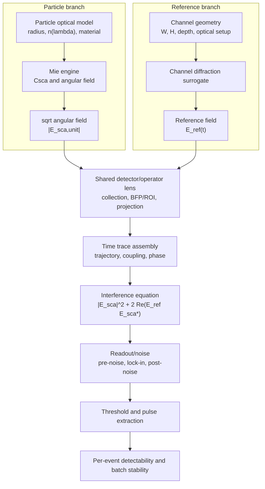
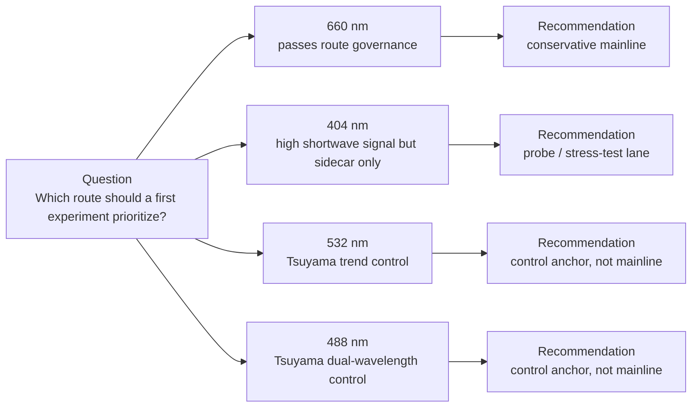

# EV/NODI 综合分析报告 v5.2.8：lens-B τ=1 ms 1000e low-event full-grid overlay

- 日期 / 版本：2026-05-15；**v5.2.8（lens-B τ=1 ms 1000e low-event full-grid overlay）**
- 报告性质：读者向综合分析报告；适用口径 = 无实测数据 + 合成相对先验模型 + post-v2 审计 / 有界 trace
- **2026-06-12 当前状态（必须先读）**：本报告是历史综合背景报告，不再是最终结论入口。当前最终读者向 no-data 结论见 `reports/140_exhaustive_ev_gold_fullgrid_3seed_10000e_postrun_analysis_20260523.md`，封板门与残余假设见 `reports/147_detector_forward_identity_full_chain_adversarial_audit_synthesis_20260610.md` 和 `reports/148_extreme_simulation_roadmap_post_audit_20260610.md`。旧的“660 conservative main route / 404 sidecar”表述已被降级：当前只能写成 `candidate families under detector surrogate`，即 `404/W500` fixed-view candidate 与 `660/W800` per-wavelength-view candidate 并立；不存在 detector-resolved 或绝对跨波长 winner。
- 原始 v5.2.8 路线叙述（历史口径）：660 nm = conservative main route；404 nm = shortwave sidecar / probe；532 / 488 nm = Tsuyama-aligned trend controls。该叙述只保留为历史 provenance，不得作为当前结论复用。
- **2026-05-23 覆盖说明（已由 2026-06-12 再次收紧）**：report 140 完成 EV+gold exhaustive shared-dual 3seed × 10000e post-run audit/analysis；2026-06-12 后，当前读法进一步收紧为 `404/W500` fixed-view candidate 与 `660/W800` per-wavelength-view candidate 并立，D1400/D1500 不再写作最终深度 mandate。
- **Lens-B B7 后续覆盖说明（历史）**：本报告的 §11 和 report 100 记录 B6/B7 单 seed 1000e 方法谱系；它们不再作为 robust Lens-B route conclusion。
- v5.2.6 历史更新：口径 B 的 **EV + gold full-grid, 1 seed × 10000 events/case** 曾完成（`results/lens_b_ev_gold_fullgrid_1seed_20260513/`，32,032 rows），但后来确认 runtime 是 2 ms；v5.2.7 起只保留为 legacy sensitivity/reference。口径 B 仍拆为 **B1 anchor target-fitting** + **B2 EV biomimetic application**：B1 只冻结 estimated parameter set；B2 才从 EV full-grid 选型。Gold rows 只做 anchor / Tsuyama consistency diagnostics；最终推荐波长只允许 660 / 404，488 / 532 只能作为 trend/control。
- **v5.2.7 overlay**：口径 B runtime 现在按固定要求锁定为 **τ = 1 ms**。因此 `results/lens_b_ev_gold_fullgrid_1seed_20260513/` 的 raw rows（实际 `lockin_time_constant_s = 0.002 s`）只能作为 **legacy 2 ms sensitivity / impact reference**，不能再写成当前 B=1 ms final full-grid evidence。
- **v5.2.8 overlay**：Stage B6 `τ=1 ms` EV + gold full-grid 已完成 32,032 rows（`results/stage_b6_tau1ms_ev_gold_fullgrid_1000e_seed42_22worker_restart_20260514/`），但事件数是 `1000 events/case`。它是当前 B=1 ms low-event design evidence，不是 `10000 events/case` final-validation。
- 不变量：不引入新实测或 3-seed robust consensus；forbidden claim 与 P19 gate 不变；旧 2 ms B full-grid 不能被 metadata 改名成 1 ms；1000e 结果不能被改名成 10000e final-validation。
- 阅读提示：第一次阅读请先看 §0.0；完整版本履历与 v5.1–v5.2.8 细节见 §18.2

---

## §0 阅读须知

### 0.0 First-time reviewer claim boundary box（先读这一框）

如果读者只给本报告 3–5 分钟，应先按下面四行理解全文：

| 读者问题 | 本报告允许的回答 | 本报告不允许的回答 |
|---|---|---|
| 这份报告到底是什么？ | 面向 EV/NODI 路线选择的 no-measured-data relative design audit；它审计 Mie → detector → reference → interference → readout → pulse → route governance 的完整链条 | 不是 calibrated simulator、不是实验报告、不是完整 full-wave 电磁求解、不是 EV 生物学验证 |
| 当前选型结论是什么？ | 当前最终结论不在本报告正文内封板，而在 report 140/147/148 closure set：`404/W500` 是 fixed-view detector-surrogate candidate family，`660/W800` 是 per-wavelength detector-surrogate candidate family；532 / 488 只能作为 control/trend | 不能写成"660 物理绝对最优"、"404 或 660 已成为 detector-resolved winner"、"532/488 已成为主路线竞争者" |
| 数字应怎样读？ | 同 lens、同 panel、同 source type 内可读相对趋势；coverage gap 显式标 `—` | 不能把 synthetic detection proxy 当真实事件概率、count rate、concentration、LOD 或 calibrated SNR |
| 论文还能怎么走？ | 可作为 physics-governed route-selection framework 的底稿；paper story 另见 report 123 | 不能把 Tsuyama alignment、selected-annulus residual 或 route score 写成 validated EV detection performance |

**一句话边界**：本报告能推荐"当前相对审计下哪条路线更稳、哪些证据缺口最该补"，但不能替代 measured blank / detector operator / standard-particle / EV characterization / full-wave spot-check 之后的校准结论。

**selected-annulus 防误读**：本报告中的 `selected-annulus` 是 event-position / analysis-window 口径（初始位置靠近通道边缘 0.5–0.8 的事件子集），**不是** BFP optical annular aperture；除非 detector-operator 代码另有明确定义，否则不得按光学环形孔径解释。

**数字可比微规则**：只有当 **lens、particle panel、source type、固定变量** 同时匹配时，数字才可直接定量比较。任一项不同，都只能读成 route-level evidence、qualitative trend 或 coverage gap，不能跨 lens / panel 混排。

### 0.1 这份报告是什么、不是什么

**是**：在没有任何实测采集数据的前提下，把物理推导、surrogate 模型、估计参数与多轮审计证据按读者直觉串起来，给出 EV / NODI 工程主线推荐 + Tsuyama-anchored EV application 推荐 + 边界声明的读者向综合分析。

**不是**：

- 不是实验报告（没有实测）
- 不是仪器校准报告（没有 calibrated SNR / LOD / 浓度）
- 不是论文完整复现（Tsuyama 数值的复现只到 reproduction-lens partial，没有 accepted paper-calibrated candidate）
- 不是生物学论证（没有 biological specificity claim）

### 0.2 双口径并立

本报告同时回答两个并立问题，**互不替代**：

```text
口径 A — 工程主排序
        问题：在 32,032 设计组合 × 8 仪器情景的合成相对先验模型内，
              EV / NODI 工程路线如何排序、主路线选哪一组几何？
        主分母：全 back-focal-plane 全 crossing
        颗粒：EV biomimetic + Au20/Au30 anchors
        历史正文推荐：660 nm + 通道宽 800 nm × 通道深 1400 / 1500 nm 的双 main 集合
        当前 closure-set 读法：该历史推荐已降级为背景；最终读法见 report 140，
        即 404/W500 fixed-view candidate 与 660/W800 per-wavelength candidate 并立。

口径 B — Tsuyama-anchored EV application lens
        问题：先用 Tsuyama Au/Ag anchor 反推低自由度 estimated parameter set，
              再把这组参数固定后应用到 EV biomimetic 候选尺寸。
        主分母：selected-annulus 0.5–0.8
        颗粒：B1 anchor = Au 20 / 30 / 40 / 60 nm + Ag 40 / 60 nm；
              B2 application = EV biomimetic
        当前框架：三步——
                step 1 用 Tsuyama targets 反推 reproduction-lens estimated parameters（当前 1 ms descriptive set: γ=0.736502 等），
                step 2 anchor residual 诊断几何 = 660 / 800 × 550 + 660 / 1200 × 550（不是 EV 推荐），
                step 3 用 frozen B lens 看 EV biomimetic full-grid；raw/control 全记录，但最终推荐只从 660 / 404 中选。
                注意：当前口径 B runtime 固定为 τ=1 ms；Stage B6 1000e full-grid 是当前 low-event design evidence；既有 2026-05-13 full-grid 是 τ=2 ms legacy reference。
```

把口径 A 的工程几何当作口径 B 的 anchor residual 诊断、把口径 B 的 Au/Ag anchor 几何当作 EV 推荐、或把口径 B 的估计参数当作物理常数推广到口径 A 工程库，都属于 §15 forbidden claim。

### 0.3a 一页版读者地图（5 行回答 5 个问题）

| 你想知道 | 一句话答案 | 详细见 |
|---|---|---|
| 问题 A 是什么 | EV / NODI 工程主线推荐 | §1.1 |
| 问题 B 是什么 | 用 Tsuyama anchor 反推估计参数，再用 frozen B lens 看 EV biomimetic | §1.2 / §11 |
| 当前推荐是什么 | 当前 closure set 不给单一绝对主路线：`404/W500` 是 fixed-view candidate family，`660/W800` 是 per-wavelength-view candidate family；488/532 只作 control/trend；本报告 §10/§11 是历史背景 | report 140/147/148；本报告仅作 provenance |
| 不能下哪些结论 | 校准 SNR / LOD / 真实浓度 / 生物特异性 / 替代主排序 / 移动 selected-annulus / 把 γ 当物理常数 / route promotion / classification accuracy 已复现 | §15.2 |
| 下一步要做什么 | P19 evidence-strategy gate 双口径同时声明 acceptance criteria + 优先获取 measured Au raw trace + measured blank / BFP / slit / ROI | §16 |

### 0.3b 读者问题导航表（10 个最常被问的问题 → 报告位置）

| # | 读者问题 | 在哪里回答 | 主要看哪张表 / 段 | 结论口径 | 注意事项 |
|--:|---|---|---|---|---|
| 1 | 这个通道尺寸对粒子的 detection proxy 是多少？ | §6.4 + §7.2 | 表 6.4.A（口径 A）+ 7.2.x | EV biomimetic + all-crossing | 数字是 synthetic detection score，**不是**实测事件概率 |
| 2 | 为什么检测不到？主要 blocker 是什么？ | §8.5 blocker 分类 | 表 8.5 | 双口径共用 | blocker 不是单一原因，要看 reference / noise / threshold / route gov 多条 |
| 3 | 固定尺寸时不同波长在 Mie / reference / peak / detection 上差多少？ | §6.4.F + §7.1 + §2.4 | 表 6.4.F（4 波长信号链分解）| 双口径分别给 EV + Au | 倍数列只用于阶段量；detection 列保留 % |
| 4 | 固定波长时不同 W / H 对 peak / transit / detection 影响多大？ | §7.2 + §10.4 | 表 7.2.1–7.2.5 + §10.4 width-prior | 口径 A all-crossing | 通道几何**不**改变 Csca（颗粒固有量）；改变的是 reference / 路径 / transit |
| 5 | 404 nm 为什么本征散射更强但不一定推荐？ | §2.4 + §6.4.F + §10.2 | 表 2.4 + 6.4.F | 口径 A | peak↑ 但 transit↓、phase flip↑、margin↓ → detection 反而 ↓；详 §8 |
| 6 | 660 nm 为什么是 main route？ | §10.2 因果链 5 步 + §10.6 裁决表 | 表 10.6 | 口径 A | 不是单指标最优，是 width-prior + R5.2 + P0 audit + 近壁细网格一致结果 |
| 7 | 噪声到底影响多大？ | §8.4 + §8.6 | 表 8.4 + 表 8.6 | 双口径共用 | 三个理由：参考场不放大噪声、阈值随噪声同步上抬、短波长 transit/sample 衰减 |
| 8 | reference field 增强这么多倍，为什么噪声还重要？ | §8.1–§8.3 + §3.0a | §3.0a 阶段量级联 | 双口径共用 | reference 放大相干一次项不放大非相干噪声；但阈值 / margin / transit 要分别看 |
| 9 | Csca、自散射、干涉项、peak 是不是简单相加 / 简单相乘？ | §3.0a + §2.3 + §2.4 | §3.0a 公式块 + 表 2.4 | 双口径共用 | signal proxy = self term + cross term；强参考场下 cross term 主导，peak ∝ \|E_ref\|·√Csca **不是** \|E_ref\|·Csca |
| 10 | 口径 B 到底怎么从 Tsuyama 数据走到 frozen B lens，再走到 EV 选型？ | §11.1–§11.8 | 表 11.8 step 流程 | 口径 B | B1 用 Tsuyama Au/Ag anchor 反推 estimated parameters 并冻结 lens；B2 用该 frozen lens 看 EV biomimetic；anchor diagnostic geometry 不是 EV 推荐，488/532 只进趋势/对照 |

### 0.3c 外部审稿人入口：先定角色，再读数字

这层是 v5.2.2 起针对外部初读者新增、在 v5.2.3 加入图解草图、在 v5.2.4 收紧 lens-language / number-comparability / P19 acceptance criteria，在 v5.2.5 更正 lens-B EV application 逻辑，在 v5.2.6 吸收 B-EV + gold full-grid，在 v5.2.7 叠加 B runtime τ=1 ms 固定要求，并在 v5.2.8 吸收 Stage B6 τ=1 ms 1000e low-event full-grid 设计证据的入口层。它不替代后文任何数据表，只规定**先用什么框架读后面的数字**。若读者只看一页，本节应先于 §6 / §7 / §10 / §11 阅读。

#### 0.3c.1 四波长角色表（不要把"波长优劣"读成"绝对物理最优"）

| 波长 | 本报告中的主角色 | 主要证据位置 | 可以支持的最强表述 | 禁止表述 | 下一步若要升级需要什么 |
|---:|---|---|---|---|---|
| **660 nm** | 当前 per-wavelength-view candidate family；历史正文里曾写作 conservative main route | report 140/147/148 为当前入口；本报告 §6/§10/§11 仅作背景 | 可写 `660/W800` 是 per-wavelength detector-surrogate candidate family | "660 nm 是物理上绝对最佳波长"；"660 已有 calibrated SNR / LOD"；"660 是 detector-resolved winner" | measured blank / BFP / slit / ROI；standard-particle transfer；detector gain / noise；full-wave spot checks |
| **404 nm** | 当前 fixed-view candidate family；历史正文里曾写作 shortwave sidecar/probe | report 140/147/148 为当前入口；本报告 §2/§6/§7 仅作背景 | 可写 `404/W500` 是 fixed-view detector-surrogate candidate family，且短波阶段量更强 | "404 因 peak 强就成为绝对 winner"；"404 热效应给 NODI 加分" | 404 blank/reference；thermal / POD cross-talk；detector throughput；shortwave full-wave / exposure safety |
| **532 nm** | Tsuyama-aligned mid-wave trend/control anchor；Au / Ag paper-audit 趋势参照 | §6.2.2；§6.4.C；§7.1.5；§14 | 支持"中间波长不是简单夹在 404 与 660 之间"，并为 Tsuyama 488/532 双波长趋势提供 anchor | "532 已证明 EV/NODI 主路线"；"532 是当前主路线竞争者" | 若要进入主候选，需同等 measured operator / blank / standard-particle / EV panel |
| **488 nm** | Tsuyama-aligned dual-wavelength control；与 532 一起作为 paper-method trend anchor | §6.2.2；§6.4.C；§7.1.5；§14 | 支持 488/532 文献趋势对照与方法学 sanity check；不是当前 EV 工程主路线 | "488 与 660 / 404 同级竞争主路线"；"Tsuyama 488/532 分类等价于本地 classification 已复现" | 同 532；另需 crosstalk / dual-wavelength readout artifact |

**一句话读法**：本报告现在应作为历史背景读取；当前 closure set 给出的是 `404/W500` 与 `660/W800` 两个 detector-surrogate candidate family，而不是 660 main / 404 sidecar 的单线叙事。

#### 0.3c.2 版本 / lens lineage 表（防止把历史、主线和审计层混成一个结论）

| 名称 | 它是什么 | 当前读者应怎样用 | 不能怎样用 |
|---|---|---|---|
| v1 full-grid library | 32,032 基础设计组合的相对工程库 | 作为 §6 / §7 / §10 的底层 evidence pool | 不能当成 measured event probability / calibrated detector output |
| realism v2 sidecars | 在 v1 上加入仪器情景、route governance、blank / readout / uncertainty / no-measured-data closure 的审计层 | 观察路线角色是否稳定；暴露 artifact gap | 不能当成实测校准或真实 blank safety |
| post-v2 P0–P18 | P0 mandatory audit + P6/P8/P10/P12/P14/P16 有界 trace + P18 stop/continue synthesis | 作为历史 route-governance provenance | 不能把任一 bounded trace 排名当 route promotion |
| 口径 A all-crossing engineering lens | EV / NODI 工程主排序历史口径 | 作为 all-crossing 背景和变量解释 | 不能替代当前 all-crossing / selected-annulus 并立 closure |
| 口径 B selected-annulus Tsuyama-anchored EV application lens | B1 用 Tsuyama targets 做 reproduction-lens target fitting / parameter freeze；B2 用 frozen B lens 计算 EV biomimetic full-grid 选型 | 作为 selected-annulus 背景和 Tsuyama lineage 解释 | 不能把 B1 anchor diagnostic geometry 当 B2 EV recommendation；不能把 488/532 control-only top 当推荐结论；不能把 γ / SNR scale 当物理常数 |
| report 88 v5.2.8 | 历史综合背景报告 | 作为 provenance 和术语背景；当前结论读 report 140/147/148 | 不能用本报告旧路线角色覆盖当前 closure set |
| report 122 ledger | 版本演化与双口径合并记录 | 追踪 report 88 为什么变成当前结构 | 不是新的科学结果源 |
| report 123 paper outline | 后续论文路线提纲 | 后续讨论论文 story / figure / validation package 的草案 | 不是 report 88 的结论升级，也不解锁任何 claim |

#### 0.3c.3 三个高优先级图表规格（先补图，不先补新算例）

| 优先级 | 建议图 | 放置位置 | 数据来源 | 图要传达的一句话 | 图注必须写清 |
|:-:|---|---|---|---|---|
| 1 | **Route-role decision matrix：404/W500 vs 660/W800 + 532/488 controls** | 当前应在 report 140/147/148 之后重画 | report 140/147/148；本报告 §6/§10/§11 仅作背景 | 404/W500 与 660/W800 是 detector-surrogate candidate families；532/488 是 trend controls | 这是 route role 图，不是 calibrated performance 图 |
| 2 | **Whole observation-chain flowchart** | §2.1 后 | §2.1–§2.2、附录 B、核心代码路径 | 读者不能只看 Csca；必须看 detector / reference / interference / readout / pulse / governance 全链 | 箭头表示计算依赖与审计 provenance，不表示实验校准闭环 |
| 3 | **Wavelength × geometry evidence map / gap map** | §7 数据覆盖矩阵后 | §7 数据覆盖矩阵、附录 D/E/F | 哪些 cell 有 strict 直接行，哪些只是 route-level / nearest-neighbor evidence | "—" 是 coverage gap，不是 0% detection |

**v5.2.4–v5.2.8 取舍**：v5.2.3 已把上面 3 张图推进为 report 内可读草图（§2.1a / §2.1b、§7.0a、§10.6a）；v5.2.4 收紧 lens 标注、number comparability、selected-annulus 防误读和 P19 artifact 验收标准；v5.2.5 更正口径 B 的 EV-application 读法和推荐结论过滤；v5.2.6 吸收已完成但后续降级为 legacy 的 2 ms B-EV + gold full-grid；v5.2.8 吸收当前 1 ms Stage B6 1000e low-event full-grid。仍**不生成独立图像文件、不引入实测校准、不把草图或 1-seed low-event full-grid 当实测证据**。若后续生成 slide / PNG / PPTX，图注必须继承 §15 forbidden claim。

#### 0.3c.4 论文路线先不并入主报告

论文 story、main figures、validation package 和 reviewer-risk checklist 已单独沉淀到 `reports/123_EV_NODI_paper_story_outline_for_later_discussion.md`。该文件是**后续讨论用提纲**，不是当前报告的 claim 升级；若未来把其中任何 validation claim 并回 report 88，必须先满足 §16 P19 双口径 evidence-strategy gate。

### 0.3 阅读路径建议

| 你的角色 | 建议路径 | 大致用时 |
|---|---|---:|
| 第一次阅读 | §0 → §1 → §2 → §6 → §10 或 §11（按你的口径）→ §15 | 25–40 分钟 |
| 工程评审 / 审计 | §1 → §3 → §4 → §5 → §7 → §9 → §10 → §15 → §17 | 50–70 分钟 |
| 论文对照 | §6 → §11 → §14 → §15 | 30–40 分钟 |
| 边界与治理 | §12 → §13 → §15 → §16 → §18 | 25–35 分钟 |
| 出处溯源 | §17 → 附录 A → §18 | 15–25 分钟 |
| 完整通读 | §0 → §18 → 附录 A/B/C | 60–90 分钟 |

### 0.4 v5.0 与之前版本的关系

- v3.0：仅口径 A，selected-annulus 仅一处指针提及
- v4.0：双口径并立、§14 selected-annulus 等规模并入、§15 双口径综合
- v4.1：新增 §16 读者向解读层
- v4.2：§16 改两步框架 + §16.3 / §16.4 改 ms / % 多表
- **v5.0**：**全文 reader-centric 重构**。把 v3 → v4.2 的叠加痕迹清掉，按问题 → 物理 → 变量 → 数据 → 分析 → 推荐 → 边界 → 出处的顺序重排；把代码层参数 ID 改名为可读科学命名（附录 A 给出对照表）。**数值与 forbidden 完全继承 v4.2，没有放宽任何边界**。

### 0.5 v5.0 重构的不变量（invariants，不会被改名 / 改顺序改变的事实）

```text
1. 全部数值结论与 v4.2 一致
2. 全部 forbidden claim 与 v4.2 一致（§15）
3. 口径 B 当前参数集采用 Stage B4 1 ms descriptive set（§11.2）；legacy 2 ms 参数只作 provenance
4. 双口径并立、互不替代的治理原则与 v4.0 起一致
5. selected-annulus 0.5–0.8 固定不可移动
6. raw provenance 来源扩展：reports/49（口径 B Phase 2 / 2.5–2.11）+ reports/71（R5.2 sidecar）+ `results/stage_b6_tau1ms_ev_gold_fullgrid_1000e_seed42_22worker_restart_20260514/`（当前 B2 1 ms 1000e low-event full-grid）+ `results/lens_b_ev_gold_fullgrid_1seed_20260513/`（legacy 2 ms reference）
```

---

## §1 项目要解决的两个并立问题

### 1.1 问题 A — EV / NODI 工程主线推荐

在以下候选范围内挑出最适合作为 EV / NODI 工程主线的几何 + 波长组合：

```text
波长候选：404 / 488 / 532 / 660 nm
通道宽度候选：11 个值（500 / 600 / 700 / 800 / 900 / 1000 / 1100 / 1200 / 1300 / 1400 / 1500 nm）
通道深度候选：13 个值（覆盖 500–1500 nm）
颗粒类型候选：56 种（EV biomimetic 系列 + Au 20–300 nm anchors）
合计：32,032 个基础设计组合
```

**"最适合"在本报告内的精确意思**：在合成相对先验模型 + 8 个仪器情景下，detection 数字稳定、近壁条件下网格证据充分、对低自由度风险先验解释鲁棒、并且没有被路线治理审计降级到对替代量级敏感 (`surrogate_sensitive_not_promoted`) 状态。

**它不是**：不是"detection 数字绝对最高"。§10.4 会显示，detection 数字最高的反而是 500 nm 宽窄通道路线（19.6% 在 660 / 500 × 1500 nm），但它们在路线治理裁决后被标为 `surrogate_sensitive_not_promoted`——原因是窄通道工程风险在原模型中被低估（§10.4 详解 width-prior 风险先验）。

### 1.2 问题 B — Tsuyama anchor 反推参数后，EV biomimetic 怎么选

Tsuyama 等 2019 / 2020 / 2022 / 2024 共 6 篇论文给出了 NODI / POD 检测的若干**论文数值**：

```text
Table S1 Ag40 / Au40 signal ratio（按散射截面开方列）
Au 粒径响应斜率 ≈ 2.3
Au30 / Au20 SNR 比 ≈ 33 / 12 ≈ 2.75
Au20 / Au30 / Au40 / Au60 selected-annulus detection 带
selected-annulus 几何 guardrail
classification accuracy 71.9 ± 4.0%（diagnostic only）
```

**问题 B 的边界条件**：

```text
不修改 selected-annulus 0.5–0.8 窗口
不回写 EV 工程主线
不开 per-diameter / per-geometry / per-case correction
只允许低自由度全局估计参数
```

在这组边界内，口径 B 回答两个连续问题：

```text
B1 anchor target-fitting:
  能否用低自由度 estimated parameters 对齐 Tsuyama Au/Ag anchor？

B2 EV application:
  固定 B1 得到的 estimated parameter set 后，EV biomimetic 候选尺寸怎么排序？
```

**B1 当前结论（详见 §11.2）**：Stage B4 1 ms descriptive set 已替代旧 2 ms freeze 作为当前报告 metadata：`γ=0.736502`、`snr_scale=0.890700`、`snr_response_exp=0.810281`、`raw_global_snr_scale=0.293130`。release boundary 仍是 `negative_or_diagnostic_result_only` / `bounded_response_compression_partial_descriptive`，主 no-go 仍是 `raw_size_response_alignment_not_met`；这些参数不是物理常数，也不是 active transform。

**B2 当前结论（详见 §11.3–§11.5，最新 B7 见 report 100）**：`results/stage_b6_tau1ms_ev_gold_fullgrid_1000e_seed42_22worker_restart_20260514/seed_42_raw_rows.csv` 已完成 32,032 rows，seed `42`，`1000` events/case，EV/exosome + gold，全粒子库，404 / 488 / 532 / 660 nm，且所有 rows 的 `lockin_time_constant_s = 0.001 s`。这是 B6 **per-wavelength gold-normalized** low-event full-grid design evidence，不是 `10000 events/case` final-validation。B6 结果提示 EV reference-useful selected-annulus 高分集中在 **660 nm / 800 nm width**，depth band 为 `1000-1400 nm`；随后完成的 B7 fixed-660-gold normalization 则把当前跨波长候选改为 **404 nm / 500 nm width**。488 / 532 即使 raw/control 分数高，也只能放 control-only / trend-only 表。任何结论仍只是 synthetic relative，不是 3-seed robust consensus 或 measured calibration。

### 1.3 为什么是两个并立问题、不是一个？

| 维度 | 口径 A：工程主排序 | 口径 B：Tsuyama-anchored EV application |
|---|---|---|
| 目标 | EV / NODI 工程整体路线排序 | B1 用 Tsuyama anchor 反推参数；B2 用 frozen B lens 看 EV biomimetic |
| 主分母窗口 | 全 BFP 全 crossing | selected-annulus 0.5–0.8 |
| 候选规模 | 32,032 设计 × 8 情景 = 256,256 行 | B1 约 52 paper-audit candidates × 3 seeds；当前 B2 EV + gold low-event full-grid = 32,032 rows, 1 seed × 1000 events/case（τ=1 ms）；旧 B2 10000e full-grid 是 τ=2 ms legacy |
| 颗粒 panel | EV biomimetic + Au20 / Au30 anchors | B1 anchor = Au 20 / 30 / 40 / 60 + Ag 40 / 60 nm；B2 application = EV biomimetic |
| 主推几何 | 660 nm + 800 × 1400 + 800 × 1500 nm | B1 anchor diagnostic = 660 / 800 × 550 + 660 / 1200 × 550（不是 EV 推荐）；当前 τ=1 ms B2 1000e full-grid design evidence 指向 660 / 800 nm width、1000-1400 nm depth band |
| 当前 release | `conditional_relative_main` 集合 | B1 仍 `negative_or_diagnostic_result_only`；B2 1000e 是 one-seed synthetic relative low-event design evidence，不是 10000e final-validation |
| 主 No-Go | 无（已收口）| B1: `raw_size_response_alignment_not_met`；B2: 1 seed only、no measured blank、no calibrated SNR/LOD、no biological specificity；488 / 532 control-only, not recommendation-eligible |

两套候选不一样、分母不一样、回答不一样的问题，所以**不能把一边的结论搬到另一边**。后面 §10 / §11 各自展开。

---

## §2 物理链：粒子如何变成一个 detection event

本节回答"信号是从哪里来的、经过哪些环节"。读完本节，读者应该能跟着一条公式链算下来，并理解 §11.2 关键问题"**本征散射 |E_sca|² 与干涉项 2|E_ref||E_sca|cos(Δφ) 是相加还是相乘？**"的答案为什么是相加。

### 2.1 链条总览（7 阶段）

```text
[阶段 1] 粒子本征散射（Mie 散射）
            产物：散射截面 Csca、角度散射振幅 S1(θ), S2(θ)、收集前场幅值 |E_sca,unit|
            源代码：nodi_simulator/mie_engine.py + intrinsic_scattering.py
                ↓
[阶段 2] 角度收集（探测算子 L_det）
            产物：被收集的检测端散射场 E_sca,detected
            源代码：nodi_simulator/utils.py 中 build_collection_operator + collapse_angular_field_with_operator
                ↓
[阶段 3] 照明 + 路径相位 + 耦合 → 事件级散射场
            产物：事件随时间的散射场 E_sca(t)
            源代码：nodi_simulator/scattering_trace.py + illumination.py
                ↓
[阶段 4] 通道参考场（Tsuyama BFP / channel-angular surrogate）
            产物：事件随时间的参考场 E_ref(t)
            源代码：nodi_simulator/reference_field.py
                ↓
[阶段 5] 干涉叠加 → signal_trace
            产物：signal_trace(t) = |E_ref + E_sca|² - |E_ref|²
            源代码：nodi_simulator/interferometric_trace.py
                ↓
[阶段 6] 噪声 + 锁相读出
            产物：post-readout 信号
            源代码：nodi_simulator/pulse_analysis.py (与 reference 的 lock-in surrogate 部分)
                ↓
[阶段 7] 阈值 + 脉冲提取 + batch 统计
            产物：detection_rate, mean_peak_margin_z, phase_flip_fraction, ...
            源代码：nodi_simulator/pulse_analysis.py + count_generation.py
                ↓
[最终] 按 lens 分组：
       口径 A 看 all_crossing_detection_rate
       口径 B 看 selected_annulus_detection_rate
```

### 2.1a Whole engineering workflow flowchart（从输入到推荐）

下面这张图是给外部初读者的**工程全流程图**。它回答"为什么不能只看 Csca 或某张 detection 表"：路线推荐来自整条 observation chain + governance，而不是来自单一物理量。

```mermaid
flowchart LR
    A["Design inputs<br/>particle/material, lambda, W, H"] --> B["Intrinsic scattering<br/>Mie Csca, S1/S2, dCsca/dOmega"]
    B --> C["Detector operator<br/>BFP/slit/pinhole/ROI surrogate"]
    A --> D["Channel geometry<br/>diffraction/reference surrogate"]
    C --> E["Collected scattered field<br/>E_sca,detected"]
    D --> F["Reference field<br/>E_ref"]
    E --> G["Event trace<br/>trajectory, phase, coupling"]
    F --> H["Interference signal<br/>|E_ref + E_sca|^2 - |E_ref|^2"]
    G --> H
    H --> I["Readout/noise surrogate<br/>lock-in, threshold, baseline"]
    I --> J["Pulse extraction<br/>peak, width, margin, phase flip"]
    J --> K["Batch metrics<br/>synthetic detection proxy, stability"]
    K --> L["Route governance<br/>score, gate, freeze, recommendation"]
    L --> M["Reader-facing output<br/>660 main, 404 sidecar, 532/488 controls"]
```



**图注**：箭头表示计算依赖与审计 provenance，不表示实验校准闭环。`synthetic detection proxy` 只能在同 lens / 同 panel / 同 source type 内做相对比较，不能解释为 count rate、concentration、LOD 或 calibrated SNR。

### 2.1b Core computation unit diagram（核心计算单元内部）

这张图把核心计算单元缩小到一个 event：Mie 本征散射与 reference field 先被同一个 detector / readout 口径压到可比较的检测端量，再进入干涉、噪声和阈值。



**读法**：`Csca` 只在 particle branch；真正决定 pulse 的是 detector operator 后的 `E_sca`、reference branch 的 `E_ref`、两者相位关系、readout/noise 和阈值。任何绕过这张图直接说"短波 Csca 更大所以路线更好"的判断，都违反 §2.3 / §4.5 / §15 的阅读边界。

### 2.2 每个阶段的公式与物理量含义

**阶段 1 — Mie 本征散射**

```text
散射截面：Csca = Qsca · π a²    （a = 粒径半径）
角度散射场幅值（非偏振平均）：dCsca / dΩ = (|S1|² + |S2|²) / (2 k²)
场幅值代理：|E_sca,unit(θ)| = √(dCsca / dΩ)
```

读法：粒子越大、折射率反差越大、波长越短（在 Rayleigh 区），Csca 越大。对 EV biomimetic 这种低反差颗粒，Csca ≈ 1 / λ⁴（Rayleigh 极限）；对 Au plasmonic 颗粒，Csca 在等离激元共振附近（约 520 nm）局部增强，所以 Au 在 660 nm 的 Csca 反而比 488 nm 大。

证据档位（§13 6 档来源谱）：**Mie 推导值（第 2 档）**，由物理常数 n、k、λ、π 直接算出。

**阶段 2 — 角度收集**

```text
E_sca,detected = L_det[ field_sca(θ, φ) ]    （L_det = 当前 surrogate 收集算子）
```

`L_det` 在 v4.0 / v4.2 / v5.0 内仍是 surrogate（默认 `channel_diffraction + pupil_slit_surrogate + parallel projection`），它把完整角度散射图压成一个由 BFP / slit / pinhole 决定的收集场。它**不是**完整 pupil integral，所以收集量级是 surrogate 估计，不是 calibrated detector unit chain。

证据档位：**Surrogate 估值（第 3 档）**。

**阶段 3 — 照明 + 路径相位 + 耦合 → 事件级散射场**

```text
E_sca(t) = E_env(t) · E_sca,unit · f_coupling(t) · exp(i · φ_extra(t))
```

其中 `E_env(t)` 是照明场（默认 `overfill` 模式），`f_coupling(t)` 是 Gaussian xy 耦合，`φ_extra(t)` 包括路径 OPD 与焦点穿过相位。这一步把"静态散射场"转成"事件随时间的散射场"。

证据档位：第 3 档（surrogate 估值）。

**阶段 4 — 通道参考场**

```text
E_ref(t) ~ L_det[ E_diff,ch ]
```

当前默认参考场模型是 `channel_angular_surrogate`（通道角谱 surrogate）。NODI 主链看的是参考场和散射场的**干涉**，不是单独的 `|E_sca|²`。

证据档位：第 3 档（surrogate）。在 reports/49 / 71 / Phase 2 lane 内有 `paper_aligned_phase_filter` 与 `tsuyama_bfp_roi_mode` 等更接近论文条件的 reference 变体；当前主报告 reference 模型对论文条件做相位滤波对照，相对误差 ≈ 2–9%（§6.3 表）。

**阶段 5 — 干涉叠加**（**关键公式，§2.3 / §11.4 都引用它**）

```text
E_det(t)       = E_ref(t) + E_sca(t)
I_det(t)       = |E_det(t)|²
signal_trace(t)= I_det(t) - |E_ref(t)|²
              = |E_sca|² + 2 · Re( E_ref · E_sca* )
                  ↑        ↑
              本征二次项   参考场放大的一次干涉项
```

**这一行就是问题"本征 vs 干涉是相加还是相乘"的答案**：**严格意义上是相加**——两项简单叠加，不是相乘。但量级关系按 |E_ref| / |E_sca| 的比值分三个极限：

| 极限 | \|E_ref\| / \|E_sca\| | 主导项 | peak 量级 |
|---|---|---|---|
| 弱参考场 | ≪ 1 | 本征二次项 \|E_sca\|² | peak ∝ Csca |
| 平衡 | ≈ 1 | 两项可比 | peak ≈ \|E_sca\|² + 2\|E_ref\|\|E_sca\|cos(Δφ) |
| **强参考场**（当前模型 + Tsuyama 论文条件） | ≫ 1 | **干涉一次项** | **peak ≈ 2 · \|E_ref\| · \|E_sca\| · cos(Δφ) ≈ \|E_ref\| · √Csca** |

所以"参考场放大 N 倍 × 本征 Csca 翻 M 倍 = 总放大 N · M"是**错的直觉**。在当前强参考场口径下，peak 大致跟 |E_ref| · √Csca，**不是** |E_ref| · Csca。

**阶段 6 — 噪声 + 锁相读出**

噪声进入位置：

```text
干涉 signal_trace
    ↓
[pre-readout 噪声] 高斯 + 散粒 (shot-noise surrogate) + 漂移 surrogate
                 默认: noise_std = 0.01, shot_noise_scale = 0.001
    ↓
锁相读出 lock-in surrogate（当前 runtime：口径 A / `EV_NODI_only_design` = 1 ms；口径 B Stage B6 low-event full-grid = 1 ms；旧 B full-grid / D2.1 = 2 ms legacy；论文条件范围 1–2 ms）
    ↓
[post-readout 噪声] 默认: post_readout_noise_std = 0.002
    ↓
输入到阈值
```

**关键观察**：参考场放大的是相干一次项（signal 端），**不放大噪声**（噪声没有相干相位）。但 noise floor 不是常数：

- 阈值用背景的 MAD 估计；noise↑ → 阈值↑ → detection↓
- 短波长 transit 时间窗变小 → 锁相有效样本数变少 → margin z 变小
- phase flip fraction 在短波长更高（OPD 抖动相对 λ 占比更大）

这就是 §8 / §11.4 / 用户曾问"为什么参考场放大那么多倍噪声还重要"的答案：noise 不被放大，但 noise 决定阈值，阈值决定 detection；transit 与 phase flip 还会进一步压低短波长的 detection。

**阶段 7 — 阈值 + 脉冲提取 + batch 统计**

```text
threshold = median(background[:n_bg]) + threshold_sigma · 1.4826 · MAD(background[:n_bg])
默认: threshold_sigma ∈ {5, 10}, n_bg = first 20% samples

find_peaks(signal_post_readout):
    height   ≥ threshold
    width    ≥ min_peak_width   （Phase 2 paper-audit lane: 2.0–3.0 ms）
    distance ≥ min_peak_interval

batch 输出:
    detection_rate / stable_detection_rate / mean_peak_height / mean_peak_margin_z
    phase_flip_fraction / roc_auc_event_vs_background / d_prime_event_vs_background
```

最后按 lens 分母选择是 all-crossing 还是 selected-annulus（§4 详解）。

### 2.3 关键问题答覆：本征散射 + 干涉项 是相加还是相乘？

直接答：**相加**（§2.2 阶段 5 公式）。

但在强参考场极限（**当前模型 + Tsuyama 论文条件就在这里**）下，干涉一次项 `2|E_ref||E_sca|cos(Δφ)` 主导，本征二次项 `|E_sca|²` 被淹没。所以读者直觉中的"参考场放大 × 本征 Csca 翻倍 → 总倍数相乘"是错的；正确量级关系是：

```text
peak ≈ 2 · |E_ref| · |E_sca| · cos(Δφ)
     ≈ |E_ref| · √Csca · (cos Δφ 的运行平均)
```

注意 √Csca 不是 Csca。所以波长把 EV biomimetic 颗粒 Csca 翻 7.1× 时（404 vs 660 nm，Rayleigh 1/λ⁴），peak 大致只放大 √7.1 ≈ 2.66×（再乘 |E_ref| 在相近几何下的弱波长因子约 0.95–1.00 与 cos Δφ 平均后约 0.7–0.9），实际只约 2×。这就是为什么 404 nm 的 peak 增益远比 Csca 增益小。

### 2.4 强参考场极限下的具体放大表（4 波长机制链：404 / 488 / 532 / 660 nm，EV biomimetic + 相近几何）

> **倍数计算口径**：本节所有"相对 660 nm"列都是 `量(λ) / 量(660 nm)` 的比值，baseline 是同一 W × H 同一 EV biomimetic panel 下的 660 nm。常数倍率（例如干涉项里的 `2`）在分子分母同时出现时已抵消，**不会再乘进相对倍数列**。`transit (ms)` 用绝对值；`synthetic detection score (%)` 用绝对百分比。
>
> **重要拆分（v5.1.1 hotfix）**：本节拆为两个数据块。**块 A**（严格物理阶段量）按"同一 W × H + 同一颗粒 panel + vary λ"做 strict controlled comparison；**块 B**（route-level available evidence）只展示 v5.x 报告内可用的 route-class detection 行，这些行**不是** strict λ-only fixed-geometry evidence。两块**不可混读**（详见 §7.0 第 1 条 controlled 比较约束）。

#### 块 A — 严格物理阶段量（strict controlled，同 W × H + 同 panel + vary λ）

先把最容易误读的 404 nm 拆成一笔账：

```text
404 的 Mie Csca× = 7.10
但 Csca 是功率 / 截面量，不是 detector pulse 里直接相加的场幅值。

强参考场下：
observed pulse ≈ |A_ref + E_sca|² - |A_ref|²
              = 2 Re(A_ref* E_sca) + |E_sca|²

当前模型处在 strong-reference 区，所以主导项是第一项：
peak ratio ≈ (A_ref_404 / A_ref_660)
           × sqrt(Csca_404 / Csca_660)
           × (effective phase / readout factor relative to 660)
```

| 404 nm 相对 660 nm 的拆账步骤 | 倍数 | 这一步为什么会变 |
|---|---:|---|
| Mie Csca | 7.10× | EV biomimetic 在 Rayleigh 区近似按 `(660 / 404)^4` 放大；这是截面 / 功率量 |
| 场幅值 `|E_sca|` | `sqrt(7.10)` = 2.66× | 干涉 pulse 主要吃场幅值；功率量开方后才是场量 |
| cross term `|A_ref|·|E_sca|` | `≈ 0.95 × 2.66` = ≈ 2.5× | 404 的 reference 幅值在相近几何下略低；公式里的常数 `2` 在相对 660 的比值中抵消 |
| 实际 extracted peak | ≈ 2.0× | 再乘相对 660 的 phase / readout / trajectory running-average 折扣（约 0.75–0.85）；所以不是 2.5×，更不是 7.1× |

**关键直觉**：`7.10×` 仍然出现在 self term 里，但 self term 是 `|E_sca|²`，在 strong-reference 区不是 pulse height 的主导项。主导项是 `A_ref` 和 `E_sca` 的干涉一次项，所以 peak 更像 `sqrt(Csca)`，不是 `Csca`。

| 量 | 660 nm 基线 | 532 nm | 488 nm | 404 nm | 物理 / 推导来源 |
|---|---:|---:|---:|---:|---|
| Mie 散射截面 Csca× | 1.00× | 2.37× | 3.34× | 7.10× | EV Rayleigh: (660 / λ)⁴ |
| 收集场幅值 \|E_sca\|× | 1.00× | 1.54× | 1.83× | 2.66× | √Csca |
| 参考场幅值 \|A_ref\|× | 1.00× | ≈ 1.00× | ≈ 1.00× | ≈ 0.95–1.00× | §6.3 衍射对照：在所考察 W × H 范围内 \|A_ref\| 波长方向因子约 ±2–9%；除 404 nm 在深通道偏低外，488 / 532 与 660 接近 |
| 干涉一次项 cross term× = \|A_ref\|·\|E_sca\| | 1.00× | ≈ 1.54× | ≈ 1.83× | ≈ 0.95 × 2.66 ≈ 2.5× | factor 2 在比值中抵消，**不再乘进** |
| 自散射 self term× = \|E_sca\|² = Csca× | 1.00× | 2.37× | 3.34× | 7.10× | self term 比 cross term 小（强参考场极限下被 cross term 主导）|
| 实际 peak×（含相对 660 的 phase / readout running-average 折扣）| 1.00× | ≈ 1.2–1.4× | ≈ 1.4–1.6× | ≈ 2.0× | 404 可读成 `cross term ≈ 2.5×` 再乘约 0.75–0.85；用户示例表 404 = 2.01× 同 order |
| noise×（surrogate 内 noise 不随 λ）| 1.00× | 1.00× | 1.00× | 1.00× | pre-readout noise_std + post 不显式依赖 λ；noise model 是横向常数 |
| transit 时间窗（绝对 ms）| 8.94 ms | 7.21 ms | 6.61 ms | 5.48 ms | beam waist = 0.61 · λ / NA = 0.61 · λ / 0.45；transit = 2 w_0 / 0.2 mm·s⁻¹ |

> **块 A strict controlled？** ✅ 是。Csca / E_sca / A_ref / cross-term / self-term / peak / noise / transit 都是按"同一 W × H + 同一颗粒 panel + 仅变化 λ"的物理推导值或 surrogate 值；同一基线 660 nm 同 W × H 同 panel。

#### 块 B — Route-level available evidence（**非 strict λ-only**，仅做方向性参考）

| λ (nm) | 来自的 route class（§6.4 表 6.4.A） | EV synthetic detection score (%) | 几何 / panel 是否与块 A 同？ |
|---:|---|---:|---|
| 660 | main_660_W800_D1400 / D1500 类 (896 rows class avg) | 12.61 | ✅ 同 W × H = 800 × 1400 / 1500 同 panel |
| 532 | mid-wave baseline class (488 / 532 混合, 896 rows class avg) | ≈ 7.77 | ❌ 混合几何（class 内多 W × H）；仅作方向性参考 |
| 488 | mid-wave baseline class（同上）| ≈ 7.77 | ❌ 同上 |
| 404 | shortwave probe class (404 / 600 × 1300, 448 rows class avg) | 4.45 | ❌ 几何为 600 × 1300，不是块 A 的 800 × 1400；仅作方向性参考 |

> **块 B strict controlled？** ❌ 否。detection proxy 行是 route-level class evidence，不是 strict λ-only fixed-geometry evidence；v5.x 没有"固定 W × H = 800 × 1400 + 仅扫 λ + EV biomimetic 全 panel" 的直接行（§6.4.F + §7 数据覆盖矩阵已明示）。块 B 只能用来读"在 v5.x 已发布 route-level evidence 下 660 整体优于 404 / 488 / 532"的方向，**不能**反推"在 800 × 1400 nm 几何上 404 nm detection 是 X%"。

#### 块 C — Stage B6 口径 B selected-annulus evidence（τ=1 ms, 1000e）

Stage B6 不是块 A 的 strict λ-only 固定几何表，也不是块 B 的 all-crossing route-class 表；它是口径 B selected-annulus lens 下的 EV-only full-grid ranking。为了防止把旧 2 ms 或 B5 targeted-panel 结论继续沿用，当前 report 88 的 B2 读法以这张表为准：

| EV prior | best eligible 660 route | selected-annulus detection (%) | best eligible 404 route | selected-annulus detection (%) | B2 read |
|---|---|---:|---|---:|---|
| uniform | 660 / 800 × 1100 | 84.10 | 404 / 500 × 1100 | 82.70 | 660 wins |
| small_ev_literature | 660 / 800 × 1100 | 83.30 | 404 / 500 × 1100 | 81.34 | 660 wins |
| broad_ev_literature | 660 / 800 × 1000 | 85.84 | 404 / 500 × 1100 | 85.06 | 660 wins, close |
| sharp_msc_sev_empirical | 660 / 800 × 1400 | 75.78 | 404 / 500 × 1100 | 69.49 | 660 wins |

> **块 C claim boundary**：这是 `1000 events/case` low-event full-grid design evidence，不是 `10000 events/case` final-validation，也不是 measured event probability。它只更新口径 B selected-annulus EV application；不覆盖口径 A all-crossing main-660 工程治理。

为什么 404 的 route-level detection score 会低这么多？不是只有 transit 一条原因，而是下面几项叠加：

| 原因层 | 具体机制 | 对 404 的影响 | 能不能靠"换物镜 / 改 NA"单独解决？ |
|---|---|---|---|
| 证据范围先不同 | `4.45%` 来自 `404 / 600×1300` shortwave probe route class；`12.61%` 来自 `660 / 800×1400 / 1500` main route class | 这不是 strict same-geometry λ-only comparison，不能把差值全归因给 λ | 不能。先要补同 W × H、同 panel、同 lens 的 404/660 直接行 |
| peak 增益没有想象中大 | 块 A 已拆账：Csca 7.10× → `|E_sca|` 2.66× → cross term ≈ 2.5× → extracted peak ≈ 2.0× | 404 只有约 2× peak，不是 7× pulse；因此没有足够余量覆盖下游 penalty | 不能只靠 NA；NA 会同时改 reference、collection 和 spot size |
| transit 时间窗变短 | 当前公式 `w0 = 0.61·λ / illumination_NA`，`transit ≈ 2w0 / v_flow`；同 NA=0.45、同 flow 下，404 = 5.48 ms，660 = 8.94 ms | 当前口径 A route-level 与口径 B Stage B6 low-event full-grid runtime 都是 τ = 1 ms，所以 404 ≈ 5.48 bins、660 ≈ 8.94 bins；旧 B 2 ms legacy rows 则分别约 2.74 / 4.47 bins。二者 ratio 仍是 0.61× | 只降低 illumination NA 可拉长 transit，但会重写照明、reference、BFP/ROI 和收集算子；不是免费旋钮 |
| 不是"面积"单因子 | detection pipeline 主要看到的是时间 trace：pulse 高度、持续时间、宽度 gate、margin、phase sign；transit 用的是沿流向 beam waist 长度，不是简单光斑面积 | 光斑变小的直接后果是 dwell time 变短；若固定总功率，面积变小也可能改变强度，但本报告没有把它校准成实测功率优势 | 不能用"面积小所以换大光斑"直接推出 detection 会升；必须同时重算 signal、noise、reference 和 threshold |
| phase / sign 稳定性更差 | `k = 2π/λ` 更大时，同样路径相位扰动占更大的相位比例；短波 route 在 bounded trace 中也保留 phase / curvature 风险 | 正负峰、相位翻转、destructive interference 会让 stable detection / margin 不随 peak 同步增加 | 改 NA 可能改变相位与模式重叠，但方向不保证；需要 full-wave / measured operator 验证 |
| 阈值与噪声没有被短波自动改善 | threshold 来自 background median + sigma × MAD；noise surrogate 横向不随 λ 降低 | peak 约 2×，但 threshold / MAD / margin / Wilson LB 不按同倍数改善；detection 不是 peak 的单调函数 | 需要 measured blank / detector noise / readout chain，而不是只换光学口径 |
| route governance 降级 | 404 route 被标为 `shortwave_probe_only`；thermal / POD cross-talk / shortwave safety 只作为 sidecar risk，不给 NODI detection 加分 | 即使 404 有物理阶段量优势，也不能升级成 main route | 除非通过 §16 P19 的 measured blank、operator transfer、standard-particle / EV-like control 和 full-wave spot check |

**关于 NA 的定量直觉**：若只想让 404 的 transit 追平 660，且保持 flow 不变，按 `w0 ∝ λ / NA`，404 的 illumination NA 需要从 `0.45` 降到约 `0.45 × 404 / 660 ≈ 0.28`。但这会同时改变 beam waist、照明强度分布、reference field、BFP / slit / ROI transfer、收集效率和 phase behavior；如果同时改 collection NA，还会改变 `|E_sca|` 的收集算子。所以"换物镜口径"是一个新的 optical-operator design，不是把 404 分数自动抬高的后处理修正。

可行的工程补救方向有三类，但都需要新证据：降低 illumination NA / 放慢流速来拉长 dwell time；缩短 lock-in τ 或改 matched-filter / width gate 以适配窄 pulse；重新实测 404 blank / reference / detector transfer。当前报告不能把这些假设直接写成 404 推荐，只能把 404 保留为 shortwave sidecar / probe。

读法（4 条）：

```text
读法 1（机制链方向）：从 404 → 660，Csca 单调下降（7.10 → 1）；但 transit 单调上升（5.48 → 8.94 ms）；
                    两条链方向相反，最终 detection proxy 反而是 660 最高、404 最低。

读法 2（不是简单比）：peak× 不等于 √Csca×（因为 |A_ref| 也参与）；detection× 不等于 peak×
                    （因为 transit、phase flip、margin、threshold、route gate 都参与）；
                    所以"短波长 Csca 翻 7×"的直觉**远不能**外推到"detection 翻 7×"。

读法 3（中间波长）：488 / 532 处于 404 与 660 之间，Csca 优势比 660 大但比 404 小；
                  同时 transit 比 404 长一些。所以读者直觉"波长越短越好"在 488 / 532 处就已经开始失效，
                  不是只有 404 极端情况才失效。

读法 4（这是 EV biomimetic 视角）：本表全部对应 EV biomimetic Rayleigh 区颗粒，方向"短波 Csca↑"；
                                Au plasmonic 颗粒方向相反（660 Csca > 532 > 488，§6.2.2 / §6.4 表 6.4.C）。
                                所以"短波散射强"是 EV / dielectric Rayleigh 颗粒规律，不是金颗粒规律。
```

读法（结论）：peak 放大约 2×（404 vs 660）、detection 反而降到 ≈ 0.4× —— 这就是问题 Q4（"peak 放大 N 倍，detection 是否同步放大"）的答案：**不同步**，原因详见 §8 噪声归因。**4 波长一起看**比"只看 404 vs 660"更直观地说明这条非单调关系：488 / 532 不是简单的"中间值"，是同一物理传导链的中段证据。

---

## §3 可调变量与它们的物理含义

本节给变量做一次正名 + 解释。读完本节，读者应该能把后面 §7 / §10 / §11 出现的每个变量映射回它在 §2 物理链上的位置。

### 3.0 变量依赖图（哪个变量影响哪个 downstream 量）

> 这张图把 §3.1–§3.6 的所有变量在 §2 物理链上的连接位置画出来，让读者一眼建立"调谁 → 什么变 → 最终 detection 怎么变"的因果链。

```text
[材料 (§3.1)] ─┐
[粒径 a (§3.1)] ─┼─→ [Csca, S1, S2 (Mie, §2.2 阶段 1)]
                                       │
[波长 λ (§3.2)] ─┼─→ [k = 2π/λ → Csca, |E_sca|]
                 │
                 └─→ [beam waist w_0 ∝ λ/NA → transit time]
                                       │                │
[收集 NA (§3.2)] ─→ [收集算子 L_det → |E_sca,detected|] │
                                       │                │
[流速 (§3.2)] ───────────────────→ [transit time]      │
                                       │                │
[参考场模型 (§3.2)] ─→ [|E_ref| (§2.2 阶段 4)]         │
                                       │                │
[通道宽度 W (§3.3)] ─┬─→ [|E_ref|, 路径相位 φ_extra]   │
[通道深度 H (§3.3)] ─┘                  │                │
                                       ▼                ▼
                            [signal_trace = |E_sca|² + 2|E_ref||E_sca|cos(Δφ)]
                                       │
                                       │ (强参考场极限：peak ∝ |E_ref|·√Csca)
                                       ▼
                            [+ pre-readout 噪声 (§3.4 / §2.2 阶段 6)]
                                       │
[锁相 τ (§3.4)] ────────────→ [lock-in 读出]
[读出方式 (§3.4)] ─────────→  │
                                       ▼
                            [+ post-readout 噪声]
                                       │
[阈值 σ × MAD (§3.4)] ───────→ [阈值 → find_peaks]
[最小 peak 宽度 (§3.4)] ────→  │
                                       ▼
                            [batch detection_rate]
                                       │
[仪器情景 (§3.5)] ──────→ 8 情景重复扩展（不重新跑随机事件）
                                       │
                                       ▼
              ┌────────────────────────┴────────────────────────┐
              ▼                                                  ▼
   [口径 A: all-crossing detection (§4.1)]    [口径 B: selected-annulus detection (§4.2)]
              │                                                  │
              │                            ┌─[γ, s_SNR, e_SNR (§3.6 估计参数)]
              │                            ▼
              │                      [reproduction lens rescore (§4.4)]
              ▼                                                  ▼
   [§10 工程主线推荐]                                  [§11 B1 anchor + B2 EV 推荐]
```

读法：

```text
- 变量框越靠左 / 上 = 越上游（影响越广）；
- 颗粒材料和粒径在最上游，所以 §9 排名 1 / 4 是它们；
- 波长 λ 同时影响 Csca、|E_sca|、transit time 三处，所以 §9 排名 3；
- 通道几何 W、H 在中游影响参考场和路径相位，所以 §9 排名 5–6；
- 估计参数 γ / s_SNR / e_SNR 只进入口径 B 的 reproduction rescore，所以只对 §11 选型有影响，对 §10 没有；
- 仪器情景 (§3.5) 是 v2 在 v1 之上的横向扩展，不改变上游变量，只观察路线角色稳定性。
```

### 3.0a 阶段量级联：每个量是谁、归谁管、怎样向下游传导

读者最常踩的两个坑是 (a) 把"通道宽度↑"想象成"Csca↑"；(b) 把"Csca↑ × reference↑ × peak↑"当成可乘的总放大。本节正面回答这两件事，让后面 §6 / §7 / §10 / §11 的阶段量列表都可以一眼读懂。

#### 阶段量是谁、归谁管

| 阶段量 | 符号 | 物理含义 | **由谁决定** | **不由谁决定** |
|---|---|---|---|---|
| Mie 散射截面 | Csca | 单粒子的固有角度积分散射截面 | 颗粒材料 (n, k)、粒径 a、探测波长 λ | **不由通道宽度 W / 深度 H 决定**；通道几何只影响下游的 \|E_sca\| 收集 / \|A_ref\| / 路径相位 |
| 收集场幅值 | \|E_sca\| | 散射场到 detector / annulus 的有效场强（≈ √Csca · 收集算子）| Csca、收集 NA、collection operator (`pupil_slit_surrogate` 等)、几何相位 | 不由 reference 决定 |
| 参考场幅值 | \|A_ref\| | 通道参考场到同一 detector 的有效场强代理 | 通道几何 W / H、波长 λ、参考场模型 (`channel_angular_surrogate` 等)、operating band | 不由颗粒决定（颗粒只贡献散射，不贡献参考场）|
| 干涉一次项 | cross term | 2 \|A_ref\|·\|E_sca\|·cos(Δφ) | 上述两项相乘 + 相对相位 | — |
| 自散射二次项 | self term | \|E_sca\|² | 只来自 \|E_sca\| | — |
| signal proxy | — | self term + cross term（**两项相加，不相乘**）| 上面两项之和 | 不是"放大倍数链相乘" |
| 噪声代理 | noise proxy | pre-readout (高斯 + shot + 漂移) + post-readout | noise model + readout 链路 | **不被参考场放大**（噪声没有相干相位）|
| peak 高度 | peak | 强参考场极限 ≈ cross term 主导 ≈ \|A_ref\|·√Csca | cross term + cos Δφ 平均 + 时间窗 | — |
| peak margin z | margin z | peak / noise proxy（粗略）| peak ↑ → ↑；noise ↑ → ↓；transit / 锁相样本数 ↑ → 估计更稳定 | 不是单纯"peak / 噪声常数" |
| transit 时间 | transit | 粒子穿过 beam waist 时间，beam waist ∝ λ / NA | λ、照明 NA、流速 | 不依赖通道几何（beam waist 由照明决定）|
| detection proxy | — | P(peak > threshold) 的合成相对先验估计 | margin z + threshold + transit / 锁相 sample 数 + phase flip + route gating | 不是 SNR 的单调函数 |

#### 三条简化关系（读者应记住的"骨架公式"）

```text
[阶段 1] signal proxy ≈ cross term + self term
                       ≈ 2 · |A_ref| · |E_sca| · cos(Δφ)  +  |E_sca|²
                                ↑                              ↑
                          强参考场下主导                    强参考场下被淹没

[阶段 2] strong-reference 极限：peak ≈ |A_ref| · √Csca （NOT |A_ref| · Csca）

[阶段 3] detection proxy ≈ f( peak margin z, transit / τ, phase flip, threshold, route gate )
       —— 不是 peak 的单调函数，更不是 Csca 的单调函数
```

#### 三条 "不保证" 警告

```text
警告 1: Csca↑  不保证  detection proxy↑
   反例: §6.4 表 6.4.D Au panel 20→60 nm Csca 跨 1200×，detection proxy 只 0% → 31.5%

警告 2: peak↑  不保证  detection proxy↑
   反例: §2.4 表 404 vs 660 nm peak ≈ 2×，detection proxy ≈ 0.4×
   原因: transit↓、phase flip↑、margin↓ 抵消 peak↑

警告 3: reference↑  不保证  SNR_amplitude↑ → detection↑
   reference 放大相干一次项确实让 signal 端上升、noise 端不变，amplitude SNR ↑；
   但 detection 还要看：阈值（随 noise 同步上抬）、有效锁相样本数、phase flip、route gating；
   且 reference 太弱时（如 660/700×1500 weak-ref control）虽然 selected-annulus uplift 看似高，
   但被 P0 audit / R5.2 sidecar 锁为 weak_reference_control_only，不是 route 物理优势。
```

#### 倍数表的正确读法

```text
- 只有以下阶段量可以写成"× 倍数"：Csca×、|E_sca|×、|A_ref|×、cross-term×、self-term×、peak×、noise×。
- 这些倍数都对应明确的 baseline（通常是 660 nm 同 W×H 同 panel）。
- transit 用 ms（绝对值），不用倍数。
- detection 用 % synthetic detection score / proxy（绝对百分比），不用倍数。
- 把上述阶段量倍数链相乘 ≠ detection 总倍数。例如 Csca× 7.10 × |A_ref|× ~1.0 ≠ detection× 7.10。
- 后面 §6.4.F、§7.x 的所有"× 列"都按这条约定读。
```

### 3.1 颗粒变量

| 变量 | 单位 | 默认 / 主推范围 | 在 §2 物理链上的位置 | 影响 |
|---|---|---|---|---|
| 颗粒材料 | 折射率 n, k 谱 | EV biomimetic（生物拟态低反差）/ Au（金 plasmonic）/ Ag | 阶段 1 Mie | **影响最大的变量**（§9 排名 1）；EV 与 Au 在 488–660 nm 的 Csca 走向**相反** |
| 颗粒粒径 | nm | EV biomimetic 50–150 nm；Au 20 / 30 / 40 / 60 nm（口径 B 主 panel） | 阶段 1 Mie | Csca ∝ a⁶ 在 Rayleigh 区；Au20 vs Au60 Csca 差 ≈ 1200× |

### 3.2 光学变量

| 变量 | 单位 | 默认 / 主推范围 | 在 §2 物理链上的位置 | 影响 |
|---|---|---|---|---|
| 探测波长 λ | nm | 候选 404 / 488 / 532 / 660 | 阶段 1、2、3、4 | EV Rayleigh 颗粒：短波 Csca↑；Au plasmonic：长波 Csca↑（共振红移到约 520 nm）|
| 收集 NA | — | 0.9（Tsuyama 2020 / 2022 论文条件，本报告对照口径） | 阶段 2 探测算子 | 影响 \|E_sca\|；当前 surrogate 不是绝对 NA 校准 |
| 照明 NA | — | 0.45（Tsuyama 2020 物镜，沿用至 2022） | 阶段 3 照明 | 决定 beam waist → transit time |
| 流速 | mm/s | 0.2（Tsuyama 2022 NODI 论文条件） | 阶段 3 / transit | 与照明 NA 一起决定 transit 时间 |
| 参考场模型 | — | `channel_angular_surrogate`（主线）/ `paper_aligned_phase_filter`（论文条件对照）| 阶段 4 | 与论文条件相对差异 ≈ 2–9%（§6.3）|

### 3.3 几何变量

| 变量 | 单位 | 候选范围 | 在 §2 物理链上的位置 | 影响 |
|---|---|---|---|---|
| 通道宽度 W | nm | 500 / 600 / 700 / **800 (main)** / 900 / 1000–1500 | 阶段 4 参考场、阶段 3 路径相位 | 窄通道 detection / route score 数字高（**Csca 不由通道宽度决定，是颗粒固有量**），但工程风险也高（§10.4 width-prior）|
| 通道深度 H | nm | 550 (Tsuyama 论文 depth) / 800 / 1200 / 1300 / **1400 (main)** / **1500 (main)** | 阶段 4 参考场、阶段 3 路径 | H 在 1200–1500 nm 区间内 detection 已基本饱和 |

### 3.4 电子学变量

| 变量 | 单位 | 默认 | 在 §2 物理链上的位置 | 影响 |
|---|---|---|---|---|
| 锁相时间常数 τ | ms | 论文条件范围 1–2；当前口径 A `EV_NODI_only_design` runtime = 1 ms；当前口径 B Stage B6 low-event full-grid runtime = 1 ms；旧 B full-grid D2.1 runtime = 2 ms legacy reference | 阶段 6 锁相 | 决定有效锁相样本数；transit / τ ≈ 锁相 bin 数；比较 404 vs 660 时 ratio 仍由 transit ratio 0.61× 主导 |
| 读出方式 | — | in-phase（默认）/ magnitude / in-phase + phase-gated | 阶段 6 | 在 pass / fail 边界上影响巨大，但 mean detection 几乎不变（§6.4）|
| 阈值倍数 threshold_sigma | — | {5, 10}（Phase 2 paper-audit 限定） | 阶段 7 | 阈值 = median + threshold_sigma · 1.4826 · MAD |
| 最小 peak 宽度 min_peak_width | ms | 2.0–3.0（Phase 2 paper-audit 限定） | 阶段 7 | metadata guardrail，不一致就 fail fast |
| 相位翻转硬剔除 phase_flip_hard_reject | — | false | 阶段 7 / batch | 当前不硬剔除负 peak，但极性保存为字段 |

### 3.5 仪器情景变量（v2 受限仪器情景先验，无实测）

v2 在原 v1 基础设计组合之上，把每个 case 放入 8 个**受限仪器情景**里做确定性扩展。它**不是**真实采集，**不引入任何 measured artifact**——是 noise / blank / readout 路径的先验分布扫描，用于看路线角色稳定性。

```text
情景 1：标称仪器 + 干净空白样本
情景 2：50 Ω 探测器路径的悲观情况
情景 3：外置 TIA（current input + low-noise transimpedance amplifier）的乐观情况
情景 4：空白样本中存在突发强度噪声
情景 5：后焦面 / 狭缝偏移带来的泄漏风险
情景 6：PEG 或近壁损失更悲观的情况
情景 7：404 nm 热效应风险较高、功率较低的情况
情景 8：数据采集分辨率较低的情况
```

8 个情景 × 32,032 设计 = 256,256 合成评估行。

### 3.6 估计参数（口径 B 复现 lens 估计项）

这些不是物理常数，不是 surrogate，是用 Tsuyama 论文 target 反推出的低自由度全局参数；§11.2 给出它们的 reproduction-lens target-fitting 过程。v5.2.8 起，当前 B=1 ms 设计文件采用 Stage B4 的 1 ms descriptive set：`gamma=0.736502`、`snr_scale=0.890700`、`snr_response_exp=0.810281`、`raw_global_snr_scale=0.293130`。这些字段在 EV+gold full-grid runner 中仍是 **metadata-only in this runner**，没有作为 active transform 写入每一行 raw output。旧 2 ms lineage 参数 `0.749 / 0.728 / 0.812` 只作 legacy provenance。

| 估计参数 | 描述名 | 代码 ID | 数值 | 含义 |
|---|---|---|---|---|
| γ | 全局响应压缩因子 | `paper_reproduction_response_compression_gamma` | 0.736502 | Stage B4 1 ms descriptive set；把 raw 模型 peak 高度按 (peak)^γ 重映射以解释 anchor response compression |
| s_SNR | 全局 SNR 缩放因子 | `paper_reproduction_global_snr_scale` | 0.890700 | Stage B4 1 ms descriptive set；把 Au20 / Au30 局部 SNR 平移到 Tsuyama 论文 anchor |
| e_SNR | 全局 SNR 响应指数 | `paper_reproduction_snr_response_exponent` | 0.810281 | Stage B4 1 ms descriptive set；调节 SNR ratio 的相对 scaling |
| raw SNR scale | raw 全局 SNR 缩放 | `raw_global_snr_scale` | 0.293130 | Stage B4 descriptive diagnostic；metadata-only |
| 选定算子 | 当前 1 ms 全局参考相位正向位移 + 窄收集窗 | `tau_1ms_global_refphi_plus_collection_narrow` | — | 当前 B runtime 固定 1 ms；旧 `tau_2ms_global_refphi_plus_collection_narrow` 只作 legacy provenance |

**重要边界**（§13 / §15 重申）：这 4 项都是**复现 lens 估计项（第 4 档证据）**，禁止解读为仪器物理常数。

---

## §4 检测率有 4 种含义

读者最容易踩的坑：同一个"detection %"在本报告里其实可能是 4 种不同的量。本节把它们一次性厘清。

### 4.1 all-crossing detection rate（口径 A 主排序）

```text
all_crossing_events     = { event i | event 横穿模拟检测区 }
all_crossing_detection_rate = n_detected(all_crossing_events) / n(all_crossing_events)
```

- 分母：横穿检测区的所有 event（不挑分母 condition）
- 用途：口径 A 主排序、工程 gate、main-660 治理
- 典型数字：12.5–20% 范围（EV biomimetic + 8-scenario avg）
- 出现位置：§6.4 表 6.4.A、§7.2 各表等

### 4.2 selected-annulus detection rate（口径 B 主审计）

```text
edge_norm_i = max( |x_norm_i|, |z_norm_i| )       # 粒子横截面位置归一化
selected_annulus_events = { event i | 0.5 ≤ edge_norm_i ≤ 0.8 }
selected_annulus_detection_rate = n_detected(selected_annulus_events) / n(selected_annulus_events)
```

- 分母：横穿检测区且初始位置在通道边缘 0.5–0.8 比例环带的 event
- 用途：Tsuyama 2022 NODI 论文有效采样区语义、口径 B paper-audit lane
- 典型数字：分子分母同步缩小，平均 uplift ≈ 1.384× 相对 all-crossing
- 关键 forbidden：不替代 all-crossing 主排序（§15）

### 4.3 NODI engineering lens stable detection rate

来自 §6.4 表 6.4.B 的 NODI engineering lens（17 strict-pass cases）mean stable detection；它是"通过 strict NODI engineering gate 的 case 子集上的平均稳定 detection"。和 all-crossing 主排序的 8-scenario avg 不可直接比较（分母不同）。

- 典型数字：33–47%
- 出现位置：§6.4 表 6.4.B、§7.1.1 / §7.1.2 / §7.1.3 等

### 4.4 paper-audit reproduction score（口径 B Phase 2.6+ 复现 lens）

这**不是 detection 量**，是 paper-audit lane 的 lower-is-better penalty score（多个 loss 项加权）：

```text
reproduction_score = SNR_ratio_loss + SNR_anchor_loss + formula_signal_loss
                   + size_response_loss + detection_loss + complexity_penalty + strict_residual
```

- 用途：口径 B Phase 2.6–2.11 选 candidate
- 阈值：bounded partial 阈值 ≤ 2.0；当前 best 2.033（partial reproduction descriptive 级别）
- 关键 forbidden：不能按"分数越高越好"解读；不能当作物理量

### 4.5 4 种数字何时可比 / 何时不可比

| 比较 | 是否可比 | 注 |
|---|---|---|
| 同一 lens 不同几何 | ✅ 可比 | 例：660 / 800 × 1400 vs 660 / 800 × 1500 都在 all-crossing |
| 同一 lens 不同波长 | ✅ 可比（前提是同一颗粒 panel）| 例：488 / 532 / 660 都在同一 selected-annulus Au panel |
| 同一 lens 不同颗粒 | ⚠️ 谨慎 | EV biomimetic vs Au 是不同 panel |
| all-crossing vs selected-annulus | ❌ 不直接可比 | 分母不同；只能看 uplift ratio |
| all-crossing vs NODI engineering lens | ❌ 不直接可比 | 不同 lens 不同分母 |
| reproduction score vs detection % | ❌ 不直接可比 | 一个是 loss、一个是 rate |

所以表里每个 detection 数字必须显式标 lens；同一表里**只能**放同 lens 的数字；不同 lens 数字并排出现时必须分列。

---

## §5 计算与审计 study design

本节回答"我们到底做了什么计算和审计"。读完本节，读者应该能回答"这些数字是怎么生成的、用了多少 events、跑了多少种子"。

### 5.1 v1 全量库（基础计算）

```text
扫描参数空间：32,032 个基础设计组合
每个组合的随机事件数：10,000 events
合计事件级 case 量：3.2 × 10⁸ events
单 case 跑随机种子：1 (precompute 用 case_keyed_independent 随机流)
```

v1 给出：每个 case 的 detection_rate / mean_peak_height / phase_flip_fraction / ROC AUC 等。这是后续所有 lens 的原料。

### 5.2 v2 仪器情景扩展（不重新跑随机事件）

```text
v1 基础设计组合 × 8 仪器情景 = 256,256 合成评估行
新增随机种子：0（确定性扩展，不重 sample）
```

8 情景见 §3.5。v2 的作用是**看路线角色稳定性**，不是生成新事件概率。

### 5.3 post-v2 P0–P18 审计 + 6 条有界 trace（口径 A）

> **阶段类型说明**（降低读者阶段名负担）：本表中 **audit** = 对已有数据再聚合 / 再分类，不跑新计算；**design / preflight / gate** = 设计文档 / 授权合同，不执行；**trace** = 实际跑了少量 case 产生新数字（但严格 bounded）；**synthesis** = 综合多 trace 的裁决。**全 P0–P18 内不存在"新跑全量随机事件"或"产生新 measured artifact"的阶段**。

| 阶段 | 类型 | 是否产生新 simulation | 关键数字 |
|---|---|---|---|
| P0 | mandatory **audit**（aggregate / classify）| ❌ 否（只对已有 v1 / v2 数据再聚合） | 572 个路线聚合审计行；563 surrogate-sensitive_not_promoted；2 main candidates；1 weak control；1 optional probe；1 shortwave probe |
| P1 | physical-ceiling diagnostic **contracts** | ❌ 否（只写诊断合同，不跑 solver） | 4 条合同（full-wave、vector/Jones、roughness、transport）；surrogate-risk reduction only |
| P2 | bounded physical-solver **readiness** | ❌ 否（route universe + verifier，solver execution blocked） | route universe + source binding + schema manifest + verifier |
| P3 | minimal pilot **design** | ❌ 否（只 design） | 选 P4 / P6 后续使用的 3 条路线子集 |
| P4 | dry-run **preflight** | ❌ 否（preflight，无 mesh） | mesh 标记 `not_generated_no_mesh_generation` |
| P5 | authorization **gate** | ❌ 否（gate，默认阻塞） | 默认 `not_authorized_pending_explicit_later_phase_execution_request` |
| P6 | bounded **trace** 1（minimal bounded Green kernel） | ✅ 是（少量 bounded case） | 顺序：800 × 1400 > 800 × 1500 > 404 probe |
| P8 | bounded **trace** 2（phase-gradient） | ✅ 是 | 同上顺序 |
| P10 | bounded **trace** 3（curvature-balance） | ✅ 是 | 800 × 1500 > 800 × 1400 > 404 probe（main-660 首位反转） |
| P12 | bounded **trace** 4（resonance-compactness） | ✅ 是 | 同 P10 |
| P14 | bounded **trace** 5（phase-curvature residual） | ✅ 是 | 800 × 1400 > 800 × 1500 > 404 probe（再反转） |
| P16 | bounded **trace** 6（phase-curvature residual） | ✅ 是 | 800 × 1500 > 800 × 1400 > 404 probe |
| P17 | 第七 lane 授权 **design** | ❌ 否 | 记录 P12→P14 与 P14→P16 都出现 rank delta [−1, +1, 0] |
| P18 | **synthesis** stop / continue | ❌ 否（综合裁决） | `bounded_lanes_sufficient_for_route_promotion = false`；停止机械式 lane 滚动；要求 P19 evidence-strategy gate |

### 5.4 Phase 2 Tsuyama 论文审计 lane（口径 B）

```text
Phase 2 family-ladder full inverse:
    52 candidates × 3 seeds × 10,000 events / case
    156 summary rows、5616 raw rows、runtime ≈ 6.94 h
Phase 2.5 D2 raw-operator (operator family D2):
    20 candidates × 3 seeds × 1,500 events / case = 60 summary rows
Phase 2.5 D2.1 local smoke (D2.1 局部 12 variants):
    12 candidates × 3 seeds × 2,000 events / case = 36 summary rows
Phase 2.6–2.11 reproduction lens 链:
    单 size-only F-family 3,000 events / case (12 summary rows)
    其余为 read-only rescore（不重跑 simulation）
```

Phase 2 / 2.5 / 2.6 / 2.7 / 2.8 / 2.9 / 2.10 / 2.11 的具体作用见 §11.2。

### 5.5 仪器可行性估算 + 论文统计敏感性

```text
ET-2030 + LI5640 instrument-aware feasibility:
    216 配置（responsivity × NEP × 0.4 mm 有效面 × time constant × filter-order 先验）
    输出：current input/TIA 与 50 Ω voltage path 双列 verdict

Paper-statistics sensitivity (Phase 2.10 limiting-pair 只读估算):
    288 行
    输出：paper_statistics_unlikely_alone / paper_statistics_borderline
```

**重要边界**：这两组数据是**量级估计 + 只读估算**，不是 calibrated SNR / LOD。

---

## §6 物理量级与核心数据

本节集中放整份报告的核心数据，按"transit → Csca → \|E_ref\| → detection"顺序排。这些数字会在 §7 / §10 / §11 反复引用。

### 6.1 transit 时间随波长（物理推导）

```text
公式: transit ≈ 2 · w_0 / v_flow
推导假设: w_0 = 0.61 · λ / NA  (Airy radius)
          NA = 0.45 (Tsuyama 2020 / 2022 illumination objective)
          v_flow = 0.2 mm/s = 200 nm/ms (Tsuyama 2022 NODI 流速)
```

| 探测波长 λ (nm) | beam waist w_0 (nm) | transit 时间 (ms) | 相对 660 nm |
|---:|---:|---:|---:|
| 404 | 547.7 | 5.48 | 0.61× |
| 488 | 661.4 | 6.61 | 0.74× |
| 532 | 721.2 | 7.21 | 0.81× |
| 660 | 894.4 | 8.94 | 1.00× |

证据档位：**Mie / 物理推导（第 2 档）**。

读法：短波长 transit 短，意味着锁相有效采样数变少。当前口径 A route-level 与口径 B Stage B6 low-event full-grid runtime 都是 τ = 1 ms，因此 404 nm 的 transit / τ ≈ 5.48，660 nm ≈ 8.94；旧 B 2 ms legacy rows 对应约 2.74 / 4.47。无论 1 ms 或 2 ms，404 都只有 660 的约 0.61× 有效窗口，这是 detection 不能跟 peak 同步放大的根本原因之一。

### 6.2 Csca 随波长（EV biomimetic vs Au，两种颗粒走向相反）

#### 6.2.1 EV biomimetic（Rayleigh 区，低反差）

```text
近似: Csca ∝ 1 / λ⁴
基线: 660 nm = 1.00×
```

| λ (nm) | EV Csca 相对 660 | 推导 |
|---:|---:|---|
| 404 | 7.10× | (660 / 404)⁴ |
| 488 | 3.34× | (660 / 488)⁴ |
| 532 | 2.37× | (660 / 532)⁴ |
| 660 | 1.00× | 基准 |

#### 6.2.2 Au plasmonic（在当前 Au panel + Mie 输入下：660 nm Csca 最大）

> **重要免责声明**：教科书常说"Au 等离激元共振约在 520 nm"，所以读者会预期 532 nm 附近 Csca 最大。但本表给出的"660 nm Csca 最大"是 **当前 simulator Au panel（20 / 30 / 40 / 60 nm）+ 当前 Mie 输入折射率 + 4 几何 mean 聚合 (800 × 500 / 600, 1200 × 500 / 600)** 下的有效结果，**不是**泛化的"金纳米粒子在 660 nm 共振"口号。共振峰位置随颗粒尺寸 / 形状 / 介质有偏移，本数据只对应当前粒径段。

| λ (nm) | Au Csca (m²) | Au Csca 相对 660 | 来源 |
|---:|---:|---:|---|
| 488 | 2.86 × 10⁻¹⁶ | 0.43× | §7 直接行（4 几何 mean）|
| 532 | 3.93 × 10⁻¹⁶ | 0.59× | 同上 |
| 660 | 6.66 × 10⁻¹⁶ | 1.00× | 同上 |

**Au 颗粒粒径阶梯**（660 / 800 × 500 nm）：

| 粒径 a (nm) | Au Csca (m²) | 相对 a = 20 nm |
|---:|---:|---:|
| 20 | 2.019 × 10⁻¹⁸ | 1× |
| 30 | 2.499 × 10⁻¹⁷ | ≈ 12× |
| 40 | 1.577 × 10⁻¹⁶ | ≈ 78× |
| 50 | 6.956 × 10⁻¹⁶ | ≈ 345× |
| 60 | 2.449 × 10⁻¹⁵ | ≈ 1213× |

**关键观察**：Au 颗粒 Csca 在 20→60 nm 跨 1200×，但后面 §6.4 / §7.3 表会显示 detection 只从 0% 升到 31.5%（**没有同步翻 1200×**）。原因是 Au20 远低于阈值、Au40+ 已接近 detection 上限饱和；详见 §8。

### 6.3 \|E_ref\| 随几何（§6.2 衍射对照已有数据）

来自原 §6.2 Tsuyama 2020 diffraction 论文条件对照，按 660 / 800 × 550 nm 为基线归一：

| 探测波长 λ | 通道几何 W × H (nm) | \|E_ref\| 相对 660 / 800 × 550 | 解读 |
|---|---|---:|---|
| 404 | 500 × 800 | 0.968× | 差异小 |
| 404 | 500 × 900 | 0.960× | 差异小 |
| 404 | 500 × 1200 | 0.930× | 深通道偏差开始明显 |
| 404 | 500 × 1400 | 0.908× | 深窄短波偏差最大 |
| 660 | 800 × 550 | 1.000× | 基准（Tsuyama 论文几何）|
| 660 | 800 × 1400 | 0.963× | 差异小 |
| 660 | 900 × 1200 | 0.976× | 差异小 |

平均绝对差异 ≈ 2.13%，最大绝对差异 ≈ 9.20%。

读法：**\|E_ref\| 在所考察范围内几乎不随波长 / 几何剧烈变化**（差异 < 10%）。所以波长引起的 peak 放大主要来自 \|E_sca\| 项（即 √Csca），不是 \|E_ref\| 项。

### 6.4 detection 数字大表（按 lens 分组的 v4.2 已直接发布行）

下面把 v4.2 / v5.0 报告涉及的所有直接发布 detection 行汇总在一张大表，按 lens 分组。**禁止跨 lens 直接比较**（详见 §4.5）。每行的 detection 数值都是 v4.2 已公开的（仅做 0.xxx → x.xx% 单位换算）。

> **术语统一**（v5.0 二次精修）：本节所有标 `detection (%)` / `mean stable detection (%)` 的列**都不是事件概率**（不是 §13 第 6 档校准 / 实测值）。它们是合成相对先验代理量（synthetic detection proxy 或 relative-prior detection score），按各自 lens 的分母与聚合方式生成。读到 12.52% 不要默认理解为"100 个 EV 实物有 12.52 个被测到"，应理解为"在合成相对先验模型 + 该 lens 分母下的 detection-equivalent 比例"。详见 §4 / §13。

#### 表 6.4.A — 口径 A 主排序：EV biomimetic + all-crossing 8-scenario avg（synthetic detection score, %）

| 几何 (λ / W × H, nm) | events 来源 | synthetic detection score (%) | 路线最终角色（P0 audit） | 来源 |
|---|---|---:|---|---|
| 660 / 500 × 1200 | R5.2 audit (660_500x1200) | 17.39 | context, surrogate_sensitive_not_promoted | §12.2 |
| 660 / 500 × 1300 | R5.2 audit | 18.26 | context, surrogate_sensitive_not_promoted | §12.2 |
| 660 / 500 × 1400 | R5.2 audit | 18.97 | context, surrogate_sensitive_not_promoted | §12.2 |
| 660 / 500 × 1500 | R5.2 audit | 19.64 | context, surrogate_sensitive_not_promoted（ratio_vs_main 1.557）| §12.2 |
| 660 / 600 × 1500 | R5.2 audit | 16.55 | context, surrogate_sensitive_not_promoted | §12.2 |
| 660 / 700 × 1500 | R5.2 audit | 15.23 | **weak_reference_control_only** | v2 路线类 / §12.2 |
| **660 / 800 × 1400** | main route (448 rows) | **12.52** | **conditional_relative_main** | v1 main-660 直接行 |
| **660 / 800 × 1500** | main route (448 rows) | **12.70** | **conditional_relative_main** | v1 main-660 直接行 |
| 660 / 900 × 1400 | optional probe (448 rows) | 12.30 | **optional_robustness_probe_only** | v2 路线类 |
| 404 / 600 × 1300 | shortwave probe class | 4.45 | **shortwave_probe_only** | v2 路线类 + §5.3 P0/P6 trace |
| 路线类 mean: 弱参考场控制 | 448 rows | 15.23 | — | v2 路线类 |
| 路线类 mean: main-660 | 896 rows | 12.61 | — | v2 路线类 |
| 路线类 mean: optional probe | 448 rows | 12.30 | — | v2 路线类 |
| 路线类 mean: long-wave selected-annulus probe | 1344 rows | 10.09 | — | v2 路线类 |
| 路线类 mean: mid-wave baseline (488/532) | 896 rows | 7.77 | — | v2 路线类 |
| 路线类 mean: large context | 250,432 rows | 7.09 | — | v2 路线类 |
| 路线类 mean: shortwave probe | 448 rows | 4.45 | — | v2 路线类 |
| 路线类 mean: shortwave selected-annulus probe | 1344 rows | 4.04 | — | v2 路线类 |

> **一句话 takeaway（表 6.4.A）**：所有 660 nm 路线（main / weak-ref control / context / optional probe）的 detection score 都明显高于 404 nm 路线；其中**窄通道 660 / 500 × 1500 nm score 最高 (19.64%)**，但被治理裁决标为 surrogate_sensitive_not_promoted；main-660 选 800 × 1400 / 1500 是**治理意义上的稳定基准**（不是数字最高），见 §10.4 width-prior 解释。

#### 表 6.4.B — NODI engineering lens **synthetic stable detection score**（NODI engineering gate 通过的 17 strict-pass case 子集平均；与表 6.4.A 不同 lens、不可直接比较）

| 几何 | lens 1: NODI engineering proxy (%) | lens 2: 2020 paper-条件 proxy (%) | lens 3: 2022 NODI paper-条件 proxy (%) |
|---|---:|---:|---:|
| 404 / 500 × 800 | 33.65 | 34.50 | 35.40 |
| 660 / 800 × 550 | 47.15 | 43.50 | 46.70 |
| 660 / 800 × 1400 | 45.15 | 41.00 | 42.90 |
| 660 / 900 × 1200 | 42.60 | 44.20 | 47.05 |

> **一句话 takeaway（表 6.4.B）**：在 NODI engineering / 2020 paper / 2022 NODI paper 三个 lens 下，660 nm 几何普遍在 41–47% 量级，404 nm 几何在 33–35%；同 lens 内不同 660 nm 几何之间差异约 3–6 pp（§7.4 同 lens 差异）；不同 lens 之间差异约 4 pp（同行）。**没有单一几何在所有 lens 下都是最高**——例如 660 / 900 × 1200 在 2022 NODI paper lens 下 47.05% 略高于 660 / 800 × 550 的 46.70%（详见 §14.6 修正结论）。

#### 表 6.4.C — Au paper-audit selected-annulus lens（跨 4 几何 mean: 800×500/600 + 1200×500/600；synthetic detection proxy）

| λ (nm) | mean stable detection proxy (%) | mean pulse peak (相对) | pass 比例（strict NODI gate）|
|---:|---:|---:|---:|
| 488 | 5.95 | 0.0525 | 0.00 |
| 532 | 8.51 | 0.0773 | 0.00 |
| 660 | 17.74 | 0.1564 | 0.45 |

> **一句话 takeaway（表 6.4.C）**：Au panel 在 selected-annulus lens 下 660 > 532 > 488，与 §6.2.2 Csca 方向一致（**注意 Au plasmonic 方向与 EV biomimetic Rayleigh 相反**）；这是 §11.6 B1 anchor diagnostics 中 660 nm 作为主对照波长的直接数据根据。

#### 表 6.4.D — Au paper-audit selected-annulus lens, 粒径阶梯（660 / 800 × 500 nm，近 Tsuyama 2020 counting POD 条件 Au gold 对照；synthetic detection proxy）

| Au 粒径 (nm) | mean detection proxy (%) | mean stable detection proxy (%) | mean pulse peak (相对) |
|---:|---:|---:|---:|
| 20 | 0.00 | 0.00 | 0.000 |
| 30 | 14.6 | 14.0 | 0.044 |
| 40 | 26.6 | 26.5 | 0.110 |
| 50 | 30.5 | 30.0 | 0.232 |
| 60 | 31.5 | 30.8 | 0.447 |

> **一句话 takeaway（表 6.4.D）**：Au panel 20→60 nm 时 Csca 跨 1200×（§6.2.2），但 detection 只从 0% 升到 31.5%；说明**detection 不跟 Csca 同步放大**——Au20 在阈值之下、Au40+ 已在 detection 上限附近饱和。这是 §8 噪声归因 + §2.4 peak vs detection 解耦的最强直接证据。

#### 表 6.4.E — 660 nm 读出方式对照（60 cases，NODI 2024 readout mode calibration lane；synthetic detection proxy，**不是**已校准事件概率）

| 读出方式 | strict gate 通过比例 | mean detection proxy (%) | mean stable detection proxy (%) |
|---|---:|---:|---:|
| in-phase + phase-gated (基线) | 0.00 | 18.28 | 17.89 |
| in-phase no gate | 0.45 | 18.28 | 17.89 |
| magnitude（脉冲幅值）| 0.45 | 18.15 | 17.74 |

读法：strict gate 通过比例从 0 跳到 0.45 是边界判据切换，**不是** detection 本身改变。mean detection 几乎不变。

> **一句话 takeaway（表 6.4.E）**：读出方式（in-phase / magnitude / 是否加 phase-gate）对 mean detection proxy 几乎无影响（17.74–17.89%），但对 strict gate pass / fail 判据有决定性影响；这是 §9 排名 8 "读出方式：在 pass / fail 边界上影响巨大但 mean detection 几乎不变" 的直接证据。

#### 表 6.4.F — 4 波长信号链分解汇总（同一 W × H = 800 × 1400 nm，EV biomimetic + 同一颗粒 panel；synthesis of §2.4 + §7.2.5a.1）

> **derived reader table**：本表把 §2.4 4 波长机制链与 §7.2.5a.1 信号链扩列汇成一张紧凑的物理量级表，专门给 §0.3b / §3.0a / §10.6 / §13.2 / §18.4 引用 `§6.4.F` 时直接定位。**baseline = 660 nm 同 W × H 同颗粒 panel**；倍数列只用于阶段量；transit 用 ms 绝对值。

| λ (nm) | Csca× | \|E_sca\|× | \|A_ref\|× | cross-term× | self-term× | peak× | noise× | transit (ms) | EV synthetic detection score (%) — strict controlled? |
|---:|---:|---:|---:|---:|---:|---:|---:|---:|---|
| 404 | 7.10 | 2.66 | ≈ 0.95 | ≈ 2.5 | 7.10 | ≈ 2.0 | 1.0 | 5.48 | — at this exact cell (route-level shortwave probe class avg ≈ 4.45%；非 strict λ-only) |
| 488 | 3.34 | 1.83 | ≈ 1.00 | ≈ 1.83 | 3.34 | ≈ 1.4–1.6 | 1.0 | 6.61 | — at this exact cell (mid-wave class avg ≈ 7.77%，混合几何) |
| 532 | 2.37 | 1.54 | ≈ 1.00 | ≈ 1.54 | 2.37 | ≈ 1.2–1.4 | 1.0 | 7.21 | — at this exact cell (同上 mid-wave class avg) |
| **660** (baseline) | 1.00 | 1.00 | 1.00 | 1.00 | 1.00 | 1.00 | 1.00 | 8.94 | **12.52** (§6.4 表 6.4.A 直接行 `main_660_W800_D1400`) |

> **表 6.4.F 严格性声明（重要）**：阶段量倍数列 (Csca× / |E_sca|× / |A_ref|× / cross-term× / self-term× / peak× / noise× / transit) 在固定 W × H + 颗粒 panel 下是 **strict controlled comparison**（§7.0 第 1 条）；但 detection 列**不是** strict λ-only，是 route-level available evidence —— v5.x 报告**没有**在 W × H = 800 × 1400 nm 这一具体几何下针对 404 / 488 / 532 各跑 EV biomimetic 全 panel detection；最近邻是 route-class 聚合（404 / 600 × 1300 shortwave probe 4.45%；488 / 532 mid-wave class avg 7.77%；这两个 class avg **本身**已混合几何）。所以 detection 列不能解读为"在 800 × 1400 nm 几何上 404 nm detection 是 X%"。
>
> 若要看真正"固定 W × H + 严格 vary λ + 同颗粒 panel"的 detection 行，v5.x 报告**仅在 660 nm 这一行有直接覆盖**；其他波长行需要 P19 evidence-strategy gate 之后实测补齐（§16.2 优先级 1）。

> **一句话 takeaway（表 6.4.F）**：阶段量层级（Csca / E_sca / A_ref / cross-term / self-term / peak）从 404 → 660 是单调递减；transit 从 404 → 660 是单调递增。两条链方向相反 + detection 列只在 660 nm cell 有 strict 直接行 —— 这就是为什么 §10.2 / §10.6 不能仅凭 "404 nm peak 大约 2× 660 nm" 推 "404 nm 应该是 main route"；route-level evidence + 治理裁决（§10.4 width-prior + §10.6 多候选裁决 5 条）共同决定 main 在 660 nm。

### 6.5 雷区警告：禁止跨 lens 直接比较

```text
表 6.4.A 行 660 / 800 × 1400 = 12.52% (口径 A all-crossing 8-scenario avg)
表 6.4.B 行 660 / 800 × 1400 = 45.15% (NODI engineering lens stable detection)

12.52 与 45.15 同是 "660 / 800 × 1400 detection"，但分母不同、aggregation 不同；
直接读 "detection 从 12.52% 跳到 45.15% 因为换了 lens" 是错的；
正确读法是 "这两个数字回答两个不同问题，不可比"。
```

---

## §7 变量隔离分析（固定其他，看一个变量）

本节用 §6 的数据回答"固定 X，看 Y 改变了什么"。它是 §1 → §10 / §11 推荐之间的桥梁——读者能在这里直接看到每个变量的影响幅度。

### 7.0 如何读 controlled comparison（变量固定法 5 条）

读者最容易问"你到底是不是固定变量后比较的？"。本节明确 §7 的 5 种比较方式 + 各自约束：

| 比较方式 | 固定的 | 变化的 | §7 对应位置 | 必须遵守的约束 |
|---|---|---|---|---|
| 1. 看波长影响 | particle panel + W + H + lens / route | λ | §7.1.x、§2.4 表、§7.2.5a.1 | 同一 panel + 同一 lens；不要混 EV biomimetic vs Au paper-audit |
| 2. 看尺寸影响 | particle panel + λ + lens / route | W 和 / 或 H | §7.2.x、§7.2.5a.2 | 同一 panel + 同一 lens；**Csca 不变**（颗粒固有量），变化的是 \|A_ref\| / 路径相位 / route gating |
| 3. 看材料影响 | λ + W + H | 颗粒 panel（EV biomimetic vs Au）| §6.4.B vs §6.4.C 对照、§9 排名 1 | **不能直接把不同 panel 的 detection 百分比当同一 ranking**（§4.5 / §9 排名 1 修正）；只能定性看方向（Csca 反转、route 选择不同） |
| 4. 看 lens 影响 | route candidate（同 λ + W + H + 颗粒）| lens（all-crossing / NODI engineering / 2020 paper / 2022 NODI paper / selected-annulus）| §7.4 三 lens 对照表 | 仅作口径诊断，不作交叉排名；同一几何在不同 lens 下差异 lens 切换 > 几何切换 > 波长切换（§9 排名 2）|
| 5. 看 Tsuyama target-fitting 影响 | candidate geometry + 颗粒 + lens | reproduction-parameter set（γ / s_SNR / e_SNR / 选定算子）| §11.2 B1 target fitting → §11.6 anchor residual diagnostics | **先冻结 reproduction-parameter set，再在同一口径里读 residual**——不是反过来"先挑几何再拟合 target"；§11.6 / §11.8 关键澄清 |

**一句话原则**：**任何"X 影响 Y"的结论都要回到这 5 种比较方式之一；混种比较法（如 §9 排名 1 用 Au selected-annulus mean 与 EV NODI engineering lens 比的 v5.0 初稿错误）要明确标"定性影响判断"，不用具体百分比 ranking**。


公共约定（全 §7 适用）：

```text
- transit 列用 ms（按 §6.1 物理推导；只依赖 λ）
- detection 列用 % synthetic detection score / proxy（按 v4.2 / v5.0 已发布数字单位换算；§4 / §13 解释）
- 每张表显式标 lens 分母 + 颗粒口径
- "—" = v4.2 / v5.0 未直接覆盖该 cell；禁止读为 0%
```

### §7 数据覆盖矩阵（先看哪些 cell 是真比较，哪些是 gap map）

**这是 §7 全节最重要的一张图**。读者打开任何一张 §7.x 表前，应该先看这里：v5.0 报告**没有按"波长 × W × H × 颗粒"做完全交叉扫描**，而是以 660 nm 为主路线 + 404 nm 为短波探针 + 800 × 550 / 1200 × 550 / 800 × 1400 / 800 × 1500 / 500 × 800 / 500 × 1200–1500 / 600 × 1500 / 700 × 1500 / 900 × 1200 / 900 × 1400 / 800 × 500 / 800 × 600 / 1200 × 500 / 1200 × 600 几何为单点对照。所以下面表里大量 "—" 是**数据覆盖 gap，不是 0% detection**。

EV biomimetic 颗粒，按几何聚类的覆盖矩阵：

| (W × H) ↓ \\ λ → | 404 nm | 488 nm | 532 nm | 660 nm |
|---|:-:|:-:|:-:|:-:|
| 500 × 800 | ✅ NODI lens | — | — | — |
| 500 × 1200 | — | — | — | ✅ all-cross |
| 500 × 1300 | — | — | — | ✅ all-cross |
| 500 × 1400 | — | — | — | ✅ all-cross |
| 500 × 1500 | — | — | — | ✅ all-cross |
| 600 × 1300 | ✅ all-cross 类 | — | — | — |
| 600 × 1500 | — | — | — | ✅ all-cross |
| 700 × 1500 | — | — | — | ✅ all-cross |
| **800 × 550** | — | — | — | ✅ NODI / 2020 / 2022 lens |
| **800 × 1400** | — | — | — | ✅ all-cross + NODI / 2020 / 2022 lens |
| **800 × 1500** | — | — | — | ✅ all-cross |
| 900 × 1200 | — | — | — | ✅ NODI / 2020 / 2022 lens |
| 900 × 1400 | — | — | — | ✅ all-cross |

Au paper-audit 颗粒（Au panel 20–60 nm + Ag 40 / 60 nm），按几何聚类的覆盖矩阵：

| (W × H) ↓ \\ λ → | 488 nm | 532 nm | 660 nm |
|---|:-:|:-:|:-:|
| **800 × 500** | ⚠️ 在 §7.1.5 的 4 几何 mean 内 | ⚠️ 同上 | ✅ §6.4 表 6.4.D 直接行（Au 粒径阶梯）|
| **800 × 600** | ⚠️ 同上 | ⚠️ 同上 | ⚠️ 在 mean 内 |
| **1200 × 500** | ⚠️ 同上 | ⚠️ 同上 | ⚠️ 在 mean 内 |
| **1200 × 600** | ⚠️ 同上 | ⚠️ 同上 | ⚠️ 在 mean 内 |
| **800 × 550** | — | ✅ raw exponent 直接行（§7.3.1）| ✅ raw exponent 直接行（§7.3.1）|
| **1200 × 550** | — | — | ✅ raw exponent 直接行（§7.3.1，全 6 case 最低 residual）|

读法：

```text
✅ = v4.2 / v5.0 有直接数据
⚠️ = 该 cell 数据被聚合进 4 几何 mean (§6.4 表 6.4.C)，不能直接拆出单 cell 值
—  = v4.2 / v5.0 未覆盖；禁止读为 0%

§7.1 / §7.2 / §7.3 各表里出现 "—" 的 cell 都对应这两个矩阵里的 "—"。
要补这些 cell 必须新跑 case，不在 v5.0 范围内。
```

**这就是为什么 §7 的多张表里大量为 "—"**：v5.0 报告本身就是单点对照而非全扫描。读者不应该把空 cell 解读成"那里 detection 为 0"，而是"那里 v5.0 没数据，需要 P19 evidence-strategy gate 之后的实测才能补齐"。

### 7.0a Slide-ready evidence / gap map（给读者一眼看覆盖）

这张压缩图不是新数据，只把上面的覆盖矩阵改写成 slide / review-friendly 的视觉读法。它的目的不是告诉读者"哪个 cell 更高"，而是先告诉读者"哪个 cell 有资格被直接比较"。

```text
Legend:
  D-A = direct all-crossing evidence
  D-N = direct NODI engineering lens evidence
  D-P = direct paper-lens evidence
  D-S = direct selected-annulus paper-audit evidence
  M   = mean / grouped evidence only
  R = route-level nearest evidence only
  G = gap; not covered, not zero

EV biomimetic evidence side — not a single-lens map:

          404       488   532   660
500x800    D-N/R     G     G     G
600x1300   D-A/R     G     G     G
800x550    G         G     G     D-N/D-P
800x1400   R         G     G     D-A + D-N/D-P
800x1500   G         G     G     D-A
900x1400   G         G     G     D-A

Au selected-annulus paper-audit side:

          488   532   660
800x500    M     M     D-S
800x600    M     M     M
1200x500   M     M     M
1200x600   M     M     M
800x550    G     D-S   D-S
1200x550   G     G     D-S
```

**读法**：

- `D-A`、`D-N`、`D-P`、`D-S` 都是 direct evidence，但**不是同一个 lens**；只有相同后缀内才能 strict / same-lens 直接比较；
- `M` 只能读成 mean / grouped trend，不能拆成单 cell 性能；
- `R` 只能作为 route-level nearest evidence，不能当固定几何 λ-only 结论；
- `G` 是 coverage gap，不是 0% detection。

**图注建议**：Evidence coverage map for the current no-measured-data audit. Cell labels indicate evidence type and lens type, not performance magnitude. D-A, D-N, D-P, and D-S must not be merged into one direct-comparison class. Gaps require new case generation or measured artifacts before being promoted to route evidence.

### 7.1 固定几何，看波长（5 张表）

#### 7.1.1 W × H = 800 × 1400 nm 固定，vary λ（口径 A main 第一几何）；颗粒 EV biomimetic；lens = NODI engineering stable detection proxy

> **Lens warning**：本表使用 **NODI engineering lens**。660 / 800×1400 的 **45.15%** 不是 all-crossing main-route score；口径 A all-crossing 分数是 §6.4.A / §10.1 的 **12.52%**。这两个数回答不同 lens 下的问题，不能直接比较或混排。

| λ (nm) | transit (ms) | EV Csca× (相对 660) | synthetic detection score (%) | 数据来源 |
|---:|---:|---:|---:|---|
| 404 | 5.48 | 7.10 | — | v4.2 未直接覆盖（最近邻 404 / 500 × 800 = 33.65%）|
| 488 | 6.61 | 3.34 | — | v4.2 未直接覆盖 |
| 532 | 7.21 | 2.37 | — | v4.2 未直接覆盖 |
| 660 | 8.94 | 1.00 | **45.15** | §6.4 表 B 直接行 |

#### 7.1.2 W × H = 800 × 550 nm 固定，vary λ（Tsuyama 论文 depth）；颗粒 EV biomimetic；lens = NODI engineering stable detection proxy

> **Lens warning**：本表同样使用 **NODI engineering lens**，且 800×550 是 Tsuyama / paper-likeness cross-check 几何，不是口径 A all-crossing main geometry。660 / 800×550 的 **47.15%** 只能作为 NODI lens / paper-depth 对照，不替代 §10 的 main-660 all-crossing 结论。

| λ (nm) | transit (ms) | EV Csca× | synthetic detection score (%) | 数据来源 |
|---:|---:|---:|---:|---|
| 404 | 5.48 | 7.10 | — | 未覆盖 |
| 488 | 6.61 | 3.34 | — | 未覆盖 |
| 532 | 7.21 | 2.37 | — | 未覆盖 |
| 660 | 8.94 | 1.00 | **47.15** | §6.4 表 B 直接行 |

#### 7.1.3 W × H = 500 × 800 nm 固定，vary λ（404 nm 短波 lens 几何）；颗粒 EV biomimetic；lens = NODI engineering stable detection proxy

| λ (nm) | transit (ms) | EV Csca× | synthetic detection score (%) | 数据来源 |
|---:|---:|---:|---:|---|
| **404** | 5.48 | 7.10 | **33.65** | §6.4 表 B 直接行 |
| 488 | 6.61 | 3.34 | — | 未覆盖 |
| 532 | 7.21 | 2.37 | — | 未覆盖 |
| 660 | 8.94 | 1.00 | — | 未覆盖（最近邻 800 × 550 = 47.15%）|

#### 7.1.4 W × H = 800 × 500 nm 固定，vary λ（Au paper-audit 主对照 + counting POD 论文几何）；颗粒 Au panel 20–60 nm；lens = selected-annulus proxy

| λ (nm) | transit (ms) | Au Csca× | Au20 detection proxy (%) | Au30 detection proxy (%) | Au40 detection proxy (%) | Au50 detection proxy (%) | Au60 detection proxy (%) | 数据来源 |
|---:|---:|---:|---:|---:|---:|---:|---:|---|
| 488 | 6.61 | 0.43 | — | — | — | — | — | 未在此 cell 直接覆盖 |
| 532 | 7.21 | 0.59 | — | — | — | — | — | 未在此 cell 直接覆盖 |
| **660** | 8.94 | 1.00 | **0.0** | **14.6** | **26.6** | **30.5** | **31.5** | §6.4 表 D 直接行 |

#### 7.1.5 W × H = 跨 4 几何 mean（800 × 500/600 + 1200 × 500/600），vary λ；颗粒 Au panel mean；lens = selected-annulus proxy

| λ (nm) | transit (ms) | Au Csca (m²) | selected-annulus mean stable detection proxy (%) | mean pulse peak (相对) | 数据来源 |
|---:|---:|---:|---:|---:|---|
| 488 | 6.61 | 2.86 × 10⁻¹⁶ | 5.95 | 0.0525 | §6.4 表 C |
| 532 | 7.21 | 3.93 × 10⁻¹⁶ | 8.51 | 0.0773 | §6.4 表 C |
| 660 | 8.94 | 6.66 × 10⁻¹⁶ | 17.74 | 0.1564 | §6.4 表 C |

### 7.2 固定波长，看几何（5 张表）

#### 7.2.1 λ = 660 nm + H = 1500 nm；颗粒 EV biomimetic；lens = all-crossing 8-scenario avg

| W (nm) | transit (ms) | synthetic detection score (%) | 路线最终角色 |
|---:|---:|---:|---|
| 500 | 8.94 | 19.64 | context, surrogate_sensitive_not_promoted |
| 600 | 8.94 | 16.55 | context, surrogate_sensitive_not_promoted |
| 700 | 8.94 | 15.23 | weak_reference_control_only |
| **800 (main)** | 8.94 | **12.70** | **conditional_relative_main** |
| 900 | 8.94 | — | 未在 H=1500 直接覆盖（最近邻 900 × 1400 = 12.30%）|

#### 7.2.2 λ = 660 nm + H = 1400 nm；颗粒 EV biomimetic；lens = all-crossing 8-scenario avg

| W (nm) | transit (ms) | synthetic detection score (%) | 路线最终角色 |
|---:|---:|---:|---|
| 500 | 8.94 | 18.97 | context, surrogate_sensitive_not_promoted |
| 600 | 8.94 | — | 未覆盖 |
| 700 | 8.94 | — | 未覆盖 |
| **800 (main)** | 8.94 | **12.52** | **conditional_relative_main** |
| 900 | 8.94 | 12.30 | optional_robustness_probe_only |

#### 7.2.3 λ = 660 nm + W = 500 nm，看 H 阶梯；lens = all-crossing 8-scenario avg

| H (nm) | transit (ms) | synthetic detection score (%) | ratio vs main 660 | 路线最终角色 |
|---:|---:|---:|---:|---|
| 1200 | 8.94 | 17.39 | 1.379× | context, surrogate_sensitive_not_promoted |
| 1300 | 8.94 | 18.26 | 1.448× | context, surrogate_sensitive_not_promoted |
| 1400 | 8.94 | 18.97 | 1.504× | context, surrogate_sensitive_not_promoted |
| 1500 | 8.94 | 19.64 | 1.557× | context, surrogate_sensitive_not_promoted |

读法：W=500 在 H=1200→1500 内 detection 单调上升，但 4 行均被治理裁决降级为 `surrogate_sensitive_not_promoted`——这是 §10.4 width-prior + P0 audit 的典型例子。

#### 7.2.4 λ = 660 nm + W = 800 nm，看 H 阶梯；多 lens 同时排（仅 v4.2 已直接覆盖行）

| H (nm) | transit (ms) | NODI engineering stable detection proxy (%) | 2020 paper lens (%) | 2022 NODI paper lens (%) | all-crossing 8-scen avg (%) | 几何角色 |
|---:|---:|---:|---:|---:|---:|---|
| 550 | 8.94 | 47.15 | 43.50 | 46.70 | — | Tsuyama 论文 depth（cross-check）|
| 1400 (**main**) | 8.94 | **45.15** | 41.00 | 42.90 | **12.52** | **conditional_relative_main** |
| 1500 (**main**) | 8.94 | — | — | — | **12.70** | **conditional_relative_main** |

#### 7.2.5 λ = 660 nm + W = 900 nm，看 H；多 lens 同时排

| H (nm) | transit (ms) | NODI engineering stable detection proxy (%) | all-crossing 8-scen avg (%) | 几何角色 |
|---:|---:|---:|---:|---|
| 1200 | 8.94 | **42.60** | — | NODI lens 直接行 |
| 1400 | 8.94 | — | **12.30** | optional_robustness_probe_only |
| 1500 | 8.94 | — | — | 未覆盖 |

### 7.2.5a 信号链扩列对比（4 波长信号链分解，固定 W × H）

> codex 反馈：用户最想看的是 "Csca× / |E_sca|× / |A_ref|× / cross-term× / peak× / noise× / margin / transit / detection" 一行同时展示。本节给两张代表性扩列表（一张固定几何看波长 + 一张固定波长看几何），让读者把 §6 阶段量与 §7 隔离对比合在一张表里读。

#### 7.2.5a.1 固定 W × H = 800 × 1400 nm（口径 A main 第一几何），4 波长信号链分解（EV biomimetic + 同 panel；baseline 660 nm）

| λ (nm) | Csca× | \|E_sca\|× | \|A_ref\|× | cross-term× | peak× | noise× | transit (ms) | EV synthetic detection score (%) | 主要 blocker（§8.5）|
|---:|---:|---:|---:|---:|---:|---:|---:|---:|---|
| 404 | 7.10 | 2.66 | ≈ 0.95 | ≈ 2.5 | ≈ 2.0 | 1.0 | 5.48 | — (此 cell 无直接行；最近邻 404 / 600 × 1300 = 4.45%) | transit / gating mismatch + phase flip |
| 488 | 3.34 | 1.83 | ≈ 1.00 | ≈ 1.83 | ≈ 1.4–1.6 | 1.0 | 6.61 | — (此 cell 无直接行；mid-wave class avg 7.77%) | transit↓ 较弱、margin 中等 |
| 532 | 2.37 | 1.54 | ≈ 1.00 | ≈ 1.54 | ≈ 1.2–1.4 | 1.0 | 7.21 | — (同上) | margin 接近 main |
| **660** (baseline) | 1.00 | 1.00 | 1.00 | 1.00 | 1.00 | 1.00 | 8.94 | **12.52** (§6.4 表 6.4.A 直接行) | — (main route, no blocker) |

> **takeaway（表 7.2.5a.1）**：在 W × H = 800 × 1400 nm 同一几何下，404 nm 的阶段量在 Csca / |E_sca| / cross-term / peak 全部超过 660 nm（peak 约 2×），但 EV biomimetic 的 detection proxy 在 660 nm 这一行**才有直接数据**——其他波长的数据 gap 限制了直接比较，需要 P19 evidence-strategy gate 后实测补齐（§16.2 优先级 1）。从趋势看（§6.4.A mid-wave class avg 7.77% vs shortwave probe class 4.45% vs main-660 12.61%），这条几何上短波长 detection 仍**低于** 660 nm。

#### 7.2.5a.2 固定 λ = 660 nm（main 波长）、固定 H = 1500 nm，看 W 阶梯：信号链分解

注意：**固定 λ + 固定颗粒 panel 时，Csca 不变**（颗粒固有量；§3.0a 阶段量是谁、归谁管）。下表 Csca 列因此是绝对值、不再是倍数；变化的是 |A_ref| / cross-term / route gating。

| W × H (nm) | Csca (绝对，EV biomimetic 60 nm 等代表 panel) | \|E_sca\|× | \|A_ref\|× | cross-term× | peak× | noise× | transit (ms) | synthetic detection score (%) | route role | 主要 blocker（§8.5） |
|---|:-:|:-:|:-:|:-:|:-:|:-:|---:|---:|---|---|
| 500 × 1500 | 同（颗粒固有）| 1.0 | 偏离 baseline（窄通道 \|A_ref\| 谱形改变）| ≈ 1.0 | ≈ 1.0 | 1.0 | 8.94 | 19.64 | context, surrogate_sensitive_not_promoted | geometry outside preferred + route governance downgrade |
| 600 × 1500 | 同 | 1.0 | 接近 baseline | ≈ 1.0 | ≈ 1.0 | 1.0 | 8.94 | 16.55 | context, surrogate_sensitive_not_promoted | 同上 |
| 700 × 1500 | 同 | 1.0 | 偏低（reference too weak）| < 1.0 | < 1.0 | 1.0 | 8.94 | 15.23 | weak_reference_control_only | reference too weak |
| **800 × 1500 (main)** | 同 | 1.0 | **1.0 baseline** | **1.0 baseline** | **1.0 baseline** | 1.0 | 8.94 | **12.70** | **conditional_relative_main** | — (main, no blocker) |
| 900 × 1400（同 H 行无直接覆盖；用 1400 行）| 同 | 1.0 | 接近 baseline | ≈ 1.0 | ≈ 1.0 | 1.0 | 8.94 | 12.30 | optional_robustness_probe_only | — (probe, no main blocker) |

> **takeaway（表 7.2.5a.2）**：**固定 λ + 固定颗粒 panel 时，Csca 是常数**——所以"窄通道 detection 高"的现象与 Csca 无关，是 |A_ref| / 路径相位 / route gating / width-prior 风险先验的综合结果。这条直接对应 codex 反馈的"通道几何不改变 Csca"原则，也对应 §10.4 width-prior 解释的物理直觉。**windowed detection score 数字最高（19.64%）但 route 治理裁决降级到 surrogate_sensitive_not_promoted**——说明数字不是单一裁决条件，必须看 §10.6 多条件裁决表。

### 7.3 固定颗粒粒径，看几何（口径 B paper-audit）

#### 7.3.1 Au 颗粒 + selected-annulus + D2.1 算子；按 case-level raw Au peak-height exponent 排序（数据来自 §11.2.1 第 Phase 2.10 行：raw Au size-response 残差分解）

| λ (nm) | 几何 W × H (nm) | transit (ms) | raw Au peak-height exponent | residual vs Tsuyama 2.3 | 几何角色（§11.6 B1 diagnostics）|
|---:|---|---:|---:|---:|---|
| 660 | 1200 × 550 | 8.94 | **3.0335** | **+0.73** | **口径 B 主对照（residual 全 6 case 最低）**|
| 660 | 800 × 550 | 8.94 | 3.0456 | +0.75 | **口径 B 主对照**|
| 532 | 800 × 550 | 7.21 | 3.1563 | +0.86 | wavelength 对照 |
| 488 | 800 × 550 / 1200 × 550 | 6.61 | — | — | v4.2 D2.1 case-level 未直接覆盖 |
| 532 | 1200 × 550 | 7.21 | — | — | 未直接覆盖 |

读法：在 step 1（§11.2）target-fitted reproduction lens 内，660 / 1200 × 550 与 660 / 800 × 550 的 raw Au peak-height exponent residual 最低——这是把这两个几何列为 B1 anchor diagnostic geometry 的**直接数据根据**（§11.6）。

### 7.4 三 lens 同时排列对照（同一波长 / 几何在不同 lens 下的 detection 差异有多大）

| 几何 | NODI engineering lens stable detection proxy (%) | 2020 paper lens proxy (%) | 2022 NODI paper lens proxy (%) | EV all-crossing 8-scen avg synthetic score (%) | lens 间最大差 |
|---|---:|---:|---:|---:|---:|
| 660 / 800 × 1400 | 45.15 | 41.00 | 42.90 | 12.52 | 32.6 pp |
| 660 / 800 × 550 | 47.15 | 43.50 | 46.70 | — | 3.6 pp |
| 660 / 900 × 1200 | 42.60 | 44.20 | 47.05 | — | 4.5 pp |
| 404 / 500 × 800 | 33.65 | 34.50 | 35.40 | — | 1.7 pp |

读法：**仅在 660 nm 几个相近几何之间（800×1400 vs 800×550 vs 900×1200），同 lens 内差异约 3–6 pp**；但只要拉到 404 vs 660 这一对波长（同 lens、不同几何），差异就能到 ≈ 13 pp（NODI engineering lens 33.65% vs 47.15%，§6.4 表 6.4.B）；EV all-crossing 8-scen avg 在不同路线之间的差异更可超过 15 pp（§6.4 表 6.4.A 中 main-660 12.52% vs 500×1500 context 19.64%）。所以同 lens 内"波长 / 几何切换差异"的实际范围是 3–15 pp，不是单一小数字。

但**真正大的 lens 间差异**仍达 32.6 pp（如 660 / 800 × 1400 NODI engineering 45.15% vs all-crossing 8-scen 12.52%）——这才是 §4.5 禁止跨 lens 直接比较的实证根据：lens 切换的影响**始终**大于同 lens 内的几何 / 波长切换。

### 7.5 §7 的 6 条读法（总结）

```text
读法 1: 表 7.1.x 显示 v4.2 / v5.0 在 EV biomimetic + 跨波长几何对照上数据稀疏；
        660 nm 行通常有直接数据，404 / 488 / 532 行多数为 "—"。
        要补这些 cell，必须新跑 case，不是 v5.0 范围内能完成。

读法 2: 表 7.2.x 在 660 nm 下数据密；其它波长在 W、H 阶梯上稀疏。
        v4.2 / v5.0 没有按 "波长 × W × H" 三维全扫，而是以 660 nm 为主路线 +
        404 nm 为短波探针的单点对照。

读法 3: transit (ms) 只依赖 λ，几何不变它就不变。同一 λ 在所有 §7.2 表里 transit 一致。
        这是物理推导，§13 第 2 档证据。

读法 4: §7.3.1 是 §11.6 B1 anchor diagnostic geometry 的直接数据根据。660 / 1200 × 550 与
        660 / 800 × 550 之所以是口径 B 主对照，不是因为它们最像 Tsuyama 器件，
        而是因为在 step 1 target-fitted reproduction lens 内 raw exponent residual 最低。

读法 5: §7.4 显示 lens 切换 > 波长切换 > 几何切换。颗粒切换（EV vs Au）的
        影响在 §9 排第 1，比 lens 切换还大（§9 详解）。

读法 6: 表 7.2.1 / 7.2.2 显示窄通道 (W=500) detection 数字最高，但都被治理裁决降级
        为 surrogate_sensitive_not_promoted。详细解释见 §10.4。
```

---

## §8 噪声归因（为什么参考场放大不消除噪声）

读完 §2 / §6 / §7，读者会问：

```text
既然参考场放大 |E_sca| 把 peak 放大了，
而噪声 (noise_std = 0.01 + post_readout = 0.002) 这么小，
detection 不应该接近 100% 吗？
```

答案：不是。本节用 3 个理由解释。

### 8.1 理由 1 — 参考场放大相干一次项，不放大噪声

回看 §2.2 阶段 5：

```text
signal_trace = |E_sca|² + 2 · Re(E_ref · E_sca*)
```

参考场放大的是 `2 · Re(E_ref · E_sca*)`——一个**相干项**（含相对相位）。噪声没有相干相位，所以参考场不放大它。

```text
信号 amplification: × |E_ref| (与 λ 几乎无关)
噪声 amplification: × 1
```

SNR 确实增加。但 detection 不只是 SNR 的单调函数——它还要过**阈值**和**采样数**两关。

### 8.2 理由 2 — 阈值随噪声同步抬高

阈值公式：

```text
threshold = median(背景前 20%) + threshold_sigma · 1.4826 · MAD(背景前 20%)
threshold_sigma = 5 或 10
```

所以 noise↑ → MAD↑ → threshold↑ → detection↓。换句话说：阈值是 noise-aware 的，参考场放大 signal 后阈值也变。但 signal / noise ratio 改善确实让 detection 上升——这就是 main-660 lens 下 detection 能到 12.5–47% 的原因。

### 8.3 理由 3 — 短波长 transit↓ + phase flip↑ → 有效采样数↓ + margin↓

参考 §2.4 表与 §6.1 transit 表，404 nm 比 660 nm：

```text
transit:  5.48 ms  vs  8.94 ms (≈ 0.61×)
锁相 τ:   口径 A route-level = 1 ms；口径 B current low-event full-grid = 1 ms；旧 B full-grid = 2 ms legacy
有效采样: 对同一 runtime，transit / τ ratio 仍 ≈ 0.61×（404 比 660 少约 40% 有效窗口）
phase flip fraction: 短波长更高（OPD 抖动相对 λ 占比更大，正负翻转更频繁）
```

短波长虽然 peak 放大，但：

- 有效采样数变少 → margin z 不能跟 peak 同步放大（mean_peak_margin_z 在 404 nm ≈ 1.2–1.6× 660 nm 的水平，不是 2×）
- phase flip 把一些事件分到负 peak（在 `pulse_detection_mode="absolute"` 下负 peak 可被检出，但极性记录会拖累 stable detection rate）
- Wilson 下界 (`detection_rate_wilson_lb`) 在有限事件数 + 高方差下进一步压低

### 8.4 数值版（noise 影响的具体量级）

| 场景 | peak（相对 660 / 800 × 1400 main）| pre + post noise std (相对) | mean_peak_margin_z 估计 | 综合 detection % (8-scen avg) | 解释 |
|---|---:|---:|---|---:|---|
| 660 / 800 × 1400 main | 1.00× | 0.012 | 数 σ 量级 | 12.52 | 主路线基线 |
| 404 / 600 × 1300 短波探针 | 2× peak 但 transit ≈ 0.61× | 0.012（相同噪声） | 偏小（margin z ≈ 1.2–1.6× 但被 phase flip 拖累）| 4.45 | shortwave_probe_only |
| 660 / 700 × 1500 weak-ref | 偏低（\|E_ref\| 弱）| 0.012 | 中 | 15.23（同 lens 下高于 main 12.52）| 数字来自 **all-crossing 8-scenario avg 路线类**（同 main 同分母），不是 selected-annulus；但口径 A R5.2 sidecar 把这条路线锁为 `weak_reference_control_only` —— "weak ref 跨 8 / 8 情景持续高于 main" 不被读为路线物理优势，而是参考场偏低导致路线治理裁决（见 §10.5 / §12.2）|

### 8.5 blocker 分类表（"为什么检测不到"——不是黑箱失败）

读者最常问："detection 为什么这么低？是噪声大、还是阈值高、还是路线被压？"。下表把 v5.0 在已有 audit / sidecar / route classification 中出现过的所有 blocker 类型分类，让读者看到 detection 低不是单一黑箱失败，而是多条不同物理 / 治理通道：

| blocker 类型 | 物理含义 | 通常出现在哪些 λ / geometry | 对 detection 的影响方向 | 读者应该如何理解 |
|---|---|---|---|---|
| reference too weak | \|A_ref\| 偏低，强参考场极限失效，cross term 减弱、self term 占比上升 | 660 / 700 × 1500（weak-reference control）；窄通道 W ≤ 600 部分情况 | selected-annulus uplift 看似高，但 absolute peak 偏低；治理裁决 weak_reference_control_only | "selected-annulus uplift 高"≠"路线物理优势"；分子分母同步缩小是另一种解释 |
| noise too high / margin too low | pre-readout / post-readout noise → MAD ↑ → threshold ↑；peak 高度不一定不够，但 margin z 不稳定 | 短波长 + 短 transit；少有效锁相样本数情况 | margin z 偏小 → detection ↓ | 不是"peak 不够大"，是"margin 不稳定"；§8.6 数值版 |
| peak below threshold | peak 高度本身低于 threshold = median + threshold_sigma · 1.4826 · MAD | Au20 (660 / 800 × 500)；EV biomimetic 在某些短波 + 窄通道 | detection = 0% 或近 0% | 不是 noise 问题，是颗粒散射太弱；增大颗粒 / 改材料才能解 |
| unstable route（rank instability across bounded lanes）| P6–P16 trace 6 条 lane 之间排名反复切换 | main_660_W800_D1400 vs main_660_W800_D1500 在 trace 间互换首位 | 不能从 trace-only lane 挑单一冠军 | 治理上保留为 conditional_relative_main 集合；不是路线本身有问题 |
| transit / gating mismatch | transit 太短（短波长 + 高 NA）→ 有效锁相样本数不够 | 404 nm 系列；窄 beam waist 路径 | margin z ↓ + Wilson LB 收紧 | peak 翻倍但 transit 0.61× → detection 反而 ↓ |
| geometry outside preferred operating region | 通道 W / H 越过 width-prior `(W/800)^1.5` / `^2` 的可接受范围 | 窄通道 W = 500–600 + 深通道 H ≥ 1300 | route score 看似高，但被 width-prior + R5.2 sidecar 降级 | "数字最高"≠"治理推荐"；§10.4 详解 |
| route governance downgrade | P0 audit 把 route 分为 conditional_main / weak control / optional probe / shortwave probe / surrogate_sensitive_not_promoted | 563 / 572 路线（绝大多数 v1 高分上下文）| 不允许 route promotion | 不是单 case 失败，是审计层面拒绝晋升 |
| weak_reference_control_only | 同"reference too weak" 的治理裁决标签 | 660 / 700 × 1500 | 仅作为对照，不替代 main-660 | §10.5 / §12.2 |
| paper-likeness / lens mismatch | 在某 lens 下 detection 看似高，但其他 lens 不一致或不在 paper anchor 集合 | 例如 660 / 900 × 1200 在 2022 NODI paper lens 47.05% 但 NODI engineering lens 42.60% | 单 lens 高分不能替代 cross-lens 一致性 | §7.4 / §14.6 |
| classification accuracy 不可复现 | 本地 sklearn 不可用 | Tsuyama 2022 NODI classification 71.9 ± 4.0% | `no_accuracy_claim` | 不是 detection blocker，但是 release-positive 的额外 forbidden 边界 |

**一句话 takeaway（表 8.5）**：detection 低**从来不是单一黑箱失败**——v5.0 内每条低 detection / 未晋升路线都能映射到上面 10 类 blocker 之一（或多条叠加）。所以"为什么检测不到"必须先指明 blocker 类别，再讨论用什么 measured artifact（§16.2）能解锁哪一类。

### 8.6 噪声 sensitivity 数值版（"reference 增强了那么多倍，noise 还重要"）

§8.1–§8.3 已经从概念回答；本节给具体 sensitivity 数字，让读者看到 peak 和 noise 不是简单线性关系：

| 场景 | peak× (相对 660 / 800 × 1400 main) | reference× | noise×（相对 main 基线，pre + post）| peak margin z 估计 | synthetic detection score (%) | 一句话结论 |
|---|---:|---:|---:|---|---:|---|
| 660 / 800 × 1400 main（baseline）| 1.00× | 1.00× | 1.00× | 数 σ 量级 | 12.52 | baseline |
| 404 / 600 × 1300 短波探针 | ≈ 2.0× peak | ≈ 0.93× | ≈ 1.0×（surrogate 内 noise 不随 λ）| margin z ≈ 1.2–1.6×（被 transit↓ 0.61× 与 phase flip↑ 拖累）| 4.45 | peak 翻倍 ≠ detection 翻倍；transit↓ + phase flip↑ 把 margin 拉回 |
| 660 / 700 × 1500 weak-ref | ≈ 0.7–0.9× peak（\|A_ref\| 弱）| ≈ 0.7–0.9× | ≈ 1.0× | margin z 中 | 15.23 | reference↓ → cross term↓ → peak↓；selected-annulus 分子分母同步缩小让 uplift 看似高，但治理上仍 weak_reference_control_only |
| 假想 noise×2（双噪声） | 1.00× | 1.00× | 2.00× | margin z ≈ 0.5×；threshold ≈ 2× | 估计大幅下降，难以稳定通过 strict gate | noise 直接抬阈值与 z 同步，detection 不能靠 reference 救回 |
| 假想 reference×2（参考场翻倍，noise model 不变） | ≈ 2× peak（cross term 翻倍）| 2.00× | 1.00× | margin z ≈ 2× | 估计 detection 中等改善（margin 改善确实让 detection 上升），但仍受 route gate / phase stability / saturation / operating band 约束 | reference↑ → cross term↑ → peak↑；此情景下 noise proxy 不变 → threshold 不随 reference 同步上抬；detection 改善是真实的，但不解锁 release-positive（route governance / paper-likeness / forbidden 边界仍约束）|

读法：

```text
比较行 (404 / 600 × 1300) 与假想 noise×2：
  两者都让 detection ↓，但途径不同——404 是 transit↓ 间接拖累 margin；noise×2 是直接抬阈值。
  所以单看"peak 是否大"或"reference 是否大"都不够，必须看 (peak, noise, transit, gate) 四元组。

比较 weak-ref 行 与假想 reference×2（noise model 不变）：
  reference 的方向性影响：太弱 (cross term↓ → peak↓ → margin z↓)；reference×2 在 noise model 不变下
  确实让 cross term + peak + margin z 同步↑，detection 改善是真实的；但本报告 surrogate baseline 内
  reference 的实际可调范围由 operating band / route governance / width-prior 等共同约束，
  不是单纯"越大越好"。
  这条边界论是 §10.4 width-prior 模型 (W/800)^1.5/^2 之所以"补缺"而不是"打压"的物理直觉支持
  （window-of-acceptance 而非 maximize）。
  注：本节 reference×2 假想**没有**采用 shot-noise-like reference-coupled noise 假设
  （那是另一个独立情景，会让 noise× 同步>1，并改变结论方向；详见 §3.0a 噪声三条不保证警告 第 3 条）。
```

**一句话 takeaway（表 8.6）**：reference 增强 → amplitude SNR ↑，但 detection 还要过 threshold / margin / transit / gate 四关。所以"reference 放大了 N 倍噪声却还重要"的根本答案是：**noise 不是被参考场放大或抑制，它进入的是另一个完全独立的环节（threshold + margin），这条独立路径既不被参考场放大也不被参考场抑制**。

### 8.7 一句话总结噪声归因

```text
参考场放大相干一次项 → signal 端确实放大；
噪声不被放大 → SNR_amplitude 上升；
但 detection = P(peak > 阈值) 这一概率还要看：
  (a) 阈值（随噪声同步上抬）
  (b) 有效采样数（随 transit 与 τ 决定）
  (c) phase flip（短波长更频繁）
所以 detection ≠ SNR_amplitude 的单调函数；
peak 翻倍不等于 detection 翻倍（§2.4 数值证据）。
```

---

## §9 变量影响排序（哪个变量对 detection 影响最大）

按 |Δ detection| / |Δ variable| 量级估算，把所有可调变量排序：

| 排名 | 变量 | 量化影响（v4.2 / v5.0 现有数据估算）| 出处 | 解读 |
|---:|---|---|---|---|
| 1 | **颗粒材料**（EV biomimetic vs Au plasmonic）| **定性最高**——488 / 532 / 660 上 Csca 方向完全相反（EV Rayleigh 短波↑ vs Au plasmonic 长波↑，§6.2.1 vs §6.2.2）；同时不同材料 panel 在 v4.2 / v5.0 内**没有同 lens 同几何**的可直接比较行（cross-lens 比较违反 §4.5）。所以本排名按"方向反转 + 影响 §10 / §11 选择不同主波长"判最高，而**不**用具体百分比作 cross-panel 加减法 | §6.2.1 / §6.2.2；§7.1（材料 panel 切换）| 最大影响。不分材料的"波长 / 几何 → detection"结论会误导。 |
| 2 | **lens 切换**（all-crossing vs NODI engineering vs selected-annulus vs 2022 NODI paper） | 同 660 / 800 × 1400：NODI eng = 45.15%、all-crossing 8-scen = 12.52%（差 32.6 pp）| §7.4 | 第 2 大。这是为什么 §4.5 明令禁止跨 lens 比较的实证。 |
| 3 | **探测波长 λ**（在固定材料 + 几何）| EV biomimetic：detection 大致 0.4 / 0.7 / 0.7 / 1.0× (404 / 488 / 532 / 660)；Au plasmonic：0.34 / 0.49 / 1.0× (488 / 532 / 660) | §6.4 表 C；§7.1 | 大。方向与材料绑定。 |
| 4 | **颗粒粒径**（在固定 Au）| 660 / 800 × 500：0 / 14.6 / 26.6 / 30.5 / 31.5% (20 / 30 / 40 / 50 / 60 nm) | §6.4 表 D | 大。Au20 是 weak-SNR / not-all-detected 的物理边界。 |
| 5 | **通道宽度 W**（在 660 nm，H = 1400–1500）| 500 → 18.97%；800 (main) → 12.52%；900 → 12.30% | §7.2.1 / 7.2.2 | 中。窄通道分数高但被 §10.4 width-prior + 治理压住。 |
| 6 | **通道深度 H**（在 660 nm，W = 800）| 1400 → 12.52%；1500 → 12.70%（差 < 2%）| §7.2.4 | 中-小。1400 / 1500 已饱和。 |
| 7 | **收集算子配置**（D2.1 best 内 `collection_narrow` vs control）| raw Au exponent 3.071 vs 3.190；joint score 2.377 vs 2.635 | §11.2 / §11.6 | 中-小（口径 B paper-audit lane 内可量化的中等改进）。 |
| 8 | **读出方式**（in-phase / magnitude / in-phase + phase-gated）| 660 nm：mean stable det 几乎一致（17.74–17.89%），但 strict gate 通过比例从 0.00 跳到 0.45 | §6.4 表 E | 在 pass / fail 边界上影响巨大；mean detection 几乎不变。 |
| 9 | **参考场模型**（`channel_angular_surrogate` vs `paper_aligned_phase_filter` vs `calibrated_lookup`）| 平均绝对差异 ≈ 2.13%，最大 ≈ 9.20% | §6.3 | 小（在波长 / 几何固定后，参考场模型差异约 1–9%）。 |
| 10 | **selected-annulus 窗口 (0.5–0.8)** | shadow uplift median 1.384×、max 1.557× | §12.2 R5.2 sidecar | 中（分母层面），但**禁止移动**（§15）。 |
| 11 | **threshold_sigma + min_peak_width** metadata guardrail | 不一致就 fail fast | §5.4 / §3.4 | 小（量化上），但 fail-fast 判据 |

读者结论：**排前 4 都是"颗粒侧 / lens 侧"变量**；几何（W、H）位列 5-6，量级中等且在 main-660 锁定后已基本饱和；7-10 都是计算 / 算子 / 读出层级，量化影响小但在路线治理和 metadata guardrail 层是 fail-fast 判据。

---

## §10 口径 A 工程主线推荐（EV / NODI engineering main route）

### 10.1 推荐参数（总览）

```text
探测波长 λ          = 660 nm
通道宽度 W          = 800 nm
通道深度 H          ∈ {1400 nm, 1500 nm}     # 双 main 集合，不挑单一冠军
颗粒目标            = EV biomimetic (含 Au20 / Au30 anchors)
排序窗口            = all-crossing (全 BFP 全 crossing)
路线最终角色        = conditional_relative_main
release status      = (口径 A 已收口；后续依赖 P19 evidence-strategy gate)
```

为什么是双 main 而不是单一推荐？P6–P16 六条 trace 在 (800 × 1400, 800 × 1500) 之间首位反复切换（§5.3 表 P6–P16 行），所以保留两条为集合，不挑单一冠军；详细出处见 §10.5 与 §5.3。

### 10.2 因果链：物理 → 工程 → 治理（5 步推导）

**第 1 步 — 颗粒材料锁定为 EV biomimetic**

项目目标即 EV / NODI 检测；§9 排名 1 决定波长方向：EV biomimetic 在 Rayleigh 区段，Csca ≈ 1 / λ⁴；同时强参考场下 peak ≈ |E_ref| · √Csca。

**第 2 步 — 波长 → 660 nm**

> **口径声明**：本步骤的 660 vs 404 比较**不是**严格 λ-only 隔离对照（v5.0 没有"固定几何 + 仅扫 λ"的全 EV biomimetic 直接行，§7 数据覆盖矩阵已说明这是 gap）。下面引用的是**route-level available evidence**：每条 route 都是某个 (λ, W, H) 组合的整体 detection，不是单变量切片。

- §6.4 表 6.4.B：660 / 800 × 1400 在 NODI engineering lens stable det 45.15%；同 lens 下 404 / 500 × 800 只有 33.65%（**注意几何不同**，所以 13.5 pp 的差既包含 λ 因素也包含几何因素）
- §6.4 表 6.4.A 短波探针类（404 / 600 × 1300）mean 4.45% << main-660 12.61%（**同样跨几何**：4.45 与 12.61 的差既来自 λ 也来自 W/H）
- §5.3 P6–P16 trace：404 probe（404 / 600 × 1300）始终排第 3，从未挑战 main-660（800 × 1400 / 1500）——这是 route 级别一致性证据
- 404 nm 热效应旁路 §15 forbidden 中明令不得加分

合起来：在所有可用 route-level 证据下，660 nm 系列**整体优于** 404 nm 系列；定向上与 §2.4 物理推导（短波 transit↓ + phase flip↑ → detection↓）一致；这条结论不依赖纯 λ 隔离对照。

**第 3 步 — 通道宽度 → 800 nm**

- §6.4 表 6.4.A：500 / 1500 detection 19.64%、500 / 1400 detection 18.97%（context routes 分数最高）
- §10.4 width-prior 给出"窄通道工程风险被低估"的低自由度解释
- §12.2 R5.2 sidecar：`context_route_promotion_authorized = false`
- §5.3 P0 audit 把 563 条 surrogate-sensitive 路线降级

所以 W = 800 是**治理意义上的稳定基准**，不是数字最高。详细见 §10.4。

**第 4 步 — 通道深度 → 1400 或 1500 nm（双 main 集合）**

- §6.4 表 6.4.A：800 × 1400 vs 800 × 1500 在 all-crossing 8-scen avg 上差 < 2%（12.52% vs 12.70%）
- §5.3 post-v2 近壁细网格证据：两条 main-660 在细网格上通过比例 = 1.0
- §5.3 P6–P16 trace 首位反复切换 → P18 stop_mechanical_lane_roll_forward
- 两条 main-660 同时保留为 conditional_relative_main 集合

**第 5 步 — 路线治理边界（不可越过）**

```text
main_660_redefinition_authorized = false        # 不得重新定义 main-660
route_promotion_authorized       = false        # 不得直接路线晋升
calibrated_claim_allowed         = false        # 仍 surrogate-relative
P19 evidence-strategy gate 之前不再机械式滚 lane
```

### 10.3 detection 增益数字（口径 A 视角）

| 对比 | detection 差 | 倍数 |
|---|---:|---:|
| main-660 (12.52%) vs short-wave probe (4.45%) | +8.07 pp | ≈ 2.81× |
| main-660 (12.52%) vs large context class (7.09%) | +5.43 pp | ≈ 1.77× |
| main-660 (12.52%) vs mid-wave baseline (7.77%) | +4.75 pp | ≈ 1.61× |

读法：**这些倍数不是绝对 detection 改善**，是合成相对先验分数下的相对改进。在 v5.0 内不解锁 calibration（§13 / §15）。

### 10.4 为什么不挑数字最高的几何（深度解释）

**现象**：表 6.4.A / 7.2.1 / 7.2.2 / 7.2.3 显示 660 / 500 × 1500 detection 19.64% > 600 / 1500 16.55% > 700 / 1500 15.23% > 800 / 1500 12.70% (main) > 900 / 1400 12.30%（optional probe）——**窄通道反而数字最高**。

**关键提问**：那 main-660 为什么不是 500 × 1500？

**答案 1（width-prior 解释 + R5.2 sidecar）**

引入"窄通道工程风险被低估"的低自由度先验后，2 种 width-prior 模型能同时满足"main 路线保留 + context 路线越线消失 + weak-ref 越线消失"：

| width-prior 模型 | main 保留比例 | context 越线数 | weak-ref 越线数 | 解释等级 |
|---|---:|---:|---:|---|
| (W / 800)^1.5 | 1.000 | 0 | 0 | 可接受 |
| (W / 800)^2.0 | 1.000 | 0 | 0 | 可接受 |
| (W / 850)^2.0 | 0.886 | 0 | 0 | 可接受但需谨慎 |
| (W / 900)^2.0 | 0.79 | 0 | 0 | **过强**（main 压损太多）|

所以"窄通道高分"很可能不是物理真的更好，而是**原模型低估了窄通道工程风险**（颗粒-壁面间隙、PEG、近壁运输、堵塞、通量风险等）。

> **白话解释**：width-prior 不是"故意惩罚窄通道让数字下降"，而是"在原模型给窄通道打的分里，加上一个被原模型遗漏的工程风险代价"。如果原模型已经把这些风险算进去了，那加 width-prior 就不会让数字变化；事实是加了之后窄通道分数被合理压下，说明原模型确实漏算了这一块。这是**补缺，不是打压**。

但本报告同时声明：

```text
width-prior (W / 800)^1.5 / ^2 是可接受解释模型，
不是真实物理定律（§13 第 5 档：可接受解释先验）；
推到 (W / 900)^2 会过度打压主路线，越过"补缺"边界进入"打压"。
```

**答案 2（多轮审计裁决）**

| 审计 | 对 660 / 500 × 1500 等窄通道高分路线的裁决 |
|---|---|
| P0 audit | surrogate_sensitive_not_promoted（563 条之一）|
| R5.2 bounded scenario-prior audit | context_route_promotion_authorized = false |
| P18 synthesis | bounded_lanes_sufficient_for_route_promotion = false |
| width-prior 解释 | 窄通道工程风险被低估，分数高不等于物理优势 |

所以 main-660 锁在 800 × 1400 / 1500 是 **width-prior + 多轮独立审计 + 治理边界**的一致结果，不是单一指标决定。

### 10.5 路线治理裁决总表（每条路线最终角色 + 主要理由）

| 几何 (660 nm) | all-crossing synthetic detection score (%) | P0 audit 最终角色 | 主要理由 |
|---|---:|---|---|
| 800 × 1400 | 12.52 | **conditional_relative_main** | §5.3 post-v2 近壁细网格通过 1.0 + §5.3 P6 / P8 / P14 trace 首位 |
| 800 × 1500 | 12.70 | **conditional_relative_main** | §5.3 post-v2 近壁细网格通过 1.0 + §5.3 P10 / P12 / P16 trace 首位 |
| 700 × 1500 | 15.23 | weak_reference_control_only | §12.2 R5.2：weak ref 8 / 8 scenarios above main，但 \|E_ref\| 偏低不是物理优势 |
| 900 × 1400 | 12.30 | optional_robustness_probe_only | §6.4 表 6.4.A + §5.3 P0 audit；不得 redefine main-660 |
| 500 × 1200–1500 | 17.39–19.64 | context, surrogate_sensitive_not_promoted | §10.4 width-prior + §12.2 sidecar |
| 600 × 1500 | 16.55 | context, surrogate_sensitive_not_promoted | 同上 |
| 800 × 550 | (NODI lens 47.15%) | paper-sanity / cross-check（仅作为 §14 Tsuyama 对照）| 不替代 main-660；详 §14.6（口径 B Tsuyama 2022 NODI 对照）|

### 10.6 多候选裁决表（"为什么不挑数字最高的，也不挑最像 Tsuyama 的"）

读者最希望看清楚的不是"哪个候选数字高"，而是"为什么最终选 main-660 而不是其它看起来更亮眼的候选"。下表把所有相关候选放到一起，**按多条件裁决而不是单指标排名**对照：

> **lens 列拆分（v5.1.1 hotfix）**：原表把 all-cross 和 NODI lens 放在同一 cell（如 `12.52 (all-cross) / 45.15 (NODI lens)`）容易诱发跨 lens 比较。本版拆为 2 列分别展示 `all-crossing synthetic score (%)` 与 `NODI engineering proxy (%)`；空 cell 用 `—` 表示该 lens 在此候选下无直接行（**不是 0%**）。

| candidate | peak signal（相对 main） | all-crossing synthetic score (%) | NODI engineering proxy (%) | transit (ms) | noise / margin 风险 | paper-likeness | route governance | why yes / why not |
|---|---|---:|---:|---:|---|---|---|---|
| **660 / 800 × 1400 (main 1)** | 1.00× baseline | **12.52** | **45.15** | 8.94 | 中等（baseline）| 与 2022 NODI 几何同方向 | **conditional_relative_main**；近壁细网格通过 1.0；P6 / P8 / P14 trace 首位 | **WHY YES**：通过所有 5 条主裁决：物理稳定 + width-prior 可接受 + 近壁细网格 + R5.2 sidecar + P0 audit + paper trend 对齐 |
| **660 / 800 × 1500 (main 2)** | ≈ 1.00× | **12.70** | — (NODI lens 未直接覆盖此 H) | 8.94 | 中等 | 同 main 1 | **conditional_relative_main**；近壁细网格通过 1.0；P10 / P12 / P16 trace 首位 | **WHY YES**：与 main 1 在 trace 间互换首位，作为集合保留；不挑单一冠军 |
| 660 / 500 × 1500 | 略低（参考场偏离 baseline）| **19.64**（all-cross 内数字最高）| — | 8.94 | 高（窄通道工程风险被原模型低估）| 偏离论文器件 | **context, surrogate_sensitive_not_promoted**（ratio_vs_main 1.557）| **WHY NOT**：§10.4 width-prior `(W/800)^1.5/^2` 加补缺后越线消失；R5.2 sidecar `context_route_promotion_authorized = false`；P0 audit 把 563 条类似路线降级 |
| 660 / 700 × 1500 | 偏低（\|A_ref\| 弱）| 15.23 | — | 8.94 | 中等-高（reference too weak）| 偏离论文器件 | **weak_reference_control_only**；R5.2 显示 weak-ref 8 / 8 scenarios above main | **WHY NOT**：all-cross detection 看似高但 \|A_ref\| 偏低 → cross term 弱 → 不是物理优势；治理上仅作 control |
| 660 / 900 × 1400 | ≈ 1.00× | 12.30 | — | 8.94 | 中等 | 偏离论文器件 | **optional_robustness_probe_only** | **WHY NOT (as main)**：all-cross detection 与 main 持平但治理边界禁止 main-660 redefinition；保留为 probe |
| 404 / 600 × 1300 | ≈ 2× peak（短波散射强）| 4.45 | — | 5.48 | 高（transit↓ + phase flip↑ + margin↓）| out-of-scope | **shortwave_probe_only**；P6–P16 trace 始终排第 3 | **WHY NOT**：peak↑ 但 transit↓ + margin↓ → detection 反而最低；§2.4 / §6.4.F 详解；404 nm 热效应旁路 §15 forbidden 不得加分 |
| 660 / 800 × 550（Tsuyama 论文 depth）| ≈ 1.00× | — | **47.15** (NODI lens 内最高之一) | 8.94 | 中等 | **最接近论文器件几何** | **paper-sanity / cross-check**；不替代 main-660 | **WHY NOT (as main-660)**：paper-likeness 高但 v5.0 main-660 治理选择**不依赖**单纯"接近 Tsuyama 几何"；保留为 cross-check 几何 |
| 口径 B B1 anchor diagnostic set: 660 / 1200 × 550 + 660 / 800 × 550（Au panel + selected-annulus）| — | — | — | 8.94 | — | step 1 target-fitted reproduction lens 内 raw Au peak-height exponent residual 最低 (3.0335 / 3.0456) | **conditional diagnostic set, release_status = negative_or_diagnostic_result_only** | **WHY YES (as B1 diagnostic)**：在 step 1 target-fitted reproduction lens 内 residual 最低（**不是因为最像 Tsuyama 几何**；§11.6 / §11.8 关键澄清）。注：这是 anchor diagnostic，不是 EV 推荐尺寸 |
| 口径 B B2 τ=1 ms 1000e EV full-grid design evidence: 660 / 800 × 1000–1400 | — | 当前 1 ms B full-grid EV selected-annulus；uniform/small top = 660 / 800 × 1100，broad top = 660 / 800 × 1000，sharp small-sEV top = 660 / 800 × 1400 | — | 8.94 | 660 conservative long-wave trend；404 保留 sidecar | frozen B lens applied to EV biomimetic full-grid；488 / 532 control-only；gold diagnostic-only | **low-event design evidence; not 10000e final-validation** | **WHY YES AS CURRENT DESIGN READ**：当前 1 ms EV-only reference-useful selected-annulus tops 在 4 个 priors 下均为 660 / 800 nm width；但事件数只有 1000/case，不能写作 10000e final-validation。中间 raw/control 表仍保留 404/488/532/660 全部结果，但 488/532 不进推荐结论 |

> **裁决原则总结（必须看完）**：本表的关键不是某个候选在某列上得分多少，而是 **5 条裁决条件必须同时成立**才能成为 main 推荐：
>
> 1. **物理稳定性**：peak / margin / transit 在合理 operating band；不被 §8.5 任一 blocker 主导
> 2. **风险先验补缺**：width-prior `(W/800)^1.5/^2` 加补缺后不被压损（main 保留比 ≥ 0.9）
> 3. **多 lens 一致性**：在 NODI engineering / 2020 paper / 2022 paper / all-crossing 等多 lens 下方向一致
> 4. **route governance**：通过 P0 audit + R5.2 sidecar + P6–P16 bounded trace 一致裁决
> 5. **不越过 §15 forbidden**：不得 main-660 redefinition / route promotion / paper-calibrated claim
>
> 任何"单指标最高"的候选（如 detection 数字 19.64% 的 500×1500、peak 数字 ≈ 2× 的 404 / 600×1300、paper-likeness 最高的 800×550）**都至少缺其中 1 条裁决条件**——这就是为什么 main-660 锁在 800 × 1400 / 1500 双集合而不是单 winner，也是为什么口径 A 推荐与口径 B 推荐**不同几何**的根本原因。

**一句话 takeaway（表 10.6）**：main 推荐**不是单指标最优**，是 5 条裁决一致结果；任何看起来"数字更高 / 更像论文"的候选，都至少有 1 条裁决不通过——读者无须再问"为什么不选 X"，对照上表 why not 一栏即可。

### 10.6a Route-role decision matrix（slide-ready 压缩版）

如果 §10.6 是审计底账，这张矩阵就是给 review / slide 的一页版裁决。它把"波长谁更好"改写成"每个波长在当前证据层里承担什么角色"。

| 路线角色 | 660 nm | 404 nm | 532 nm | 488 nm |
|---|---|---|---|---|
| 当前主路线资格 | **通过**：main-660 双集合 800 × 1400 / 1500；route governance 一致 | **未通过**：shortwave probe only；route-level detection / transit / phase / margin 不支持替代 | 未进入 EV 工程主排序；主要是 Tsuyama control | 未进入 EV 工程主排序；主要是 Tsuyama control |
| Evidence type | direct main-route + governance evidence；含 all-crossing main rows、NODI / paper-lens cross-check 和 P0–P18 bounded traces | route-level probe evidence + partial strict cells；短波阶段量强但 main-route direct cell 不完整 | literature/control evidence + grouped selected-annulus paper-audit trend；不是 EV main-route direct evidence | literature/control evidence + grouped selected-annulus paper-audit trend；不是 EV main-route direct evidence |
| 物理阶段量 | EV Rayleigh 下 Csca 不最高，但 transit / phase / margin 更稳 | Csca / \|E_sca\| / peak 更强，但 transit shorter + phase flip higher | Au / Ag paper trend anchor；EV 工程证据不足 | 与 532 组成 Tsuyama dual-wavelength trend anchor |
| 工程治理 | `conditional_relative_main`；不得重新定义但可作为默认主集合 | `shortwave_probe_only`；可保留为 sidecar / stress test | `trend_control_only`；不作为主候选 | `trend_control_only`；不作为主候选 |
| 最强可写结论 | current conservative main route under relative audit | high-value shortwave sidecar / probe | Tsuyama-aligned mid-wave trend control | Tsuyama-aligned dual-wavelength control |
| 最危险误读 | 写成 calibrated optimal wavelength | 写成 peak 强所以替代 660；或把 thermal/POD 当 NODI 加分 | 写成已证明 EV main route | 写成已复现 Tsuyama classification |
| 升级所需证据 | blank/reference、detector operator、standard particle、EV panel、full-wave spot checks | 同 660；另需 thermal / photodamage / POD cross-talk / shortwave throughput | 若要入候选，需同等 measured chain | 同 532；另需 dual-wavelength crosstalk/readout artifact |



**图注建议**：Route-role matrix under the current no-measured-data relative audit. The diagram ranks route roles, not absolute optical performance. Any promotion of 404/532/488 to mainline status requires measured artifacts and explicit P19 acceptance criteria in both lenses.

---

## §11 口径 B：Tsuyama anchor target-fitting + EV full-grid application

### 11.1 三步框架总览（v5.2.8 τ=1 ms 1000e overlay）

口径 B 的核心逻辑仍是 **B1 anchor target-fitting → freeze estimated parameters → B2 EV biomimetic full-grid application**。v5.2.7 叠加新约束：当前 B runtime 必须固定为 τ=1 ms，所以 v5.2.6 的 2 ms full-grid 降级为 legacy sensitivity/reference。v5.2.8 加入新的 Stage B6 结果：`τ=1 ms` EV+gold full-grid 已完成 32,032 行，但由于时间限制采用 `1000 events/case`；它是当前 B=1 ms 低事件数 full-grid 设计证据，不是 `10000 events/case` final-validation。

```text
Step 1 — Tsuyama targets → reproduction-lens target fitting
   target: Tsuyama Table S1 Ag/Au signal、Au size exponent 2.3、Au30/Au20 SNR 33/12
        ↓
   反推: γ = 0.736502、snr_scale = 0.890700、snr_response_exp = 0.810281、
         raw_global_snr_scale = 0.293130、1 ms refphase + narrow-collection operator
        ↓
   产物: 一组 frozen B estimated parameters（第 4 档 reproduction-lens 估计项）

Step 2 — anchor / Tsuyama consistency diagnostics
   用 Au/Ag anchor 检查 residual，记录 diagnostic geometry
        ↓
   产物: B1 anchor diagnostic = 660 / 1200 × 550 + 660 / 800 × 550
         这不是 EV 推荐尺寸

Step 3 — B2 EV biomimetic full-grid application
   把 frozen B runtime/operator 应用于 EV biomimetic full-grid
        ↓
   产物: EV-only recommendation-eligible result；gold rows diagnostic-only；
         404/488/532/660 raw/control 全保留，但最终推荐只从 404/660 产生
```

本节引用的当前 1 ms low-event 派生文件位于 `results/stage_b6_tau1ms_ev_gold_fullgrid_1000e_seed42_22worker_restart_20260514/derived_1000e/`。旧 `results/lens_b_ev_gold_fullgrid_1seed_20260513/` 是 2 ms legacy reference，不再作为 current B final evidence：

| derived file | 用途 |
|---|---|
| `lens_b_fullgrid_data_precheck.json` | 输入预检 |
| `lens_b_ev_fullgrid_route_ranking.csv` | EV full-grid route / geometry / wavelength ranking，含 404/488/532/660 全部结果 |
| `lens_b_ev_recommendation_eligible_404_660.csv` | EV-only recommendation-eligible 表，只含 404 / 660 |
| `lens_b_ev_control_only_488_532.csv` | EV control-only 表，只含 488 / 532 |
| `lens_b_gold_anchor_tsuyama_diagnostic_summary.csv` | gold anchor / Tsuyama consistency diagnostics；禁止用于 EV 推荐 |
| `lens_b_ev_wavelength_summary.csv` | EV-only wavelength-level summary；保留 404 / 488 / 532 / 660 全部趋势 |
| `lens_b_fullgrid_topline_summary.json` | full-grid topline summary；供报告表格与 precheck 复核 |
| `lens_b_a_vs_b_difference_explainer.csv` | 口径 A vs B 差异解释表 |
| `lens_b_fullgrid_analysis_report.md` | 简短派生分析报告 |

### 11.2 Step 1 — B1 frozen estimated parameters（1 ms descriptive set）

B1 当前采用 Stage B4 的 1 ms descriptive set；它仍是 reproduction-lens estimated-parameter metadata，不是物理常数，也未作为 active transform 写入每一行 EV runtime output：

| 描述名 | 符号 / 代码 ID | 数值 | 当前角色 |
|---|---|---:|---|
| 全局响应压缩因子 | γ (`paper_reproduction_response_compression_gamma`) | 0.736502 | Stage B4 1 ms descriptive parameter；不是物理常数 |
| 全局 SNR 缩放因子 | s_SNR (`paper_reproduction_global_snr_scale`) | 0.890700 | Stage B4 1 ms descriptive parameter；不是仪器增益 |
| 全局 SNR 响应指数 | e_SNR (`paper_reproduction_snr_response_exponent`) | 0.810281 | Stage B4 1 ms descriptive parameter；不是 detector law |
| raw 全局 SNR 缩放 | `raw_global_snr_scale` | 0.293130 | Stage B4 diagnostic metadata；不是 active transform |
| 选定探测算子 | `tau_1ms_global_refphi_plus_collection_narrow` | — | 1 ms refphase + narrow-collection operator |
| 当前 B runtime 固定值 | `lockin_time_constant_s` | 0.001 s | v5.2.7 起口径 B 固定 τ=1 ms |

这里要分清 **current 1 ms descriptive set** 和 **legacy 2 ms provenance**。旧 2 ms 参数 `gamma=0.749`、`snr_scale=0.728`、`snr_response_exp=0.812` 仍可作为历史 lineage 解释，但不能再写成当前 B=1 ms freeze。当前 runner 使用 `tau_1ms_global_refphi_plus_collection_narrow` 并固定 `lockin_time_constant_s = 0.001 s`。换句话说：

```text
口径 A EV_NODI_only_design runtime = 1 ms
口径 B current runtime requirement = 1 ms
旧 B2 full-grid completed rows = 2 ms legacy sensitivity/reference output
当前 B6 low-event full-grid rows = 1 ms, 1000 events/case design evidence
Tsuyama paper condition range = 1-2 ms
```

历史来源仍需记录：Phase 2.5 / 2.11 的 2 ms lineage 解释了为什么早期文件中出现 `tau_2ms_global_refphi_plus_collection_narrow`、`gamma=0.749`、`snr_scale=0.728`、`snr_response_exp=0.812`。这些现在只作 legacy provenance。Stage B4 1 ms rescore/acceptance 的 release boundary 仍是 `negative_or_diagnostic_result_only` / `bounded_response_compression_partial_descriptive`，主 no-go 仍是 `raw_size_response_alignment_not_met`；因此这些参数不能变成 calibrated physical constants。

`run_manifest.json` 明确说明：旧 2026-05-13 full-grid rows 的实际 runtime 是 2 ms；`gamma` / `snr_scale` / `snr_response_exp` 在该 runner 中是 **metadata-only**，没有 SimulationConfig 字段。因此解释 A vs B 差异时要分清：

```text
B1 estimated parameters: 1 ms descriptive lens lineage / anchor fitting 逻辑；不当物理常数
B2 current low-event runtime metrics: 来自 Stage B6 1000e seed_42_raw_rows.csv 的 selected-annulus / lock-in / readout fields；τ=1 ms，但不是 10k final-validation
B2 legacy runtime metrics: 旧 seed_42_raw_rows.csv 是 τ=2 ms，只能作 sensitivity/reference
```

#### 11.2a τ = 2 ms → 1 ms 的影响判断（不重跑 full-grid）

这个改动的影响不能说“小到可忽略”。按代码里的 transit-bandwidth surrogate，`lockin_time_constant_s` 从 2 ms 改为 1 ms 会把 NODI lock-in bandwidth 从约 79.6 Hz 提到约 159.2 Hz；短 transient event 的 transit attenuation 会减弱。用既有 2 ms full-grid rows 的 `mean_nodi_transit_bandwidth_gain` 反推，同一 event transit 下：

| scope | inferred 1 ms / 2 ms transit-gain ratio | 如果 noise ENBW 主导，再除以 √2 后的 net SNR ratio | 读法 |
|---|---:|---:|---|
| EV rows median | 1.36× | 0.96× | peak / margin 会明显变；若噪声随 ENBW 完全上升，net SNR 可能接近持平 |
| EV 404 median | 1.41× | 1.00× | 404 因 transit 更短，受益比 660 更大 |
| EV 660 median | 1.30× | 0.92× | 660 也变，但相对受益小于 404 |

小型 probe（EV 27 particles、关键 routes、200 events/case，**不是 full-grid**）给出的方向一致：`mean_peak_height` / `mean_peak_margin_z` 通常上升约 1.35–1.65×；selected-annulus detection rate 在这些 high-margin top routes 上只在约 ±1–2 percentage points 内摆动，主要因为 detection 已接近 ceiling 且 probe 事件数很小。

因此当前判断是：

```text
对 B1 / Tsuyama anchor fitting：影响大。
  旧 2 ms D2.1 score、gamma=0.749、snr_scale、snr_response_exp 只能作 lineage；
  当前报告使用 Stage B4 1 ms descriptive set，但 release boundary 仍是 diagnostic / bounded partial。

对 B2 EV ranking：影响中等，且 Stage B6 1000e 已给出当前低事件数实证方向。
  peak / margin 会明显变化，404 相对 660 会更受益；
  但 1000e full-grid 中 404 仍未超过 660，660 / 800 nm width 仍稳定。
  如果要 final-validation strength，再跑 10000 events/case。

对报告推荐：影响大到足以改变 claim status。
  旧 2 ms full-grid 可以留作 legacy sensitivity evidence，
  但不能继续写成 current Criterion-B final recommendation。
```

B1 release 仍是 `negative_or_diagnostic_result_only`：formula-consistent Ag/Au signal pass，但 total reproduction score ≈ 2.033，仍高于 bounded partial 阈值 2.0；classification accuracy 仍 no_accuracy_claim。

### 11.3 数据预检与 full-grid scope

v5.2.8 读取 Stage B6 1000e `seed_42_raw_rows.csv` 后的预检结果；这些 rows 是 **τ=1 ms low-event full-grid design evidence**：

| check | result |
|---|---|
| rows | 32,032 |
| random_seed | 42 only |
| n_events | 1000 only |
| particle_material | exosome / gold |
| wavelengths | 404 / 488 / 532 / 660 |
| EV rows | 15,444 |
| gold rows | 16,588 |
| runtime tau | `lockin_time_constant_s = 0.001` |
| status | passed for file integrity；current low-event design evidence, not 10000e final-validation |

当前正确表述是：**B-EV + gold full-grid, 1 seed × 1000 events/case 已完成，runtime 是 τ=1 ms；它可以用于当前设计优化，但不能冒充 1 seed × 10000 events/case final-validation**。同时必须保留限制：它只有 1 seed，不是 3-seed robust consensus；它是 synthetic relative result，不是 measured blank、calibrated SNR / LOD、或 biological specificity。

### 11.4 Step 3 — EV-only full-grid recommendation result

B2 recommendation 只用 `particle_material == exosome` 的 EV rows。Gold rows 不参与 winner，也不能把 B1 anchor geometry 写成 EV 尺寸。

EV reference-useful selected-annulus top results：

| EV prior / profile | top EV route under B selected-annulus | selected-annulus detection | all-crossing detection | final_engineering_score | 读法 |
|---|---|---:|---:|---:|---|
| uniform | 660 / 800 × 1100 | 0.841044 | 0.646963 | 1.078969 | 1000e low-event design top |
| small_ev_literature | 660 / 800 × 1100 | 0.833029 | 0.608569 | 0.845224 | 1000e low-event design top |
| broad_ev_literature | 660 / 800 × 1000 | 0.858362 | 0.635354 | 1.016162 | broad-EV shallow neighbor |
| sharp_msc_sev_empirical | 660 / 800 × 1400 | 0.757808 | 0.571951 | 0.705121 | small-sEV stress-check |

**B2 1000e B6 low-event full-grid reading**：EV-only 1 ms B6 per-wavelength gold-normalized full-grid 已不支持旧 v5.2.5 临时叙述中的 `488 / 600×1500` B2 推荐候选，也不支持把 B5 targeted-panel 的 `660 / 800×1500` 直接当作 full-grid design center。该 B6 1-seed 1000e full-grid 下，reference-useful selected-annulus top 被 **660 nm / 800 nm width** 主导，深度读法变为 `1000-1400 nm` band：

```text
口径 B2 1 ms 1000e full-grid design evidence:
  width family = 660 nm / 800 nm
  broad default center = 660 nm / 800 × 1100 nm
  broad-EV neighbor = 660 nm / 800 × 1000 nm
  sharp small-sEV stress-check = 660 nm / 800 × 1400 nm
```

这不是说 `800×1500` 无效，而是把它从 B5 targeted-panel winner 降级为 adjacent/sensitivity context。后续 B7 fixed-660-gold normalization 已在 report 100 中把当前跨波长低事件数候选改为 404 / 500 nm width family；若需要 final-validation strength，仍应跑同口径 `10000 events/case`。

### 11.5 404 / 488 / 532 的处理规则

所有中间 ranking / trend / comparison 文件必须保留 404 / 488 / 532 / 660 全部结果；最终推荐结论只能在 404 / 660 内产生。

Stage B6 1000e EV recommendation-eligible 表（只含 404 / 660）中，报告最终推荐还要叠加 `reference_operating_band == electronics_noise_limited_useful` 的 reference-useful 筛选。筛选后的 404 / 660 对照显示，404 仍需保留为 shortwave sidecar，但没有超过 660：

| profile | best reference-useful 660 eligible | selected | best reference-useful 404 eligible | selected | 结论 |
|---|---|---:|---|---:|---|
| uniform | 660 / 800 × 1100 | 0.841044 | 404 / 500 × 1100 | 0.826990 | 660 wins in 1 ms 1000e |
| small_ev_literature | 660 / 800 × 1100 | 0.833029 | 404 / 500 × 1100 | 0.813371 | 660 wins in 1 ms 1000e |
| broad_ev_literature | 660 / 800 × 1000 | 0.858362 | 404 / 500 × 1100 | 0.850584 | 660 wins in 1 ms 1000e |
| sharp_msc_sev_empirical | 660 / 800 × 1400 | 0.757808 | 404 / 500 × 1100 | 0.694897 | 660 wins in 1 ms 1000e |

EV control-only 表（只含 488 / 532）同样保留 raw/control 排名；下表列的是 reference-useful control tops。未筛选 raw control maxima 也可能出现在 500 nm width boundary rows，但这不改变 488 / 532 的 control-only status，不允许 promotion：

| profile | reference-useful control-only top | selected-annulus detection | allowed interpretation |
|---|---|---:|---|
| uniform | 488 / 600 × 900 | 0.833377 | trend/control only |
| small_ev_literature | 488 / 600 × 1100 | 0.818085 | trend/control only |
| broad_ev_literature | 488 / 600 × 900 | 0.855403 | trend/control only |
| sharp_msc_sev_empirical | 488 / 600 × 1300 | 0.717183 | trend/control only |

因此，即使 488 / 532 在 control-only 或 raw trend 表中分数接近甚至局部很高，也不能写成 final recommendation wavelength。

### 11.6 Gold anchor / Tsuyama diagnostics（diagnostic-only）

Gold rows 的角色是 anchor / Tsuyama consistency diagnostics，不是 EV recommendation。Stage B6 1000e 派生文件 `lens_b_gold_anchor_tsuyama_diagnostic_summary.csv` 对 Au20 / Au30 / Au40 / Au60 anchor panel 计算 selected-annulus、all-crossing、peak、SNR 与 raw peak exponent residual。该文件用于检查 B1 anchor lineage 是否有一致性信号，不能与 EV rows 混合成一个 winner。

B1 论文主链仍以 Phase 2.10 / 2.11 的 anchor residual diagnostic 为准：

| anchor diagnostic geometry | B1 role | old B1 residual note |
|---|---|---|
| 660 / 1200 × 550 | anchor diagnostic only | raw Au peak-height exponent ≈ 3.0335（Phase 2.10 / 2.11） |
| 660 / 800 × 550 | anchor diagnostic only | raw Au peak-height exponent ≈ 3.0456（Phase 2.10 / 2.11） |

Stage B6 的 full-grid gold rows 可以支持“gold diagnostic 另表保留”的 provenance，但不得支持以下错误写法：

```text
错误 1: gold diagnostic top route = EV recommendation
错误 2: 660 / 800×550 或 660 / 1200×550 = EV 推荐尺寸
错误 3: gold rows + EV rows 混排后选出一个 single winner
```

### 11.7 为什么口径 A 和口径 B 差别这么大

不能只说“口径不同”。实际差异来自下面这些工程实现与数据字段：

| difference axis | 口径 A | 口径 B | 实现 / 字段 | 当前 full-grid 证据 |
|---|---|---|---|---|
| particle scope | 工程主排序证据池可含 EV biomimetic + Au anchor context | B2 recommendation 只用 EV/exosome rows；gold diagnostic-only | `particle_material`; `run_manifest.json` recommendation_rule | derived tables 先 filter `particle_material == exosome`；gold 表 `ev_recommendation_allowed=false` |
| event denominator | all-crossing / engineering route governance | selected-annulus 0.5–0.8 | `all_crossing_detection_rate` vs `selected_detector_mode_annulus_detection_rate` | EV routes mean selected-annulus = 0.794581；mean all-crossing = 0.593507；uplift = 1.339× |
| operator / lock-in | 工程主排序不被 Tsuyama reproduction operator 覆盖 | 当前 B runtime 固定 `lockin_time_constant_s=0.001`；旧 D2.1 `tau_2ms_global_refphi_plus_collection_narrow` 只作 legacy provenance | Stage B6 1000e rows = `lockin_time_constant_s=0.001`；旧 full-grid rows = `0.002` | 1000e rows 可作当前低事件数设计证据；旧 2 ms rows 只能作 sensitivity/reference |
| estimated parameters | A 不用 B1 参数当物理常数 | B1 records γ=0.736502, snr_scale=0.890700, snr_response_exp=0.810281, raw_global_snr_scale=0.293130 as descriptive metadata | `run_manifest.json` frozen_b_metadata; metadata-only status | 这些解释 B1 lens lineage；本 runner 未把它们作为 active transform 写入每行 EV metric |
| wavelength governance | 660 main、404 sidecar、488/532 controls | raw 保留四波长；final recommendation 只许 404/660 | `RECOMMENDATION_ELIGIBLE_WAVELENGTHS_NM=(404,660)` | 488/532 有 control-only table，但不进 final recommendation |
| reference / weak route handling | width-prior + route governance 降级窄/弱参考路线 | selected-annulus ranking 保留 weak-reference boundary rows，但 final summary 用 reference-useful | `reference_operating_band`; `selected_annulus_reference_interpretation` | raw maxima 可落到 660/500 weak-reference rows；reference-useful B recommendation 转到 660/800 width |

这就是 A 与 B 结论差别大的真实来源：B 不是“拿 Tsuyama anchor 尺寸当推荐”，也不是“用 selected-annulus 覆盖 A”。B 是 Tsuyama-anchored EV application lens；它的 full-grid EV recommendation 与 A 的工程主路线可以相互参照，但不能相互覆盖。

### 11.8 口径 B step 流程表（input → output → what it is not）

| step | action | input | output | what it is NOT |
|---|---|---|---|---|
| 1 | 读取 Tsuyama targets | Ag/Au signal、Au exponent、Au20/30 SNR、selected-annulus guardrail | target set + target-mode 标注 | 不是 EV 正验证；不是 calibrated reference |
| 2 | B1 target-fitting | Phase 2 / 2.5 / 2.6–2.11 paper-audit chain + Stage B4 1 ms rescore | 1 ms descriptive set: γ=0.736502, s_SNR=0.890700, e_SNR=0.810281, raw_global_snr_scale=0.293130 | 不是 measured physical calibration；不是 active transform |
| 3 | 冻结 estimated parameter set | Step 2 outputs + selected-annulus 0.5–0.8 + current τ=1 ms requirement | frozen B lens lineage for 1 ms EV application | 不是物理常数；不是 A 的主排序参数；不是把旧 2 ms rows 改名 |
| 4 | Anchor diagnostics | frozen B lens + Au/Ag anchor panel | 660 / 1200×550 + 660 / 800×550 diagnostic geometry | 不是 EV recommendation |
| 5 | B2 full-grid execution | frozen B runtime/operator + EV/exosome + gold full grid | current 1 ms 1000e rows completed；旧 2 ms rows retained as legacy reference | 不是 3-seed robust consensus；1000e 不是 10000e final-validation |
| 6 | EV-only ranking | EV/exosome rows + selected-annulus | 1 ms 1000e rows show 660 / 800 nm width dominates reference-useful EV tops；depth band 1000-1400 nm | 不是 gold+EV mixed winner；不是 measured calibration |
| 7 | wavelength recommendation filter | EV full-grid + 404/660-only final rule | 404 retained but does not overtake 660；488/532 control-only | 不是删除 488/532 raw/control results；不是推荐 488/532 |
| 8 | release boundary | one-seed 1000e synthetic result + no measured artifact | synthetic relative Lens-B low-event design evidence | 不是 accepted paper-calibrated candidate；不是 calibrated SNR/LOD/biological specificity；不是 10000e final-validation |

**一句话 takeaway（表 11.8）**：口径 B 走的是 “anchor target-fitting first, EV full-grid application second, recommendation wavelength filter third”。B1 anchor diagnostic geometry 不等于 EV 推荐；488/532 control-only 不等于推荐波长；当前 τ=1 ms Stage B6 1000e full-grid 支持 660 / 800 nm width、1000-1400 nm depth band 的 low-event design read，但不能写成 10000e final-validation 或 measured calibration。

## §12 双口径同时存在的意义

### 12.1 两套推荐为什么不冲突

| 维度 | 口径 A 推荐 | 口径 B 推荐 / 诊断 |
|---|---|---|
| 颗粒 | EV biomimetic (含 Au20 / Au30 anchors) | B1 anchor: Au 20 / 30 / 40 / 60 nm + Ag 40 / 60 nm；B2 application: EV biomimetic |
| 主波长 | 660 nm | 推荐结论只在 660 / 404 内选；488 / 532 只作为 trend / control |
| 主几何 | 800 × 1400 + 800 × 1500 nm | B1 anchor diagnostic: 800 × 550 + 1200 × 550 nm；当前 1 ms B2 1000e full-grid design read: 660 / 800 × 1000-1400（1100 为 broad default center；1400 为 sharp small-sEV stress-check） |
| 主目标 | EV route role + main-660 治理集合 | Tsuyama anchor → estimated parameters → frozen B lens → EV biomimetic recommendation shortlist |
| 排序 lens | all-crossing 全 BFP 全 crossing | selected-annulus 0.5–0.8 |
| release | conditional_relative_main 集合 | B1 negative_or_diagnostic_result_only；B2 one-seed 1 ms 1000e synthetic relative low-event design evidence；not 10000e final-validation |
| 下一步硬依赖 | P19 evidence-strategy gate | measured Au raw trace + blank + BFP/slit/ROI + lock-in/logger |

**两套推荐回答不同问题，分母不同、颗粒不同、几何不同，所以不冲突**。口径 B 内部还要再分清：B1 anchor diagnostic geometry（800 × 550 / 1200 × 550）不是 B2 EV recommendation；当前 1 ms B2 1000e design read 来自 EV/exosome rows，但仍不是 10000e final-validation；488 / 532 只作为 trend / control，最终推荐结论只从 660 / 404 尺寸里选。

### 12.2 同一证据在两个 lens 下的对照

| 证据 | 口径 A 下的结论 | 口径 B 下的结论 |
|---|---|---|
| main-660 (800 × 1400 / 1500) | conditional_relative_main 集合；P6–P16 trace 首位反复切换 | 当前 B2 1000e design read 属于同一 660 / 800 nm width family；full-grid tops偏向 1000 / 1100 / 1400 而不是固定 1500；**不是** B1 anchor diagnostic geometry 复现 |
| weak-reference control (660 / 700 × 1500) | weak_reference_control_only；§6.4 表 6.4.A mean 15.23% | weak-reference / NA boundary control |
| 660 nm 高分 context (660 / 500 × 1200–1500) | R5.2 ratio_vs_main 1.31–1.56×；context, surrogate_sensitive_not_promoted | selected-annulus uplift median 1.384×；同样 surrogate_sensitive |
| 404 nm probe | shortwave_probe_only；P6–P16 trace 排第 3 | B2 full-grid 中仍属 recommendation-eligible sidecar，但不是 selected-annulus EV winner；仍需 blank / thermal / readout 实测 |
| optional (660 / 900 × 1400) | optional_robustness_probe_only | 未独立扩展 |
| width-prior (W / 800)^1.5 / ^2 | 可接受解释；main 保留 1.000 + 越线 0 | sidecar 解释，不影响 paper-audit candidate score |
| 404 nm 热效应旁路 | 旁路提示，不加分 | 仍 forbidden（双口径共同）|
| Au panel 20–60 nm | 用作 anchor + Au-equivalent risk 解释 | paper-audit 主对照 |
| Tsuyama 2022 NODI paper 几何 (800 × 550) | 工程口径 cross-check，不替代 main-660 | B1 anchor residual diagnostic geometry；用于检验 Tsuyama target-fitting 后的 Au/Ag residual，不是 B2 EV 推荐尺寸 |
| 488 / 532 EV control-only routes | 中波路线不进入口径 A 主推荐 | B2 full-grid control-only 表保留 raw/control ranking；按 v5.2.8 rule 只作为 trend / control，不得写成推荐波长 |
| 404 / 660 eligible comparison | 404 是 shortwave probe，660 是 main-660 集合 | B2 full-grid eligible table 中 660 / 800 nm width 在全部 4 个 priors 下领先；404 保留 sidecar，不晋升为 final winner |
| classification accuracy 71.9 ± 4.0% | 仅引用，不复现 | diagnostic_only target；本地 sklearn 不可用 |

### 12.3 双口径并立治理原则（going forward）

| 原则 | 描述 |
|---|---|
| 1 | 任何后续 realism v2 / post-v2 P19+ 阶段证据并入本报告时，必须**同时**评估两个口径，不允许只写一边 |
| 2 | 某口径下若没有等价证据，必须**显式标注 gap**："selected-annulus 口径下未扩展" 或 "all-crossing 口径下未扩展" |
| 3 | 新证据若改变了 §15 共同 forbidden claim 中的任意一条，必须先在 §15 显式更新，不允许通过新阶段表述间接推翻 |
| 4 | P19 evidence-strategy gate 必须为两个口径分别给出 acceptance criteria（详 §16.3）|
| 5 | 每次 P19+ 并入时，§12.2 对照表与共同收口段必须同步更新 |
| 6 | raw provenance 保留并扩展：reports/49 + 71 仍是 B1 / sidecar 主源；`results/stage_b6_tau1ms_ev_gold_fullgrid_1000e_seed42_22worker_restart_20260514/` 是当前 B2 1 ms low-event full-grid 主源；`results/lens_b_ev_gold_fullgrid_1seed_20260513/` 是 legacy 2 ms reference；不允许只更新其中一处就声称 report 88 已同步 |

---

## §13 估计值的 6 档来源谱

### 13.1 6 档（含 1a）来源谱总表

读者最常被误读的：v5.0 报告里的每个数字属于哪一档证据？7 档（在 v5.0 内把 v4.2 第 1 档"物理常数 + 仪器设定"拆成 1 物理常数 + 1a 仪器设定 / 论文条件，避免读者把 NA 当物理定律）总表如下：

| 档位 | 含义 | v5.0 报告中代表 | 可作为物理推导输入？ | 可作为仪器 / 实验校准声明？ |
|---:|---|---|---|---|
| 1 | **物理常数 / 教科书参数** | λ, π, n_water, c | ✅ 是 | — |
| 1a | **仪器设定 / 论文条件**（外部规范，本报告作为输入引用，不是物理定律）| 收集 NA = 0.9 (Tsuyama 2020 / 2022)、照明 NA = 0.45、流速 0.2 mm/s、论文 lock-in τ 范围 1–2 ms；当前 runtime：口径 A = 1 ms、口径 B current low-event full-grid = 1 ms；旧 B full-grid = 2 ms legacy；threshold_sigma = 5 / 10 | ✅ 是（作为已知输入条件）| ❌ 否（这些是论文 / 工程规范，不是 v5.0 报告内做出的校准声明）|
| 2 | **Mie 推导值**（由档 1 + 1a 直接计算）| Csca, Cext, Cabs, S1, S2, transit time (§6.1)、Au Csca (§6.2) | ✅ 是（受输入折射率精度限制）| ❌ 否 |
| 3 | **Surrogate 模型估值**（明确标 surrogate）| `channel_angular_surrogate` 参考场、`pupil_slit_surrogate` 收集、`lockin_surrogate` 读出、`relative_surrogate` 相位、Wilson LB | ⚠️ 部分（方向有效，绝对量级不解锁）| ❌ 否 |
| 4 | **Reproduction-lens 估计项**（口径 B Stage B4 1 ms descriptive set）| γ = 0.736502, s_SNR = 0.890700, e_SNR = 0.810281, raw_global_snr_scale = 0.293130, `tau_1ms_global_refphi_plus_collection_narrow`; legacy 2 ms set retained as provenance | ❌ 否（不是物理常数）| ❌ 否（明确禁止视为仪器物理量；§15 / §11.2）|
| 5 | **可接受解释先验**（口径 A 路线治理）| width-prior `(W/800)^1.5 / ^2`、`0.5–0.8` selected-annulus 边界、noise_std `0.01`、shot_noise_scale `0.001`、post_readout_noise_std `0.002`、路线角色分类 | ❌ 否（解释模型，不是物理定律）| ❌ 否 |
| 6 | **校准 / 实测值** | **当前 0 个**；v5.0 全文 `calibrated_claim_allowed = false`、`measured_data_ingest_authorized = false` | — | — |

读者结论：**v5.0 报告所有可视化数字至多到第 5 档**（实际多在 1a–4 档）。**第 1a 档不能解锁第 6 档**——例如收集 NA = 0.9 是论文条件，可作为推导 transit / E_sca 的输入，但不能由此声称本报告做了"NA = 0.9 的校准"。任何把 3–5 档当作第 6 档的解读都违反 §15 共同 forbidden claim。

高频被误读数字的正确档位：

| 数字 | 出处 | 档位 | 容易被误读为 | 正确读法 |
|---|---|---:|---:|---|
| 收集 NA = 0.9 / 照明 NA = 0.45 | §3.2 / §6.1 | 1a | 1（物理常数）或 6（已校准）| 论文条件 / 仪器规范，作为推导输入；**不是** v5.0 内的 calibration |
| EV Csca× 7.10× | §6.2 | 2 | 6 | Mie 推导，不解锁 calibration |
| peak× 2× (404 vs 660 nm) | §2.4 | 2 (Mie) × 3 (surrogate) | 6 | surrogate 相对放大，不解锁 absolute peak unit |
| detection 12.52% / 47.15% | §6.4 / §7 | 3 (synthetic relative-prior) | 6 (event probability) | 合成相对先验代理计数比例，**不是事件概率** |
| γ = 0.736502, s_SNR = 0.890700 | §11.2 | 4 | 5 或 6 | 1 ms reproduction-lens descriptive 估计项，不是物理常数 |
| (W / 800)^2 width-prior | §10.4 | 5 | 6 | 解释模型，不是物理定律 |
| 0.5–0.8 selected-annulus 窗口 | §4 / §11 | 5 (canonical) | 5 但**不可移动**（§15）| canonical default，移动需另起 sensitivity 流程 |
| Wilson LB | §2.2 阶段 7 | 3 | 3（被误读为"安全下界"）| finite-event statistical lower bound，**不是** safety bound |

### 13.2 阶段量来源与置信等级映射表

读者最希望知道的不是"哪个证据档是几档"，而是"我看到的某个具体数字（Csca / E_sca / |A_ref| / cross term / peak / noise / margin / transit / detection / route score / paper-likeness / Tsuyama residual）属于哪一档、是怎么算出来的、可以用来做什么"。下表把 v5.0 / v5.1 报告里读者会反复看到的 13 个阶段量整理成"符号 / 来源 / 推导方式 / 置信档位 / 可用于什么"5 列对照：

| 阶段量 | 符号 | 来源 (报告位置 + 主要 results 目录) | 推导方式 | 置信档（§13.1）| 可用于什么 / 不可用于什么 |
|---|---|---|---|---|---|
| Mie 散射截面 | Csca | §6.2.1 / §6.2.2；`results/ev_nodi_realism_v2_full_grid_R5_v2/` 内 case 字段 | 输入 n, k, λ, a 的 Mie 直接计算 | 2（Mie 推导）| ✅ 物理推导；❌ 校准 / 实测声明 |
| 收集场幅值 | \|E_sca\| | §3.0a / §6.4 / §7.x 间接出现；surrogate 算子 collapse | √Csca · L_det collapse 因子 | 2 + 3 | ✅ 推导；❌ absolute detector unit chain |
| 参考场幅值 | \|A_ref\| | §6.3 / §3.0a；`results/ev_nodi_realism_v2_full_grid_R5_v2/` reference 字段；reports/49 paper-aligned 变体 | `channel_angular_surrogate` 算子 + 同 L_det collapse | 3（surrogate）| ✅ 方向性比较；❌ absolute \|E_ref\| 校准 |
| 干涉一次项 | cross term | §3.0a 公式块；§2.4 / §7.2.5a 表 | 2 \|A_ref\|·\|E_sca\|·cos(Δφ) | 2 + 3 | ✅ 推导 / 方向性；❌ release-positive |
| 自散射二次项 | self term | §3.0a 公式块 | \|E_sca\|² = Csca | 2 | ✅ 推导；❌ release-positive |
| 平均脉冲峰值 | mean peak height | §6.4 表 6.4.D / 6.4.C；`results/ev_nodi_realism_v2_full_grid_R5_v2/` summary | batch 字段 mean_peak_height | 3（surrogate）| ✅ 同 lens 同 panel 比较；❌ cross-lens / cross-panel ranking |
| 噪声代理 | noise proxy | §3.0a / §8.4 / §8.5；`SimulationConfig` noise_std + shot_noise_scale + post_readout_noise_std | pre-readout (高斯 + shot + drift) + post-readout 模型加和 | 5（可接受先验：noise_std=0.01 等）| ✅ 同模型内 sensitivity；❌ 实测 noise 替代 |
| 峰值 margin z | mean_peak_margin_z | §5（batch 字段）/ §8.6 sensitivity 表；同 results 目录 summary 字段 | (peak − threshold) / robust_std 量级 | 3（surrogate）| ✅ 同 lens 内稳定性；❌ absolute SNR 校准 |
| transit 时间 | transit | §6.1 / §7.x；推导 | 2 · w_0 / v_flow，w_0 = 0.61 · λ / NA | 2 + 1a（论文条件 NA / v_flow）| ✅ 物理推导（依赖论文条件输入）；❌ NA / v_flow 实测校准声明 |
| 合成 detection | synthetic detection score / proxy | §6.4 / §7.x / §10 / §11 各 detection 表；`results/ev_nodi_realism_v2_full_grid_R5_v2/` summary detection_rate / stable_detection_rate | batch find_peaks 后 n_detected / n_events，按 lens 分母（all-crossing / selected-annulus / NODI engineering 等） | 3（synthetic relative-prior）| ✅ 同 lens 同 panel 内排序；❌ 事件概率（不是 P(event detected)）；❌ cross-lens / cross-panel 直接比 |
| route score | route_score | `results/post_v2_mandatory_audit/`；§5.3 P0 audit 行 | engineering_score / final_engineering_score 加权 | 3 + 5（surrogate 评分 + 可接受先验）| ✅ 同 lens route 排序；❌ 直接转 detection 概率 |
| paper-likeness | （多种 lens）| §6.4 表 6.4.B（NODI engineering / 2020 paper / 2022 paper lens）；§14 论文对照 | 同 detection batch + 论文条件 lens metadata 切片 | 3（surrogate lens）| ✅ 同 lens 内方向性；❌ paper accuracy 已复现声明 |
| Tsuyama residual | reproduction score | §11.2 / §11.6；`results/tsuyama_phase2p11_response_compression_rescore_d2p1_v1/` | reproduction lens 多目标 lower-is-better penalty 加和 | 4（reproduction-lens 估计项）| ✅ 口径 B candidate 排序；❌ 当作物理常数 / 校准声明 / 推到口径 A |

读法：

```text
- 任何"× 倍数"列（§2.4 / §6.4.F / §7.2.5a）只能用于"同 baseline 同 lens 同 panel 比较"；
  不能跨档位或跨 lens 直接乘进总倍数（§3.0a 三条骨架公式）。
- 任何 detection % 列都是 synthetic detection score 或 proxy；
  读到一个百分比时先回到本表确认它来自哪个 lens / 哪个分母（§4 详解）。
- 任何 reproduction score / Tsuyama residual 都是第 4 档 reproduction-lens 估计项；
  不能跨到口径 A，更不能转成校准声明（§11.4 / §11.8 step 6）。
```

---

## §14 Tsuyama 6 篇论文逐篇对照

按论文角色总览 → 6 篇分论文条件对照 → 整体结论顺序展开。这里数值已经在 §6 / §7 / §11.2 / §11.6 引用过，本节只把它们组织成论文条件 → 当前模型对照 → 判定的形式。

### 14.1 6 篇论文角色总览

| 论文 | 年份 | 对当前主线的约束强度 | 当前对照方式 | 主要作用 |
|---|---|---|---|---|
| Tsuyama 2019 POD | 2019 | 中 | POD 热效应边界 + 衍射光读出区域 | 支持衍射光读出与小通道 POD 可行性；不直接校准 EV NODI |
| Tsuyama 2020 单纳米通道衍射 | 2020 | 高 | 固定 633 nm 衍射与参考场对照 | 参考场、宽度与深度趋势强对齐 |
| Tsuyama 2020 POD 纳米颗粒计数 | 2020 | 中 | POD 计数边界 + 流动 / 读出时间尺度 | 支持毫秒级瞬态与金颗粒 POD 可检测性 |
| Tsuyama 2020 溶剂增强 POD | 2020 | 中 | 热效应与溶剂边界 | 边界控制；不做 NODI 热效应定量 |
| **Tsuyama 2022 NODI** | 2022 | **高** | 接近论文条件的 NODI 对照 + 金颗粒对照 | **口径 B 中心对照论文** |
| Tsuyama 2024 POD + NODI | 2024 | 高 | 双频读出与 POD / NODI 配对语义 | 配对读出方向对齐；未复现完整电子链路 |

### 14.2 Tsuyama 2019 POD (Nonfluorescent Molecule Detection)

**论文重点**：非荧光分子 POD 检测；信号在衍射光区域；约 400 × 400 nm 通道下 LOD ≈ 5.0 µM；200 × 200 nm 下按 detection volume 不显著恶化。

**当前模型对照**：

| 项 | 论文 | 当前模型 | 判定 |
|---|---|---|---|
| 检测机制 | 光热衍射 POD（分子级）| NODI 散射干涉（颗粒级）| out-of-scope |
| 通道尺度 | 200×200 至 400×400 nm² 截面 | EV / NODI 主路线 500–900 nm 宽，论文对照 800 × 550 nm | out-of-scope |
| 衍射光读出区域 | 核心机制 | v2 用 BFP / slit / pinhole 显式约束 | match（方向）|
| 小通道 LOD | 论文给绝对值 | 当前禁止 absolute LOD claim | out-of-scope |
| 热扩散到玻璃基底 | 核心物理项 | v2 不做完整热源；旁路只作 boundary | boundary |

**结论**：支持衍射光区域作为读出区域 + 小通道不天然不可用的趋势；**不能**把 POD 分子 LOD 外推为 EV NODI 事件概率。

### 14.3 Tsuyama 2020 diffraction (Characterization of Optical Diffraction by Single Nanochannel)

**论文条件**：633 nm He-Ne 探测 + 照明物镜 NA 0.45（20×）+ 收集 NA 0.9 + lock-in 1.1 kHz + time constant 1 s + 通道宽 / 深变化。

**当前模型与论文条件参考场振幅对比**（§6.3 已给）：平均绝对差异 ≈ 2.13%、最大 ≈ 9.20%。

**结论**：当前模型最强的参考场约束来源；支持"空白通道是相位滤波结构 + 参考场幅值方向"；**不**支持"所有绝对衍射强度已逐图复现"。

### 14.4 Tsuyama 2020 counting POD (Detection of Individual Nanoparticles)

**论文条件**：通道 ≈ 800 × 710 nm；压力 100 kPa；流速 0.17 mm/s；lock-in 1.1 kHz + τ = 2 ms；颗粒 20 nm Au；POD counting 下接近 100% 检测。

**当前模型对照**（§6.4 表 D）：

| Au 粒径 | 当前 NODI 散射检出 (660 / 800 × 500) | 论文 POD 热计数 | 判定 |
|---:|---:|---|---|
| 20 | 0.0% | ≈ 100% | out-of-scope（POD → NODI 不可外推）|
| 30 | 14.6% | — | partial（同向）|
| 40 | 26.6% | — | match（同向）|
| 50 | 30.5% | — | match（同向）|
| 60 | 31.5% | — | match（同向）|

**结论**：POD 100% Au20 检出**不能**外推为 NODI 散射 100%；当前 Au20 在 NODI 上 0% 与 §14.4 Au20 weak-SNR / not-all-detected 描述相容。

### 14.5 Tsuyama 2020 solvent-enhanced POD (Concentration Determination)

**论文条件**：532 nm 激发 + 633 nm 探测 + 通道 ≈ 400 × 400 nm；solvent dn/dT 主导；solvent enhancement > 30×；LOD = 75 nM；sign flip 可发生。

**当前模型对照**：

| 项 | 论文 | 当前 v5.0 | 判定 |
|---|---|---|---|
| solvent dn / dT | 核心变量 | 不在 NODI 主模型 | out-of-scope |
| solvent enhancement | > 30× | 不评估 | out-of-scope |
| LOD | 绝对值 75 nM | 禁止 absolute LOD claim | out-of-scope |
| sign flip | POD 特征 | NODI 不当作 sign-preservation 替代指标 | boundary |

**结论**：边界控制——POD 热效应与溶剂增强可以很强，但**不是** EV NODI 散射可检测性的直接校准来源。

### 14.6 Tsuyama 2022 NODI (Nanofluidic Optical Diffraction Interferometry — 口径 B 中心对照)

**论文条件**：探测 660 nm；收集 NA 0.9；slit 1 mm；pinhole 400 µm；time constant 1–2 ms；压力 100 kPa；流速 0.2 mm/s；通道 ≈ 800 × 550 nm。

**当前模型对照（多种 lens 下的同 lens 比较）**（§6.4 表 B）：

| Lens | 404 / 500 × 800 | 660 / 800 × 550 | 660 / 800 × 1400 | 660 / 900 × 1200 |
|---|---:|---:|---:|---:|
| NODI engineering stable detection proxy (%) | 33.65 | **47.15** | 45.15 | 42.60 |
| 2020 paper lens (%) | 34.50 | 43.50 | 41.00 | 44.20 |
| 2022 NODI paper lens (%) | 35.40 | **46.70** | 42.90 | 47.05 |

**结论**：

1. 固定到 2022 NODI 语义后，660 nm 仍强于 404 nm
2. **800 × 550 几何在多个 lens 下都是高值且接近 Tsuyama 论文器件几何**，但**并不是该表唯一最高**——例如 660 / 900 × 1200 在 2022 NODI paper lens 下 = 47.05%，略高于 660 / 800 × 550 = 46.70%。所以这里不是"最优几何收缩到 800 × 550"的强结论，而是"800 × 550 处于高值簇且物理上接近论文器件，可作 cross-check 几何"
3. 工程主线 660 / 800 × 1400 / 1500 与 paper 几何 800 × 550 在多 lens 下方向一致；但 main-660 锁的是工程几何，**不**因 paper geometry cross-check 发生 route promotion 或 main-660 redefinition

口径 B reproduction lens 链（Phase 2 / 2.5 / 2.6–2.11）已经在 §11.2 详细展开；B1 anchor diagnostic geometry 落到 800 × 550 + 1200 × 550 是 step 1 target-fitted reproduction lens 内 raw Au peak-height exponent residual 最低，而不是这张 §14.6 表里 detection 的最高（§11.6 / §11.8 关键澄清）。

### 14.7 Tsuyama 2024 POD + NODI (Simultaneous Light Absorption and Scattering)

**论文条件**：探测 660 nm + 激发 532 nm；time constant 1–2 ms；frequency split 1.2 / 4.1 kHz；通道宽 800–1200 nm + 深 ~550 nm；POD + NODI 配对脉冲读出。

**当前模型对照**（§6.4 表 E）：

| 读出方式 | strict gate 通过比例 | mean detection proxy (%) |
|---|---:|---:|
| in-phase + phase-gated | 0.00 | 18.28 |
| in-phase no gate | 0.45 | 18.28 |
| magnitude | 0.45 | 18.15 |

**结论**：读出方式切换显著改变 pass / fail 判定，但 mean detection 几乎不变。配对 POD + NODI 电子链路与分类协议**不**复现。

### 14.8 整体结论：趋势对齐，未完成数值校准

```text
当前模型和 Tsuyama 的关系是 "趋势一致、固定论文条件下已检查"，
不是 "已按论文数值完成校准"。

强约束: 2020 diffraction、2022 NODI、2024 POD + NODI（参考场 + 660 nm 主波长 +
        毫秒级读出 + 脉冲观测量 + 读出口径 方向对齐）
边界控制: 2019 POD、2020 counting POD、2020 solvent-enhanced POD（POD 热效应 / 溶剂 /
        分子检测论文不能直接校准 EV NODI 散射）
```

**不可签发**：accepted paper-calibrated candidate；classification accuracy 已复现；论文全部数值已逐图复现。

---

## §15 当前可发布与禁止的结论清单（unified forbidden claim）

### 15.1 可以发布的（双口径分别 + 共同）

**双口径共同可发布**：

```text
- 合成相对先验证据；
- 受限仪器情景下的相对先验判断；
- 锁定路线在合成模型内的稳定性；
- 近壁网格、路线角色和窄通道风险先验的审计结论；
- P0 相对审计与 P6 / P8 / P10 / P12 / P14 / P16 trace-only 排名不稳定结论；
- ET-2030 + LI5640 instrument-aware feasibility 量级估计；
- 未来进入实测或校准前必须补齐的 artifact 清单。
```

**口径 A 可发布**：

```text
- 在合成相对先验模型内，660 nm + 800 × 1400 + 800 × 1500 nm 为 conditional_relative_main 集合；
- 窄通道 context 路线高分由 width-prior 与多轮审计降级为 surrogate_sensitive_not_promoted；
- main-660 不能从 trace-only lane 中挑单一冠军。
```

**口径 B 可发布**：

```text
- 当前 B1 anchor target-fitting 参数集采用 Stage B4 1 ms descriptive set（γ = 0.736502, snr_scale = 0.890700, snr_response_exp = 0.810281, raw_global_snr_scale = 0.293130），release_status 仍是 negative_or_diagnostic_result_only / bounded_response_compression_partial_descriptive；
- run_manifest.json 声明这些参数在 full-grid runner 中是 metadata-only，runtime EV ranking 主要来自 1 ms operator、selected-annulus 和 readout fields；旧 2 ms rows 不能改名为 1 ms；
- B1 anchor residual diagnostic geometry 是 660 / 800 × 550 + 660 / 1200 × 550；它只用于 Tsuyama Au/Ag anchor 对照，不是 EV 推荐尺寸；
- 当前 B2 EV + gold low-event full-grid 已完成：32,032 rows，seed 42，1000 events/case，runtime 是 1 ms；EV recommendation 只用 EV/exosome rows，gold rows diagnostic-only；
- B6 per-wavelength gold-normalized 低事件数设计证据指向 660 nm / 800 nm width family，深度 band 为 1000-1400 nm；B7 fixed-660-gold 低事件数 overlay（report 100）把当前跨波长候选改为 404 nm / 500 nm width family；
- 488 / 532 保留在 raw ranking / control-only / trend-only 表，不能晋升为推荐波长；
- formula-consistent Ag / Au signal proxy 已通过 raw signal-ratio target；
- ET-2030 + LI5640 + current input / TIA 是推荐接法（216 / 216 comfortable）；
- 50 Ω voltage path 不被推荐（211 / 216 below sensitivity）。
```

### 15.2 不能发布的（unified forbidden claim）

```text
- 校准信噪比；
- 校准事件概率；
- 绝对检出限 (LOD)；
- 真实 EV 浓度；
- 生物特异性；
- 实测空白样本安全性；
- 探测器电压 / 样品计数预测；
- 路线直接升级（口径 A）或 accepted paper-calibrated candidate（口径 B）；
- 把口径 B 的 B1 anchor diagnostic geometry（800 × 550 / 1200 × 550）写成 B2 EV 推荐尺寸；
- 把 488 / 532 的 raw metric high-score 或 control-only top 写成最终推荐波长；v5.2.8 起当前 B2 仍只允许它们作为 trend / control；
- main-660 重新定义；
- selected-annulus 替代 all-crossing 主排序，反之亦然（**双向并立 forbidden**）；
- selected-annulus 边界变更（0.5–0.8 固定）；
- P6–P16 trace 排名当作路线升级或单一冠军结论；
- estimated-parameter reproduction lens 当作 raw physical calibration；
- classification accuracy 已本地复现（本地 sklearn 不可用，仍 no_accuracy_claim）；
- γ response compression 当作真实物理定律；
- 当前 γ / SNR scale / SNR response exponent 当作仪器物理常数（reproduction-lens 估计项）；
- 404 nm 热效应旁路加分；
- Tsuyama 论文 Table S1 / classification 数值已被 raw 参数自然复现；
- 把 §13 第 3 / 4 / 5 档证据数字当作第 6 档校准 / 实测值。
```

---

## §16 Open dependencies 与下一步需要的实测

### 16.1 P19 evidence-strategy gate 必须做什么

P19 是双口径共同下一步硬依赖。任何 P19 计划必须：

1. **同时**为两个口径声明 acceptance criteria，不允许只覆盖一边
2. 口径 A 至少包含：`measured_blank_bfp` / standard particle transfer / slit-ROI scan / full-wave spot-check
3. 口径 B 至少包含：measured Au raw trace + blank + BFP / slit / ROI 扫描 + lock-in / logger
4. 把口径 B 冻结参数集（§11.2）当作 P19 baseline，**不允许**视为"过渡候选"再做新一轮 reproduction-score 搜索
5. 引用 §12.3 going-forward 治理原则与本节 §16 全部条目

P19 设计若只覆盖一个口径，**不是**合法 P19 计划（双口径并立的强一致约束）。

### 16.2 实测 artifact 优先级清单（artifact → 解决哪个不确定性 → 会改变哪个结论）

| 优先级 | Measured artifact | 解决的不确定性 | 一旦获得，会改变 v5.0 哪个结论 |
|:-:|---|---|---|
| 1 | measured **Au raw trace**（按 Phase 2 paper-audit 几何采集 Au panel 20–60 nm 实测信号）| 口径 B step 1 目前只是 reproduction-lens target fitting（§13 第 4 档），不知 raw exponent 偏陡是否来自模型 surrogate 还是真实 Au 散射 | 把 §11.2 step 1 从第 4 档 target fitting 推到第 6 档 measured physical calibration；§11.4 B2 EV application geometry 可能改变；§11.2 frozen reproduction-parameter set 可能更新；§13 表新增第 6 档行 |
| 1 | measured **blank / BFP / slit / ROI scan**（参考场 + 收集算子的实测对照）| 口径 A 主路线 \|E_ref\| 模型仍是 surrogate（§13 第 3 档），且 §6.3 给的 2–9% 差异是相对 surrogate 不是相对 absolute | §10 main-660 conditional → 可能升级 / 降级；§6.3 表数字可能进入第 6 档；§11.2 / §11.6 B1 operator and anchor diagnostics 可能改变 |
| 2 | **lock-in / logger 配置实测**（ET-2030 + LI5640 实际响应度 / NEP / current-input vs voltage path 实测对照）| §5.5 硬件可行性 216 / 216 vs 211 / 216 仍是量级估计 | 把 §5.5 instrument feasibility 推到第 6 档；可能允许 absolute SNR claim（仍受 §15 forbidden 约束）|
| 2 | **PEG / fluidic 流体可行性**（窄通道颗粒输运实测）| §10.4 width-prior 是可接受解释模型（§13 第 5 档），但没有直接实测窄通道运输风险 | 验证或推翻 width-prior；可能改变 §10.5 路线治理裁决 |
| 3 | **EV polydispersity / non-sphericity / coincidence / blended pulses** | v2 / v5.0 未建模的 EV 真实形态分布 | 可能在 §10 main-660 detection 上加入 polydispersity 修正；不会改变路线选型方向 |
| 3 | **roughness / fabrication background / PEG fouling / drift** | post-v2 validation program 的项 | 长期影响 main-660 路线 long-term reliability；不改变当前选型 |

读法：

```text
优先级 1 = 直接解锁 §13 第 4 档→第 6 档跨越，影响最大
优先级 2 = 把 §13 第 3 / 5 档的某项升档；改变 §5.5 硬件 / §10.4 width-prior 解释
优先级 3 = 改善细节 / 长期可靠性，不动 v5.0 选型方向
```

### 16.2a P19 minimum acceptance criteria（artifact 不只是清单，也要有最低验收）

P19 不是"拿到任意一份实测文件"就通过。每个 artifact 至少要满足下表的最低验收口径，且必须同时覆盖口径 A 与口径 B；否则只能记为 partial artifact，不得解锁 §13 第 6 档或 §15 forbidden claim。

| Artifact | Minimum acceptance criterion | 覆盖口径 | 不通过时的处理 |
|---|---|---|---|
| measured blank / BFP / slit / ROI | 至少覆盖 660 main geometry（800×1400 / 800×1500 中至少一个）+ 404 sidecar geometry（600×1300 或当前 sidecar nearest geometry）；输出 reference amplitude、phase / sign convention、ROI transfer 或等价 detector-operator transfer | A + B | 只能维持 `channel_angular_surrogate` / `pupil_slit_surrogate`；不得把 \|E_ref\| 或 detector operator 升为 measured |
| standard Au raw trace | Au20 / Au30 / Au40 / Au60 至少覆盖 frozen reproduction geometry（660 / 800×550 与 660 / 1200×550）；每个粒径需给 pulse height、width、CV、event count / usable event count 和 exclusion rule | B | §11 target-fitting 仍停留第 4 档；不得把 γ / s_SNR / e_SNR 写成 measured physical calibration |
| soft-particle / EV-like control | 至少一个 soft-particle control（PS / silica / vesicle / EV-like surrogate 之一）在 660 main route 与 404 sidecar route 上给同一 readout chain 的 pulse statistics | A | EV biomimetic route 仍只能是 relative design hypothesis；不得外推到真实 EV detectability |
| lock-in / logger / detector chain | ET-2030 + LI5640 current input / TIA 与 50 Ω voltage path 至少同条件对照；记录 bandwidth、time constant、NEP/noise floor、gain chain、baseline drift | A + B | §5.5 仍是 instrument-aware feasibility 量级估计；不得签发 calibrated SNR |
| flow / trajectory / transit validation | 至少记录 representative flow speed、transit-time distribution、occupancy / coincidence proxy；覆盖 660 main route 与 404 sidecar route | A | transit 与 pulse width 仍按 §6.1 推导值；不得把 per-event proxy 转成 count rate |
| full-wave spot checks | 至少包含 660 / 800×1400、660 / 800×1500、404 / 600×1300、660 / 500×1500 context route；输出 blank/reference field、collection transfer 或与 surrogate 对比的 signed residual | A + B | full-wave gap 仍阻断；不得把 current surrogate 写成 structure-background electromagnetic truth |
| EV / contaminant characterization | NTA 或等价 size distribution + TEM/cryo-TEM 或 morphology evidence + protein/RNA/contaminant panel 至少一组；报告 EV vs lipoprotein/protein aggregate/soft-particle control 的区分边界 | A | 不得写 biological specificity 或 true EV concentration claim |

**验收原则**：P19 的目标是决定哪些第 3 / 4 / 5 档证据可以升到第 6 档；不是用实测文件给既有 route score 背书。若 artifact 只覆盖单一 lens，必须在另一 lens 标 `gap`，不能宣称 P19 complete。

### 16.3 P19 之前能做与不能做

| 类别 | 能做 | 不能做 |
|---|---|---|
| 算法 / 参数 | 不再扩大 reproduction-lens 自由度；按 §11.2 冻结参数输出最终结果 | 在没有 measured artifact 之前重启 broad raw-parameter sweep |
| 报告 | 修订表述 / 改善读者向解释（v5.0 即此类）| 把冻结参数当 calibration |
| 路线 | 保留 main-660 conditional_relative_main 集合 | route promotion / main-660 redefinition |
| 测量 | 设计 P19 实测计划（双口径同时覆盖）| 把任何单口径计划等同于 P19 |

---

## §17 Evidence trail / provenance

### 17.1 口径 A 主线证据（v1 + v2 全量库 + post-v2 P0–P18）

```text
v1 全量库:
    results/ev_nodi_realism_v2_full_grid_R5_v2/
    （32,032 设计 × 8 情景 = 256,256 行）

v2 收口报告:
    reports/51_EV_NODI_realism_v2_instrument_aware_roadmap.md
    reports/75_EV_NODI_realism_v2_R6_route_prior_sensitivity_audit_analysis.md
    reports/77_EV_NODI_realism_v2_R7_route_prior_mechanistic_decomposition_audit_analysis.md
    reports/81_EV_NODI_realism_v2_R7_2_operator_artifact_gap_register_generation_analysis.md
    reports/84_EV_NODI_realism_v2_no_measured_data_consolidated_roadmap.md
    reports/87_EV_NODI_realism_v2_no_measured_data_closure_analysis.md
    results/ev_nodi_realism_v2_R6_route_prior_sensitivity_audit/
    results/ev_nodi_realism_v2_R7_route_prior_mechanistic_decomposition_audit/
    results/ev_nodi_realism_v2_R7_2_operator_artifact_gap_register/
    results/ev_nodi_realism_v2_no_measured_data_closure/

post-v2 P0 audit + P1–P18 (审计 + 6 trace + synthesis):
    reports/90 … 120
    results/post_v2_mandatory_audit/
    results/post_v2_minimal_bounded_solver_execution/
    results/post_v2_second_bounded_solver_lane_execution/
    results/post_v2_third_bounded_solver_lane_execution/
    results/post_v2_fourth_bounded_solver_lane_execution/
    results/post_v2_fifth_bounded_solver_lane_execution/
    results/post_v2_sixth_bounded_solver_lane_execution/
    results/post_v2_bounded_lane_synthesis_stop_continue/
```

### 17.2 口径 B 主线证据（Phase 2 / 2.5 / 2.6–2.11 + B-EV full-grid + 仪器可行性 + 论文统计）

```text
口径 B paper-audit 主源（reports / 49 / 71 / 70）:
    reports/49_Tsuyama_Phase2_paper_calibrated_selected_annulus_analysis.md  (Phase 2 / 2.5–2.11)
    reports/70_EV_NODI_realism_v2_R5_2_bounded_scenario_prior_audit_plan_for_external_review.md
    reports/71_EV_NODI_realism_v2_R5_2_bounded_scenario_prior_audit_analysis.md  (sidecar)

口径 B results 目录:
    results/tsuyama_phase2_paper_target_audit_v1/
    results/tsuyama_phase2_acceptance_baseline_v1/
    results/tsuyama_phase2_parameter_inverse_full_v1/
    results/tsuyama_phase2_acceptance_full_inverse_v1/
    results/tsuyama_phase2p5_operator_phase_bfp_smoke_v1/
    results/tsuyama_phase2p5_operator_phase_bfp_acceptance_smoke_v1/
    results/tsuyama_phase2p5_d2p1_refphi_collection_smoke_v1/    # D2.1 best
    results/tsuyama_phase2p5_d2p1_refphi_collection_acceptance_v1/
    results/tsuyama_phase2p6_paper_reproduction_fit_d2p1_v1/
    results/tsuyama_phase2p6_paper_reproduction_fit_full_inverse_v1/
    results/tsuyama_phase2p6_paper_reproduction_fit_3000e_v1/
    results/tsuyama_phase2p6_paper_reproduction_fit_3000e_acceptance_v1/
    results/tsuyama_phase2p7_snr_response_rescore_3000e_v1/
    results/tsuyama_phase2p8_reviewed_score_rescore_3000e_v1/
    results/tsuyama_phase2p9_maximal_upper_rescore_3000e_v1/     # 与 d2p1 / full inverse 三套
    results/tsuyama_phase2p10_size_response_decomposition_3000e_v1/
    results/tsuyama_phase2p11_response_compression_rescore_d2p1_v1/  # legacy 2 ms γ = 0.749 provenance
    results/instrument_hardware_feasibility_v1/                  # ET-2030 + LI5640 216 配置
    results/tsuyama_paper_statistics_sensitivity_v1/             # 288 行
    results/ev_nodi_realism_v2_R5_2_bounded_scenario_prior_audit/
    results/stage_b6_tau1ms_ev_gold_fullgrid_1000e_seed42_22worker_restart_20260514/  # current B2 1 ms low-event full-grid, seed 42, 1000 events/case
        seed_42_raw_rows.csv
        derived_1000e/lens_b_ev_fullgrid_route_ranking.csv
        derived_1000e/lens_b_ev_recommendation_eligible_404_660.csv
        derived_1000e/lens_b_ev_control_only_488_532.csv
        derived_1000e/lens_b_gold_anchor_tsuyama_diagnostic_summary.csv
        derived_1000e/lens_b_ev_wavelength_summary.csv
        derived_1000e/lens_b_fullgrid_topline_summary.json
        derived_1000e/lens_b_fullgrid_data_precheck.json
        derived_1000e/lens_b_fullgrid_analysis_report.md
        derived_1000e/lens_b_a_vs_b_difference_explainer.csv
    results/lens_b_ev_gold_fullgrid_1seed_20260513/              # legacy B2 EV + gold full-grid, seed 42, 10000 events/case, runtime tau=2 ms
        seed_42_raw_rows.csv
        lens_b_ev_fullgrid_route_ranking.csv
        lens_b_ev_recommendation_eligible_404_660.csv
        lens_b_ev_control_only_488_532.csv
        lens_b_gold_anchor_tsuyama_diagnostic_summary.csv
        lens_b_ev_wavelength_summary.csv
        lens_b_fullgrid_topline_summary.json
        lens_b_fullgrid_data_precheck.json
        lens_b_fullgrid_analysis_report.md
        lens_b_a_vs_b_difference_explainer.csv
```

### 17.3 Tsuyama 文献证据（双口径共用）

```text
archive/tsuyama/48_tsuyama六篇严格补读结论.md
archive/tsuyama/51_tsuyama_paper_aligned全论文闭环审查.md
archive/tsuyama/56_tsuyama已解决与尚未解决问题_中英对照表.md
archive/tsuyama/57_工程主线与Tsuyama论文结果趋势对照_中英对照.md
archive/tsuyama/58_tsuyama固定条件对标与结果表.md

papers/:
    Tsuyama_Mawatari_2019_Nonfluorescent Molecule Detection.pdf
    Tsuyama和Mawatari - 2020 - Characterization of optical diffraction by single nanochannel.pdf
    Tsuyama_Mawatari_2020_Detection and Characterization of Individual Nanoparticles.pdf
    Tsuyama_Mawatari_2020_Concentration Determination at a Countable Molecular Level.pdf
    Tsuyama_Mawatari_2022_Nanofluidic optical diffraction interferometry for detection and classification.pdf
    Tsuyama和Mawatari - 2024 - Nanofluidic detection platform.pdf
```

### 17.4 v3.0 → v4.0 → v4.1 → v4.2 → v5.0 ledger

```text
reports/121_EV_NODI_full_update_review_ledger_2026-05-11.md  (v3.0 → v4.0 全量合并审计)
reports/122_EV_NODI_report_88_v4_dual_lens_consolidation_ledger.md
    包含: v4.0 dual-lens consolidation + v4.0 lens-B parameter freeze
         v4.1 §16 reader-explainer layer
         v4.2 two-step lens-B framing + ms / % many-table reformat
         v5.0 reader-centric full restructure
         v5.2.x external-review / reviewer-figure / lens-language entrance layers
```

---

## §18 历史与版本演化

### 18.1 supersession（这份报告替代了什么）

本报告 88（当前 v5.2.8，建立在 v5.0 reader-centric restructure 之上）是**当前全量读者向报告**。如下旧报告的读者面结论已并入本报告：

| 历史报告 | 替代位置 | supersession_reason |
|---|---|---|
| reports/47_EV_NODI全量结果分层分析报告.md | 本报告（v5.0）| 全量库 v1 历史分析；现在的读者面结论在本报告 §6 / §10 |
| reports/49_Tsuyama_Phase2_paper_calibrated_selected_annulus_analysis.md | 本报告 §11 / §11.2 | Phase 2 / 2.5–2.11 reader-facing 结论；49 仍为口径 B raw provenance |
| reports/70 + 71 | 本报告 §12.2 | R5.2 sidecar reader-facing 结论；70 / 71 仍为 sidecar raw provenance |
| reports/9[1-9] + 1[0-1][0-9] + 120 | 本报告 §5.3 / §10.5 | P1–P18 阶段报告 reader-facing 结论；阶段报告仍为 trace_only_provenance |

### 18.2 v3.0 → v5.2.8 演化记录

| 版本 | 日期 | 主要内容 |
|---|---|---|
| v3.0 | （v4 之前）| 仅口径 A；selected-annulus 仅 §11 / §13 一处指针提及 |
| v4.0 | 2026-05-11 | 双口径并立；§14 selected-annulus 等规模并入；§15 双口径综合；reports/49 + 71 等规模并入；reports/122 ledger 建立 |
| v4.0 amendment | 2026-05-11 | 旧版曾把口径 B 参数集冻结为选型（在 v4.2 旧版 §14.12 / 14.13 / 14.14；当前读法见 §11.2 frozen parameter set、§14.6 Tsuyama 2022 NODI 对照与 §5.5 硬件可行性）|
| v4.1 | 2026-05-11 | 新增**旧版 §16** 读者向解读层（物理链 + 估计值来源 + 变量影响排序 + 推荐因果链）。**与 v5.0 现行 §16（Open dependencies 与下一步实测）不是同一节**——v5.0 把旧版 §16 拆散到现 §2 / §13 / §9 / §10 / §11 |
| v4.2 | 2026-05-11 | 旧版 §16.9.2 改两步框架（用户反馈 1）→ 当前读法分布在 §11.2 / §11.4–§11.8；旧版 §16.3 / §16.4 改 ms / % 多表（用户反馈 2）→ v5.0 整合进 §6.4 + §7.1 / §7.2 |
| **v5.0** | **2026-05-11** | **reader-centric 全文重构**：把层层叠加结构改为问题 → 物理 → 变量 → 数据 → 分析 → 推荐 → 边界 → 出处的一次性叙事；代码层 ID 改名为可读科学命名；附录给出对照 |
| v5.0 二次精修 | 2026-05-11（commit `c67c768`）| 按 codex 审阅清单做 P0（§2.4 数学 / 方向修正、§3.3 Csca 错归因、§8.4 weak-ref 解释、§7.4 同 lens 差异限定、§9 跨 lens 排名、§14.6 800×550 收缩修正）+ P1（§13 拆 1a 档、§6.4 detection 命名、§7.1 标题、§7 数据覆盖矩阵、§10.2 口径声明、§11 "最优"改"residual 最低 diagnostic set"、§6.2.2 Au plasmon 免责声明）+ P2（§0 一页版地图、§3.0 变量依赖图、§5.3 阶段类型标注、§6.4 takeaway、§10.4 width-prior 白话、§16.2 artifact 三列表、§18 旧版 §16 标注）|
| **v5.1** | **2026-05-12** | **reader table supplement**（codex 第二轮反馈吸收）：新增 §0.3b 读者问题导航表 + §3.0a 阶段量级联解释 + 7.0 变量固定法 + §7.2.5a 信号链扩列对比（2 张代表性表）+ §8.5 blocker 分类表 + §8.6 噪声 sensitivity 数值表 + §10.6 多候选裁决表 + §11.8 口径 B step 流程表 + §13.2 阶段量来源映射表；扩展 §2.4 到 4 波长机制链。**不引入新 simulation / solver case / candidate / lane / random seed / measured artifact ingest**；新增读者表为派生重组 / 单位换算 / 物理近似解释，数值与 forbidden 与 v5.0 完全一致。|
| **v5.1.1 hotfix** | **2026-05-12** | codex 第三轮反馈 P0 + P1 修正：新增真实 §6.4.F 让先前引用不悬空；§2.4 拆 strict block A + route-level block B；§8.6 reference×2 逻辑修正（option A：noise model 不变→threshold 不同步上抬）；§10.6 mixed-lens cell 拆 2 列；统一 detection 表头为 `synthetic detection score (%)` / `proxy (%)`；§8.5 / §8.6 takeaway 表号修正；`window-prior` → `width-prior` 拼写修正；header 把"不引入新计算"改成精确表述（不引入新 simulation / solver case / candidate / lane / random seed / measured artifact ingest）|
| **v5.2** | **2026-05-12** | **reader comparison table pack**：附录 D（5 张固定 W × H vary λ derived reader tables）+ 附录 E（5 张固定 λ vary W × H derived reader tables）+ 附录 F（strict controlled vs route-level 14 行对照矩阵——v5.2 防误读核心）。每张表明确 source type / strict controlled / baseline；detection cell 只在 strict 直接行时填，否则 `—` + note 最近邻。**不引入新 simulation / solver case / candidate / lane / random seed / measured artifact ingest**；仅做派生重组、单位换算、物理近似解释和读者向诊断表。|
| **v5.2.1 hotfix** | **2026-05-12** | codex 第四轮反馈（consistency hotfix）：(1) §18.7 修正 report 47 CSV 存在性表述（codex 第三轮其实正确——文件在 `reports/current/47_ev_design_full_grid_analysis/`，v5.1.1 漏查目录；迁移仍延后做 audit）；(2) §18.2 v5.2 行 "不引入新计算" → 精确表述；(3) ledger 122 同；(4) §18.6 / 附录 F 表号修正；(5) 统一遗漏的 detection 表头（`Au20 det (%)` / `all-crossing detection (%)` 等）；(6) 附录 D.1 / D.3 / E.3 / E.5 mixed-lens cell 拆为多列或挪到 note；(7) 附录 F 14 行对照"detection 仅 660 cell" → "detection 仅 source type 标 strict 直接行的 cell"；(8) §6.4.F trailing whitespace；(9) report 88 行数 typo 2455 → 2453。**不引入新内容**，仅 consistency 修正。|
| **v5.2.2** | **2026-05-13** | **external-review entrance layer**：吸收 GPT-Pro 外部读者反馈后，新增 §0.3c。该层把后文已有证据压缩成四波长角色表、版本 / lens lineage 表、3 张优先图表规格和 report 123 论文提纲指针。**不引入新 simulation / solver case / candidate / lane / random seed / measured artifact ingest**；不改变任何数值、forbidden claim、release status、冻结参数或 P19 依赖。|
| **v5.2.3** | **2026-05-13** | **reviewer-figure entrance layer**：新增 §0.0 first-time reviewer claim boundary；在 §2.1a / §2.1b 落地工程全流程与核心计算单元 Mermaid 图；在 §7.0a 落地 evidence/gap map；在 §10.6a 落地 route-role decision matrix。**仍不引入新 simulation / solver case / candidate / lane / random seed / measured artifact ingest**；不改变任何数值、forbidden claim、release status、冻结参数或 P19 依赖。|
| **v5.2.4** | **2026-05-13** | **lens-language cleanup layer**：压缩 header，新增 selected-annulus optical-annulus 防误读声明与 number-comparability 微规则；§7.0a 把混合 `D` 改为 `D-A / D-N / D-P / D-S` lens-coded evidence map；§7.1.1 / §7.1.2 加 NODI-lens 分数警告；§10.6a 增加 evidence type 行；§11 统一把内部"校准"语言改为 reproduction-lens target fitting / frozen reproduction-parameter set；新增 §16.2a P19 minimum acceptance criteria。**仍不引入新 simulation / solver case / candidate / lane / random seed / measured artifact ingest**；不改变任何数值、forbidden claim、release status、冻结参数或 P19 依赖。|
| **v5.2.5** | **2026-05-13** | **lens-B EV-application correction**：把口径 B 明确拆成 B1 anchor target-fitting / residual diagnostic 与 B2 frozen B lens 下的 EV biomimetic application；§0 / §1 / §11 / §12 / §15 / §18 同步更正。B1 的 Tsuyama Au/Ag anchor 只用于 estimated-parameter freeze 与 anchor residual diagnostic，不是 EV 选型终点；B2 的 raw metric top1 `488 / 600 × 1500` 只作为 trend/control；推荐结论只从 660 / 404 内筛选。当时尚未纳入 full-grid 的临时 recommendation-eligible shortlist 为 `404 / 600 × 1300` 与 `660 / 800 × 1400 / 1500`，已由后续 v5.2.6/v5.2.8 full-grid reading 覆盖。中间 comparison 表 / 图 / raw metric ranking 不受该推荐过滤影响。**仍不引入新 simulation / solver case / candidate / lane / random seed / measured artifact ingest**；forbidden claim 和 P19 依赖不变。|
| **v5.2.6** | **2026-05-14** | **lens-B EV+gold legacy 2 ms full-grid update**：吸收 `results/lens_b_ev_gold_fullgrid_1seed_20260513/` 完成结果（32,032 rows；seed 42；10000 events/case；EV/exosome + gold；404/488/532/660）。§0 / §1 / §10.6 / §11 / §12 / §15 / §17 / §18 曾同步更新：EV recommendation 只用 EV rows；gold rows diagnostic-only；488/532 control-only；B2 selected-annulus 指向 660 / 800 nm width，报告级保守参考写作 660 / 800 × 1400 / 1500。v5.2.7 后该结果因 runtime tau=2 ms 降级为 legacy sensitivity/reference。|
| **v5.2.7** | **2026-05-14** | **lens-B τ=1 ms requirement overlay**：按当前要求把口径 B runtime 固定为 `lockin_time_constant_s=0.001`。既有 `results/lens_b_ev_gold_fullgrid_1seed_20260513/` 完成件实际是 2 ms，因此从 current final 降级为 legacy sensitivity/reference；不把旧 rows 改名为 1 ms。|
| **v5.2.8** | **2026-05-15** | **lens-B τ=1 ms Stage B6 1000e full-grid low-event design overlay**：吸收 `results/stage_b6_tau1ms_ev_gold_fullgrid_1000e_seed42_22worker_restart_20260514/` 完成结果（32,032 rows；seed 42；1000 events/case；EV/exosome + gold；404/488/532/660；runtime τ=1 ms）。B2 design read 更新为 660 / 800 nm width family，depth 1000-1400 nm；404 eligible but not winner；488/532 control-only；gold diagnostic-only。不是 10000e final-validation、3-seed consensus 或 measured calibration。|

### 18.3 v5.0 重构的不变量（不会被改名 / 改顺序改变的事实）

```text
1. 全部 raw 数值表、raw metric ranking 与 v4.2 / v5.2.4 一致；
2. 全部 forbidden claim 与 v4.2 一致；
3. 当前 1 ms 口径 B descriptive set (γ = 0.736502, s_SNR = 0.890700, e_SNR = 0.810281, raw_global_snr_scale = 0.293130, `tau_1ms_global_refphi_plus_collection_narrow`) 是 metadata-only；历史 2 ms set 只作 provenance；selected-annulus 0.5–0.8、ET-2030 + LI5640、current input / TIA、Au panel 20 / 30 / 40 / 60 nm、B1 anchor diagnostic geometry 660 / 1200 × 550 + 660 / 800 × 550 仍按 lineage 记录；
4. 双口径并立、互不替代的治理原则与 v4.0 起一致；
5. selected-annulus 0.5–0.8 固定不可移动；
6. raw provenance 来源扩展：reports / 49 (口径 B Phase 2 / 2.5–2.11) + reports / 71 (R5.2 sidecar) + results/stage_b6_tau1ms_ev_gold_fullgrid_1000e_seed42_22worker_restart_20260514/（current 1 ms 1000e）+ results/lens_b_ev_gold_fullgrid_1seed_20260513/（legacy 2 ms）；
7. v5.2.8 更新 B2 full-grid application 吸收 1 ms 1000e low-event full-grid；任何 B2 EV 推荐仍必须只用 EV rows、只在 660 / 404 内筛选；488 / 532 保留在中间 comparison / trend / control 表中；gold rows 只做 anchor / Tsuyama diagnostics。若要 final-validation strength，需另跑 10000e。
```

### 18.4 v5.1 / v5.1.1 reader table supplement 的 8 项验收（codex 第一与第二轮反馈映射）

v5.1 / v5.1.1 仅做读者表格 / 解释增强 + 风险点 hotfix，不改变 v5.0 / v4.2 任何数值或 forbidden。

**口径声明（重要，v5.1.1 修正）**：v5.1 已完成 reader table supplement 的**第一层代表性补表**（§6.4.F + §7.2.5a 各 1–2 张代表性扩列表 + §10.6 + §11.8 等导航 / 解释表）；**完整多表格 reader comparison pack**（每个固定几何 / 固定波长 5–7 张完整表）放在 v5.2（详 §18.6）。下列 8 项验收**只回答"是否提供了读者直觉入口"，不回答"是否完成了完整多表格 pack"**。

验收按 codex 8 项读者问题：

| # | codex 验收问题 | v5.1 解决位置 | 状态 |
|--:|---|---|---|
| 1 | 我能不能看到某个固定尺寸下 404/488/532/660 的完整对比？ | §2.4 4 波长机制链 + §7.2.5a.1 信号链扩列（800×1400 nm）| ✅ |
| 2 | 我能不能看到固定 660 nm 时不同 W/H 为什么有差异？ | §7.2.5a.2 信号链扩列（660 nm + H=1500，vary W）+ §7.2.x + §10.4 width-prior + §10.6 多候选裁决 | ✅ |
| 3 | 我能不能看懂 Csca / E_sca / reference / cross-term / peak / noise / detection 之间不是简单线性关系？ | §3.0a 阶段量级联（"是谁、归谁管、三条骨架公式、三条不保证"）+ §13.2 阶段量来源映射 | ✅ |
| 4 | 我能不能知道 detection 低到底败在什么 blocker？ | §8.5 blocker 分类表（10 类 blocker）| ✅ |
| 5 | 我能不能理解为什么 404 peak 强但不一定推荐？ | §2.4 4 波长扩展 + §6.4.F + §10.6 候选裁决"why not 404"行 + §8 噪声归因 | ✅ |
| 6 | 我能不能理解为什么 660 main route 被保留？ | §10.2 5 步因果链 + §10.4 width-prior 白话 + §10.5 治理裁决 + §10.6 多候选裁决"why yes main-660"行 | ✅ |
| 7 | 我能不能理解口径 B 是先用 Tsuyama anchor 拟合参数，再用 frozen B lens 做 EV application？ | §11.1–§11.8 + §10.6 候选裁决表（B1 anchor diagnostic + B2 EV shortlist 两行）| ✅ |
| 8 | 我能不能清楚知道哪些表是既有 artifact 派生 / simulation 原始输出 / 解释性诊断？ | §13.2 阶段量来源映射表（13 个阶段量的"来源 + 推导方式 + 置信档"3 列）+ §5（study design）| ✅ |

### 18.5 v5.1 / v5.1.1 / v5.2 不变量

```text
1. 全部 §18.3 v5.0 不变量继续成立；
2. v5.1 / v5.1.1 / v5.2 不引入任何新 simulation / 新 solver case / 新 candidate /
   新 lane / 新 random seed / 新 measured artifact ingest；
3. v5.1 / v5.1.1 / v5.2 所有新表的数据都是既有结果的派生重组、单位换算、物理近似解释
   或读者向诊断表（包括 §6.4.F 信号链汇总、§7.2.5a 信号链扩列、§8.6 假想 sensitivity、
   §13.2 阶段量来源映射、附录 D / E 完整 reader pack、附录 F strict vs route-level 对照）；
4. v5.1+ 所有新表都按 v5.0 二次精修后的术语口径写：
   - detection 列写 synthetic detection score (%) 或 proxy (%)，不是事件概率；
   - transit 用 ms 绝对值，不用倍数；
   - 倍数列只用于阶段量（Csca× / |E_sca|× / |A_ref|× / cross-term× / peak× / noise×），
     且每张表都明确 baseline；
   - 固定 λ + 固定 panel 时 Csca 列写 "constant for same particle panel"，不写倍数；
5. 跨 lens / panel 的对比一律按 §7.0 变量固定法 5 条 + 附录 F 14 行对照矩阵进行，
   严禁 cross-lens 直接百分比 ranking；
6. 口径 B 流程严格按 §11.8 step 1 → 8 顺序展开：
   先 B1 anchor target-fitting / diagnostic，再 B2 EV biomimetic application，最后在 660 / 404 内做推荐结论过滤；
7. v5.2 附录 D / E 中 detection cell **只在 source type 标为 strict 直接行时填数字**；
   其他 cell 一律 `—` + note 列说明最近邻——这是防止 reader 把最近邻当 strict 数据的硬约束。
```

### 18.6 v5.2 reader comparison pack 验收

v5.2 完成 codex 第三轮验收清单（10 项）的覆盖：

| # | codex v5.2 验收问题 | v5.2 解决位置 | 状态 |
|--:|---|---|---|
| 1 | 我能不能看到多个固定尺寸下 404 / 488 / 532 / 660 的阶段量对比？ | 附录 D 5 张表（800×1400 / 800×1500 / 800×550 / 600×1300 / 500×1500）| ✅ |
| 2 | 我能不能看到 660 nm 下多个 W / H 的阶段量对比？ | 附录 E 5 张表（H=1400/H=1500 vary W；W=800/W=500 vary H；404 sweep）| ✅ |
| 3 | 我能不能区分 strict controlled comparison 和 route-level evidence？ | 附录 F 14 行对照矩阵；每张 D/E 表的 source type 列；§7.0 变量固定法 5 条 | ✅ |
| 4 | 我能不能知道哪些 `—` 是数据 gap，而不是 0？ | 附录 D / E note 列明确 "—" = "此 cell 无 strict 直接行；最近邻是 X% (不同 lens / 不同几何)"；§7 数据覆盖矩阵已声明 | ✅ |
| 5 | 我能不能看懂为什么 Csca 高不等于 peak 高、peak 高不等于 detection 高？ | §3.0a 三条骨架公式 + 三条不保证警告 + §6.4.D Au 粒径阶梯实证 | ✅ |
| 6 | 我能不能看懂为什么 404 peak 强但不推荐？ | §2.4 块 A + 块 B + 附录 D.4 (404 / 600 × 1300 strict 直接行 = 4.45%) + §10.6 候选裁决 why not 行 | ✅ |
| 7 | 我能不能看懂为什么 660 / 800×1400 和 800×1500 是 main 集合？ | §10.2 5 步因果链 + §10.6 候选裁决 + 附录 E.3 / E.1 / E.2 strict 直接行 | ✅ |
| 8 | 我能不能看懂为什么 500×1500 score 高但不 promotion？ | §10.4 width-prior + §10.6 候选裁决 + 附录 E.4 (W=500 vary H 4 行全降级) + 附录 D.5 | ✅ |
| 9 | 我能不能看懂口径 B 是先反推参数，再把 frozen lens 用到 EV biomimetic，而不是停在 anchor geometry？ | §11.1–§11.8 step 流程表 + §10.6 候选裁决 B1/B2 两行 + §12.1 / §12.2 双口径表 | ✅ |
| 10 | 我能不能知道每张表的数据来自哪里、是什么证据档位、能不能用于 release-positive claim？ | §13.2 阶段量来源 + 附录 F source type 列 + §13.1 7 档证据谱 + §15 forbidden | ✅ |

### 18.7 关于旧 report 47 派生表的迁移决定

**v5.2.1 修正（codex 第四轮反馈）**：v5.2 / v5.1.1 写"file 不存在"是错的——v5.1.1 的 `find` 只查了 `results/` 和 `archive/`，**漏查了 `reports/current/`**。codex 第三轮反馈是正确的，以下 6 个 historical report 47 派生 CSV 实际存在于本地：

```text
reports/current/47_ev_design_full_grid_analysis/mechanism_chain_by_wavelength_EV_medians.csv
reports/current/47_ev_design_full_grid_analysis/paired_wavelength_effect_ratios_EV.csv
reports/current/47_ev_design_full_grid_analysis/geometry_effect_ranges_EV.csv
reports/current/47_ev_design_full_grid_analysis/within_lambda_top_geometries.csv
reports/current/47_ev_design_full_grid_analysis/wavelength_404_to_660_signal_decomposition.csv
reports/current/47_ev_design_full_grid_analysis/reference_operating_point_by_lambda.csv
```

**v5.2 决定（修正后表述）**：这些 historical report 47 CSV 存在于 `reports/current/47_ev_design_full_grid_analysis/`，但 v5.2 不迁移它们——迁移需要单独做 provenance / 术语 / lens / panel / forbidden-claim 审计（旧 report 47 用的术语和 lens 口径与 v5.0 二次精修后的命名规范不同步，直接搬入会引入 release-positive 误读）。当前 v5.2 已用附录 D / E / F 满足 reader comparison pack 的核心需求（§18.6 验收 10 项全 ✅）；report 47 迁移**延后到专门的审计补充或 P19 之后**。

---

## 附录 A：术语表（描述名 ↔ 代码 ID 对照）

| 描述名（本报告主要用语）| 代码 ID / 短码 | 含义 |
|---|---|---|
| 全局响应压缩因子 γ | `paper_reproduction_response_compression_gamma`, `gamma` | 当前 1 ms descriptive value = 0.736502；把 raw 模型 peak 高度按 peak^γ 重映射以解释 anchor response compression；reproduction-lens 估计项，**不是**物理常数 |
| 全局 SNR 缩放因子 s_SNR | `paper_reproduction_global_snr_scale`, `snr_scale` | 当前 1 ms descriptive value = 0.890700；把 Au20 / Au30 局部 SNR 平移到 Tsuyama 论文 anchor |
| 全局 SNR 响应指数 e_SNR | `paper_reproduction_snr_response_exponent`, `snr_response_exp` | 当前 1 ms descriptive value = 0.810281；调节 SNR ratio 的相对 scaling |
| raw 全局 SNR 缩放 | `raw_global_snr_scale` | 当前 1 ms descriptive value = 0.293130；metadata-only |
| 选定探测算子 | `tau_1ms_global_refphi_plus_collection_narrow` | 当前 1 ms 全局参考相位正向位移 + 窄收集窗；旧 `tau_2ms_global_refphi_plus_collection_narrow` 是 legacy provenance |
| 探测算子 family D2 | `D2_operator_phase_bfp_raw` | Phase 2.5 D2 raw-operator family |
| 探测算子 family D2.1 | D2.1 局部 12 variants | D2 加密的局部 smoke，最优解 = D2.1 best |
| 主路线 1 | `main_660_W800_D1400` | 660 nm + 800 nm 宽 + 1400 nm 深 |
| 主路线 2 | `main_660_W800_D1500` | 660 nm + 800 nm 宽 + 1500 nm 深 |
| 短波探针路线 | `probe_404_W600_D1300` | 404 nm + 600 nm 宽 + 1300 nm 深 |
| 弱参考场对照路线 | `control_660_W700_D1500` | 660 nm + 700 nm 宽 + 1500 nm 深 |
| 可选稳健性探针路线 | `optional_660_W900_D1400` | 660 nm + 900 nm 宽 + 1400 nm 深 |
| 条件性相对主路线 | `conditional_relative_main` | 在合成相对先验框架内的主路线（不是绝对校准主路线）|
| 对替代量级敏感、未晋升 | `surrogate_sensitive_not_promoted` | 被 P0 audit 降级；不允许按 v1 高分直接晋升 |
| 仅作为弱参考场对照 | `weak_reference_control_only` | 不替代 main-660；不允许 route promotion |
| 仅作为可选稳健性探针 | `optional_robustness_probe_only` | 同上 |
| 仅作为短波探针 | `shortwave_probe_only` | 同上 |
| 仅作为论文条件 sanity | `paper_sanity_only` | 仅论文条件 cross-check，不替代 main-660 |
| 选定环带 | `selected_annulus` | 初始粒子位置在通道边缘 0.5–0.8 比例环带 |
| 全 crossing 排序 | `all_crossing` / `all-crossing` | 不挑分母 condition，全 BFP 全 crossing |
| 选定环带不替代全 crossing 主排序 | `selected_annulus_replaces_all_crossing_ranking = false` | 双向并立 forbidden 一条 |
| 选定环带边界不可移动 | `selected_annulus_bound_change_authorized = false` | 0.5–0.8 固定 |
| 路线晋升不许可 | `route_promotion_authorized = false` | 不得 route promotion |
| main-660 重新定义不许可 | `main_660_redefinition_authorized = false` | 不得 redefine main-660 |
| 校准声明不许可 | `calibrated_claim_allowed = false` | 全文 forbidden |
| 实测数据未授权摄入 | `measured_data_ingest_authorized = false` | 全文 forbidden |
| 公式自洽信号比 | `formula-consistent` | 论文 Csca 列开方比 vs interferometric 列比；当前 best loss ≈ 0.041 pass |
| 总复现 score | `total_reproduction_score` / Phase 2.11 best | 多目标 lower-is-better penalty；当前 2.033 |
| 候选 release 状态 | `release_status` | accepted / negative / diagnostic / **negative_or_diagnostic_result_only** |
| raw 粒径响应未对齐 | `raw_size_response_alignment_not_met` | 口径 B 主 No-Go |
| BFP | back focal plane | 后焦面 |
| ROI | region of interest | 感兴趣区域 |
| Wilson LB | Wilson lower bound | 有限事件数下 detection_rate 的统计下界 |
| transit time | — | 粒子穿过 beam waist 的时间，按 beam_diameter / v_flow 估算（§6.1）|

---

## 附录 B：公式简表

| 阶段 | 公式 | 关键变量 | 证据档位 |
|---|---|---|---|
| 1 | Csca = Qsca · π a²；dCsca/dΩ = (\|S1\|² + \|S2\|²) / (2 k²)；\|E_sca,unit\| = √(dCsca/dΩ) | a, n, k, λ | 2（Mie 推导）|
| 2 | E_sca,detected = L_det[ field_sca(θ, φ) ] | 收集算子 L_det | 3（surrogate）|
| 3 | E_sca(t) = E_env(t) · E_sca,unit · f_coupling(t) · exp(i · φ_extra(t)) | 照明 / 耦合 / 路径相位 | 3（surrogate）|
| 4 | E_ref(t) ~ L_det[E_diff,ch] | channel-angular surrogate | 3（surrogate）|
| 5 | signal_trace = \|E_sca\|² + 2 · Re(E_ref · E_sca*)  ← **相加，不相乘** | E_ref, E_sca, Δφ | 2 + 3（公式 + surrogate）|
| 5 强参考场极限 | peak ≈ 2 \|E_ref\| \|E_sca\| cos(Δφ) ≈ \|E_ref\| · √Csca | — | 2 + 3 |
| 6 | post-readout = lock-in(signal_trace + pre-noise) + post-noise | τ, in-phase / magnitude, noise_std | 3 |
| 7 阈值 | threshold = median(bg) + threshold_sigma · 1.4826 · MAD(bg) | threshold_sigma, MAD | 5（可接受先验）|
| 7 脉冲 | find_peaks(height ≥ threshold, width ≥ min_peak_width, distance ≥ min_peak_interval) | — | 3 |
| 7 batch | detection_rate = n_detected / n_events；selected_annulus_detection_rate (§4) | edge_norm, annulus 0.5–0.8 | 3 + 5 |
| Reproduction lens (口径 B) | (peak')^γ；SNR_obs = s_SNR · (SNR_raw)^e_SNR | γ = 0.736502, s_SNR = 0.890700, e_SNR = 0.810281；raw_global_snr_scale = 0.293130 | 4（reproduction-lens descriptive 估计项）|

---

## 附录 C：表格索引

按变量类型分组找表：

| 你想找的内容 | 去 § | 表 ID |
|---|---|---|
| transit 时间随波长 | §6.1 | 表 6.1 |
| EV biomimetic Csca 随波长 | §6.2.1 | 表 6.2.1 |
| Au plasmonic Csca 随波长 | §6.2.2 | 表 6.2.2 |
| Au 粒径阶梯 Csca | §6.2.2 | 表 6.2.2 第二张 |
| \|E_ref\| 随几何 | §6.3 | 表 6.3 |
| EV biomimetic all-crossing detection 总表 | §6.4 | 表 6.4.A |
| NODI engineering lens stable detection | §6.4 | 表 6.4.B |
| Au paper-audit selected-annulus 跨波长 | §6.4 | 表 6.4.C |
| Au 粒径阶梯 detection | §6.4 | 表 6.4.D |
| 660 nm 读出方式对照 | §6.4 | 表 6.4.E |
| 固定几何看波长（5 张）| §7.1 | 表 7.1.1–7.1.5 |
| 固定波长看几何（5 张）| §7.2 | 表 7.2.1–7.2.5 |
| 口径 B 几何选型数据根据 | §7.3 | 表 7.3.1 |
| 三 lens 同时排列 | §7.4 | 表 7.4 |
| 噪声归因 | §8.4 | 表 8.4 |
| 变量影响 10 项排序 | §9 | 表 9 |
| 口径 A 推荐 detection 增益 | §10.3 | 表 10.3 |
| 口径 A 路线治理裁决总表 | §10.5 | 表 10.5 |
| 口径 A width-prior 模型对照 | §10.4 | 表 10.4 |
| 口径 B frozen estimated parameters | §11.2 | 表 11.2 |
| 口径 B B2 full-grid 数据预检 | §11.3 | 表 11.3 |
| 口径 B EV-only reference-useful top results | §11.4 | 表 11.4 |
| 口径 B 404/660 eligible 与 488/532 control-only 处理 | §11.5 | 表 11.5 |
| 口径 B gold anchor diagnostic-only | §11.6 | 表 11.6 |
| 口径 A vs B 差异解释 | §11.7 | 表 11.7 |
| 双口径同一证据对照 | §12.2 | 表 12.2 |
| 估计值 6 档来源谱 | §13 | 表 13 |
| 高频被误读数字读法 | §13 | 表 13（第二张）|
| Tsuyama 6 篇角色总览 | §14.1 | 表 14.1 |
| Tsuyama 2022 NODI 多 lens 对照 | §14.6 | 表 14.6 |
| Forbidden claim 完整列表 | §15.2 | 表 15.2 |
| **v5.2.3 新增**：first-time reviewer claim boundary | §0.0 | 表 0.0 |
| **v5.2.3 新增**：工程全流程图 + 核心计算单元图 | §2.1a / §2.1b | Mermaid 图 2.1a / 2.1b |
| **v5.2.3 新增**：slide-ready evidence / gap map | §7.0a | 图 7.0a |
| **v5.2.3 新增**：route-role decision matrix | §10.6a | 表 10.6a + Mermaid 图 |
| **v5.2.4 新增**：selected-annulus 防误读 + 数字可比微规则 | §0.0 | 规则框 |
| **v5.2.4 修正**：lens-coded evidence map (`D-A / D-N / D-P / D-S`) | §7.0a | 图 7.0a |
| **v5.2.4 新增**：P19 minimum acceptance criteria | §16.2a | 表 16.2a |
| **v5.2.5 修正**：口径 B B1 anchor target-fitting / B2 EV application + 660/404 recommendation filter | §0 / §11 / §12 / §15 / §18 | 规则框 + 表 11.8 + 表 12.1 / 12.2 + forbidden claim |
| **v5.2.6 更新**：B-EV + gold full-grid（历史 2 ms legacy 状态）| §0 / §1 / §10.6 / §11 / §12 / §15 / §17 / §18 | 派生文件 + 表 11.3–11.8 + forbidden claim |
| **v5.2.7 更新**：B runtime τ=1 ms requirement overlay | §0 / §1 / §3.6 / §11 / §17 / §18 | 旧 2 ms full-grid 降级为 legacy sensitivity/reference；runner future config 固定 1 ms |
| **v5.2.8 更新**：Stage B6 τ=1 ms 1000e full-grid low-event design overlay | §3.6 / §11 / §12 / §15 / §18 | 当前 1 ms full-grid完成 32,032 rows at 1000e；设计读法为 660 / 800 nm width, depth 1000-1400；不是 10000e final-validation |
| **v5.1 新增**：读者问题导航表（10 行）| §0.3b | 表 0.3b |
| **v5.1 新增**：阶段量是谁/归谁管 + 三条骨架公式 + 三条不保证 | §3.0a | 表 3.0a |
| **v5.1 新增**：4 波长机制链（404 / 488 / 532 / 660 信号链分解）| §2.4 | 表 2.4（扩展）|
| **v5.1 新增**：变量固定法 5 条（如何读 controlled comparison）| §7.0 | 表 7.0 |
| **v5.1 新增**：信号链扩列对比（800×1400 + 660 nm/H=1500 vary W）| §7.2.5a | 表 7.2.5a.1 / 7.2.5a.2 |
| **v5.1 新增**：blocker 分类表（10 类 detection blocker）| §8.5 | 表 8.5 |
| **v5.1 新增**：噪声 sensitivity 数值版（包含 reference×2 / noise×2 假想）| §8.6 | 表 8.6 |
| **v5.1 新增**：多候选裁决表（why yes / why not main-660 等 8 候选）| §10.6 | 表 10.6 |
| **v5.1 新增**：口径 B step 流程表（input → output → what it is NOT）| §11.8 | 表 11.8 |
| **v5.1 新增**：阶段量来源与置信等级映射（13 个阶段量）| §13.2 | 表 13.2 |
| **v5.1.1 新增**：4 波长信号链汇总（800×1400 同 W×H，4 波长 strict + route-level 评估）| §6.4.F | 表 6.4.F |
| **v5.2 新增**：strict vs route-level 对照矩阵 | 附录 F | 表 F |
| **v5.2 新增**：固定 W×H vary λ 5 张表 | 附录 D | 表 D.1–D.5 |
| **v5.2 新增**：固定 λ vary W/H 5 张表 | 附录 E | 表 E.1–E.5 |

---

## 附录 D：固定 W × H 看波长（5 组 derived reader tables，全 strict / 部分 strict）

> **说明**：本附录是 v5.2 reader comparison pack 的核心。每组对应一个固定几何，列出 4 个候选波长（404 / 488 / 532 / 660）的全阶段量倍数 + transit 绝对 ms + synthetic detection score。**所有 detection cell 严格遵守**："如果 v5.x 没有 strict (固定几何 + 固定颗粒 panel + 仅扫 λ + 同 lens) 直接行，则填 `—` 且只在 note 列说明最近邻；不把最近邻 route-class 数字塞进 detection cell"。这一约束防止跨 lens / 跨几何混读（codex P0.4 修正原则）。
>
> **共用约定**：颗粒 panel 默认 EV biomimetic + 同 panel 跨波长保持一致；倍数列 baseline 都是 660 nm 同 W × H 同 panel；transit 用 ms 绝对值；阶段量来源 = §6.1 物理推导 + §6.2 Mie + §6.3 |A_ref| 衍射对照 + §3.0a 强参考场极限近似。

### 表 D.1 — 固定 W × H = 800 × 1400 nm（口径 A main 第一几何）

| λ (nm) | source type | Csca× | \|E_sca\|× | \|A_ref\|× | cross-term× | self-term× | peak× | noise× | transit (ms) | synthetic detection score (%) | blocker / role | note |
|---:|---|---:|---:|---:|---:|---:|---:|---:|---:|---:|---|---|
| 404 | strict 物理 + route-level note | 7.10 | 2.66 | ≈ 0.95 | ≈ 2.5 | 7.10 | ≈ 2.0 | 1.0 | 5.48 | — | transit / gating mismatch | 此 cell 无 strict 直接行；route-level 最近邻：shortwave probe class avg ≈ 4.45% (404 / 600 × 1300，几何不同) |
| 488 | strict 物理 + route-level note | 3.34 | 1.83 | ≈ 1.00 | ≈ 1.83 | 3.34 | ≈ 1.4–1.6 | 1.0 | 6.61 | — | 中等 transit 衰减 | 同上；route-level 最近邻：mid-wave class avg ≈ 7.77% (488 / 532 混合几何) |
| 532 | strict 物理 + route-level note | 2.37 | 1.54 | ≈ 1.00 | ≈ 1.54 | 2.37 | ≈ 1.2–1.4 | 1.0 | 7.21 | — | 接近 main，无 blocker | 同上 mid-wave class avg |
| 660 | **strict 直接行** | 1.00 | 1.00 | 1.00 | 1.00 | 1.00 | 1.00 | 1.00 | 8.94 | **12.52** (all-cross) | main, no blocker | §6.4 表 6.4.A `main_660_W800_D1400` 直接行；NODI engineering lens proxy = 45.15%（不同 lens；详 §6.4 表 6.4.B），不在此 cell 内做跨 lens 比较 |

> **takeaway D.1**：660 nm 是此几何下唯一有 strict 直接行的波长；其他 3 个波长只能从阶段量推导方向（短波 peak↑ + transit↓），detection cell 不可填。本表 detection 列固定为 all-crossing synthetic score (%) **单 lens**；NODI lens proxy 不与 all-cross 在同 cell 并列，避免重新引发跨 lens 误读。

### 表 D.2 — 固定 W × H = 800 × 1500 nm（口径 A main 第二几何）

| λ (nm) | source type | Csca× | \|E_sca\|× | \|A_ref\|× | cross-term× | self-term× | peak× | noise× | transit (ms) | synthetic detection score (%) | blocker / role | note |
|---:|---|---:|---:|---:|---:|---:|---:|---:|---:|---:|---|---|
| 404 | strict 物理 | 7.10 | 2.66 | ≈ 0.91 (深通道偏低) | ≈ 2.4 | 7.10 | ≈ 1.9 | 1.0 | 5.48 | — | transit / gating mismatch；reference 深通道偏低 | route-level 最近邻：shortwave probe class 4.45%（不同几何）|
| 488 | strict 物理 | 3.34 | 1.83 | ≈ 1.00 | ≈ 1.83 | 3.34 | ≈ 1.4–1.6 | 1.0 | 6.61 | — | 中等 transit | 同 D.1 mid-wave class avg |
| 532 | strict 物理 | 2.37 | 1.54 | ≈ 1.00 | ≈ 1.54 | 2.37 | ≈ 1.2–1.4 | 1.0 | 7.21 | — | 接近 main | 同上 |
| 660 | **strict 直接行** | 1.00 | 1.00 | 1.00 | 1.00 | 1.00 | 1.00 | 1.00 | 8.94 | **12.70** (all-cross) | main, no blocker | §6.4 表 6.4.A `main_660_W800_D1500` 直接行；NODI lens 在此 H 未直接覆盖 |

> **takeaway D.2**：与 D.1 同方向；800 × 1500 比 800 × 1400 detection 略高 (12.70 vs 12.52, all-cross)，差异 <2%——这是 P6–P16 trace 反复切换两条 main 首位的根因。

### 表 D.3 — 固定 W × H = 800 × 550 nm（Tsuyama 论文 depth）

| λ (nm) | source type | Csca× | \|E_sca\|× | \|A_ref\|× | cross-term× | self-term× | peak× | noise× | transit (ms) | synthetic detection score (%) | blocker / role | note |
|---:|---|---:|---:|---:|---:|---:|---:|---:|---:|---:|---|---|
| 404 | strict 物理 | 7.10 | 2.66 | ≈ 0.97 (浅通道接近 baseline) | ≈ 2.6 | 7.10 | ≈ 2.1 | 1.0 | 5.48 | — | transit / gating mismatch | 此 cell 无 strict 直接行；同 W × H 下 404 nm 未在 v5.x 跑 |
| 488 | strict 物理 | 3.34 | 1.83 | ≈ 1.00 | ≈ 1.83 | 3.34 | ≈ 1.4–1.6 | 1.0 | 6.61 | — | 接近 main 方向 | 同上；口径 B 在此波长 / 几何对 Au panel 未直接覆盖 |
| 532 | strict 物理 + 口径 B note | 2.37 | 1.54 | ≈ 1.00 | ≈ 1.54 | 2.37 | ≈ 1.2–1.4 | 1.0 | 7.21 | — | EV 口径无 strict；口径 B 仅给 raw Au exponent | 口径 B raw Au exponent = 3.1563 (532 / 800 × 550 D2.1 best)；raw provenance 见 reports/49 与 §17.2 |
| 660 | **strict 直接行** | 1.00 | 1.00 | 1.00 | 1.00 | 1.00 | 1.00 | 1.00 | 8.94 | **47.15** (NODI engineering lens) | paper-sanity / cross-check | §6.4 表 6.4.B 直接行；2020 paper lens proxy = 43.50%、2022 NODI paper lens proxy = 46.70%（不同 lens，详见 §6.4 表 6.4.B；不在此 cell 内做跨 lens 比较）|

> **takeaway D.3**：800 × 550 nm 是 Tsuyama 论文 depth；660 nm 在 3 个 lens 下都给出高 detection proxy (43.5–47.2%)，但**这是 NODI lens / paper lens**，不是 all-crossing；不能与 D.1 / D.2 中 12.52% / 12.70% 直接比较（§4.5）。

### 表 D.4 — 固定 W × H = 600 × 1300 nm（404 nm shortwave probe 几何）

| λ (nm) | source type | Csca× | \|E_sca\|× | \|A_ref\|× | cross-term× | self-term× | peak× | noise× | transit (ms) | synthetic detection score (%) | blocker / role | note |
|---:|---|---:|---:|---:|---:|---:|---:|---:|---:|---:|---|---|
| **404** | **strict 直接行** | 7.10 | 2.66 | ≈ 0.95 | ≈ 2.5 | 7.10 | ≈ 2.0 | 1.0 | 5.48 | **4.45** (shortwave probe class avg) | shortwave_probe_only；transit↓ + phase flip↑ | §6.4 表 6.4.A `probe_404_W600_D1300` |
| 488 | strict 物理 | 3.34 | 1.83 | ≈ 1.00 | ≈ 1.83 | 3.34 | ≈ 1.4–1.6 | 1.0 | 6.61 | — | 中等 transit | 此 cell 无直接行 |
| 532 | strict 物理 | 2.37 | 1.54 | ≈ 1.00 | ≈ 1.54 | 2.37 | ≈ 1.2–1.4 | 1.0 | 7.21 | — | 接近 main | 此 cell 无直接行 |
| 660 | strict 物理 | 1.00 | 1.00 | 1.00 | 1.00 | 1.00 | 1.00 | 1.00 | 8.94 | — | route-level evidence 中 600 × 1300 仅在 404 nm 下作为 shortwave probe 评估 | 此 cell 无直接行 |

> **takeaway D.4**：这是 shortwave probe 的"原产几何"——v5.x 报告里 600 × 1300 仅在 404 nm 下被作为 probe 评估；其他波长在此几何下无 strict 直接行。这条 route 一致排第 3（§5.3 P6–P16 trace），是 §10.6 候选裁决"why not 404"的直接证据。

### 表 D.5 — 固定 W × H = 500 × 1500 nm（口径 A 数字最高的 context route）

| λ (nm) | source type | Csca× | \|E_sca\|× | \|A_ref\|× | cross-term× | self-term× | peak× | noise× | transit (ms) | synthetic detection score (%) | blocker / role | note |
|---:|---|---:|---:|---:|---:|---:|---:|---:|---:|---:|---|---|
| 404 | strict 物理 | 7.10 | 2.66 | ≈ 0.91–0.95 | ≈ 2.4–2.5 | 7.10 | ≈ 1.9–2.0 | 1.0 | 5.48 | — | 此 cell 无直接行 | route-level 最近邻 4.45% (不同 W) |
| 488 | strict 物理 | 3.34 | 1.83 | ≈ 1.00 | ≈ 1.83 | 3.34 | ≈ 1.4–1.6 | 1.0 | 6.61 | — | 同上 | — |
| 532 | strict 物理 | 2.37 | 1.54 | ≈ 1.00 | ≈ 1.54 | 2.37 | ≈ 1.2–1.4 | 1.0 | 7.21 | — | 同上 | — |
| **660** | **strict 直接行** | 1.00 | 1.00 | 1.00 (相对 660/800×550 baseline 偏离 reference 谱形) | 1.00 | 1.00 | 1.00 | 1.00 | 8.94 | **19.64** (all-cross 8-scen avg, ratio_vs_main 1.557) | **context, surrogate_sensitive_not_promoted** | §12.2 R5.2 audit；窄通道工程风险被低估 (§10.4 width-prior) |

> **takeaway D.5**：660 nm 在此几何下 detection 19.64% 是口径 A all-crossing 表里数字最高，但**被治理裁决降级**（§10.4 width-prior + §10.6 多候选裁决）；不是 main route。404 / 488 / 532 在此几何下无直接行。

---

## 附录 E：固定 λ 看 W × H（5 组 derived reader tables）

> **说明**：本附录与附录 D 镜像。固定 λ + 固定颗粒 panel 时，**Csca 是常数**（颗粒固有；§3.0a 已强调），所以倍数列**不再有 Csca×**——变化的是 |A_ref| / cross-term / route gating。

### 表 E.1 — 固定 λ = 660 nm + H = 1400 nm，vary W（口径 A all-crossing + EV biomimetic）

| W × H (nm) | source type | Csca status | \|A_ref\|× | cross-term× | peak× | noise× | transit (ms) | synthetic detection score (%) | route role | blocker |
|---|---|---|---:|---:|---:|---:|---:|---:|---|---|
| 500 × 1400 | strict 直接行 | constant for same particle panel | 偏离 baseline | ≈ 1.0 | ≈ 1.0 | 1.0 | 8.94 | 18.97 | context, surrogate_sensitive_not_promoted | geometry outside preferred + width-prior |
| 600 × 1400 | qualitative only (无直接行) | 同 | 接近 baseline | ≈ 1.0 | ≈ 1.0 | 1.0 | 8.94 | — (此 W 在 H=1400 v5.x 未直接覆盖) | 推断属于 context | — |
| 700 × 1400 | qualitative only | 同 | 接近 baseline | ≈ 1.0 | ≈ 1.0 | 1.0 | 8.94 | — | 推断接近 weak-ref | — |
| **800 × 1400 (main)** | strict 直接行 | 同 | 1.0 baseline | 1.0 | 1.0 | 1.0 | 8.94 | **12.52** | **conditional_relative_main** | — |
| 900 × 1400 | strict 直接行 | 同 | 接近 baseline | ≈ 1.0 | ≈ 1.0 | 1.0 | 8.94 | 12.30 | optional_robustness_probe_only | — (probe, no main blocker) |

### 表 E.2 — 固定 λ = 660 nm + H = 1500 nm，vary W

| W × H (nm) | source type | Csca status | \|A_ref\|× | cross-term× | peak× | noise× | transit (ms) | synthetic detection score (%) | route role | blocker |
|---|---|---|---:|---:|---:|---:|---:|---:|---|---|
| 500 × 1500 | strict 直接行 | constant for same particle panel | 偏离 baseline | ≈ 1.0 | ≈ 1.0 | 1.0 | 8.94 | 19.64 | context, surrogate_sensitive_not_promoted | width-prior + route gov |
| 600 × 1500 | strict 直接行 | 同 | 接近 baseline | ≈ 1.0 | ≈ 1.0 | 1.0 | 8.94 | 16.55 | context, surrogate_sensitive_not_promoted | 同上 |
| 700 × 1500 | strict 直接行 | 同 | 偏低 (reference too weak) | < 1.0 | < 1.0 | 1.0 | 8.94 | 15.23 | weak_reference_control_only | reference too weak |
| **800 × 1500 (main)** | strict 直接行 | 同 | 1.0 baseline | 1.0 | 1.0 | 1.0 | 8.94 | **12.70** | **conditional_relative_main** | — |
| 900 × 1500 | qualitative only | 同 | 接近 baseline | ≈ 1.0 | ≈ 1.0 | 1.0 | 8.94 | — | 此 W 在 H=1500 v5.x 未直接覆盖 | — |

### 表 E.3 — 固定 λ = 660 nm + W = 800 nm，vary H

| W × H (nm) | source type | Csca status | \|A_ref\|× | cross-term× | peak× | noise× | transit (ms) | synthetic detection score (%) | route role | blocker |
|---|---|---|---:|---:|---:|---:|---:|---:|---|---|
| 800 × 550 | strict 直接行（NODI engineering lens；其他 lens 见 note）| constant for same particle panel | ≈ 1.0 (≈ baseline 几何)| 1.0 | 1.0 | 1.0 | 8.94 | 47.15 (NODI engineering lens) | paper-sanity / cross-check | 2020 paper lens proxy = 43.50%、2022 NODI paper lens proxy = 46.70%（不在此 cell 内并列；详 §6.4 表 6.4.B）；all-cross 此 H 未直接覆盖 |
| 800 × 1200 | qualitative only | 同 | 接近 baseline | ≈ 1.0 | ≈ 1.0 | 1.0 | 8.94 | — | 此 H 在 W=800 v5.x 未直接覆盖 | — |
| **800 × 1400 (main)** | strict 直接行 | 同 | 1.0 baseline | 1.0 | 1.0 | 1.0 | 8.94 | **12.52** (all-cross) | **conditional_relative_main** | NODI engineering lens proxy = 45.15%（不在此 cell 内并列；详 §6.4 表 6.4.B；不同 lens 不可与 12.52 直接比较）|
| **800 × 1500 (main)** | strict 直接行 | 同 | ≈ 1.0 | 1.0 | 1.0 | 1.0 | 8.94 | **12.70** (all-cross) | **conditional_relative_main** | NODI engineering lens 此 H 未直接覆盖 |

### 表 E.4 — 固定 λ = 660 nm + W = 500 nm，vary H

| W × H (nm) | source type | Csca status | \|A_ref\|× | cross-term× | peak× | noise× | transit (ms) | synthetic detection score (%) | route role | blocker |
|---|---|---|---:|---:|---:|---:|---:|---:|---|---|
| 500 × 1200 | strict 直接行 | constant | 偏离 baseline | ≈ 1.0 | ≈ 1.0 | 1.0 | 8.94 | 17.39 | context, surrogate_sensitive_not_promoted | width-prior |
| 500 × 1300 | strict 直接行 | 同 | 同上 | ≈ 1.0 | ≈ 1.0 | 1.0 | 8.94 | 18.26 | context, surrogate_sensitive_not_promoted | 同 |
| 500 × 1400 | strict 直接行 | 同 | 同上 | ≈ 1.0 | ≈ 1.0 | 1.0 | 8.94 | 18.97 | context, surrogate_sensitive_not_promoted | 同 |
| 500 × 1500 | strict 直接行 | 同 | 同上 | ≈ 1.0 | ≈ 1.0 | 1.0 | 8.94 | 19.64 | context, surrogate_sensitive_not_promoted | 同 |

> **takeaway E.4**：W=500 nm 跨 H 4 个直接行的 detection 单调上升（17.39 → 19.64），方向与 H 增大相同；但**4 行全部被治理裁决降级**为 surrogate_sensitive_not_promoted。这条是 §10.4 width-prior + §10.6 多候选裁决"窄通道高 score 但不晋升"的最强直接证据。

### 表 E.5 — 固定 λ = 404 nm representative geometry sweep

| W × H (nm) | source type | Csca status | \|A_ref\|× | cross-term× | peak× | noise× | transit (ms) | synthetic detection score (%) | route role | blocker |
|---|---|---|---:|---:|---:|---:|---:|---:|---|---|
| 500 × 800 | strict 直接行 (NODI engineering lens；其他 lens 见 note) | constant for same particle panel | ≈ 0.97 (浅通道) | ≈ 2.6 (相对 660 同 W × H baseline) | ≈ 2.0 | 1.0 | 5.48 | 33.65 (NODI engineering lens) | 短波 lens cross-check | 2020 paper lens proxy = 34.50%、2022 NODI paper lens proxy = 35.40%（不在此 cell 内并列；详 §6.4 表 6.4.B）；transit / gating mismatch |
| 600 × 1300 | strict 直接行 (口径 A all-cross) | 同 | ≈ 0.95 | ≈ 2.5 | ≈ 2.0 | 1.0 | 5.48 | 4.45 (shortwave probe class avg) | **shortwave_probe_only** | transit + phase flip |
| 800 × 1400 | qualitative only | 同 | ≈ 0.95 | ≈ 2.5 | ≈ 2.0 | 1.0 | 5.48 | — | 此 cell 无直接行 | — |

> **takeaway E.5**：404 nm 仅 2 个几何有 strict 直接行（500 × 800 在多 lens 下 33–35%；600 × 1300 在 all-cross 4.45%）；**lens 切换让同 panel 同 λ 下数字差到 30 pp 以上**——这是 §4.5 / §7.4 禁止跨 lens 比较的直接证据。404 nm 在 800 × 1400 / 1500 main 几何上**没有 strict 直接行**。

---

## 附录 F：Strict controlled vs route-level 对照矩阵（防误读总表）

> **本附录是 v5.2 最重要的防误读表**。读者打开任意一张 §6 / §7 / §10 / §11 / 附录 D / E 的表时，回到本表确认"这张比较是 strict controlled 还是 route-level evidence"，就能避免把 route-level evidence 当 strict 比较读。

| comparison | strict controlled? | what is fixed | what varies | detection 列可比？ | conclusion 允许的范围 |
|---|---|---|---|---|---|
| §2.4 块 A 4 波长机制链（Csca / E_sca / A_ref / peak / noise / transit）| ✅ 是 | particle panel + W × H + lens | λ | ✅ 同 baseline 同 panel 可比 | 物理推导 / 方向性结论；**不可**反推 detection 倍数 |
| §2.4 块 B route-level evidence | ❌ 否 | 不同 route class，几何与 panel 也不一致 | λ + 几何同时变 | ❌ 仅作方向参考 | "660 整体优于其他波长"方向性结论；**不可** "404 nm 在 X% detection" |
| §6.4 表 6.4.A 内不同 (λ, W, H) 路线 | ⚠️ 同 lens（all-crossing 8-scen avg）但跨几何 | lens 一致 | (λ, W, H) 同时变 | ✅ 同 lens 内相对排序可读 | 路线排序可比；**不可**单独归因 λ 或几何 |
| §6.4 表 6.4.B 4 几何 × 3 lens | ⚠️ 同 panel + 同 8-scen，但跨 lens | panel 一致 | 几何 + lens 同时变 | ❌ 跨 lens 不直接可比 | 同 lens 内方向；**不可**跨 lens 数字比 |
| §6.4 表 6.4.C 跨 4 几何 mean (Au panel)| ⚠️ 同 panel + 同 lens，几何已聚合 | panel + lens | λ + (4 几何 mean) | ✅ 仅相对方向 | "Au 660 > 532 > 488"方向；**不可** geometry breakdown |
| §6.4 表 6.4.D Au 粒径阶梯 (660/800×500)| ✅ 严格 | λ + W × H + lens 全部固定 | Au 粒径 | ✅ 直接可比 | Au 粒径响应方向 + 阈值 / 饱和效应；属于强证据 |
| §6.4 表 6.4.E 660 nm 读出方式 (60 cases)| ✅ 严格 | λ + 60 case mix 固定 | readout mode | ✅ pass/fail 与 mean 分别可读 | 读出方式对 pass/fail 边界与 mean 的不同影响 |
| §6.4 表 6.4.F 4 波长信号链汇总 (800×1400 同 W×H)| ⚠️ 阶段量 strict / detection route-level | W × H + panel | λ | 阶段量 ✅ ；detection 仅 source type 标为 strict 直接行的 cell 可读 | 阶段量方向；detection 不可由 route-level note 外推 |
| §7.2.5a.1 信号链扩列 (800×1400 vary λ)| 同上 | 同上 | 同上 | 同上 | 同上 |
| §7.2.5a.2 信号链扩列 (660 nm + H=1500 vary W)| ✅ 严格（同 λ + 同 panel + 同 lens）| λ + panel + lens (all-cross) | W | ✅ 直接可比 | W 影响方向 + 治理裁决；属于 strict |
| §10.6 多候选裁决表 | ⚠️ 拆 2 lens 列后同 lens 可比；跨候选 (λ, W, H) 不同 | lens (拆列后)；其余共享 v5.x 已发布数据口径 | candidate (含 λ, W, H) | 同 lens 列内可读相对排序；跨 lens 列不可直接乘 | 多条件裁决；**不可**单一指标 ranking |
| reports/49 / §17.2 口径 B raw Au peak-height exponent | ✅ 严格 | frozen reproduction-parameter set + selected-annulus + Au panel + lens | (λ, W × H) 几何对比 | ✅ residual 排序可读 | step 1 target-fitted reproduction lens 内 residual 排名 |
| 附录 D.1–D.5 各表 | 阶段量 ✅；detection 列只在 source type 标为 strict 直接行的 cell 填数 | W × H + panel | λ | 阶段量 ✅；detection 仅 strict 直接行 cell 可读 | 同 §6.4.F；例如 D.4 的 404/600×1300 也是 strict 直接行 |
| 附录 E.1–E.5 各表 | 同 λ + 同 panel 时阶段量 ✅；具体 (W, H) detection 严格性见每行 source type 列 | λ + panel | (W, H) | 同 lens 列内可比 | 同 §10.6 |
| 跨 panel 比较 (EV biomimetic vs Au paper-audit) | ❌ 否 | — | panel + (通常)lens 同时变 | ❌ 直接百分比 ranking 禁止（§4.5） | 仅 "Csca 方向反转"等定性影响（§9 排名 1 修正后立场） |

> **总规则（§7.0 + 附录 F 共同）**：任何不在本表 strict controlled = ✅ 行内的比较，**只能**做方向性 / 定性结论，**不能**做百分比 ranking 或量化外推。

> **takeaway 附录 F**：v5.x 报告里读者会看到的所有 detection / 阶段量比较表都可以归到本表 14 行之一。读到具体数字时先回本表确认 "strict controlled? ✅ / ⚠️ / ❌"——这是 v5.2 reader comparison pack 的最关键防误读机制。

---

（v5.2 报告主体结束。v5.1.1 hotfix + v5.2 reader comparison pack 完整验收映射见 §18.4 + §18.6；不变量见 §18.3 + §18.5；下一步硬依赖见 §16。）
