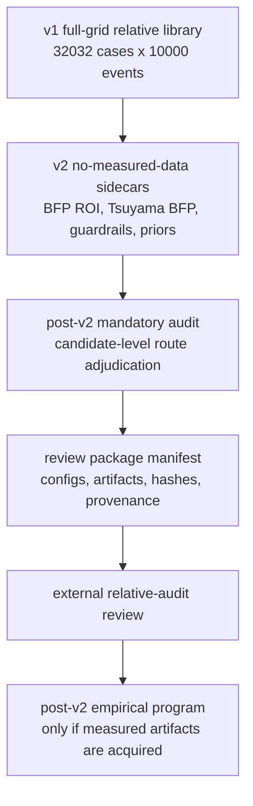

# EV/NODI post-v2 review-ready relative audit roadmap

Date: 2026-05-10

Revision status:

```text
revised_after_claude_external_schema_review
```

Target status:

```text
post_v2_review_ready_relative_audit_complete
```

This status means the repository is ready for an external no-measured-data
relative-audit review. It does not mean calibrated readiness, physical
prediction validation, absolute SNR readiness, absolute LOD readiness, true EV
concentration readiness, biological specificity readiness, measured blank
safety, or detector-voltage prediction.

## 1. Executive decision

The next phase should not add more v1 events and should not reopen v2 as a new
physics campaign. The next phase should turn the existing v2 sidecars into a
mandatory top-candidate audit chain and make the exported review package
reproducible.

The roadmap has two P0 goals:

1. Generate a post-v2 mandatory audit table for every main/control/probe/history
   candidate route, using BFP ROI, Tsuyama BFP, noise/readout robustness,
   selected-annulus consistency, and EV/sample uncertainty as required evidence.
2. Generate a review package manifest and tests so an external reviewer can
   verify that configs, closure artifacts, audit artifacts, hashes, paper
   provenance, package contents, and claim blockers are present.

The correct interpretation is:

```text
v1 full-grid = relative engineering library
v2 sidecars = no-measured-data audit/scaffold/guardrail layer
post-v2 mandatory audit = route-level acceptance/downgrade evidence chain
```

The incorrect interpretation is:

```text
v2 sidecars = calibrated detector model
post-v2 audit = calibrated physical validation
top-route audit pass = absolute SNR/LOD/EV claim
```

## 2. Current-state evidence

The current v1 summary library contains:

```text
rows = 32032
```

Across all rows, the key claim-boundary fields remain:

```text
detector_field_units = arbitrary_relative_field_units
field_coordinate_measure = theta_phi_surrogate
bfp_to_angle_jacobian_applied = False
operator_route = pupil_slit_surrogate
detector_unit_chain_status = blocked_missing_mie_to_power_and_detector_gain
output_claim_level_resolved = engineering_ranking
```

That confirms the v1 full-grid main library is still a relative surrogate
library. This is not a bug; it is the boundary that must be preserved.

The current repository tree also contains:

```text
configs/realism_v2/
results/ev_nodi_realism_v2_no_measured_data_closure/
```

The current `calibration/` directory contains 11 files:

```text
calibration/bfp_roi_mask_template.json
calibration/blank_false_positive_template.csv
calibration/blank_false_positive_template_manifest.json
calibration/calibration_manifest_template.json
calibration/collection_operator_template.csv
calibration/collection_operator_template_manifest.json
calibration/raw_blank_trace_manifest_template.json
calibration/reference_blank_channel_template.csv
calibration/reference_blank_channel_template_manifest.json
calibration/standard_particle_template.csv
calibration/standard_particle_template_manifest.json
```

Therefore, the older "calibration CSV templates are missing" criticism is
outdated for the current worktree, but the review package must include all 11
calibration scaffold files, not just the 4 CSV templates.

The current `papers/` directory contains PDFs/docx and `papers/README.md`, but
it does not yet contain:

```text
papers/provenance/
```

The current exported review zips do not yet contain the full current review
state:

```text
exports/nodi_simulator_review_clean_20260508_175246.zip:
  configs/realism_v2/ missing
  v2 closure artifacts missing
  calibration scaffold incomplete
  papers/ missing

exports/nodi_simulator_review_complete_20260510_014355.zip:
  configs/realism_v2/ missing
  v2 closure artifacts missing
  calibration CSV templates present
  papers/ missing
```

This means the main present weakness is:

```text
the scaffold and closure artifacts are not yet packaged, tested, and promoted
into a mandatory top-candidate audit evidence chain
```

## 3. Boundary logic

The central risk is semantic drift. The project has become more mature than the
old "rough proxy simulator" description, but the main result library is still
not calibrated. The correct language must hold both facts at once:

```text
v2 is materially valuable and physically useful as a no-measured-data sidecar.
v2 does not close detector calibration, blank, false-positive, standard-particle,
BFP measurement, or biological specificity loops.
```

That is why the next work should not be another broad physics expansion. The
physics/modeling value already exists in sidecars; the missing engineering
value is mandatory adjudication:

```text
Does the same candidate remain acceptable when scalar v1, BFP ROI, Tsuyama BFP,
noise/readout scenarios, selected-annulus consistency, and EV/sample uncertainty
are all considered together?
```

If yes, the route may remain a relative main candidate. If no, it should be
downgraded to conditional, probe-only, control-only, paper-sanity-only,
surrogate-sensitive, or audit-incomplete.

## 4. Corrected review flow



The post-v2 mandatory audit should sit between v2 closure and external review.
It should not start measured acquisition and should not change v1 history.

## 5. P0-0 corrections required before audit implementation

The following corrections must be made to this roadmap and then implemented in
code/tests before any post-v2 audit CSV is treated as review-ready.

| Correction | Required rule |
|---|---|
| Build vs release manifest | `REVIEW_BUILD_MANIFEST.json` may contain `must_be_generated`; `REVIEW_PACKAGE_MANIFEST.json` may not. |
| Candidate universe | BFP/Tsuyama dynamic candidates must be selected from a pre-scored candidate universe, not from the final audit table being generated. |
| Route aggregation | Every route-level aggregate score must declare particle family/filter/weighting/metric/quantile; EV route scores must not silently mix anchors or contaminants. |
| R5 scenario continuity | Reuse the live R5 scenario IDs from `configs/realism_v2/r5_scenario_bundle_manifest.yaml`; add aliases only with an explicit alias map and version bump. |
| v1 source mapping | Every `v1_*` audit field must have a documented source column or derivation rule. |
| v1 Jacobian naming | Rename source `bfp_to_angle_jacobian_applied` to `v1_bfp_to_angle_jacobian_applied` at ingest; no unprefixed copy may survive in post-v2 audit CSVs. |
| Normalization | Define `*_score_norm` as rank-percentile within the same `comparison_stratum`; raw magnitude ratios are diagnostic-only. |
| Noise pass criterion | Define scenario pass by relative score/rank stability versus nominal scenario; fixed absolute `margin_z` floors are forbidden. |
| BFP Jacobian provenance | `audit_bfp_jacobian_applied=true` must be backed by source/formula IDs and a passing unit test. |
| Small strata | Use `all_ranked_routes` as the primary inversion stratum; treat small-stratum ordering changes separately. |
| Tsuyama tolerance | Tighten "within tolerance" thresholds and avoid plain-English `none` labels that imply validation. |
| Tsuyama extrapolation | Split paper-geometry and extrapolated-geometry lanes; extrapolated use must carry a reason code. |
| Paper provenance | Create `papers/provenance/` deterministically; do not describe it as already present. |
| Calibration package | Include and hash all 11 calibration scaffold files. |
| Optional 660 route | Include `660/900x1400` as an optional robustness probe, never as main-660 redefinition. |
| Selected-annulus | Record selected-annulus consistency as a lens; keep primary-gate switch blocked. |
| Unmodeled gaps | Carry EV polydispersity/non-sphericity and coincidence/blended-pulse proxies from report 89. |
| Claim lexicon | Use a generated bilingual forbidden-claim lexicon, not a short hand-written phrase list. |

## 6. P0-A mandatory audit artifacts

Create:

```text
results/post_v2_mandatory_audit/
  candidate_universe_manifest.json
  top_candidate_mandatory_audit.csv
  top_candidate_particle_panel_audit.csv
  top_candidate_pairwise_rank_inversion.csv
  bfp_roi_operator_summary.csv
  tsuyama_bfp_reference_summary.csv
  ev_prior_contaminant_summary.csv
  noise_readout_scenario_bundle.csv
  noise_readout_route_sensitivity.csv
  top_candidate_mandatory_audit_manifest.json
  top_candidate_mandatory_audit_readme.md
```

Canonical post-v2 audit artifact list:

| artifact | required by |
|---|---|
| `candidate_universe_manifest.json` | Section 7 candidate universe |
| `top_candidate_mandatory_audit.csv` | Section 6 route-level audit |
| `top_candidate_particle_panel_audit.csv` | Section 16 particle/EV/sample audit |
| `top_candidate_pairwise_rank_inversion.csv` | Section 12 pairwise rank adjudication |
| `bfp_roi_operator_summary.csv` | Section 10 and Section 23 BFP role |
| `tsuyama_bfp_reference_summary.csv` | Section 13 and Section 23 Tsuyama role |
| `ev_prior_contaminant_summary.csv` | Section 16 and Section 23 EV/contaminant role |
| `noise_readout_scenario_bundle.csv` | Section 14 noise bundle |
| `noise_readout_route_sensitivity.csv` | Section 14 route sensitivity |
| `top_candidate_mandatory_audit_manifest.json` | Schema/provenance for all audit tables |
| `top_candidate_mandatory_audit_readme.md` | Human-readable audit boundary |

This list is authoritative for post-v2 audit artifacts. Later sections may add
schema requirements, but they must reference these filenames rather than
silently introducing extra required files.

The core table is:

```text
top_candidate_mandatory_audit.csv
```

Granularity:

```text
one row = one candidate route aggregate audit result
```

The particle-panel table is:

```text
top_candidate_particle_panel_audit.csv
```

Granularity:

```text
one row = candidate route x EV prior / particle panel / contaminant panel
```

The pairwise table is:

```text
top_candidate_pairwise_rank_inversion.csv
```

Granularity:

```text
one row = candidate A x candidate B comparison within a stratum
```

## 7. P0-A candidate set

The candidate set should be static plus dynamic.

Static mandatory candidates:

| candidate_id | wavelength_nm | width_nm | depth_nm | route_role_initial | candidate_source | ranking_participation |
|---|---:|---:|---:|---|---|---|
| main_660_W800_D1400 | 660 | 800 | 1400 | main_locked | v2_closure | ranked |
| main_660_W800_D1500 | 660 | 800 | 1500 | main_locked | v2_closure | ranked |
| control_660_W700_D1500 | 660 | 700 | 1500 | weak_reference_control | v2_closure | ranked |
| optional_660_W900_D1400 | 660 | 900 | 1400 | optional_robustness_probe | v2_closure | ranked_optional |
| historical_v1_532_W600_D1500 | 532 | 600 | 1500 | historical_v1_main | report_47 | ranked |
| historical_v1_488_W600_D1500 | 488 | 600 | 1500 | historical_v1_main | report_47 | ranked |
| probe_404_W600_D1300 | 404 | 600 | 1300 | shortwave_probe | report_47 | ranked |
| paper_proxy_404_W800_D700 | 404 | 800 | 700 | paper_proxy_sanity | report_47 | ranked |

Tsuyama paper-sanity candidates:

| candidate_id | wavelength_nm | width_nm | depth_nm | route_role_initial | candidate_source | ranking_participation |
|---|---:|---:|---:|---|---|---|
| tsuyama_like_488_W800_D550 | 488 | 800 | 550 | paper_sanity_audit_only | tsuyama_bfp_lane | audit_only_not_ranked |
| tsuyama_like_532_W800_D550 | 532 | 800 | 550 | paper_sanity_audit_only | tsuyama_bfp_lane | audit_only_not_ranked |
| tsuyama_like_660_W800_D550 | 660 | 800 | 550 | paper_sanity_audit_only | tsuyama_bfp_lane | audit_only_not_ranked |

If a Tsuyama-like geometry is not in the v1 full-grid, `v1_scalar_score` may be
null, but the row must include:

```text
ranking_participation = audit_only_not_ranked
missing_v1_reason = geometry_not_in_v1_grid
tsuyama_geometry_relation = paper_geometry or extrapolated_geometry
```

Dynamic inclusion set:

```text
top_10_v1_scalar_by_route_family
top_5_per_wavelength_v1_scalar
all routes with route_role in {main_locked, weak_reference_control, optional_robustness_probe, probe, warning, paper_sanity}
all routes with previous_report_mention = true
```

`previous_report_mention = true` means the `(wavelength_nm, width_nm, depth_nm)`
tuple appears in a numbered report or review roadmap. The dynamic-selection
manifest must include:

```text
previous_report_mention_evidence
```

as a list of report paths.

BFP/Tsuyama dynamic inclusion is allowed only after a pre-scored candidate
universe exists. Create:

```text
results/post_v2_mandatory_audit/candidate_universe_manifest.json
```

Required fields:

```text
candidate_universe_source
candidate_universe_case_rows
candidate_universe_unique_routes
candidate_universe_unique_route_sha256
candidate_universe_route_dedup_key
candidate_universe_particle_scope_for_prescoring
candidate_universe_prescore_aggregation_id
candidate_universe_coverage_by_wavelength
candidate_universe_coverage_by_route_family
candidate_universe_exclusion_reason_summary
candidate_universe_scope_label
candidate_universe_scope_claim_level
candidate_universe_sha256
bfp_roi_scoring_coverage
tsuyama_scoring_coverage
dynamic_selection_stage
pre_scored_universe_required
candidate_universe_required_wavelengths
candidate_universe_min_case_rows
candidate_universe_min_unique_routes
```

Pinned source definition:

```text
candidate_universe_source =
  all static mandatory routes
  plus all routes with previous_report_mention = true
  plus stratified v1 route aggregates across every wavelength/width/depth family
  plus all v1 route aggregates above relative engineering gate percentile floor

relative_engineering_gate_percentile_floor = 0.25
candidate_universe_required_wavelengths = {404, 488, 532, 660}
candidate_universe_route_dedup_key = wavelength_nm,width_nm,depth_nm
candidate_universe_min_case_rows >= 200
candidate_universe_min_unique_routes must be recorded
candidate_universe_particle_scope_for_prescoring must match route aggregation policy
candidate_universe_prescore_aggregation_id must be recorded
```

Route-level de-duplication is mandatory:

```text
BFP/Tsuyama dynamic top-K selection must operate on unique route aggregates,
not raw route x particle case rows.
```

Preferred scope:

```text
candidate_universe_must_cover_all_unique_v1_routes_for_BFP_prescore = true
```

If compute cost forces a narrower pre-score universe:

```text
candidate_universe_scope_label = narrowed_prescore_universe
candidate_universe_scope_claim_level = not_global_bfp_topk
candidate_universe_exclusion_reason_summary must be non-empty
```

Allowed dynamic BFP/Tsuyama selectors after pre-scoring:

```text
top_10_bfp_roi_by_route_family_from_pre_scored_universe
top_5_per_wavelength_bfp_roi_from_pre_scored_universe
top_10_tsuyama_stable_by_route_family_from_pre_scored_universe
```

Implementation order:

```text
1. Build static candidate set.
2. Add v1 dynamic candidates from existing v1 summary.
3. Run lightweight BFP/Tsuyama sidecar scoring over the expanded candidate universe.
4. Select BFP/Tsuyama dynamic candidates from that pre-scored universe.
5. Freeze final audit candidate set.
6. Generate top_candidate_mandatory_audit.csv.
```

Forbidden:

```text
If BFP/Tsuyama scores are computed only for static candidates,
BFP/Tsuyama dynamic top-K selection is forbidden.
```

Acceptance:

```text
mandatory_static_routes_missing_count == 0
candidate_universe_manifest_present == true
dynamic_route_selection_manifest_present == true
optional_660_W900_D1400_present == true
optional_660_W900_D1400_never_redefines_main_660 == true
```

Route aggregate policy:

```text
one row in top_candidate_mandatory_audit.csv = route-level aggregate over a declared particle scope
```

Required aggregate fields:

```text
aggregation_scope
aggregation_particle_family
aggregation_particle_filter_id
aggregation_weighting_id
aggregation_metric_id
aggregation_quantile
anchor_particles_included
contaminants_included_in_route_score
```

Default route-score rule:

```text
route-level main score = EV_prior p10 under declared EV prior
aggregation_quantile = p10
anchor particles = calibration/sanity evidence, not route score contributors
contaminants = risk/confusability evidence, not positive route score contributors
```

`p50` may be used only as an explicitly declared alternative diagnostic:

```text
aggregation_quantile = p50
aggregation_metric_id includes diagnostic_median_EV_prior
```

Hard rule:

```text
No route aggregate score may mix EV priors, anchor particles, and contaminants
unless aggregation_weighting_id explicitly documents weights and claim role.
```

Rank-comparison aggregation alignment:

```text
v1_scalar_rank_percentile_in_stratum
bfp_roi_rank_percentile_in_stratum
tsuyama_signal_rank_percentile_in_stratum
```

must use the same:

```text
aggregation_particle_filter_id
aggregation_metric_id
aggregation_quantile
```

unless the row is explicitly marked as a diagnostic cross-scope comparison.

## 8. P0-A v1 source field mapping

Before implementation, add this mapping as machine-readable metadata in:

```text
results/post_v2_mandatory_audit/top_candidate_mandatory_audit_manifest.json
```

Minimum mapping:

| Audit field | Source column | Derivation rule |
|---|---|---|
| `v1_scalar_score` | `score` | Direct copy from v1 summary. |
| `v1_engineering_score` | `engineering_score` | Direct copy from v1 summary. |
| `v1_stable_detection_rate_proxy` | `engineering_basis_stable_detection_rate` | Direct copy; relative/proxy only. |
| `v1_mean_peak_margin_z_proxy` | `engineering_basis_mean_peak_margin_z` | Direct copy; must not be called calibrated SNR. |
| `v1_mean_peak_height_proxy` | `mean_peak_height` | Direct copy; arbitrary relative units only. |
| `v1_output_claim_level` | `output_claim_level_resolved` | Direct copy; expected `engineering_ranking`. |
| `v1_field_coordinate_measure` | `field_coordinate_measure` | Direct copy; expected `theta_phi_surrogate`. |
| `v1_operator_route` | `operator_route` | Direct copy; expected `pupil_slit_surrogate`. |
| `v1_detector_field_units` | `detector_field_units` | Direct copy; expected `arbitrary_relative_field_units`. |
| `v1_bfp_to_angle_jacobian_applied` | `bfp_to_angle_jacobian_applied` | Rename on ingest; expected `false`; unprefixed original forbidden in audit output. |
| `v1_reference_operating_point_status` | `reference_operating_point_status` | Direct copy; relative reference status only. |
| `v1_reference_route_consensus_status` | `reference_route_consensus_status` | Direct copy. |
| `v1_reference_solver_status` | `reference_solver_status` | Direct copy; expected engineering surrogate language. |
| `v1_reference_design_validity` | `reference_design_validity` | Direct copy. |

Do not add `v1_reference_too_weak_flag` or `v1_reference_status` unless a
source column or derivation rule is defined. Null-by-default governance fields
are forbidden.

Acceptance:

```text
every v1_* audit field has source_column or derivation_rule
unprefixed bfp_to_angle_jacobian_applied absent from post-v2 audit CSVs
v1_bfp_to_angle_jacobian_applied == false for all v1-derived rows
```

## 9. P0-A core schema

Required identity and provenance fields:

```text
audit_schema_version
audit_run_id
audit_generated_at
source_v1_library_id
source_v1_library_path
source_v1_library_sha256
source_v2_closure_id
candidate_id
candidate_source
route_role_initial
route_role_final
wavelength_nm
width_nm
depth_nm
comparison_stratum
ranking_participation
particle_panel_summary_id
missing_v1_reason
aggregation_scope
aggregation_particle_family
aggregation_particle_filter_id
aggregation_weighting_id
aggregation_metric_id
aggregation_quantile
anchor_particles_included
contaminants_included_in_route_score
```

Allowed `ranking_participation` values:

```text
ranked
ranked_optional
audit_only_not_ranked
```

Allowed `route_role_initial` values:

```text
main_locked
weak_reference_control
optional_robustness_probe
historical_v1_main
shortwave_probe
paper_proxy_sanity
paper_sanity_audit_only
context_route
warning_route
```

Allowed `route_role_final` values:

```text
relative_main_candidate
relative_control_candidate
optional_robustness_probe_only
probe_only
paper_sanity_only
surrogate_sensitive_not_promoted
audit_incomplete_blocked
```

Decision/role consistency:

| final_audit_decision | required route_role_final |
|---|---|
| `clean_relative_main` | `relative_main_candidate` |
| `conditional_relative_main` | `relative_main_candidate` |
| `weak_reference_control_only` | `relative_control_candidate` |
| `optional_robustness_probe_only` | `optional_robustness_probe_only` |
| `shortwave_probe_only` | `probe_only` |
| `paper_sanity_only` | `paper_sanity_only` |
| `surrogate_sensitive_not_promoted` | `surrogate_sensitive_not_promoted` |
| `audit_incomplete_blocked` | `audit_incomplete_blocked` |

Required v1 scalar fields:

```text
v1_scalar_score
v1_engineering_score
v1_scalar_rank_in_stratum
v1_scalar_rank_percentile_in_stratum
v1_stable_detection_rate_proxy
v1_mean_peak_margin_z_proxy
v1_mean_peak_height_proxy
v1_reference_operating_point_status
v1_reference_route_consensus_status
v1_reference_solver_status
v1_reference_design_validity
v1_output_claim_level
v1_field_coordinate_measure
v1_operator_route
v1_detector_field_units
v1_bfp_to_angle_jacobian_applied
```

Acceptance for v1 fields:

```text
v1_output_claim_level == engineering_ranking
v1_field_coordinate_measure == theta_phi_surrogate
v1_operator_route == pupil_slit_surrogate
v1_detector_field_units == arbitrary_relative_field_units
v1_bfp_to_angle_jacobian_applied == false
```

These acceptance rules intentionally preserve the v1 boundary. They are not
failures.

Rows with:

```text
ranking_participation == audit_only_not_ranked
```

may have null v1 score fields only if:

```text
missing_v1_reason is non-null
```

## 10. P0-A BFP ROI/Jacobian schema

Required BFP ROI audit fields:

```text
bfp_roi_score
bfp_roi_total_deltaI_proxy
bfp_roi_cross_term_proxy
bfp_roi_self_term_proxy
bfp_roi_cross_term_fraction
bfp_roi_self_term_fraction
bfp_roi_interference_dominant_flag
bfp_roi_cross_term_sign
bfp_roi_scalar_sign
bfp_roi_sign_agreement_with_scalar
bfp_roi_negative_cross_term_flag
bfp_roi_cross_term_claim_level
bfp_roi_rank_in_stratum
bfp_roi_rank_percentile_in_stratum
bfp_roi_operator_id
bfp_roi_mask_id
audit_bfp_jacobian_applied
audit_bfp_coordinate_frame
audit_bfp_jacobian_source_id
audit_bfp_jacobian_formula_id
audit_bfp_jacobian_unit_test_status
roi_vs_scalar_percentile_delta
rank_delta_bfp_minus_scalar
percentile_delta_bfp_minus_scalar
rank_inversion_flag
rank_inversion_severity
rank_inversion_reason_codes
```

Acceptance for ranked candidates:

```text
bfp_roi_score not null
bfp_roi_total_deltaI_proxy not null
bfp_roi_cross_term_proxy not null
bfp_roi_self_term_proxy not null
bfp_roi_cross_term_claim_level == signed_relative_interference_audit_only
bfp_roi_score is derived from bfp_roi_total_deltaI_proxy or documented rank metric
bfp_roi_cross_term_proxy preserves signed Re(E_ref * conj(E_sca))
magnitude-only BFP ROI score cannot support clean_relative_main
audit_bfp_jacobian_applied == true
audit_bfp_coordinate_frame in {uv_direction_cosine, bfp_uv}
audit_bfp_jacobian_source_id not null
audit_bfp_jacobian_formula_id not null
audit_bfp_jacobian_unit_test_status == pass
bfp_roi_operator_id not null
bfp_roi_mask_id not null
```

Optional diagnostic-only field:

```text
roi_vs_scalar_percentile_ratio_diagnostic
roi_vs_scalar_percentile_ratio_claim_level = diagnostic_only_not_gate
```

`audit_bfp_jacobian_applied=true` is a no-measured-data audit statement. It is
not a measured/calibrated BFP-coordinate claim.

Required Jacobian test:

```text
tests/test_bfp_jacobian_closed_form.py
tests/test_bfp_roi_signed_cross_term_preserved.py
tests/test_bfp_roi_self_cross_decomposition_schema.py
tests/test_bfp_roi_magnitude_only_rejected_for_clean_main.py
```

Minimum test:

```text
direction-cosine Jacobian is finite inside NA support
paraxial limit approaches constant weighting
edge behavior near u^2 + v^2 -> 1 is handled without silent overflow
```

## 11. P0-A normalization policy

Do not compare raw v1 scalar and BFP ROI magnitudes directly.

Define:

```text
rank_direction = higher_score_better
rank_method = average_tie_rank
rank_percentile_definition = 1.0_best_0.0_worst
top_k_definition = min(10, ceil(0.20 * N_all_ranked_routes))

v1_scalar_rank_percentile_in_stratum =
  percentile rank of v1_scalar_score within comparison_stratum

bfp_roi_rank_percentile_in_stratum =
  percentile rank of bfp_roi_score within comparison_stratum

roi_vs_scalar_percentile_delta =
  bfp_roi_rank_percentile_in_stratum - v1_scalar_rank_percentile_in_stratum

eps = 1e-12
```

Percentile ratios and raw score ratios may be included only as diagnostic
fields:

```text
roi_vs_scalar_percentile_ratio_diagnostic
roi_vs_scalar_percentile_ratio_claim_level = diagnostic_only_not_gate
raw_roi_vs_scalar_score_ratio_diagnostic
raw_roi_vs_scalar_score_ratio_claim_level = diagnostic_only_not_gate
```

Acceptance:

```text
all route-decision gates use ranks or rank-percentiles
no final decision uses raw arbitrary-unit score ratios
no final decision uses percentile ratios
rank_direction, rank_method, rank_percentile_definition, and top_k_definition are recorded
```

## 12. P0-A rank inversion policy

Primary inversion stratum:

```text
all_ranked_routes
```

Secondary explanatory strata:

```text
main_candidate_stratum
historical_v1_stratum
shortwave_probe_stratum
weak_reference_control_stratum
optional_robustness_probe_stratum
paper_sanity_stratum
```

Pairwise cross-stratum comparisons are required for:

```text
all main_locked vs weak_reference_control
all main_locked vs optional_robustness_probe
historical_v1_main vs current main_locked
shortwave_probe vs current main_locked
```

Because `top_candidate_pairwise_rank_inversion.csv` is a P0 artifact, its base
schema is also P0:

```text
candidate_a
candidate_b
comparison_stratum
scalar_order
bfp_order
tsuyama_order
noise_robustness_order
ev_uncertainty_order
selected_annulus_order
pairwise_inversion_flag
pairwise_inversion_reason
```

Pairwise rows must cover all required cross-stratum comparisons before the P0b
audit milestone can pass. P1 may add extra pairwise views, but the base schema
and required comparisons live here.

Set `rank_inversion_flag = true` if any condition holds in the primary stratum:

```text
candidate is scalar_top_K but not bfp_top_K, where K = top_k_definition
abs(rank_delta_bfp_minus_scalar) >= ceil(0.25 * N_all_ranked_routes)
abs(percentile_delta_bfp_minus_scalar) >= 0.25
main_locked falls below any weak_reference_control route
weak_reference_control rises above all main_locked routes
```

Optional probe handling:

```text
optional_probe_outperforms_main_flag = optional_robustness_probe rises above all main_locked routes
optional_probe_redefinition_attempted = any report or final label treats optional probe as main-660
```

`optional_probe_outperforms_main_flag` is not by itself critical. It may
downgrade main routes to conditional or reason-coded status, but the optional
route remains `optional_robustness_probe_only`. `optional_probe_redefinition_attempted`
is a critical governance failure.

For strata with `N_stratum <= 4`, do not use `max(3, ...)`. Instead record:

```text
small_stratum_order_change_flag
small_stratum_order_change_reason_codes
```

Small-stratum order changes are warning evidence. They contribute to `minor`
severity unless they are already captured by a cross-stratum main/control/probe
rule, in which case the cross-stratum severity wins.

Severity must be implemented from explicit pseudocode, not free-form Boolean
phrases:

Predicate definitions:

```text
audit_incomplete =
  audit_bfp_jacobian_applied != true
  or audit_bfp_jacobian_unit_test_status != pass
  or tsuyama_phase_filter_unit_test_status != pass
  or bfp_roi_score is null for ranked candidate
  or tsuyama_tolerance_profile_id is null for ranked candidate
  or required noise_pass_criterion_id is null
  or required ev_pass_criterion_id is null
  or coincidence_event_overlap_proxy_definition is null

main_control_reversal =
  any weak_reference_control candidate has bfp_roi_rank_in_stratum better than
  the worst main_locked candidate

historical_probe_reversal =
  any historical_v1_main candidate has bfp_roi_rank_in_stratum better than the
  worst main_locked candidate
  or any shortwave_probe candidate has bfp_roi_rank_in_stratum better than the
  worst main_locked candidate

missing_bfp_score =
  bfp_roi_score is null and ranking_participation in {ranked, ranked_optional}
```

```python
if audit_incomplete:
    severity = "audit_incomplete"
elif main_control_reversal or optional_probe_redefinition_attempted or missing_bfp_score:
    severity = "critical"
elif (
    abs(percentile_delta_bfp_minus_scalar) >= 0.25
    or historical_probe_reversal
    or optional_probe_outperforms_main_flag
):
    severity = "major"
elif rank_inversion_flag or small_stratum_order_change_flag:
    severity = "minor"
else:
    severity = "none"
```

If:

```text
audit_bfp_jacobian_applied != true
```

then the route is:

```text
audit_incomplete_blocked
```

This is not a rank inversion; it is an audit completeness failure.

Route decision impact:

```text
clean_relative_main cannot have critical inversion or audit incompleteness.
major inversion must downgrade to conditional_relative_main or surrogate_sensitive_not_promoted.
severity == audit_incomplete -> final_audit_decision = audit_incomplete_blocked
severity == critical and missing_bfp_score -> final_audit_decision = audit_incomplete_blocked
severity == critical and optional_probe_redefinition_attempted -> final_audit_decision = audit_incomplete_blocked
severity == critical and main_control_reversal -> final_audit_decision = surrogate_sensitive_not_promoted
```

## 13. P0-A Tsuyama BFP policy

Required Tsuyama BFP fields:

```text
tsuyama_bfp_lane_available_paper_geometry
tsuyama_bfp_lane_available_extrapolated_geometry
tsuyama_bfp_operator_id
tsuyama_geometry_relation
tsuyama_phase_filter_model_id
tsuyama_phase_filter_source_id
tsuyama_phase_filter_formula_id
tsuyama_phase_filter_unit_test_status
G0_definition_id
U_channel_pupil_definition_id
Delta_phi_ch_derivation_id
tsuyama_signed_phase_filter_preserved
tsuyama_complex_reference_preserved
tsuyama_integrated_ref_amp_proxy
channel_surrogate_ref_amp_proxy
tsuyama_ref_amp_log2_ratio
tsuyama_integrated_ref_phase_rad
channel_surrogate_ref_phase_rad
tsuyama_ref_phase_disagreement_rad
tsuyama_integrated_signal_proxy
channel_surrogate_signal_proxy
tsuyama_signal_log2_ratio
tsuyama_tolerance_profile_id
tsuyama_tolerance_profile_role
tsuyama_disagreement_label
tsuyama_downgrade_action
tsuyama_claim_level
```

Allowed Tsuyama claim level:

```text
paper_aligned_or_extrapolated_no_measured_data_audit
```

Forbidden Tsuyama claim levels:

```text
calibrated_reference
measured_reference
validated_reference
```

Minimum paper-aligned no-measured-data reference model:

```text
E_diff_BFP(u, v) proportional to
  G0(u, v) * (exp(i * Delta_phi_ch) - 1) * U(u, v; W, H)
```

The audit must preserve the signed complex phase-filter term:

```text
exp(i * Delta_phi_ch) - 1
```

It must not collapse the Tsuyama lane to only:

```text
theta_base = arcsin(lambda / W)
```

or to an unsigned lobe-center/amplitude heuristic. This remains a
no-measured-data audit lane, not measured blank-channel calibration, but the
minimum model should still retain the signed complex reference phase.

The phase-filter true/false fields are not self-certifying. Ranked candidates
must resolve the model to documented source and formula IDs:

```text
tsuyama_phase_filter_source_id
tsuyama_phase_filter_formula_id
G0_definition_id
U_channel_pupil_definition_id
Delta_phi_ch_derivation_id
```

and must carry:

```text
tsuyama_phase_filter_unit_test_status == pass
```

Minimum phase-filter unit tests:

```text
exp(i * Delta_phi_ch) - 1 remains signed and complex
small Delta_phi_ch -> exp(i * Delta_phi_ch) - 1 approximately i * Delta_phi_ch
Delta_phi_ch = pi -> exp(i * pi) - 1 = -2
magnitude-only collapse is rejected
theta_base-only collapse is rejected
```

Define:

```text
tsuyama_ref_amp_log2_ratio =
  log2(tsuyama_integrated_ref_amp_proxy / max(channel_surrogate_ref_amp_proxy, eps))

tsuyama_ref_phase_disagreement_rad =
  wrapped_abs_phase_difference(tsuyama_integrated_ref_phase_rad, channel_surrogate_ref_phase_rad)

tsuyama_signal_log2_ratio =
  log2(tsuyama_integrated_signal_proxy / max(channel_surrogate_signal_proxy, eps))
```

Tolerance profiles are review-gate policies, not measured physical error
estimates:

```text
paper_geometry_strict_v1:
  tsuyama_tolerance_profile_role = paper_geometry_review_gate
  amp_log2_abs_max = 0.3
  phase_abs_max_rad = pi/12
  signal_log2_abs_max = 0.3

extrapolated_geometry_guardrail_v1:
  tsuyama_tolerance_profile_role = extrapolated_geometry_guardrail
  amp_log2_abs_max = 0.5
  phase_abs_max_rad = pi/8
  signal_log2_abs_max = 0.5
  clean_relative_main_allowed = false

lane_unavailable_v1:
  tsuyama_tolerance_profile_role = lane_unavailable_no_disagreement_evaluable
  clean_relative_main_allowed = false
  disagreement_label = severe_disagreement_no_measured_data
```

Labels:

```text
within_audit_tolerance_no_measured_data:
  abs(tsuyama_ref_amp_log2_ratio) <= profile.amp_log2_abs_max
  and tsuyama_ref_phase_disagreement_rad <= profile.phase_abs_max_rad
  and abs(tsuyama_signal_log2_ratio) <= profile.signal_log2_abs_max

moderate_disagreement_no_measured_data:
  abs(log2 ratio) in (profile threshold, 1.0]
  or phase disagreement in (profile threshold, pi/4]

severe_disagreement_no_measured_data:
  abs(log2 ratio) > 1.0
  or phase disagreement > pi/4
  or sign/polarity disagreement detected
  or Tsuyama lane unavailable for ranked candidate
```

Downgrade rules:

```text
within_audit_tolerance_no_measured_data -> no Tsuyama downgrade
moderate_disagreement_no_measured_data -> clean_relative_main forbidden
severe_disagreement_no_measured_data -> probe_only, paper_sanity_only, or audit_incomplete_blocked
```

If:

```text
tsuyama_bfp_lane_available_extrapolated_geometry == true
```

then:

```text
final_audit_decision_reason_codes includes TSUYAMA_LANE_EXTRAPOLATED_GEOMETRY
```

This flag may support `conditional_relative_main` only. It cannot support
`clean_relative_main`, even when the disagreement label is
`within_audit_tolerance_no_measured_data`.

If no Tsuyama lane is available for a ranked candidate, use:

```text
tsuyama_tolerance_profile_id = lane_unavailable_v1
```

and the route cannot be `clean_relative_main`.

Important wording:

```text
Tsuyama BFP lane available
```

means paper-aligned or extrapolated no-measured-data audit only. It does not mean
measured blank-channel calibration.

## 14. P0-A noise/readout robustness policy

Use the live R5 scenario IDs unless a versioned alias map is created.

Required base scenarios:

| scenario_id | scenario_role | applicable_route_filter |
|---|---|---|
| nominal_instrument_clean_blank | nominal | all routes |
| detector_50ohm_pessimistic | detector_pessimistic | all routes |
| external_TIA_optimistic | external_TIA_optimistic | all routes |
| blank_bursty_RIN_high | blank_pessimistic | all routes |
| BFP_slit_offset_leakage | BFP_offset | all routes |
| PEG_pessimistic_wall_loss | wall_loss | all routes |
| 404_thermal_high_low_power | thermal_404_gate | `wavelength_nm == 404` |
| DAQ_low_resolution_sampling | DAQ_pessimistic | all routes |

Create:

```text
results/post_v2_mandatory_audit/noise_readout_scenario_bundle.csv
results/post_v2_mandatory_audit/noise_readout_route_sensitivity.csv
```

Required continuity fields:

```text
noise_scenario_bundle_id
extends_scenario_bundle_id = R5_scenario_bundle_manifest_v1
source_scenario_manifest_path = configs/realism_v2/r5_scenario_bundle_manifest.yaml
scenario_id_alias_map_present
scenario_id_alias_map_path
```

If no aliases are used:

```text
scenario_id_alias_map_present == false
```

If aliases are used:

```text
every old scenario_id maps to exactly one new scenario_id
no live R5 scenario is dropped without a reason code
```

Required route sensitivity fields:

```text
candidate_id
noise_scenario_bundle_id
noise_pass_criterion_id
noise_pass_criterion_thresholds_id
noise_pass_criterion_score_percentile_delta_max
noise_pass_criterion_rank_delta_max
noise_scenario_count
noise_scenario_count_applicable
noise_scenario_count_applicable_minimum
noise_scenario_pass_count
noise_pass_fraction
noise_worst_case_rank_in_stratum
noise_rank_std_across_scenarios
noise_score_percentile_stability_min
noise_rank_stability_max_delta
noise_robustness_label
noise_claim_level
snr_claim_allowed
absolute_false_positive_claim_allowed
```

`noise_pass_fraction` is computed over applicable scenarios only:

```text
noise_pass_fraction =
  noise_scenario_pass_count / noise_scenario_count_applicable
```

Minimum applicable scenario count:

```text
noise_scenario_count_applicable_minimum = 5
```

If a route has fewer applicable scenarios:

```text
noise_robustness_label = insufficient_scenarios_for_robustness_label
clean_relative_main forbidden
```

Allowed pass criterion:

```text
noise_pass_criterion_id = relative_score_and_rank_stability_only_v1
noise_pass_criterion_thresholds_id = relative_score_rank_thresholds_v1
noise_pass_criterion_score_percentile_delta_max = 0.25
noise_pass_criterion_rank_delta_max = max(2, ceil(0.10 * N_stratum))
```

Per-scenario pass definition:

```text
scenario passes if:
  route rank-percentile remains within noise_pass_criterion_score_percentile_delta_max of nominal
  and route rank remains within noise_pass_criterion_rank_delta_max
  and no required claim blocker flips to false/unknown
```

No field named `relative_score_delta` may be used if it stores a rank-percentile
delta.

Forbidden pass criteria:

```text
fixed absolute margin_z floor
fixed absolute SNR threshold
fixed absolute false-positive threshold
measured blank threshold
detector voltage threshold
```

Robustness labels:

```text
relative_score_rank_stable_no_measured_data:
  noise_pass_fraction >= 0.8
  and noise_worst_case_rank_in_stratum <= ceil(0.5 * N_stratum)

conditional_relative_score_rank_stability_no_measured_data:
  0.5 <= noise_pass_fraction < 0.8

fragile_relative_score_rank_stability_no_measured_data:
  noise_pass_fraction < 0.5
  or route collapses in any required non-Gaussian scenario

insufficient_scenarios_for_robustness_label:
  noise_scenario_count_applicable < noise_scenario_count_applicable_minimum
```

Hard rule:

```text
noise audit cannot unlock SNR, false-positive, LOD, or measured blank claims
noise_claim_level == robustness_only_relative_scenario_audit
snr_claim_allowed == false
absolute_false_positive_claim_allowed == false
```

## 15. P0-A selected-annulus policy

Selected-annulus remains a parallel diagnostic lens. It cannot replace
all-crossing ranking.

Required fields:

```text
selected_annulus_lens_available
selected_annulus_rank_percentile_in_stratum
all_crossing_rank_percentile_in_stratum
selected_annulus_percentile_delta
selected_annulus_rank_delta
selected_annulus_detection_rate_delta_proxy
selected_annulus_consistency_criterion_id
selected_annulus_main_control_reversal
selected_annulus_lens_consistent_with_all_crossing
selected_annulus_lens_disagreement_codes
selected_annulus_primary_allowed
selected_annulus_claim_level
```

Consistency criterion:

```text
selected_annulus_consistency_criterion_id = selected_annulus_parallel_lens_rank_consistency_v1
selected_annulus_main_control_reversal =
  any weak_reference_control candidate has selected_annulus_rank_percentile_in_stratum
  better than the worst main_locked candidate
selected_annulus_lens_consistent_with_all_crossing == true if:
  abs(selected_annulus_percentile_delta) <= 0.15
  and selected_annulus_main_control_reversal == false
```

The 0.15 percentile-delta threshold is intentionally tighter than the 0.25 BFP
rank-inversion threshold because selected-annulus is a parallel diagnostic lens
of the same data, not an independent score path.

Hard rules:

```text
selected_annulus_primary_allowed == false
selected_annulus_claim_level == diagnostic_lens_only_not_primary_gate
```

If selected-annulus disagrees with all-crossing:

```text
final_audit_decision_reason_codes includes SELECTED_ANNULUS_DISAGREES_WITH_ALL_CROSSING
```

The route may remain conditional, but cannot be `clean_relative_main` without a
clear reason code and no other major disagreement.

## 16. P0-A EV/sample uncertainty policy

MISEV2023 and Malvicini 2024 make the biological claim boundary stricter, not
looser. A no-measured-data optical event cannot become an exosome-specific,
MSC-EV-specific, or potency claim.

Required `top_candidate_particle_panel_audit.csv` fields:

```text
candidate_id
particle_panel_id
panel_role
ev_prior_id
ev_prior_member_count
ev_pass_criterion_id
ev_pass_criterion_score_percentile_delta_max
ev_pass_criterion_rank_percentile_delta_max
relative_engineering_gate_percentile_floor
ev_member_pass_gate_basis
ev_pass_fraction
ev_score_p10_norm
ev_score_p50_norm
ev_score_p90_norm
ev_margin_z_p10_proxy
ev_margin_z_p50_proxy
ev_margin_z_p90_proxy
ri_prior_id
shell_thickness_prior_id
corona_prior_id
shape_prior_id
ev_polydispersity_panel_id
ev_polydispersity_pass_criterion_id
ev_polydispersity_pass_fraction
sample_prep_profile_id
contaminant_panel_id
contaminant_member_count
contaminant_pass_fraction
contaminant_confusability_score
engineering_gate_reference_id
engineering_gate_claim_level
sample_uncertainty_risk_label
sample_uncertainty_reason_codes
biological_specificity_claim_allowed
```

Allowed panel roles:

```text
EV_prior
anchor_particle
contaminant
sample_prep_variant
polydispersity_variant
```

EV pass criteria must be relative and recorded.

Allowed criterion:

```text
ev_pass_criterion_id = relative_score_and_rank_stability_only_v1
ev_polydispersity_pass_criterion_id = relative_score_and_rank_stability_only_v1
```

Default thresholds:

```text
ev_pass_criterion_score_percentile_delta_max = 0.25
ev_pass_criterion_rank_percentile_delta_max = 0.15
relative_engineering_gate_percentile_floor = 0.50
ev_member_pass_gate_basis = relative_engineering_gate_percentile_floor
```

Per EV-prior member pass definition:

```text
member passes if:
  normalized score remains within configured percentile delta of panel median
  and rank-percentile remains within configured delta in comparison_stratum
  and normalized score remains above relative_engineering_gate_percentile_floor
  and no required claim blocker flips to false/unknown
```

EV prior panels cannot pass solely because all members are stably bad.

The same definition applies to `ev_polydispersity_pass_fraction`.

Contaminant pass fraction definition:

```text
contaminant_pass_fraction =
  fraction of contaminant panel members that pass the same positive engineering gate
```

Higher `contaminant_pass_fraction` is risk evidence, not positive route
evidence.

Forbidden EV pass criteria:

```text
fixed absolute ev_score threshold
fixed calibrated SNR threshold
fixed detector-voltage threshold
fixed biological identity threshold
stable-but-bad panel pass
```

Risk policy:

```text
low:
  ev_pass_fraction >= 0.7
  and ev_score_p10_norm above relative engineering gate percentile
  and contaminant_confusability_score < 0.2
  and contaminant_pass_fraction < 0.2
  and ev_polydispersity_pass_fraction >= 0.7
  and sample_prep_profile_id != unknown
  and engineering_gate_claim_level == relative_with_priors

medium:
  ev_pass_fraction in [0.4, 0.7)
  or contaminant_confusability_score in [0.2, 0.5)
  or contaminant_pass_fraction in [0.2, 0.5)
  or ev_polydispersity_pass_fraction in [0.4, 0.7)
  or sample_prep_profile_id == unknown

high:
  ev_pass_fraction < 0.4
  or ev_score_p10_norm below relative engineering gate percentile
  or contaminant_confusability_score >= 0.5
  or contaminant_pass_fraction >= 0.5
  or ev_polydispersity_pass_fraction < 0.4
  or route depends on a single EV RI/shell/corona preset
```

Hard rules:

```text
engineering_gate_claim_level == relative_with_priors
ev_pass_criterion_id == relative_score_and_rank_stability_only_v1
ev_polydispersity_pass_criterion_id == relative_score_and_rank_stability_only_v1
relative_engineering_gate_percentile_floor is recorded
route gates use ev_score_*_norm rank-percentile fields, not raw EV score magnitudes
sample_prep_profile_id == unknown -> sample_uncertainty_risk_label cannot be low
sample_prep_profile_id == unknown -> clean_relative_main forbidden
biological_specificity_claim_allowed == false
```

## 17. P0-A coincidence/blended-pulse proxy

Report 89 identifies coincidence and blended pulses as post-v2 realism gaps.
They do not become count or concentration predictions inside this audit, but
they should be represented as a relative fragility proxy.

Required fields:

```text
coincidence_blended_pulse_proxy_available
coincidence_blended_pulse_proxy_claim_level
coincidence_event_overlap_proxy_definition
coincidence_event_overlap_proxy
coincidence_event_overlap_proxy_percentile_in_stratum
coincidence_proxy_distribution_iqr
coincidence_proxy_distribution_iqr_advisory_flag
coincidence_route_fragility_label
```

Allowed claim level:

```text
relative_arbitrary_units_no_count_interpretation
relative_concentration_blending_proxy_no_observed_event_interpretation
```

Proxy definition:

```text
coincidence_event_overlap_proxy =
  relative occupancy ratio in arbitrary units,
  derived from candidate relative event-window length and nominal-flow
  occupancy proxy from the scenario bundle.
```

This is not:

```text
events per second
Poisson rate
calibrated occupancy probability
absolute coincidence probability
measured coincidence rate
```

Fragility label:

```text
none:
  coincidence_event_overlap_proxy_percentile_in_stratum < 0.50

low:
  0.50 <= coincidence_event_overlap_proxy_percentile_in_stratum < 0.80

fragile:
  coincidence_event_overlap_proxy_percentile_in_stratum >= 0.80
```

Distribution-shape advisory:

```text
coincidence_proxy_distribution_iqr_advisory_flag =
  true when the stratum IQR is below configured threshold and percentile labels
  may overstate practical differences
```

Forbidden interpretations:

```text
true count rate
true concentration
absolute occupancy
occupancy probability
Poisson rate
coincidence cross-section
blended-event statistics
measured coincidence rate
```

## 18. P0-A final route decision policy

Allowed decisions:

```text
clean_relative_main
conditional_relative_main
surrogate_sensitive_not_promoted
weak_reference_control_only
optional_robustness_probe_only
shortwave_probe_only
paper_sanity_only
audit_incomplete_blocked
```

Required final fields:

```text
final_audit_decision
final_audit_decision_reason_codes
relative_main_governance_allowed
route_promotion_claim_allowed
selected_annulus_primary_allowed
calibrated_claim_allowed
nominal_relative_eligibility_gate_id
nominal_relative_eligibility_gate_passed
nominal_v1_scalar_rank_percentile_floor
nominal_bfp_roi_rank_percentile_floor
nominal_ev_score_p10_rank_percentile_floor
v1_scalar_floor_advisory_only
required_next_artifact
```

Hard rules:

```text
calibrated_claim_allowed == false
route_promotion_claim_allowed == false
selected_annulus_primary_allowed == false
```

`final_audit_decision` is a relative-evidence governance label. It is not a
calibrated route claim in either direction.

Severity-to-decision mapping:

```text
rank_inversion_severity == audit_incomplete -> audit_incomplete_blocked
rank_inversion_severity == critical and missing_bfp_score -> audit_incomplete_blocked
rank_inversion_severity == critical and optional_probe_redefinition_attempted -> audit_incomplete_blocked
rank_inversion_severity == critical and main_control_reversal -> surrogate_sensitive_not_promoted
rank_inversion_severity == major -> conditional_relative_main or surrogate_sensitive_not_promoted
rank_inversion_severity in {none, minor} -> clean_relative_main only if all other clean gates pass
```

Nominal relative eligibility gate:

```text
nominal_relative_eligibility_gate_id = route_nominal_relative_eligibility_v1
nominal_bfp_roi_rank_percentile_floor = 0.50
nominal_ev_score_p10_rank_percentile_floor = relative_engineering_gate_percentile_floor
nominal_v1_scalar_rank_percentile_floor = 0.50
v1_scalar_floor_advisory_only = true
nominal_relative_eligibility_gate_passed =
  bfp_roi_rank_percentile_in_stratum >= nominal_bfp_roi_rank_percentile_floor
  and ev_score_p10_norm >= nominal_ev_score_p10_rank_percentile_floor
```

The v1 scalar floor is recorded as advisory because v1 is the historical
theta/phi surrogate. It should not block a BFP/Tsuyama-discovered route by
itself, but failing it must be reason-coded.

`clean_relative_main` requires:

```text
nominal_relative_eligibility_gate_passed == true
rank_inversion_severity in {none, minor}
tsuyama_disagreement_label == within_audit_tolerance_no_measured_data
noise_robustness_label == relative_score_rank_stable_no_measured_data
sample_uncertainty_risk_label in {low, medium}
sample_prep_profile_id != unknown
ev_polydispersity_pass_fraction >= 0.7
selected_annulus_lens_consistent_with_all_crossing == true
coincidence_route_fragility_label in {none, low}
audit_bfp_jacobian_applied == true
audit_bfp_jacobian_unit_test_status == pass
tsuyama_phase_filter_unit_test_status == pass
tsuyama_bfp_lane_available_paper_geometry == true
```

If the Tsuyama lane is extrapolated geometry, `clean_relative_main` is forbidden.
Extrapolated geometry can support `conditional_relative_main` only with:

```text
TSUYAMA_LANE_EXTRAPOLATED_GEOMETRY
```

in `final_audit_decision_reason_codes`.

If `sample_uncertainty_risk_label == medium`, `clean_relative_main` additionally
requires:

```text
sample_prep_profile_id != unknown
final_audit_decision_reason_codes includes EV_SAMPLE_MEDIUM_RISK_RELATIVE
```

`conditional_relative_main` may accept:

```text
rank_inversion_severity == major
or tsuyama_disagreement_label == moderate_disagreement_no_measured_data
or tsuyama_bfp_lane_available_extrapolated_geometry == true
or noise_robustness_label == conditional_relative_score_rank_stability_no_measured_data
or sample_uncertainty_risk_label == medium
or sample_prep_profile_id == unknown
or selected_annulus_lens_consistent_with_all_crossing == false
or coincidence_route_fragility_label == fragile
or ev_polydispersity_pass_fraction < 0.7
```

but must include `final_audit_decision_reason_codes`.

Any severe Tsuyama disagreement, missing BFP score, optional-probe redefinition
attempt, missing required audit lane, Jacobian or Tsuyama phase-filter unit-test
failure, forbidden claim leak, missing EV pass criterion, or undefined
coincidence proxy should produce:

```text
audit_incomplete_blocked
```

When a route hits a Section 12 audit-completeness failure, the final decision
must be:

```text
final_audit_decision == audit_incomplete_blocked
```

## 19. P0-A reason-code vocabulary

Create a closed vocabulary for:

```text
final_audit_decision_reason_codes
rank_inversion_reason_codes
selected_annulus_lens_disagreement_codes
sample_uncertainty_reason_codes
```

Minimum final reason codes:

```text
BFP_RANK_SHIFT_MINOR
BFP_RANK_SHIFT_MAJOR
BFP_RANK_INVERSION_CRITICAL
BFP_JACOBIAN_AUDIT_INCOMPLETE
BFP_JACOBIAN_UNIT_TEST_FAILED
TSUYAMA_WITHIN_AUDIT_TOLERANCE
TSUYAMA_REF_DISAGREEMENT_MODERATE
TSUYAMA_REF_DISAGREEMENT_SEVERE
TSUYAMA_LANE_EXTRAPOLATED_GEOMETRY
TSUYAMA_LANE_UNAVAILABLE_FOR_RANKED
TSUYAMA_PHASE_FILTER_UNIT_TEST_FAILED
NOISE_RELATIVE_ROBUST
NOISE_RELATIVE_CONDITIONAL
NOISE_RELATIVE_FRAGILE
NOISE_INSUFFICIENT_APPLICABLE_SCENARIOS
EV_SAMPLE_LOW_RISK_RELATIVE
EV_SAMPLE_MEDIUM_RISK_RELATIVE
EV_SAMPLE_HIGH_RISK_RELATIVE
EV_SAMPLE_UNKNOWN
EV_POLYDISPERSITY_LOW_RISK_RELATIVE
EV_POLYDISPERSITY_FRAGILE
CONTAMINANT_CONFUSABILITY_HIGH
CONTAMINANT_PASS_FRACTION_HIGH
COINCIDENCE_RELATIVE_STABLE
COINCIDENCE_FRAGILITY_HIGH
SELECTED_ANNULUS_CONSISTENT_WITH_ALL_CROSSING
SELECTED_ANNULUS_DISAGREES_WITH_ALL_CROSSING
SELECTED_ANNULUS_MAIN_CONTROL_REVERSAL
OPTIONAL_660_PROBE_NOT_MAIN
OPTIONAL_660_PROBE_DOES_NOT_REDEFINE_MAIN
OPTIONAL_660_PROBE_WOULD_REDEFINE_MAIN_BLOCKED
SMALL_STRATUM_ORDER_CHANGE_OBSERVED
CALIBRATED_CLAIM_BLOCKED
AUDIT_ARTIFACT_MISSING
```

Acceptance:

```text
all reason code fields use only controlled vocabulary entries
unknown/free-text reason codes fail tests
```

P1 modularization target:

```text
reason codes should migrate to MODULE.CODE form, e.g.
BFP.RANK_SHIFT_MAJOR
TSUYAMA.EXTRAPOLATED_GEOMETRY
NOISE.RELATIVE_FRAGILE
EV.SAMPLE_UNKNOWN
CLAIM.CALIBRATED_BLOCKED
```

## 20. P0-B Build and review package manifests

Create at repository root:

```text
REVIEW_BUILD_MANIFEST.json
REVIEW_PACKAGE_MANIFEST.json
REVIEW_PACKAGE_README.md
REVIEW_PACKAGE_HASHES.sha256
```

Build manifest top-level schema:

```json
{
  "review_build_manifest_schema": "ev_nodi_review_build_manifest_v1",
  "package_id": "ev_nodi_post_v2_review_package_YYYYMMDD",
  "generated_at": "...",
  "git_commit": "...",
  "git_dirty": true,
  "package_role": "internal_build_tracking",
  "calibrated_claim_allowed": false,
  "hashes_manifest_path": "REVIEW_PACKAGE_HASHES.sha256",
  "hashes_manifest_sha256": "...",
  "artifact_groups": []
}
```

`REVIEW_BUILD_MANIFEST.json` may contain:

```text
path_status = must_be_generated
```

Release package manifest top-level schema:

```json
{
  "review_package_manifest_schema": "ev_nodi_review_package_manifest_v1",
  "package_id": "ev_nodi_post_v2_review_package_YYYYMMDD",
  "generated_at": "...",
  "git_commit": "...",
  "git_dirty": false,
  "python_version": "...",
  "platform": "...",
  "package_role": "external_review_relative_audit",
  "calibrated_claim_allowed": false,
  "v1_summary_mode": "existing_single_summary_csv",
  "hashes_manifest_path": "REVIEW_PACKAGE_HASHES.sha256",
  "hashes_manifest_sha256": "...",
  "artifact_groups": []
}
```

`REVIEW_PACKAGE_MANIFEST.json` is the external review release manifest. It may
not contain `path_status = must_be_generated` for any required P0 artifact.

External release rule:

```text
for every required P0 role:
  path_status == exists
  sha256 not null
  file exists
  hash matches
```

If the worktree is dirty:

```text
tools/verify_review_package.py fails by default
--allow-dirty is allowed only for local development, not external review package release
```

Required artifact groups:

```text
code_tests_tools_docs_reports
configs_realism_v2
calibration_scaffold_all_files
v1_key_result_artifacts
v2_closure_artifacts
post_v2_mandatory_audit_artifacts
paper_provenance
claim_language_lexicon
```

Hash manifest rules:

```text
REVIEW_PACKAGE_HASHES.sha256 is canonical for content hashes
REVIEW_PACKAGE_HASHES.sha256 includes all package artifacts except REVIEW_PACKAGE_HASHES.sha256 and REVIEW_PACKAGE_MANIFEST.json
REVIEW_PACKAGE_HASHES.sha256 excludes its own line/hash
REVIEW_PACKAGE_HASHES.sha256 excludes REVIEW_PACKAGE_MANIFEST.json to avoid a manifest/hash recursion
REVIEW_PACKAGE_MANIFEST.json contains hashes_manifest_sha256 only, not a parallel artifact hash table
manifest generated_at does not affect artifact hashes
directory hashes use sorted NFC-normalized forward-slash paths
```

Verifier rules:

```text
every artifact in the package appears in REVIEW_PACKAGE_HASHES.sha256 except REVIEW_PACKAGE_HASHES.sha256 and REVIEW_PACKAGE_MANIFEST.json
every listed artifact hash matches
manifest.hashes_manifest_sha256 matches sha256(REVIEW_PACKAGE_HASHES.sha256)
test_review_package_hash_no_cycle passes
```

## 21. P0-B calibration scaffold package

All 11 calibration scaffold files must be listed and hashed:

```text
calibration/bfp_roi_mask_template.json
calibration/blank_false_positive_template.csv
calibration/blank_false_positive_template_manifest.json
calibration/calibration_manifest_template.json
calibration/collection_operator_template.csv
calibration/collection_operator_template_manifest.json
calibration/raw_blank_trace_manifest_template.json
calibration/reference_blank_channel_template.csv
calibration/reference_blank_channel_template_manifest.json
calibration/standard_particle_template.csv
calibration/standard_particle_template_manifest.json
```

Manifest role:

```text
calibration_template_role = schema_placeholder_no_measured_data
```

No file in this group unlocks calibration. They are templates/manifests/masks for
future measured artifacts and no-measured-data audit scaffolds.

## 22. P0-B v1 summary artifact mode

The current repository has:

```text
results/ev_design_full_range_biomimetic_exosome_with_anchors_10000e_summary.csv
```

with 32,032 data rows and one header row.

Allowed manifest modes:

```text
existing_single_summary_csv
compact_32032_rows_generated
full_parts
```

First external release requirement:

```text
v1_summary_mode = existing_single_summary_csv
```

`compact_32032_rows_generated` and `full_parts` are future packaging modes.
They are not allowed in the first release manifest unless their generator,
schema, hashes, and acceptance checks are added before release.

For `existing_single_summary_csv`, require:

```text
summary_csv_path
summary_csv_sha256
summary_csv_sha256_pinned_in_manifest == true
n_cases == 32032
required_v1_boundary_fields_present == true
approved_v1_summary_drift_evidence_path
```

`approved_v1_summary_drift_evidence_path` may be null only when the pinned hash
matches the current summary. If the hash changes, the review package must carry a
human-readable drift explanation before release.

Failure mode:

```text
if summary hash differs and approved_v1_summary_drift_evidence_path is null:
  tools/verify_review_package.py fails with V1_SUMMARY_DRIFT_UNAUTHORIZED
  REVIEW_PACKAGE_MANIFEST.json cannot be released
```

For `compact_32032_rows_generated`, first create:

```text
results/v1_full_grid_compact/summary_32032_compact.csv
results/v1_full_grid_compact/summary_32032_compact_schema.json
results/v1_full_grid_compact/source_summary_hashes.sha256
```

Do not require `summary_32032_compact.csv` unless the generator step has created
it and the manifest declares the compact mode.

## 23. P0-B v2 closure role mapping

Build-time role-to-path mapping must distinguish existing artifacts from
artifacts that must be generated for post-v2 review. Do not create empty
placeholder files just to satisfy the manifest.

Minimum role resolution table:

| role | current canonical path or generation status | source lane |
|---|---|---|
| `claim_boundary_summary` | `results/ev_nodi_realism_v2_no_measured_data_closure/v2_final_claim_boundary_summary.csv` | v2 closure |
| `route_governance_summary` | `results/ev_nodi_realism_v2_no_measured_data_closure/v2_route_governance_closure_summary.csv` | v2 closure |
| `artifact_gap_register` | `results/ev_nodi_realism_v2_no_measured_data_closure/v2_artifact_gap_closure_register.csv` | v2 closure |
| `unmodeled_realism_register` | `reports/89_EV_NODI_post_v2_unmodeled_realism_register.md` | post-v2 register |
| `mie_to_power_guardrail_summary` | `results/ev_nodi_realism_v2_anchor_smoke/mie_to_power_unit_check.csv` | upstream v2 evidence |
| `noise_readout_scenario_summary` | `configs/realism_v2/r5_scenario_bundle_manifest.yaml` plus `results/ev_nodi_realism_v2_full_grid_R5_v2/scenario_bundle_sensitivity_summary.csv` | R5 v2 evidence |
| `selected_annulus_summary` | `results/ev_nodi_realism_v2_full_grid_R5_v2/selected_annulus_parallel_lens_summary.csv` | R5 v2 evidence |
| `bfp_roi_operator_summary` | `must_be_generated: results/post_v2_mandatory_audit/bfp_roi_operator_summary.csv` | post-v2 mandatory audit |
| `tsuyama_bfp_reference_summary` | `must_be_generated: results/post_v2_mandatory_audit/tsuyama_bfp_reference_summary.csv` | post-v2 mandatory audit |
| `ev_prior_contaminant_summary` | `must_be_generated: results/post_v2_mandatory_audit/ev_prior_contaminant_summary.csv` | post-v2 mandatory audit |

Required manifest fields per role:

```text
role
path
path_status in {exists, must_be_generated} for REVIEW_BUILD_MANIFEST.json
path_status == exists for REVIEW_PACKAGE_MANIFEST.json
source_lane
sha256
generation_task_id
```

Allowed `generation_task_id` values:

```text
P0a.package_manifest
P0a.paper_provenance
P0a.v1_v2_artifact_mapping
P0b.candidate_universe
P0b.bfp_roi_audit
P0b.tsuyama_bfp_audit
P0b.ev_prior_contaminant_audit
P0b.noise_readout_audit
P0b.pairwise_rank_audit
```

Rules:

```text
path_status == exists -> path must exist and hash must match
path_status == must_be_generated -> generation_task_id must be present in build manifest
path_status == must_be_generated -> forbidden in release package manifest
no empty stub artifact may satisfy a role
```

JSON shape:

```json
{
  "claim_boundary_summary": "...",
  "route_governance_summary": "...",
  "bfp_roi_operator_summary": "...",
  "tsuyama_bfp_reference_summary": "...",
  "mie_to_power_guardrail_summary": "...",
  "noise_readout_scenario_summary": "...",
  "ev_prior_contaminant_summary": "...",
  "artifact_gap_register": "...",
  "unmodeled_realism_register": "reports/89_EV_NODI_post_v2_unmodeled_realism_register.md"
}
```

If some roles are represented by existing closure files rather than exact old
names, the manifest must map role to actual path. Tests should validate roles,
not brittle historical filenames.

## 24. P0-B paper provenance

PDF corpus is optional. Paper provenance is required.

Create:

```text
papers/provenance/
  paper_manifest.csv
  paper_manifest_overrides.yaml
  paper_hashes.sha256
  paper_bibliography.bib
  paper_provenance_notes.md
  unavailable_or_not_packaged_papers.csv
```

Create deterministic generator:

```text
tools/generate_paper_provenance.py
```

Minimum generator behavior:

```text
scan papers/ for PDF/docx files
compute sha256 for local files
write paper_manifest.csv
write paper_hashes.sha256
preserve PDF optionality in review package
record unavailable/not-packaged papers explicitly
load paper_manifest_overrides.yaml before writing claim-bearing metadata
do not silently guess bibliographic metadata for claim-bearing papers
filename_encoding = utf-8
filename_normalization = NFC
path_separator_in_manifest = forward_slash
generator_locale_invariant = true
```

Manifest relationship:

```text
paper_manifest.csv = papers physically present under papers/ with local hash/provenance
unavailable_or_not_packaged_papers.csv = referenced claim-area papers not physically packaged
intersection(paper_manifest.paper_id, unavailable_or_not_packaged_papers.paper_id) must be empty
```

Claim-bearing paper metadata rule:

```text
papers/provenance/paper_manifest_overrides.yaml is P0 for papers with used_for_claim_area != null
if used_for_claim_area != null:
  title/authors/year/doi must come from manual override or verified metadata source
  auto-guessed bibliographic metadata is forbidden
```

Add:

```text
tests/test_paper_provenance_generator_deterministic.py
tests/test_paper_provenance_claim_bearing_metadata_verified.py
```

The test must run the generator twice and assert byte-identical outputs.

`paper_manifest.csv` schema:

```text
paper_id
title
authors
year
doi
local_path
sha256
included_in_package
license_or_access_note
used_for_claim_area
```

## 25. P0-C tests

Add:

```text
tests/test_review_package_manifest.py
tests/test_post_v2_mandatory_audit_schema.py
tests/test_claim_language_regression.py
tests/test_bfp_jacobian_closed_form.py
tests/test_bfp_roi_signed_cross_term_preserved.py
tests/test_bfp_roi_self_cross_decomposition_schema.py
tests/test_bfp_roi_magnitude_only_rejected_for_clean_main.py
tests/test_post_v2_reason_code_vocabulary.py
tests/test_export_zip_contents.py
tests/test_paper_provenance_generator_deterministic.py
tests/test_paper_provenance_claim_bearing_metadata_verified.py
tests/test_rank_percentile_ties_are_deterministic.py
tests/test_rank_inversion_severity_truth_table.py
tests/test_review_package_hash_manifest.py
tests/test_review_package_hash_no_cycle.py
tests/test_review_package_root_contents.py
tests/test_candidate_universe_pre_scoring_required.py
tests/test_candidate_universe_route_dedup_coverage.py
tests/test_route_aggregation_scope_declared.py
tests/test_tsuyama_tolerance_profile_recorded.py
tests/test_v1_hash_drift_blocks_release.py
tests/test_clean_relative_main_gate_consumption.py
tests/test_clean_relative_main_nominal_eligibility_gate.py
tests/test_severity_to_final_decision_mapping.py
tests/test_pairwise_rank_inversion_schema.py
tests/test_tsuyama_phase_filter_signed_complex_preserved.py
tests/test_selected_annulus_reversal_predicate.py
tests/test_noise_applicable_scenario_minimum.py
```

Recommended marker:

```text
review_package_required
```

Default reviewer command:

```bash
pytest -q -m "review_package_required and not requires_measured_data and not requires_fullwave and not requires_fullgrid_recompute"
```

Repository full regression command remains:

```bash
python tests/run_tests.py --workers 7
```

Manifest tests should check:

```text
manifest exists
schema version matches
required paths exist
hashes match
manifest hashes_manifest_sha256 matches sha256(REVIEW_PACKAGE_HASHES.sha256)
hash manifest excludes REVIEW_PACKAGE_HASHES.sha256 and REVIEW_PACKAGE_MANIFEST.json
configs/realism_v2 present
all 11 calibration scaffold files present
v1 summary available under declared mode
v2 closure artifacts available by role
post-v2 audit artifacts available
paper provenance available
claim-bearing paper metadata is verified by override or verified metadata source
claim lexicon available
expected skips match manifest
```

Audit-schema tests should check:

```text
required columns exist
static mandatory routes exist including optional_660_W900_D1400
dynamic selection manifest exists
candidate universe pre-scoring is required before BFP/Tsuyama dynamic top-K selection
candidate universe dynamic top-K operates on unique route aggregates, not raw route x particle rows
candidate universe coverage by wavelength and route family is declared
v1 source mapping covers every v1_* field
unprefixed bfp_to_angle_jacobian_applied absent
route aggregate particle scope fields are non-null and controlled-vocabulary
v1/BFP/Tsuyama rank comparisons use the same particle filter, metric, and quantile
ranked routes have BFP fields
BFP ROI signed cross/self decomposition fields exist
BFP ROI signed cross-term is preserved
magnitude-only BFP ROI score cannot support clean main
ranked routes have Tsuyama fields
Tsuyama paper/extrapolated flags are separated
Tsuyama tolerance profile IDs are present
Tsuyama phase-filter source/formula IDs are present
Tsuyama signed complex phase-filter tests pass
ranked routes without a Tsuyama lane use lane_unavailable_v1
noise fields use live R5 IDs or alias map
noise pass criterion is relative score/rank only
noise applicable scenario count meets minimum for clean main
EV pass criterion is relative score/rank only
contaminant_pass_fraction is consumed in risk policy
coincidence proxy has relative-only definition and label thresholds
EV uncertainty labels exist
selected-annulus diagnostic fields exist
selected-annulus main/control reversal predicate exists
rank direction, tie method, percentile definition, and top-K definition are present
claim blockers are false
route promotion claim is forbidden
pairwise rank inversion schema is P0-complete
rank inversion rules work on synthetic examples including N <= 4
rank inversion severity truth table is deterministic
rank inversion severity maps to final decisions
Tsuyama disagreement downgrade rules work on synthetic examples
reason codes come from controlled vocabulary
final_audit_decision maps consistently to route_role_final
v1 hash drift blocks release without approved evidence path
clean_relative_main gate consumption is tested with one synthetic failure per gate
clean_relative_main nominal eligibility gate is required
```

Export zip tests should check the latest review zip contains:

```text
configs/realism_v2/
results/ev_nodi_realism_v2_no_measured_data_closure/
results/post_v2_mandatory_audit/
papers/provenance/
all 11 calibration scaffold files
REVIEW_PACKAGE_MANIFEST.json
REVIEW_PACKAGE_HASHES.sha256
no __MACOSX/ resource-fork entries
```

External review package root tests should check an already-unzipped package:

```text
REVIEW_PACKAGE_MANIFEST.json exists
REVIEW_PACKAGE_HASHES.sha256 exists
required package-root paths exist
no required role has path_status = must_be_generated
```

## 26. P0-D claim-language regression

Create:

```text
configs/realism_v2/forbidden_claims_lexicon.yaml
```

Generate forbidden phrase families from:

```text
languages:
  - en
  - zh

verbs:
  calibrated
  validated
  absolute
  confirmed
  established
  measured
  true
  physical

objects:
  SNR
  signal-to-noise
  LOD
  detection limit
  p_detect
  event probability
  false positive
  blank safety
  EV concentration
  particle count
  biological specificity
  exosome-specific detection
  MSC-EV-specific detection
  route promotion
  main-660 redefinition

zh_forbidden_verbs:
  校准
  验证
  确认
  绝对
  真实
  实测
  已证明

zh_forbidden_objects:
  SNR
  信噪比
  LOD
  检测限
  假阳性
  空白安全
  EV浓度
  颗粒浓度
  生物特异性
  外泌体特异性
  MSC-EV特异性
  路线晋升
  main-660重新定义

zh_negators:
  禁止
  阻断
  不允许
  不能
  不应
  未校准
  非校准
  不代表
  未实现
  未达
  无法
  尚未
  暂未
  不可声称
  已封禁
  已封锁
```

Allowed blocked phrases:

```text
calibrated SNR blocked
absolute LOD blocked
not calibrated
relative robustness only
no-measured-data audit-only
absolute claim blocked
biological specificity blocked
```

Negation handling:

```text
forbidden_phrase_negators:
  - blocked
  - forbidden
  - not allowed
  - cannot
  - must not
  - unauthorized

rule:
  <verb> <object> <negator within pinned window> => allowed blocker-language use
```

Pinned negator windows:

```text
negator_window_tokens_en = 8
negator_window_chars_zh = 16
```

Claim-language tests must include both examples:

```text
"calibrated SNR blocked" passes
"calibrated SNR is achieved" fails
"校准SNR已实现" fails
"校准SNR被阻断" passes
"不能声称绝对LOD" passes
"真实EV浓度已可预测" fails
"真实EV浓度尚未可预测" passes
```

Scan:

```text
README.md
reports/9[0-9]_*.md
reports/post_v2_*.md
results/post_v2_mandatory_audit/*.md
REVIEW_PACKAGE_README.md
papers/README.md
```

Historical report policy:

```text
reports/[0-8][0-9]_*.md = frozen-history evidence
historical reports are excluded from hard claim-language regression
historical reports may be scanned in advisory mode only
```

Canonical sentence to lint for drift:

```text
v2 sidecars provide BFP ROI/Jacobian, Tsuyama BFP reference, Mie-to-power
guardrail, noise/readout scenario, selected-annulus, and EV/sample uncertainty
no-measured-data audit layers; however, the v1 full-grid main library remains a
theta/phi surrogate, pupil/slit surrogate, arbitrary-unit relative engineering
library, so all conclusions are relative candidate-audit conclusions and not
calibrated physical predictions.
```

## 27. P0 implementation split

P0 is intentionally strict, but it should be delivered in two release
milestones to avoid a single oversized, hard-to-review implementation.

P0a:

```text
release package reproducibility
schema hardening
build/package manifest split
hash manifest
configs and calibration scaffold packaging
v1/v2 artifact role mapping
paper provenance
claim lexicon
rank/aggregation schema tests
```

P0b:

```text
mandatory candidate audit evidence chain
candidate universe and pre-scoring
BFP ROI audit
Tsuyama BFP audit
noise/readout robustness audit
EV/sample/contaminant/polydispersity audit
selected-annulus consistency audit
coincidence/blended-pulse proxy
final route decision table
```

Implementation order for new threads:

```text
1. Read Sections 1-5 to lock the claim boundary.
2. Implement P0a first: package reproducibility, manifest/hash, provenance,
   schema hardening, and claim-language tests.
3. Verify P0a before starting P0b. Do not generate final route decisions until
   the review package skeleton can be verified.
4. Implement P0b second: candidate universe, BFP/Tsuyama/noise/EV/selected-
   annulus/coincidence evidence, pairwise adjudication, and final route decisions.
5. Run the review-package required test lane.
6. Only after P0a and P0b pass, start P1 physical-ceiling or extended
   adjudication work.
```

P0a completion gate:

```text
REVIEW_BUILD_MANIFEST.json exists
REVIEW_PACKAGE_MANIFEST.json schema exists and forbids must_be_generated in release mode
REVIEW_PACKAGE_HASHES.sha256 uses the no-cycle rule
configs/realism_v2 is packaged
all 11 calibration scaffold files are packaged and hashed
v1 summary mode and hash are declared
v2 closure roles resolve by role-to-path mapping
papers/provenance is generated with claim-bearing manual/verified metadata
claim-language lexicon exists and bilingual regression tests are defined
schema tests for package and audit tables are present
```

P0b completion gate:

```text
candidate_universe_manifest.json exists and uses unique route aggregates
top_candidate_mandatory_audit.csv exists
top_candidate_particle_panel_audit.csv exists
top_candidate_pairwise_rank_inversion.csv exists
BFP ROI signed cross/self decomposition fields exist
Tsuyama signed complex phase-filter fields and unit-test status exist
noise/readout robustness uses R5 scenario provenance
EV/sample/contaminant/polydispersity risk labels exist
selected-annulus diagnostic consistency fields exist
coincidence/blended-pulse relative proxy exists
final route decisions obey severity-to-decision mapping
all calibrated/absolute/biological claim blockers remain false
```

New-thread guardrails:

```text
Do not start by increasing v1 events.
Do not start with full-wave, vector/Jones, roughness, leakage, or transport
  sidecars; those are P1 after P0.
Do not generate final route decisions before candidate universe, BFP, Tsuyama,
  noise, EV/sample, selected-annulus, and coincidence evidence exist.
Do not treat a passing sidecar as calibration.
Do not rename historical v1 fields without the v1_ prefix.
Do not compare arbitrary-unit raw magnitudes as final gates.
Do not use route x particle rows for dynamic BFP/Tsuyama top-K selection.
Do not allow claim-bearing paper metadata to be auto-guessed.
```

Recommended implementation slices:

```text
P0a-1 manifest/hash verifier and no-cycle hash rule
P0a-2 calibration/config/v1/v2 artifact packaging
P0a-3 paper provenance generator and claim-bearing metadata override
P0a-4 bilingual claim lexicon and report/package scan
P0a-5 schema test scaffolding
P0b-1 candidate universe and route aggregation
P0b-2 BFP ROI/Jacobian signed decomposition audit
P0b-3 Tsuyama signed phase-filter audit
P0b-4 noise/readout and selected-annulus audits
P0b-5 EV/sample/contaminant/polydispersity and coincidence audits
P0b-6 pairwise adjudication and final decision table
```

Stop condition for implementation:

```text
The milestone is done only when the generated artifacts satisfy Section 31 and
the review-package required test lane passes without unexpected skips.
```

## 28. P1 work after P0

P1-A. Extended pairwise route adjudication:

The required pairwise schema and main/control/probe comparisons are P0 and live
in Section 12. P1 may add extended pairwise views after the first audit package
exists.

Examples:

```text
cross_wavelength_pairwise_stability
particle_panel_pairwise_stability
noise_scenario_pairwise_stability
historical_report_pairwise_drift
```

P1-B. Artifact gap binding:

```text
required_next_artifact
required_next_artifact_priority
required_next_artifact_blocks
```

Allowed artifacts:

```text
measured_blank_bfp
slit_roi_scan
raw_blank_trace
detector_gain_chain
standard_particle_transfer
pressure_flow_trace
ev_sample_characterization
fullwave_spot_check
polarization_transfer_artifact
fabrication_roughness_blank_artifact
time_resolved_alignment_blank_artifact
coincidence_event_overlap_artifact
transport_wall_interaction_artifact
```

P1-C. EV sample profiles config:

```text
configs/realism_v2/ev_sample_profiles.yaml
```

Minimum profiles:

```text
unknown
IEX_MSC_EV
UF_MSC_EV
PEG_like
SEC_like
```

Rule:

```text
unknown -> min_risk_label = medium
```

P1-D. Versioned noise bundle config:

```text
configs/realism_v2/noise_readout_scenario_bundle.yaml
```

This config should extend the R5 scenario bundle by reference, not fork it.

P1-E. Coincidence/blended-pulse and EV polydispersity model details:

```text
coincidence_blended_pulse_proxy remains relative only
ev_polydispersity_panel_id resolves to explicit panel config
```

P1-F. Historical report supersession notes:

```text
HISTORICAL_REPORT_SUPERSESSION.md
```

Recommended fields:

```text
historical_report_path
superseded_by
supersession_reason
current_claim_level
```

The P0 paper-provenance manual override requirement remains in Section 24.

P1-G. Hash manifest determinism:

```text
REVIEW_PACKAGE_HASHES.sha256 excludes itself and REVIEW_PACKAGE_MANIFEST.json
directory hashes use sorted NFC-normalized forward-slash paths
test_review_package_hash_manifest_excludes_self
test_review_package_hash_no_cycle
test_review_package_hash_order_is_deterministic
```

P1-H. Modular reason code vocabulary:

```text
reason code must match ^[A-Z_]+\.[A-Z0-9_]+$ in the future modular schema
legacy underscore codes remain acceptable only for the first P0 implementation
```

P1-I. Physical-ceiling sidecar extensions:

These extensions push the no-measured-data physics boundary after P0 is
complete. They are not release blockers for the first review-ready audit, and
they do not unlock calibration. Their job is to reduce residual surrogate risk
for the top routes.

Hard boundary:

```text
physical_ceiling_sidecar_claim_level = no_measured_data_risk_reduction_only
calibrated_claim_allowed = false
absolute_snr_claim_allowed = false
absolute_lod_claim_allowed = false
biological_specificity_claim_allowed = false
```

Top-route full-wave / Green-tensor spot-check:

```text
fullwave_spot_check_required
fullwave_spot_check_status
fullwave_geometry_set_id
homogeneous_mie_bias_label
near_wall_phase_risk_label
channel_coupled_scattering_risk_label
superposition_validity_risk_label
```

Minimum route set:

```text
main_660_W800_D1400
main_660_W800_D1500
control_660_W700_D1500
historical_v1_532_W600_D1500
historical_v1_488_W600_D1500
probe_404_W600_D1300
tsuyama_like_W800_D550
```

High-NA vector / Jones sensitivity:

```text
vector_pupil_model_source_id
vector_pupil_model_formula_id
vector_pupil_model_unit_test_status
vector_pupil_model_id
scalar_vs_vector_rank_delta
scalar_vs_vector_phase_delta_rad
jones_operator_missing_risk_label
polarization_sensitive_conditional_flag
```

The intended no-measured-data vector detector form is:

```text
Delta_I_ROI =
  integral_ROI (
    |M(u,v) E_ref(u,v) + M(u,v) E_sca(u,v,t)|^2
    - |M(u,v) E_ref(u,v)|^2
  ) W(u,v) J(u,v) du dv
```

where `M(u,v)` is an idealized vector/Jones pupil operator. If
scalar-vs-vector disagreement is large, the route should be reason-coded as
polarization-sensitive rather than promoted.

Synthetic blank-background sensitivity:

```text
roughness_psd_prior_sweep_id
residual_transmitted_leakage_prior_sweep_id
slit_offset_prior_sweep_id
alignment_drift_prior_sweep_id
blank_background_sensitivity_label
```

These sweeps can identify routes that are sensitive to roughness, residual
transmitted leakage, slit leakage, or drift. They must not be converted into
blank false-positive, LOD, or measured safety claims.

Transport / wall-interaction sensitivity:

```text
transport_claim_level = bounded_sensitivity_no_throughput_interpretation
eof_fraction_sweep_id
zeta_potential_sweep_id
peg_effective_wall_layer_sweep_id
adsorption_probability_ladder_id
surface_charge_exclusion_ladder_id
transport_robustness_label
wall_interaction_risk_label
```

These fields are bounded sensitivity evidence only. They must not be reported
as true throughput, recovery, concentration, or sample intake probability.

## 29. P2 work after P1

P2-A. One-command verifier:

```text
tools/verify_review_package.py
```

Usage:

```bash
python tools/verify_review_package.py --package-root . --mode external-review
```

Expected output style:

```text
PASS required_paths
PASS hashes
PASS v1_summary_contract
PASS v2_closure_contract
PASS post_v2_audit_schema
PASS claim_blockers
SKIP optional_pdf_corpus declared_optional
SKIP fullgrid_recompute declared_too_large
```

P2-B. Schema docs:

```text
docs/schemas/post_v2_mandatory_audit_schema.md
docs/schemas/review_package_manifest_schema.md
docs/schemas/noise_readout_scenario_bundle_schema.md
docs/schemas/ev_sample_profiles_schema.md
docs/schemas/forbidden_claims_lexicon_schema.md
```

P2-C. Optional figures:

```text
figures/post_v2_audit/scalar_vs_bfp_roi_score_scatter.png
figures/post_v2_audit/rank_delta_heatmap.png
figures/post_v2_audit/tsuyama_disagreement_barplot.png
figures/post_v2_audit/noise_robustness_matrix.png
figures/post_v2_audit/ev_uncertainty_risk_matrix.png
figures/post_v2_audit/selected_annulus_consistency_matrix.png
```

Figures are useful for review, but should not be required artifacts.

## 30. Things explicitly not to do

Do not:

```text
increase v1 event count as the next main effort
skip the candidate-universe pre-scoring step
use raw EV score thresholds in EV pass criterion
treat extrapolated Tsuyama tolerance as evidence equivalent to paper geometry
treat signed Tsuyama phase-filter audit as measured blank-channel calibration
promote full-wave, Green-tensor, vector/Jones, roughness, leakage, or transport
  sidecars to calibrated physical validation
rename v2 sidecars as calibration
write BFP/Jacobian status as a v1 main-library fact
leave unprefixed bfp_to_angle_jacobian_applied in post-v2 audit outputs
fork R5 scenario IDs without alias/provenance map
gate robustness on fixed absolute margin_z or SNR thresholds
promote context routes based on sidecar-only evidence
let optional 660/900x1400 redefine main-660
make selected-annulus the primary all-crossing gate
claim Tsuyama numerical reproduction
claim calibrated SNR or absolute LOD
claim true EV concentration
claim biological exosome specificity
require raw measured blank or detector data inside no-measured-data review package
```

## 31. Final acceptance table

| Priority | Item | Acceptance |
|---|---|---|
| P0 | v1 source mapping | every `v1_*` audit field has a documented source column or derivation; source `bfp_to_angle_jacobian_applied` renamed at ingest |
| P0 | build/release manifest split | build manifest may contain `must_be_generated`; release manifest may not |
| P0 | candidate universe | BFP/Tsuyama dynamic candidates selected only from a pre-scored unique-route aggregate universe with coverage/exclusion metadata |
| P0 | route aggregation | aggregate route score declares particle filter, weighting, metric, and quantile; anchors/contaminants do not silently contribute to EV route score |
| P0 | scenario continuity | post-v2 noise bundle reuses live R5 scenario IDs or carries complete alias map |
| P0 | top candidate audit | static mandatory routes present, including optional 660/900x1400; ranked candidates have BFP/Tsuyama/noise/EV/selected-annulus fields |
| P0 | clean-main gate consumption | `clean_relative_main` explicitly requires nominal relative eligibility, selected-annulus consistency, non-fragile coincidence proxy, and EV polydispersity pass fraction |
| P0 | normalization | route gates use rank or rank-percentile delta in declared comparison stratum; percentile ratios and raw ratios are diagnostic-only |
| P0 | rank definition | rank direction, tie handling, percentile definition, and top-K definition are pinned |
| P0 | BFP rank inversion | primary rules computed in `all_ranked_routes`; signed cross/self decomposition present; severity follows explicit truth-table pseudocode |
| P0 | severity-to-decision mapping | every `rank_inversion_severity` value maps to allowed `final_audit_decision` values |
| P0 | pairwise scope | `top_candidate_pairwise_rank_inversion.csv` schema and required comparisons are P0, not split into P1 |
| P0 | Jacobian provenance | source/formula IDs exist; closed-form Jacobian unit test passes |
| P0 | Tsuyama disagreement | signed complex phase-filter reference preserved; source/formula IDs exist; unit tests pass; tolerance profile ID recorded; extrapolated geometry cannot support clean main; no-lane profile defined |
| P0 | noise/readout | per-scenario pass criterion is score-percentile/rank stability with pinned thresholds; SNR and false-positive claims blocked |
| P0 | EV/sample uncertainty | EV pass criterion requires relative stability and engineering-gate floor; unknown profile forbids clean main; biological specificity blocked |
| P0 | selected-annulus | rank/percentile disagreement fields recorded; primary-gate switch blocked |
| P0 | coincidence/polydispersity | coincidence proxy definition and thresholds pinned; relative proxy fields present; no count/concentration interpretation |
| P0 | review manifest | required paths exist; hashes match; optional absences declared |
| P0 | hash canonicalization | `REVIEW_PACKAGE_HASHES.sha256` is canonical; manifest schema includes `hashes_manifest_sha256`; hash file excludes manifest and itself to avoid recursion |
| P0 | calibration scaffold | all 11 calibration files present and hashed |
| P0 | papers provenance | `papers/provenance/` generated deterministically; claim-bearing paper metadata uses manual override or verified source |
| P0 | v2 closure artifacts | release package roles all resolve to existing paths; build-only roles may be `must_be_generated` before release |
| P0 | packaging tests | no unexpected skip; no missing required artifact |
| P0 | claim regression tests | bilingual forbidden-claim lexicon blocks calibrated/absolute/biological/promotion language and handles negated blocker phrasing |
| P0 | claim scan scope | hard claim-language regression scans new/post-v2 prose, while historical reports are frozen/advisory |
| P0a | reproducibility milestone | manifest, hashes, configs, calibration scaffold, v1/v2 artifacts, paper provenance, claim lexicon, and schema tests pass |
| P0b | audit milestone | candidate universe, BFP/Tsuyama/noise/EV/selected-annulus/coincidence evidence, and final route decisions pass |
| P1 | reason-code completeness | every flag/label introduced in audit schema has a controlled vocabulary code |
| P1 | route-role vocabulary | `route_role_initial` and `route_role_final` use closed enumerations |
| P1 | v1 hash pinning | summary CSV hash pinned; drift requires explicit evidence path |
| P1 | extended pairwise adjudication | optional cross-wavelength, particle-panel, noise-scenario, and historical-drift pairwise views can be added after P0 |
| P1 | artifact gap binding | every candidate has required next artifact(s) |
| P1 | selected-annulus reversal | `selected_annulus_main_control_reversal` is defined and tested |
| P1 | noise applicable minimum | clean main requires at least 5 applicable noise scenarios |
| P1 | contaminant utilization | `contaminant_pass_fraction` is either consumed in risk policy or removed; current policy consumes it as risk evidence |
| P1 | paper provenance disjointness | packaged and unavailable/not-packaged paper manifests are disjoint |
| P1 | historical supersession | historical reports have a supersession note or package-level supersession table |
| P1 | negator window | English token and Chinese character negator windows are pinned |
| P1 | EV profiles config | audit sample profile IDs resolve |
| P1 | noise bundle config | required scenario IDs present and provenance-linked |
| P1 | physical-ceiling extensions | full-wave/Green-tensor, vector/Jones, roughness/leakage, and transport sidecars reduce surrogate risk only and keep calibrated claims blocked |
| P2 | macOS zip hygiene | exported zips contain no `__MACOSX/` resource-fork entries |
| P2 | verifier | one-command external-review check works |
| P2 | schema docs | fields and claim implications documented |

## 32. Review sentence to reuse

Use this sentence in reports, README, review package documentation, and paper
provenance notes:

```text
v2 sidecars provide BFP ROI/Jacobian, Tsuyama BFP reference, Mie-to-power
guardrail, noise/readout scenario, selected-annulus, and EV/sample uncertainty
no-measured-data audit layers; however, the v1 full-grid main library remains a
theta/phi surrogate, pupil/slit surrogate, arbitrary-unit relative engineering
library, so all conclusions are relative candidate-audit conclusions and not
calibrated physical predictions.
```

## 33. Final assessment

The corrected roadmap is internally consistent because it preserves three
separate layers:

```text
v1 = broad relative landscape
v2 = no-measured-data realism and governance sidecars
post-v2 = mandatory top-route audit and reproducible review packaging
```

It does not ask v2 to do calibrated work. It does not downgrade the value of v2
scaffolds. It makes their evidentiary role explicit, testable, and reviewable.

The highest-risk implementation detail remains naming discipline:

```text
v1_bfp_to_angle_jacobian_applied = false
audit_bfp_jacobian_applied = true
```

The second-highest-risk detail is scenario provenance:

```text
post-v2 noise/readout audit must extend or reference R5 scenario IDs, not fork
them under friendlier names.
```

The third-highest-risk detail is normalization:

```text
arbitrary-unit scalar scores and BFP ROI scores may be adjudicated by rank and
rank-percentile, but not by raw magnitude ratio unless clearly marked as
diagnostic-only.
```

If these three details are enforced by schema and tests, the project can move
from a strong v2 scaffold to a review-ready relative audit package without
overstating calibration.

Implementation should begin at Section 27, not at P1/P2. A new thread should
first complete P0a, then P0b, and should treat Section 31 as the acceptance
contract. Any work that adds physics breadth before P0 package reproducibility
and mandatory audit evidence exist is out of order.

The later physical-ceiling sidecars can further reduce no-measured-data
surrogate risk, but even full-wave, Green-tensor, vector/Jones, roughness,
leakage, or transport sensitivity checks do not turn the package into calibrated
physical truth. That boundary remains closed until measured blank BFP, detector
gain chain, standard-particle transfer, raw blank rare-tail traces, and
orthogonal EV characterization exist.
